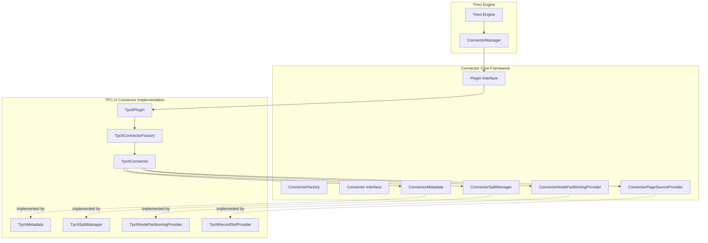
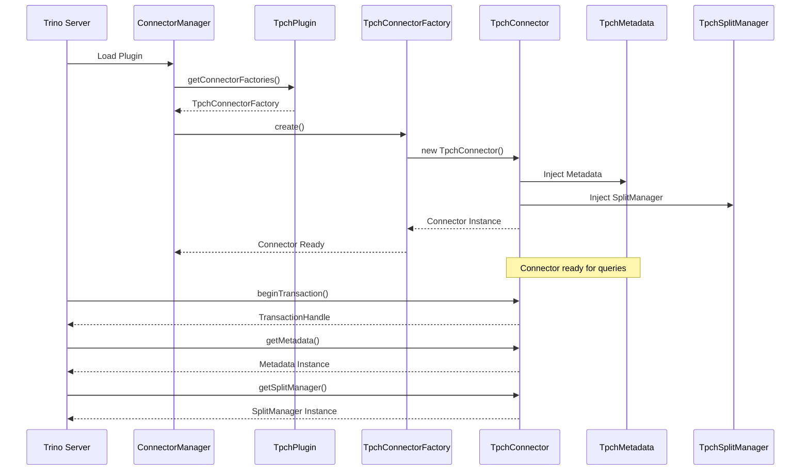
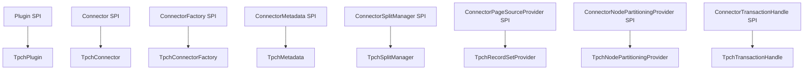
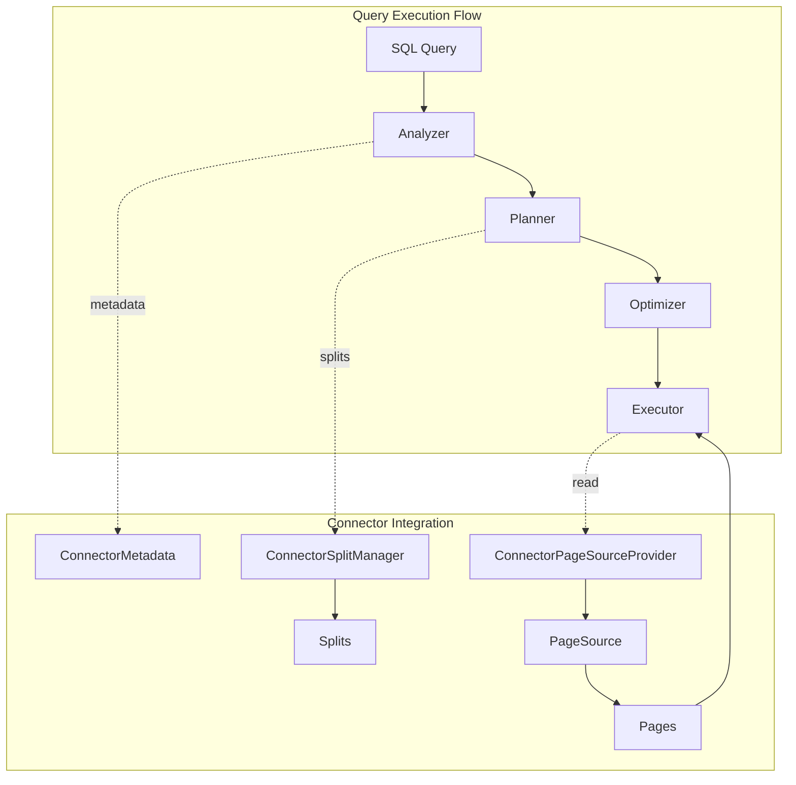

# Connector Core Module Documentation

## Introduction

The Connector Core module provides the foundational framework for implementing Trino connectors. It defines the essential interfaces and abstractions that enable Trino to interact with various data sources through a unified plugin architecture. This module serves as the bridge between Trino's query engine and external data storage systems, providing standardized mechanisms for metadata discovery, data access, and query execution.

## Architecture Overview

The Connector Core module is built around the Trino SPI (Service Provider Interface) and provides the core abstractions that all connectors must implement. The architecture follows a plugin-based design where each data source is represented by a connector that implements the required interfaces.



## Core Components

### TpchPlugin

The `TpchPlugin` class serves as the entry point for the TPC-H connector implementation. It implements the Trino SPI `Plugin` interface and is responsible for registering the connector factory with the Trino engine.

**Key Responsibilities:**
- Implements the `Plugin` interface from Trino SPI
- Provides a `TpchConnectorFactory` instance to Trino
- Acts as the bootstrap mechanism for the connector

**Code Structure:**
```java
public class TpchPlugin implements Plugin
{
    @Override
    public Iterable<ConnectorFactory> getConnectorFactories()
    {
        return ImmutableList.of(new TpchConnectorFactory());
    }
}
```

### TpchConnector

The `TpchConnector` class implements the core `Connector` interface and serves as the main coordinator for all connector operations. It manages the lifecycle of connector components and provides access to various services required by Trino.

**Key Responsibilities:**
- Implements the `Connector` interface
- Manages connector transaction lifecycle
- Provides access to metadata, split management, and data access components
- Coordinates between different connector services

**Core Services:**
- **Metadata Management**: Provides schema and table information
- **Split Management**: Handles data partitioning and distribution
- **Data Access**: Manages reading data from the underlying source
- **Node Partitioning**: Optimizes data locality and distribution

**Transaction Handling:**
```java
@Override
public ConnectorTransactionHandle beginTransaction(IsolationLevel isolationLevel, boolean readOnly, boolean autoCommit)
{
    return TpchTransactionHandle.INSTANCE;
}
```

## Connector Lifecycle



## Integration with Trino SPI

The Connector Core module heavily relies on the Trino SPI for its interfaces and contracts. The following diagram shows the key SPI components that the connector implements:



## Data Flow Architecture



## Related Modules

The Connector Core module interacts with several other Trino modules:

- **[Trino SPI](Trino%20SPI.md)**: Provides the fundamental interfaces and data structures
- **[Metadata & Connector Abstraction](Metadata%20&%20Connector%20Abstraction.md)**: Manages connector registration and lifecycle
- **[Query Execution Engine](Query%20Execution%20Engine.md)**: Uses connectors to access data during query execution
- **[SQL Analyzer, Planner & Optimizer](SQL%20Analyzer%2C%20Planner%20&%20Optimizer.md)**: Leverages connector metadata for query planning

## Key Design Patterns

### 1. Plugin Architecture
The connector follows a plugin pattern where implementations are loaded dynamically based on configuration.

### 2. Factory Pattern
`TpchConnectorFactory` creates instances of `TpchConnector` with proper dependency injection.

### 3. Dependency Injection
Guice is used for managing component dependencies and lifecycle.

### 4. Immutable Data Structures
Extensive use of immutable collections (Guava's ImmutableList) for thread safety.

## Extension Points

The Connector Core module provides several extension points for custom connector implementations:

1. **Custom Metadata Providers**: Implement `ConnectorMetadata` for specialized schema handling
2. **Custom Split Strategies**: Implement `ConnectorSplitManager` for data-specific partitioning
3. **Custom Data Readers**: Implement `ConnectorPageSourceProvider` for optimized data access
4. **Custom Partitioning**: Implement `ConnectorNodePartitioningProvider` for data locality optimization

## Best Practices

### Connector Implementation Guidelines

1. **Thread Safety**: All connector components must be thread-safe
2. **Resource Management**: Proper cleanup of resources (connections, file handles)
3. **Error Handling**: Clear error messages with appropriate error codes
4. **Performance**: Efficient metadata operations and data access patterns
5. **Transaction Support**: Proper isolation level handling

### Testing Considerations

- Unit tests for individual components
- Integration tests with actual data sources
- Performance benchmarks for data access operations
- Concurrency tests for thread safety validation

## Configuration and Deployment

Connectors are configured through Trino's catalog properties files. The TPC-H connector typically requires minimal configuration as it generates synthetic data.

Example configuration:
```properties
connector.name=tpch
tpch.splits-per-node=4
```

## Summary

The Connector Core module provides a robust framework for implementing Trino connectors. Through the TPC-H connector example, it demonstrates how to properly implement the required interfaces and integrate with Trino's plugin architecture. The modular design allows for easy extension and customization while maintaining consistency across different data source implementations.