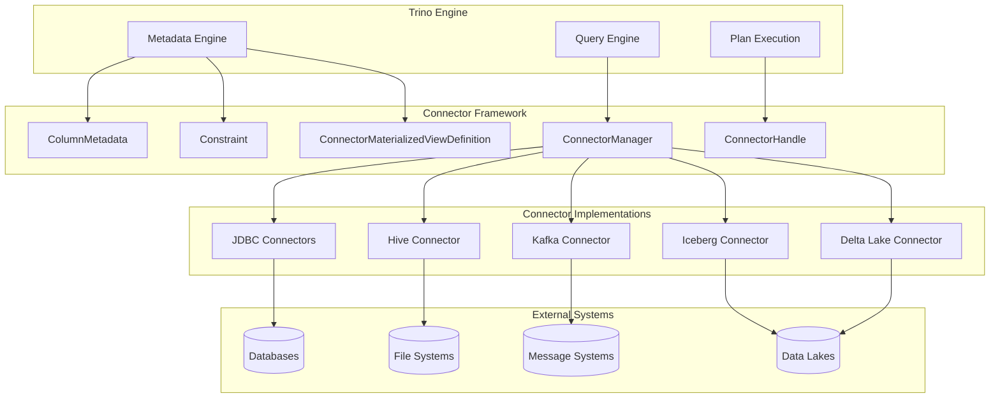
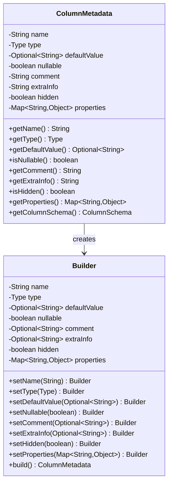
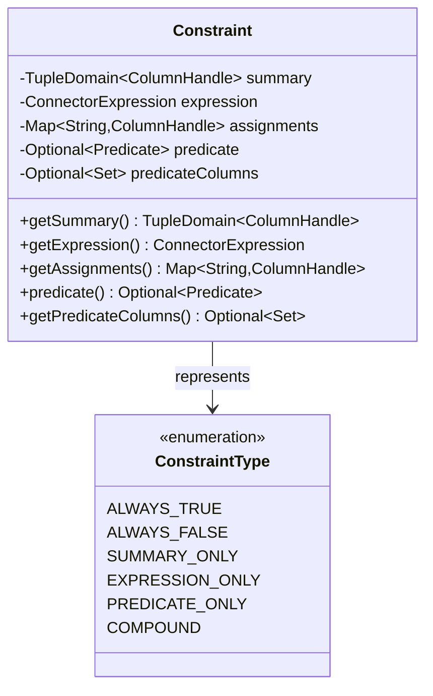
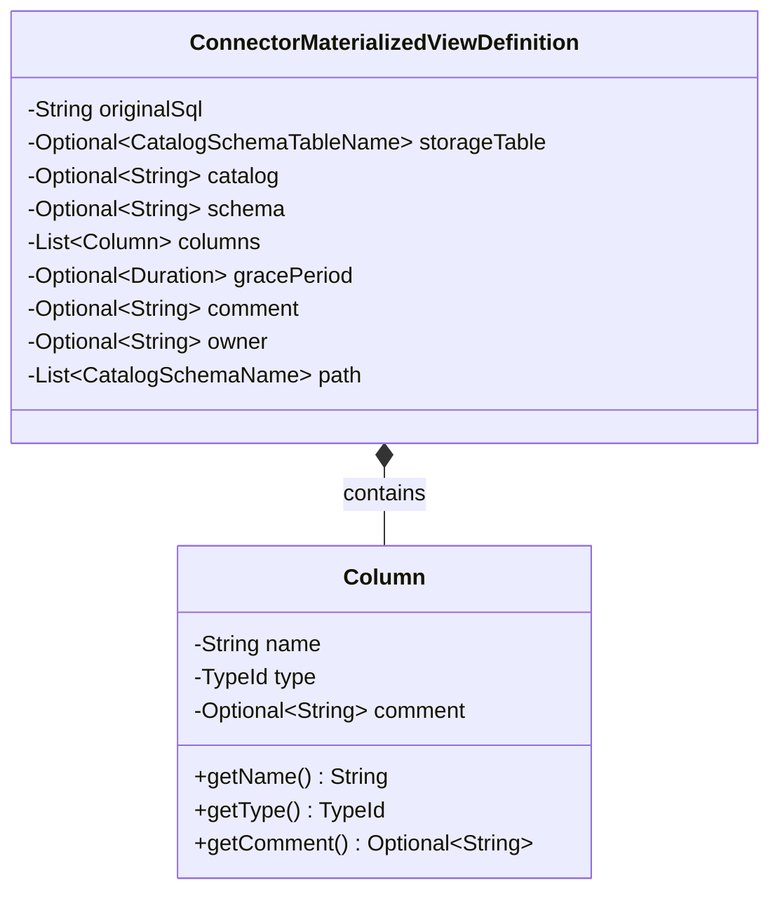
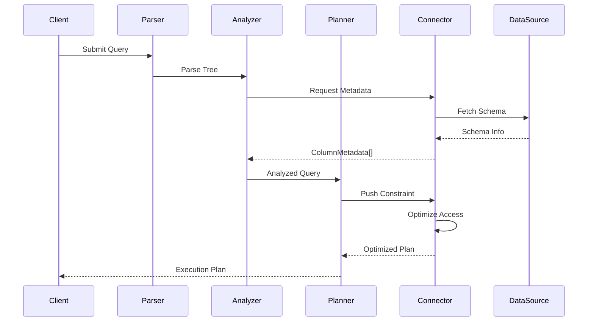
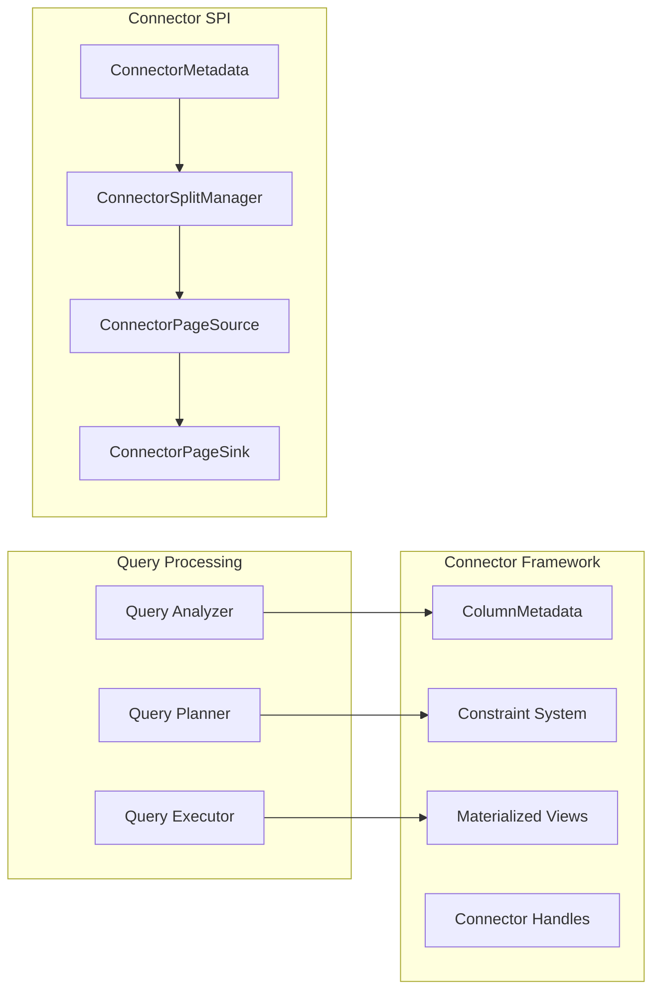
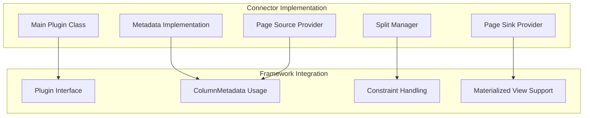
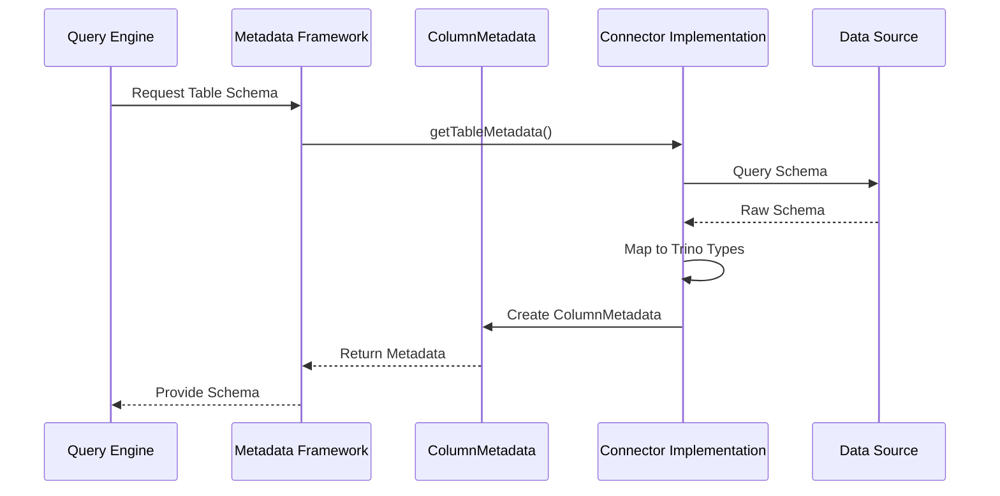

# Connector Framework

The Connector Framework is the core abstraction layer in Trino that enables seamless integration with diverse data sources. It provides a standardized interface for connectors to expose their data sources, handle metadata operations, and execute queries while maintaining Trino's distributed query processing capabilities.

## Overview

The Connector Framework serves as the bridge between Trino's query engine and external data sources. It defines the contracts that connectors must implement to participate in query planning, optimization, and execution. This framework enables Trino to treat heterogeneous data sources as unified tables while preserving the unique characteristics and capabilities of each underlying system.

## Core Architecture

### Component Relationships

### Key Components

#### ColumnMetadata
The `ColumnMetadata` class represents the metadata for a column in a table exposed by a connector. It encapsulates essential column properties including:

- **Name**: Column identifier (automatically normalized to lowercase)
- **Type**: Trino type mapping for the column
- **Nullability**: Whether the column accepts null values
- **Default Value**: Optional default value specification
- **Comment**: Human-readable description
- **Extra Info**: Additional connector-specific metadata
- **Hidden**: Visibility flag for system columns
- **Properties**: Extensible key-value metadata

#### Constraint
The `Constraint` class represents filtering conditions that connectors can use to optimize data access. It provides multiple levels of constraint expression:

- **Summary**: High-level tuple domain constraints for partition pruning
- **Expression**: Connector-specific expression trees for pushdown
- **Predicate**: Runtime filtering functions for fine-grained control
- **Assignments**: Variable-to-column mappings for expression evaluation

#### ConnectorMaterializedViewDefinition
The `ConnectorMaterializedViewDefinition` class defines the structure and properties of materialized views within connectors:

- **Original SQL**: The defining query text
- **Storage Table**: Optional backing table reference
- **Columns**: View column definitions with type information
- **Grace Period**: Staleness tolerance for cached results
- **Metadata**: Owner, comment, and path information

## Integration with Trino Architecture

### Query Planning Integration

### Data Flow Architecture

## Connector Development Patterns

### Basic Connector Structure

### Metadata Resolution Flow

## Advanced Features

### Constraint Pushdown Optimization

The Constraint system enables sophisticated query optimization through multiple pushdown mechanisms:

1. **Partition Pruning**: TupleDomain constraints eliminate unnecessary partitions
2. **Filter Pushdown**: Connector expressions are translated to native query languages
3. **Runtime Filtering**: Dynamic predicates refine results during execution
4. **Index Utilization**: Predicate information enables index-based access paths

### Materialized View Integration

Connectors can expose materialized views with:
- **Automatic Refresh**: Grace period-based staleness management
- **Storage Optimization**: Optional backing table references
- **Query Rewrite**: Transparent substitution with materialized data
- **Incremental Updates**: Efficient delta processing

## Performance Considerations

### Metadata Caching
- ColumnMetadata objects are cached at the connector level
- Schema information is refreshed based on configuration
- Type mapping is pre-computed for common scenarios

### Constraint Evaluation
- Predicate evaluation is optimized for short-circuiting
- Expression trees are minimized before pushdown
- Column references are resolved efficiently through assignments

### Memory Management
- ColumnMetadata uses immutable collections
- Constraint objects are designed for efficient serialization
- Materialized view definitions support lazy evaluation

## Error Handling

The framework provides comprehensive error handling for:
- **Type Mapping Failures**: Graceful degradation for unsupported types
- **Constraint Pushdown Rejection**: Fallback to Trino-side filtering
- **Metadata Resolution Issues**: Clear error messages with context
- **Permission Denials**: Proper security exception propagation

## Testing and Validation

### Connector Validation Framework
- ColumnMetadata consistency checks
- Constraint pushdown verification
- Materialized view refresh testing
- Performance regression detection

### Integration Testing Patterns
- End-to-end query execution validation
- Metadata round-trip verification
- Constraint optimization effectiveness
- Cross-connector compatibility testing

## Best Practices

### ColumnMetadata Design
- Use appropriate Trino type mappings
- Provide meaningful comments and extra info
- Consider nullability carefully
- Leverage properties for connector-specific metadata

### Constraint Implementation
- Implement comprehensive TupleDomain support
- Provide accurate predicate column information
- Handle expression pushdown gracefully
- Consider performance implications of complex predicates

### Materialized View Support
- Define appropriate grace periods
- Handle storage table lifecycle properly
- Provide clear ownership information
- Support incremental refresh when possible

## Related Documentation

- [Trino SPI Overview](Trino%20SPI.md) - Core service provider interface concepts
- [Plugin Architecture](Plugin%20Architecture.md) - Plugin lifecycle and registration
- [Type System](Type%20System.md) - Type mapping and conversion
- [Query Planning](SQL%20Analyzer%2C%20Planner%20%26%20Optimizer.md) - Query optimization integration
- [Metadata Management](Metadata%20%26%20Connector%20Abstraction.md) - Centralized metadata coordination

## References

- [Trino Connector SPI Documentation](https://trino.io/docs/current/develop/connectors.html)
- [Connector Development Guide](https://trino.io/docs/current/develop/spi-overview.html)
- [Built-in Connector Examples](https://github.com/trinodb/trino/tree/master/plugin)