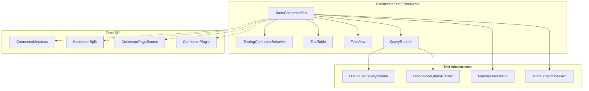
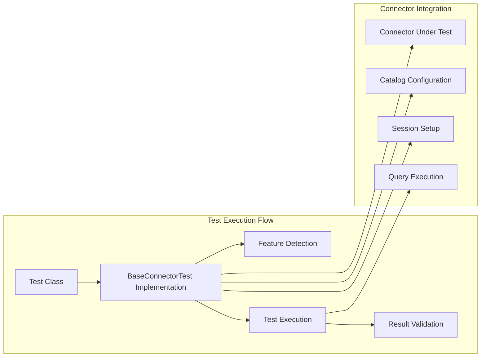
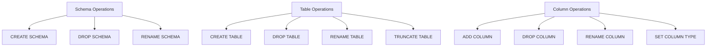
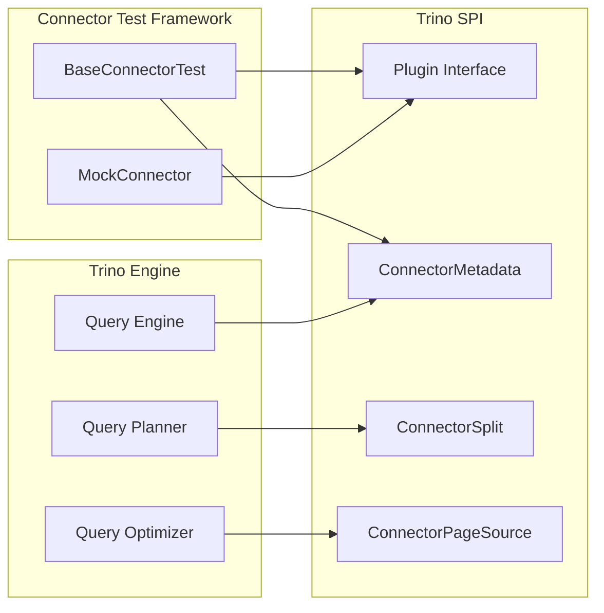
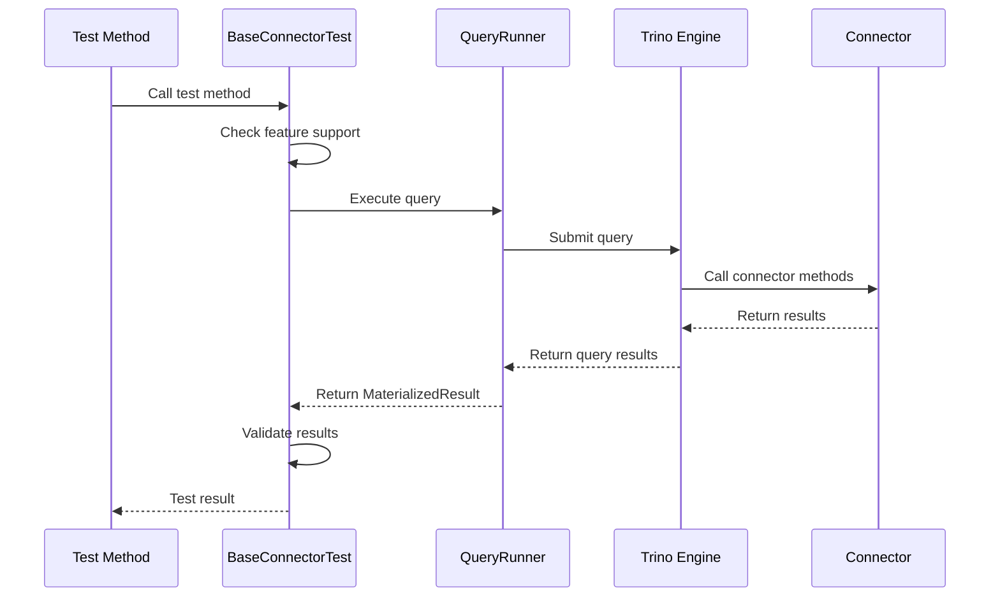
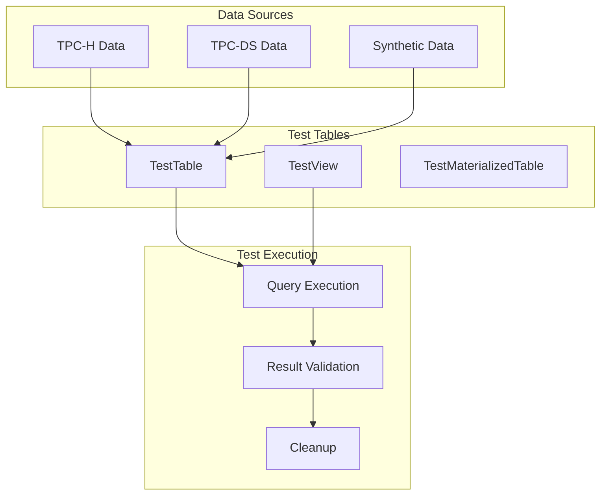

# Connector Test Framework

## Introduction

The Connector Test Framework is a comprehensive testing infrastructure within the Trino ecosystem designed to validate connector implementations against a standardized set of functionality tests. It provides a robust foundation for ensuring that all Trino connectors meet consistent behavioral standards and support expected SQL operations.

## Purpose and Core Functionality

The framework serves as the primary testing mechanism for Trino connectors, offering:

- **Standardized Connector Validation**: Ensures all connectors implement required SPI interfaces correctly
- **Behavioral Consistency Testing**: Validates that connectors behave consistently across different operations
- **Feature Capability Detection**: Automatically determines which features a connector supports
- **Regression Prevention**: Comprehensive test coverage prevents breaking changes
- **Performance Validation**: Tests query execution and optimization behaviors

## Architecture Overview

### Core Components



### Component Relationships



## Key Components

### BaseConnectorTest

The `BaseConnectorTest` class is the foundation of the testing framework, providing:

- **Comprehensive Test Suite**: Over 200 test methods covering all aspects of connector functionality
- **Behavioral Testing**: Tests for SQL operations, data types, transactions, and metadata operations
- **Feature Detection**: Automatic detection of connector capabilities through `TestingConnectorBehavior`
- **Extensibility**: Abstract methods that connector-specific tests must implement

### TestingConnectorBehavior

An enumeration that defines all possible connector behaviors:

- **DDL Operations**: CREATE/DROP/ALTER for tables, schemas, views, and materialized views
- **DML Operations**: INSERT, UPDATE, DELETE, MERGE support
- **Data Type Support**: Array, Map, Row types, and various SQL data types
- **Advanced Features**: Transactions, constraints, comments, and optimization features

### Test Infrastructure

- **QueryRunner**: Provides query execution capabilities for testing
- **TestTable/TestView**: Utility classes for creating temporary test objects
- **MaterializedResult**: Represents query results for validation
- **TrinoExceptionAssert**: Assertion utilities for exception testing

## Test Categories

### Schema and Table Operations



### Data Manipulation Operations

- **INSERT Testing**: Basic inserts, bulk inserts, and concurrent insert validation
- **UPDATE Testing**: Row-level updates, column updates, and concurrent update handling
- **DELETE Testing**: Row-level deletes, bulk deletes, and referential integrity
- **MERGE Testing**: Complex merge operations with multiple conditions

### Data Type and Constraint Testing

- **Primitive Types**: All SQL primitive data types
- **Complex Types**: Arrays, Maps, and Row types
- **Constraints**: NOT NULL, DEFAULT values, and check constraints
- **Type Coercion**: Implicit and explicit type conversions

### Advanced Features

- **Transaction Support**: Multi-statement transactions and rollback testing
- **View Support**: Regular and materialized view operations
- **Function Support**: User-defined function creation and usage
- **Optimization Features**: Predicate pushdown, projection pushdown, and join optimization

## Integration with Trino Ecosystem

### SPI Integration

The framework integrates deeply with the Trino SPI:



### Query Execution Flow



## Usage Patterns

### Basic Connector Test Implementation

```java
public class MyConnectorTest
        extends BaseConnectorTest
{
    @Override
    protected QueryRunner createQueryRunner()
            throws Exception
    {
        // Create and configure your connector
        return MyConnectorTestFactory.createQueryRunner();
    }
    
    @Override
    protected boolean hasBehavior(TestingConnectorBehavior connectorBehavior)
    {
        // Declare which features your connector supports
        return switch (connectorBehavior) {
            case SUPPORTS_CREATE_TABLE,
                 SUPPORTS_INSERT,
                 SUPPORTS_DELETE -> true;
            default -> super.hasBehavior(connectorBehavior);
        };
    }
}
```

### Feature Detection Pattern

The framework automatically skips tests for unsupported features:

```java
@Test
public void testCreateTable()
{
    if (!hasBehavior(SUPPORTS_CREATE_TABLE)) {
        assertQueryFails("CREATE TABLE test (x int)", 
                        "This connector does not support creating tables");
        return;
    }
    // Test table creation
}
```

### Concurrent Testing

The framework includes built-in support for concurrent operation testing:

```java
@RepeatedTest(4)
@Timeout(60)
public void testInsertRowConcurrently()
        throws Exception
{
    // Tests concurrent inserts with proper synchronization
}
```

## Data Flow and Dependencies

### Test Data Management



### Dependency Chain

The framework depends on several key Trino modules:

- **Trino SPI**: Core interfaces for connector development
- **Query Execution Engine**: For running test queries
- **Type System**: For data type validation
- **Transaction Manager**: For transaction testing
- **Metadata System**: For catalog and schema operations

## Testing Methodology

### Behavioral Testing Approach

The framework employs a behavioral testing methodology:

1. **Feature Detection**: Automatically determines connector capabilities
2. **Conditional Testing**: Only runs tests for supported features
3. **Standardized Validation**: Uses consistent validation patterns
4. **Error Handling**: Tests both success and failure scenarios
5. **Performance Validation**: Includes performance and concurrency tests

### Test Organization

Tests are organized by functionality:

- **Basic Operations**: Schema, table, and column operations
- **Data Operations**: CRUD operations and transactions
- **Advanced Features**: Views, functions, and optimizations
- **Edge Cases**: Error conditions and boundary scenarios
- **Performance**: Concurrent operations and large datasets

## Benefits and Impact

### For Connector Developers

- **Comprehensive Validation**: Ensures connectors meet all requirements
- **Regression Prevention**: Catches breaking changes early
- **Documentation**: Serves as executable documentation
- **Best Practices**: Enforces consistent implementation patterns

### For Trino Users

- **Consistent Behavior**: All connectors behave predictably
- **Feature Reliability**: Supported features work as expected
- **Quality Assurance**: High-quality connector implementations
- **Migration Support**: Easy switching between connectors

## Future Enhancements

The framework continues to evolve with:

- **Extended Coverage**: New test scenarios for emerging features
- **Performance Benchmarks**: Standardized performance testing
- **Security Testing**: Enhanced security and access control testing
- **Cloud Integration**: Specialized tests for cloud-native connectors

## Related Documentation

- [Trino SPI](Trino%20SPI.md) - Core service provider interfaces
- [Connector Framework](Connector%20Framework.md) - General connector architecture
- [Query Execution Engine](Query%20Execution%20Engine.md) - Query execution details
- [SQL Functions & Operators](SQL%20Functions%20&%20Operators.md) - Function testing support
- [Metadata & Connector Abstraction](Metadata%20&%20Connector%20Abstraction.md) - Metadata operations testing

The Connector Test Framework represents a critical component of Trino's quality assurance infrastructure, ensuring that all connectors provide consistent, reliable, and feature-complete implementations for end users.