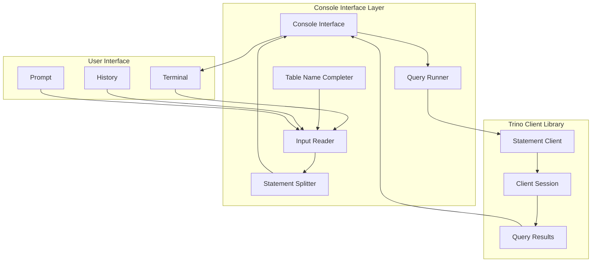
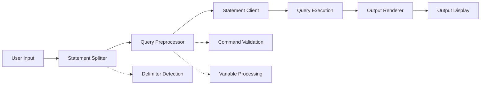
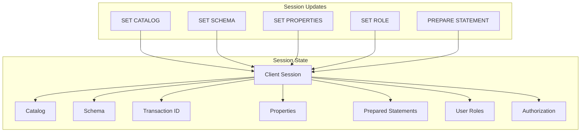
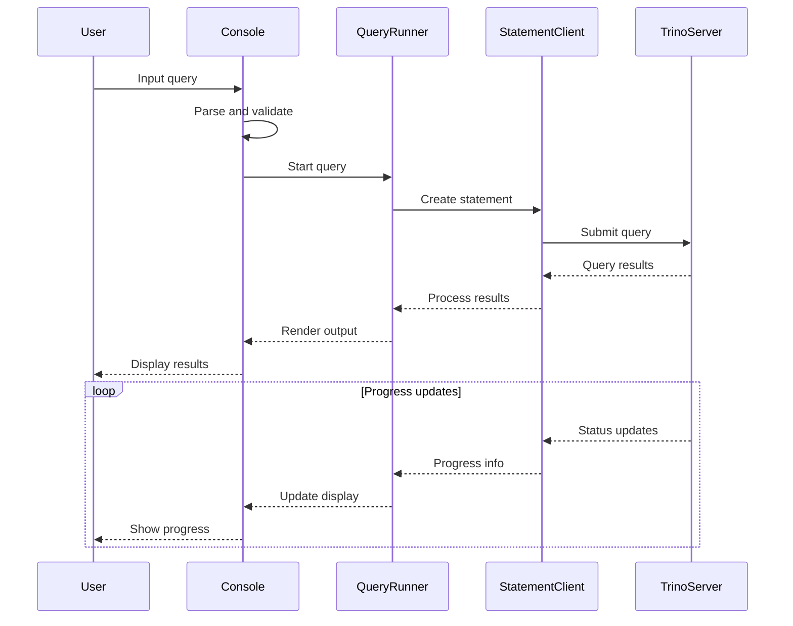

# Console Interface Module

## Introduction

The Console Interface module provides the interactive command-line interface for Trino, serving as the primary user-facing component for executing SQL queries and managing database sessions. Built on top of the Trino Client Library, it offers a rich terminal-based experience with features like syntax highlighting, auto-completion, query history, and progress monitoring.

This module transforms raw user input into structured SQL statements, manages the complete query lifecycle from submission to result rendering, and provides an intuitive interface for database administrators and analysts to interact with Trino's distributed query engine.

## Architecture Overview

The Console Interface acts as the presentation layer in Trino's client architecture, sitting between users and the Trino Client Library. It leverages modern terminal libraries like JLine to provide advanced interactive features while maintaining compatibility across different operating systems and terminal emulators.

## Core Components

### Console Class

The `Console` class serves as the main entry point and orchestrator for the entire CLI application. It implements the command-line interface using the picocli framework and manages the complete application lifecycle from initialization to shutdown.

**Key Responsibilities:**
- Command-line argument parsing and validation
- Session initialization and configuration
- Query execution coordination
- Terminal lifecycle management
- Signal handling for graceful shutdown

**Core Features:**
- Support for both interactive and batch modes
- Configurable output formats (tabular, vertical, CSV, etc.)
- Progress monitoring and query cancellation
- History management and auto-completion
- Multi-statement execution with error handling

### Input Processing Pipeline

The input processing pipeline transforms raw user input into executable SQL statements through several stages:

**Statement Splitter**: Handles multi-statement input by detecting statement delimiters (`;` and `\G`) and splitting complex queries into individual executable statements.

**Query Preprocessor**: Validates and preprocesses queries before execution, handling special commands and variable substitutions.

**Command Detection**: Recognizes special CLI commands like `exit`, `quit`, `clear`, `history`, and `help` for immediate processing without server communication.

### Session Management

The Console Interface maintains a comprehensive session state that includes:

- **Catalog and Schema Context**: Current database catalog and schema selection
- **Transaction State**: Active transaction management and isolation levels
- **Session Properties**: Configuration parameters and runtime settings
- **Prepared Statements**: Cached query templates with parameter binding
- **Role and Authorization**: User permissions and security context
- **Connection Parameters**: Network configuration and authentication details

## Interactive Features

### Terminal Integration

The Console Interface leverages JLine for advanced terminal capabilities:

**Line Editing**: Full cursor movement, text selection, and editing capabilities with customizable key bindings

**History Management**: Persistent command history with search, recall, and navigation features

**Auto-completion**: Context-aware completion for SQL keywords, table names, column names, and function names

**Syntax Highlighting**: Color-coded SQL syntax for improved readability and error detection

**Progress Indicators**: Real-time query execution progress with estimated completion times

### Table Name Completion

The `TableNameCompleter` provides intelligent auto-completion by:

- Caching metadata about available tables and columns
- Dynamically updating cache based on catalog/schema changes
- Providing context-aware suggestions based on current query position
- Supporting partial matching and case-insensitive search

### Output Formatting

Multiple output formats cater to different use cases:

**Tabular Format**: Traditional table display with aligned columns and headers

**Vertical Format**: Row-oriented display using `\G` terminator, ideal for wide tables

**CSV Format**: Comma-separated values for data export and processing

**JSON Format**: Structured JSON output for programmatic consumption

**Null Format**: Suppressed output for performance testing

## Query Execution Flow

### Interactive Mode

In interactive mode, the Console Interface provides a read-eval-print loop (REPL) experience:

### Batch Mode

Batch mode processes multiple statements efficiently:

1. **Statement Collection**: Gathers all statements from command line, file, or stdin
2. **Sequential Execution**: Processes statements in order with configurable error handling
3. **Result Aggregation**: Collects and formats results for output
4. **Error Management**: Continues execution on errors when configured with `--ignore-errors`

### Query Lifecycle Management

Each query progresses through well-defined states:

**Preparation**: SQL parsing, validation, and preprocessing
**Submission**: Network transmission to Trino coordinator
**Execution**: Distributed processing across worker nodes
**Result Collection**: Data aggregation and formatting
**Output Rendering**: Display formatting and terminal output
**Session Update**: Catalog, schema, and property updates

## Error Handling and Recovery

### Exception Management

The Console Interface implements comprehensive error handling:

**Network Errors**: Connection failures, timeouts, and service unavailability
**Query Errors**: Syntax errors, semantic errors, and runtime exceptions
**Resource Errors**: Memory limits, disk space, and quota violations
**Authentication Errors**: Credential failures and permission denials
**System Errors**: Internal failures and unexpected conditions

### User Feedback

Error messages are formatted for clarity and actionability:

- **Error Classification**: Clear indication of error type and severity
- **Context Information**: Relevant query context and line numbers
- **Suggested Actions**: Remediation steps and alternative approaches
- **Debug Information**: Detailed stack traces when debug mode is enabled

### Recovery Mechanisms

Automatic recovery from common failure scenarios:

- **Connection Retry**: Automatic reconnection with exponential backoff
- **Session Restoration**: Recovery of session state after reconnection
- **Transaction Rollback**: Automatic cleanup of failed transactions
- **Resource Cleanup**: Proper disposal of allocated resources

## Integration Points

### Trino Client Library Integration

The Console Interface builds upon the Trino Client Library's foundation:

- **StatementClient**: Manages the network protocol and communication
- **ClientSession**: Maintains session state and configuration
- **QueryResults**: Handles result set processing and iteration
- **ClientOptions**: Provides configuration management and validation

### Terminal System Integration

Deep integration with terminal capabilities:

- **Signal Handling**: Graceful shutdown on SIGINT and SIGTERM
- **Terminal Restoration**: Proper cleanup of terminal settings
- **Encoding Detection**: Automatic character set detection and handling
- **Capability Detection**: Dynamic adaptation to terminal features

## Configuration and Customization

### Command-Line Options

Comprehensive configuration through command-line parameters:

**Connection Options**: Server URL, catalog, schema, and authentication
**Output Options**: Format selection, pagination, and display preferences
**Behavior Options**: Error handling, progress display, and debugging
**Resource Options**: Memory limits, timeout settings, and queue sizes

### Runtime Configuration

Dynamic configuration during execution:

**Session Properties**: SET commands for runtime parameter adjustment
**Catalog Selection**: USE statements for database context switching
**Role Management**: SET ROLE commands for permission changes
**Transaction Control**: START TRANSACTION, COMMIT, and ROLLBACK

### Environment Integration

Support for environment-based configuration:

**Configuration Files**: Standard locations for default settings
**Environment Variables**: System-level parameter specification
**Profile Support**: Named configuration sets for different environments
**History Persistence**: Cross-session command history retention

## Performance Considerations

### Resource Management

Efficient resource utilization:

**Memory Management**: Bounded result buffering and streaming processing
**Network Optimization**: Connection pooling and request batching
**CPU Utilization**: Asynchronous processing and background tasks
**Disk Usage**: Temporary file management and cleanup

### Scalability Features

Support for large-scale operations:

**Streaming Results**: Incremental result processing for large datasets
**Progress Indication**: Real-time feedback for long-running queries
**Cancellation Support**: Query interruption without resource leaks
**Pagination**: Configurable result set size limits

## Security Features

### Authentication Integration

Multiple authentication mechanisms:

**Password Authentication**: Username/password credential validation
**Certificate Authentication**: TLS client certificate authentication
**Kerberos Authentication**: Enterprise SSO integration
**OAuth Integration**: Token-based authentication flows

### Session Security

Secure session management:

**Credential Protection**: Secure storage and transmission of credentials
**Session Isolation**: Separation of user contexts and permissions
**Audit Logging**: Comprehensive activity tracking and logging
**Timeout Management**: Automatic session expiration and cleanup

## Testing and Quality Assurance

### Test Coverage

Comprehensive testing strategy:

**Unit Tests**: Component-level validation and edge case handling
**Integration Tests**: End-to-end workflow verification
**Compatibility Tests**: Cross-platform and terminal compatibility
**Performance Tests**: Load testing and resource utilization validation

### Quality Metrics

Continuous quality monitoring:

**Code Coverage**: Comprehensive test coverage metrics
**Performance Benchmarks**: Baseline performance measurements
**Error Rate Monitoring**: Production error tracking and analysis
**User Experience Metrics**: Usability and satisfaction measurements

This comprehensive documentation provides developers and maintainers with a thorough understanding of the Console Interface module's architecture, functionality, and integration within the broader Trino ecosystem. The module serves as a critical component in making Trino's powerful distributed query capabilities accessible through an intuitive and feature-rich command-line interface.