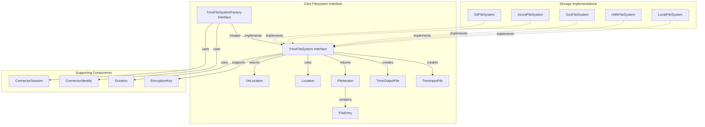
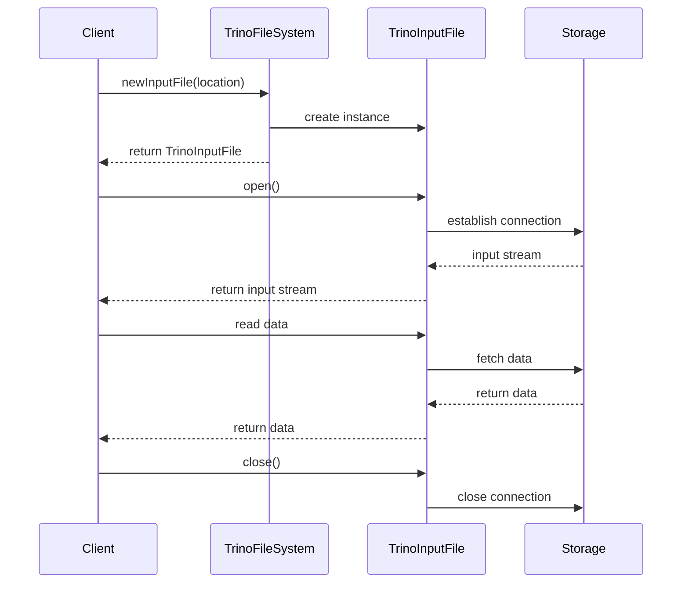
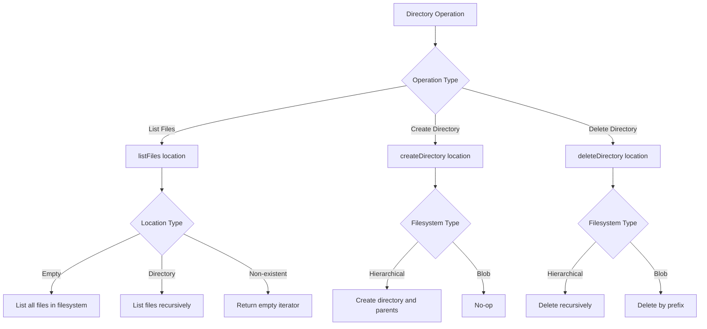
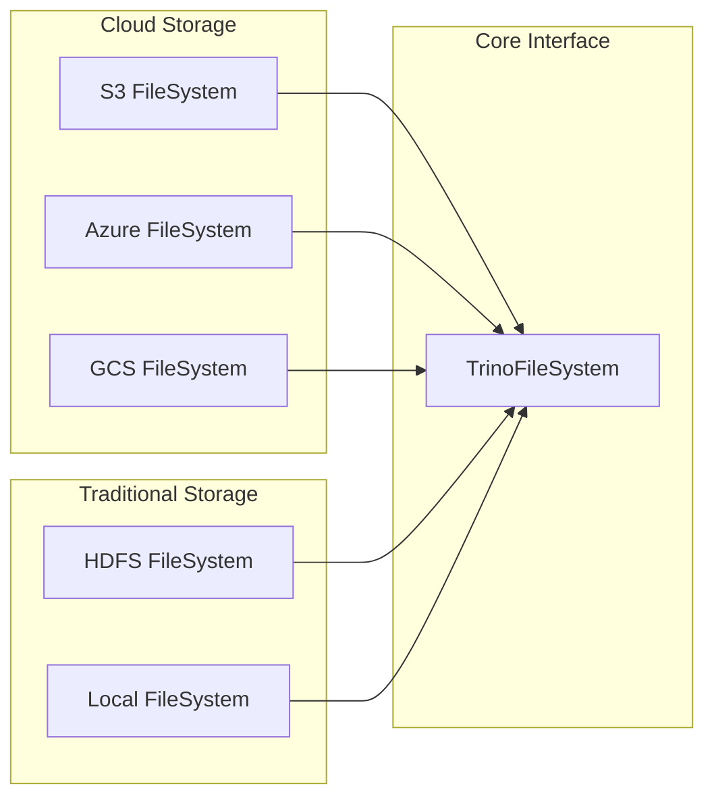
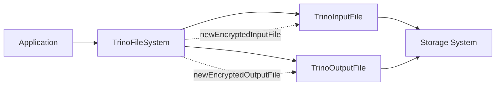
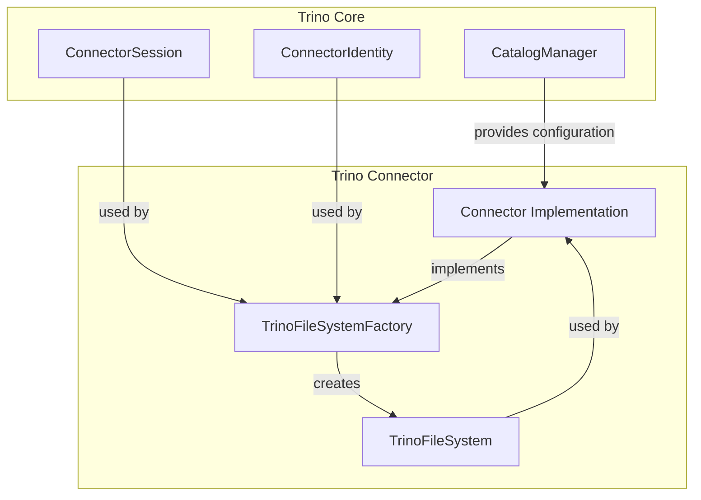

# Core Filesystem Interface

The Core Filesystem Interface module provides a unified abstraction layer for Trino to interact with various storage systems, including cloud storage services (S3, Azure, GCS), HDFS, and local filesystems. This module replaces the traditional HDFS APIs with a minimal, purpose-built interface designed specifically for Trino's needs.

## Overview

The Core Filesystem Interface serves as the foundation for all file operations in Trino, offering a consistent API across different storage backends. It supports both hierarchical filesystems (like HDFS and local filesystems) and blob storage systems (like cloud object stores), handling their behavioral differences transparently.

## Architecture

### Core Components



### Key Interfaces

#### TrinoFileSystem
The main interface that provides file operations including:
- File I/O operations (read, write, delete)
- Directory operations (create, list, delete)
- File metadata operations (exists, rename)
- Encryption support for secure file operations
- Pre-signed URI generation for direct storage access

#### TrinoFileSystemFactory
Factory interface for creating TrinoFileSystem instances:
- Creates filesystem instances based on connector identity
- Supports session-based filesystem creation
- Enables per-user filesystem configurations

## File Operations

### File I/O Flow



### Directory Operations



## Storage System Support

### Hierarchical vs Blob Storage

The interface handles two fundamentally different storage paradigms:

#### Hierarchical Filesystems (HDFS, Local)
- Traditional directory structure with files and subdirectories
- Support for relative path references (., ..)
- Path normalization and validation
- Directory existence tracking

#### Blob Storage Systems (S3, Azure, GCS)
- Key-value storage with minimal restrictions
- Prefix-based operations for directory simulation
- Limited metadata operations
- Eventual consistency considerations

### Supported Storage Implementations



## Security and Encryption

### Encryption Support

The interface provides built-in support for server-side encryption:



### Pre-signed URIs

For large file operations, the interface supports generating pre-signed URIs:
- Direct storage access bypassing Trino servers
- Configurable time-to-live (TTL)
- Support for encrypted pre-signed URIs
- Optional feature based on storage system capabilities

## Error Handling and Resilience

### Exception Classification

The interface provides utilities for determining recoverable vs unrecoverable exceptions:

```java
// Built-in exception classification
static boolean isUnrecoverableException(Throwable throwable)
```

This helps identify:
- **Unrecoverable exceptions**: FileNotFoundException, UnsupportedOperationException, TrinoFileSystemException
- **Recoverable exceptions**: Network timeouts, temporary service unavailability

### Best Practices

1. **No Additional Retries**: The interface assumes storage SDKs handle their own retry logic
2. **Custom Retry Handlers**: Recommended to modify SDK retry behavior rather than adding outer retry loops
3. **Exception Propagation**: Clear exception hierarchy for proper error handling

## Integration with Trino

### Connector Integration



### Configuration

Connectors using the filesystem interface typically:
1. Implement `TrinoFileSystemFactory` 
2. Configure storage system credentials and settings
3. Handle per-session filesystem instances
4. Support encryption and security requirements

## Performance Considerations

### Optimization Features

1. **Batch Operations**: Support for bulk file deletion
2. **Pre-declared Metadata**: File length and modification time hints
3. **Direct Storage Access**: Pre-signed URI support for large files
4. **Efficient Listing**: Optimized directory listing with lexicographic ordering

### Storage-Specific Optimizations

- **Cloud Storage**: Prefix-based operations, eventual consistency handling
- **HDFS**: Native rename operations, directory caching
- **Local Filesystem**: Direct file operations, system-dependent optimizations

## Usage Examples

### Basic File Operations

```java
// Create filesystem factory
TrinoFileSystemFactory factory = new S3FileSystemFactory(configuration);

// Create filesystem instance
TrinoFileSystem fileSystem = factory.create(session);

// Read file
TrinoInputFile inputFile = fileSystem.newInputFile(Location.of("s3://bucket/path/file.csv"));
try (InputStream stream = inputFile.open()) {
    // Process file data
}

// Write file
TrinoOutputFile outputFile = fileSystem.newOutputFile(Location.of("s3://bucket/path/output.csv"));
try (OutputStream stream = outputFile.create()) {
    // Write file data
}
```

### Directory Operations

```java
// List files
FileIterator files = fileSystem.listFiles(Location.of("s3://bucket/path/"));
while (files.hasNext()) {
    FileEntry file = files.next();
    System.out.println(file.location() + " - " + file.length());
}

// Create directory
fileSystem.createDirectory(Location.of("s3://bucket/new-directory/"));

// Delete directory
fileSystem.deleteDirectory(Location.of("s3://bucket/old-directory/"));
```

## Related Documentation

- [Cloud Storage Implementations](Cloud Storage Implementations.md) - S3, Azure, and GCS filesystem implementations
- [Traditional Storage Support](Traditional Storage Support.md) - HDFS and local filesystem implementations
- [Trino SPI](Trino SPI.md) - Service Provider Interface for Trino plugins
- [Connector Framework](Connector Framework.md) - Framework for building Trino connectors

## Future Enhancements

The Core Filesystem Interface is designed to be minimal and focused. Potential future enhancements may include:

1. **Additional Storage Systems**: Support for emerging storage technologies
2. **Performance Metrics**: Built-in instrumentation for filesystem operations
3. **Advanced Encryption**: Support for additional encryption schemes
4. **Caching Layer**: Optional caching for frequently accessed files
5. **Multi-region Support**: Enhanced support for geo-distributed storage

The interface prioritizes stability and backward compatibility, ensuring that existing implementations continue to work as new features are added.