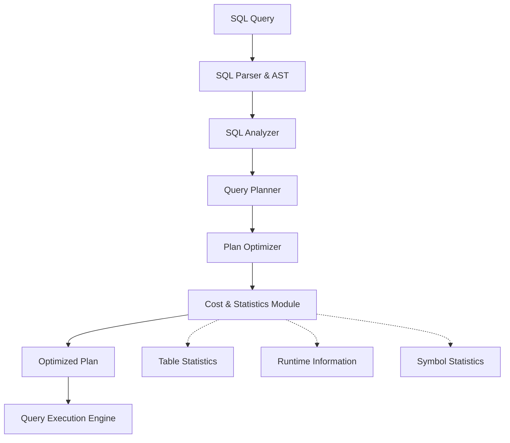
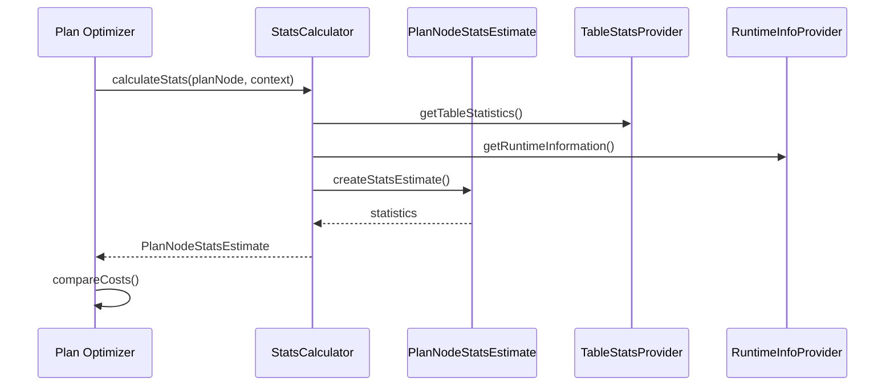
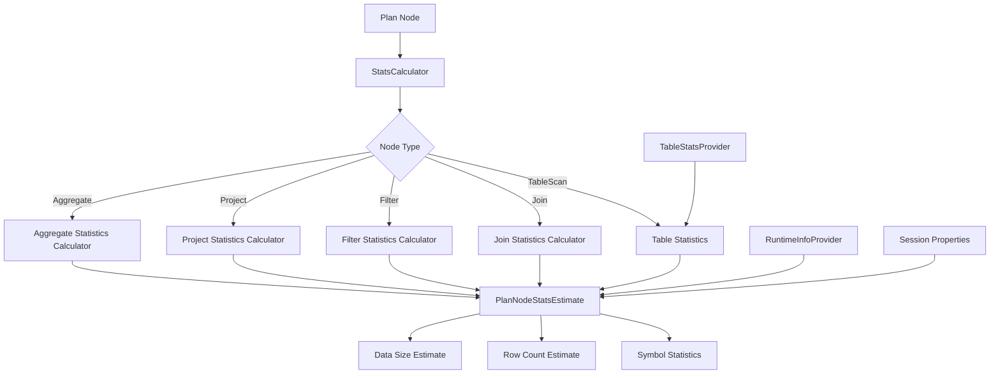
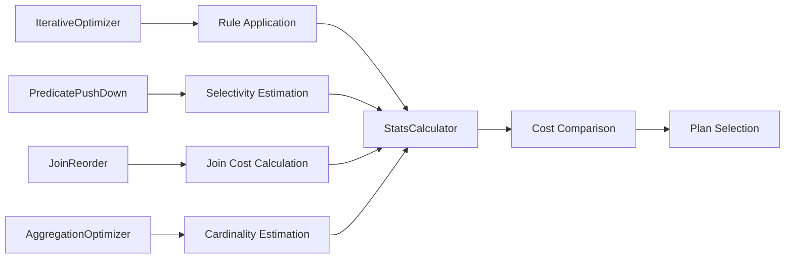

# Cost & Statistics Module

## Overview

The Cost & Statistics module is a critical component of Trino's query optimization framework, responsible for estimating the cost and statistical properties of query execution plans. This module provides the foundation for the query optimizer to make informed decisions about plan transformations and execution strategies.

## Purpose

The primary purposes of this module are:

1. **Cost Estimation**: Calculate the estimated cost of executing different query plan nodes
2. **Statistics Computation**: Provide statistical information about data distribution, cardinality, and size
3. **Optimization Support**: Enable the query optimizer to compare different execution strategies and select the most efficient ones
4. **Performance Prediction**: Help predict resource requirements and execution time for query plans

## Architecture

The Cost & Statistics module integrates with Trino's query planning and optimization pipeline:

## Core Components

### StatsCalculator

The `StatsCalculator` interface defines the contract for computing statistics for plan nodes. It provides:

- **Statistics Calculation**: Main method `calculateStats()` that computes statistical estimates for any given plan node
- **Context Management**: Encapsulates all necessary context including session information, table statistics, and runtime data
- **No-op Implementation**: Provides a fallback implementation that returns unknown statistics

**Key Features:**
- Pluggable statistics calculation framework
- Context-aware computation with access to session, table stats, and runtime info
- Integration with the iterative optimizer framework

**Context Components:**
- `StatsProvider`: Provides access to previously computed statistics
- `Lookup`: Enables lookup of plan nodes in the memo structure
- `Session`: Contains session-specific configuration and properties
- `TableStatsProvider`: Supplies table-level statistics from connectors
- `RuntimeInfoProvider`: Provides runtime information and metrics

### PlanNodeStatsEstimate

The `PlanNodeStatsEstimate` class represents statistical estimates for a plan node, including:

- **Row Count Estimates**: Estimated number of output rows
- **Symbol Statistics**: Per-column statistical information (nulls fraction, distinct values, etc.)
- **Data Size Estimation**: Calculated output size in bytes based on column types and statistics
- **Immutable Design**: Thread-safe immutable structure with builder pattern

**Key Capabilities:**
- Symbol-level statistics tracking
- Data size calculation for different data types (fixed-width and variable-width)
- Support for unknown/unestimated values using NaN
- Jackson serialization support for distributed processing

**Data Size Calculation:**
The module calculates output size by considering:
- Nulls fraction and non-null row count
- Type-specific size calculations (fixed-width vs. variable-width types)
- Overhead for null tracking arrays and offset arrays
- Default data size estimates when specific statistics are unavailable

### TableStatistics Integration

The module integrates with [Trino SPI](Trino%20SPI.md#statistics-framework) through the `TableStatistics.Builder` which provides:
- **Row Count Estimates**: Table-level row count estimates
- **Column Statistics**: Per-column statistical information
- **Connector Integration**: Statistics provided by individual connectors
- **Estimate Abstraction**: Support for both known and unknown estimates

## Integration with Other Modules

### SQL Analyzer, Planner & Optimizer
The Cost & Statistics module is deeply integrated with the query optimization pipeline:
- Works closely with the [Iterative Optimization Framework](SQL%20Analyzer,%20Planner%20&%20Optimizer.md#iterative-optimization-framework)
- Provides cost estimates for [Rule-Based Optimization](SQL%20Analyzer,%20Planner%20&%20Optimizer.md#rule-based-optimization)
- Supports optimization decisions in [Predicate Pushdown](SQL%20Analyzer,%20Planner%20&%20Optimizer.md#predicate-pushdown-optimizer)

### Trino SPI
Leverages the Statistics Framework from [Trino SPI](Trino%20SPI.md#statistics-framework) for:
- Table-level statistics collection
- Connector-provided statistical information
- Integration with connector-specific statistics

## Data Flow

## Usage Patterns

### Statistics Calculation
The module is used throughout the query optimization process to:
1. Estimate the cost of different join strategies
2. Determine the optimal order of operations
3. Predict memory and CPU requirements
4. Select appropriate algorithms based on data characteristics

### Cost-Based Optimization
Statistics are essential for:
- Join ordering decisions
- Aggregation strategy selection
- Partition pruning optimization
- Index usage decisions

## Detailed Architecture

### Statistics Computation Pipeline

### Integration with Plan Optimizers

The Cost & Statistics module works closely with various plan optimizers:

## Implementation Patterns

### Statistics Propagation
Statistics are propagated through the plan tree using a bottom-up approach:
1. **Leaf Nodes**: Table scan statistics obtained from connectors
2. **Intermediate Nodes**: Statistics calculated based on child node estimates
3. **Root Node**: Final statistics representing the complete query result

### Unknown Statistics Handling
The module gracefully handles cases where statistics are unavailable:
- Returns `PlanNodeStatsEstimate.unknown()` for unestimated nodes
- Uses default values for missing symbol statistics
- Propagates unknown status through calculations
- Falls back to conservative estimates in optimization decisions

### Type-Aware Size Calculation
Data size estimation considers different type categories:
- **Fixed-Width Types**: Uses type-specific fixed sizes (e.g., BIGINT, DOUBLE)
- **Variable-Width Types**: Uses average row size estimates with offset overhead
- **Null Handling**: Accounts for null-tracking boolean arrays
- **Collection Types**: Includes additional overhead for complex types

## Key Design Principles

1. **Immutability**: All statistics objects are immutable for thread safety
2. **Pluggability**: Interface-based design allows custom statistics calculators
3. **Context Awareness**: Rich context provides access to all necessary information
4. **Graceful Degradation**: Unknown statistics don't break optimization
5. **Performance**: Efficient calculation to avoid slowing down optimization
6. **Accuracy**: Balances estimation accuracy with computational cost
7. **Consistency**: Maintains statistical consistency across plan transformations

## Performance Considerations

### Caching Strategy
- Statistics are cached at the plan node level to avoid recomputation
- Symbol statistics are stored in persistent maps for efficient access
- Table statistics are provided by connectors and cached in the metadata layer

### Computational Efficiency
- Uses functional programming patterns for statistics transformation
- Leverages immutable data structures for thread-safe operations
- Implements lazy evaluation for expensive calculations

### Memory Management
- Statistics objects are designed to be lightweight
- Symbol statistics use compact persistent map implementations
- Unknown statistics use singleton pattern to reduce memory overhead

## Related Documentation

- [SQL Analyzer, Planner & Optimizer](SQL%20Analyzer,%20Planner%20&%20Optimizer.md) - Understanding the broader optimization framework
- [Trino SPI](Trino%20SPI.md) - Connector-level statistics integration
- [Query Execution Engine](Query%20Execution%20Engine.md) - How statistics influence execution decisions
- [Metadata & Connector Abstraction](Metadata%20&%20Connector%20Abstraction.md) - Table statistics management