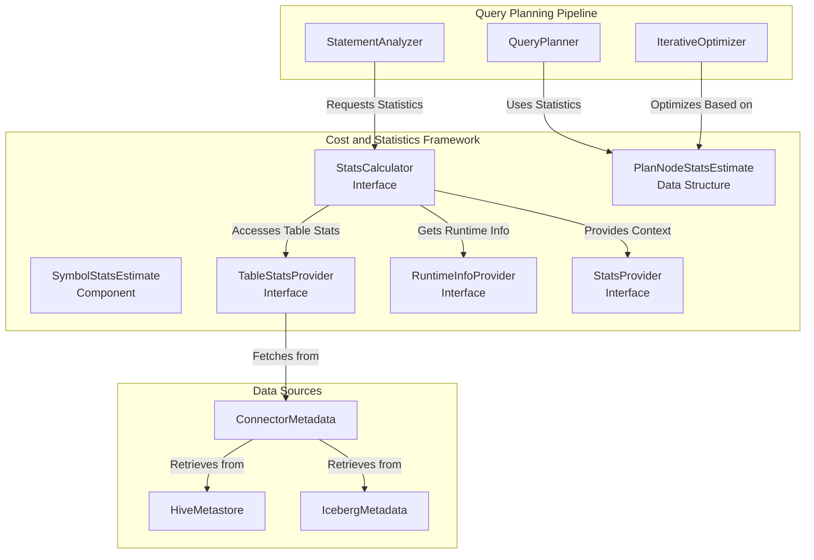
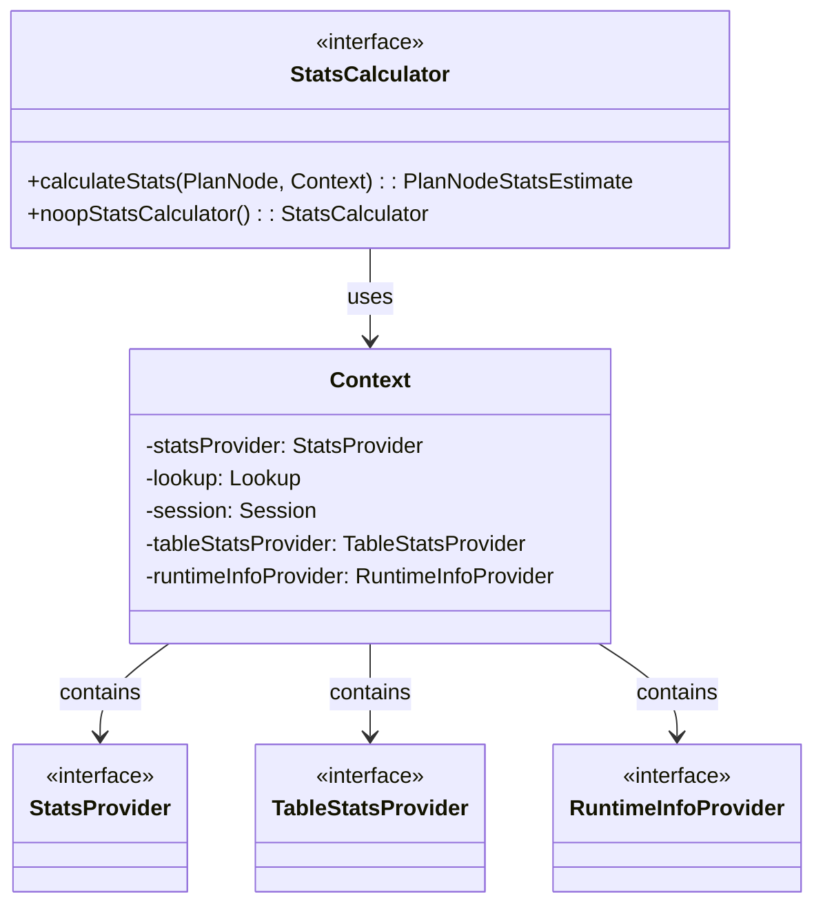
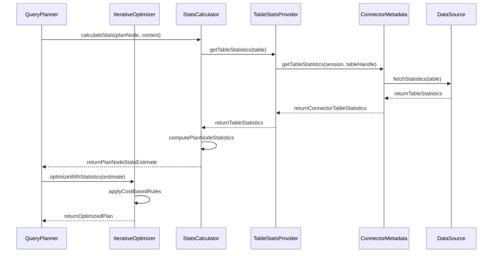
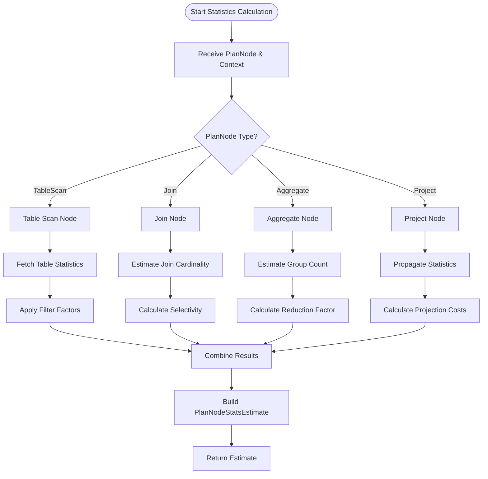

# Cost and Statistics Framework

## Introduction

The Cost and Statistics Framework is a critical component of Trino's query optimization engine that provides statistical information and cost estimation for query planning. This framework enables the query optimizer to make intelligent decisions about join ordering, data distribution strategies, and execution plan selection by providing accurate estimates of data characteristics such as row counts, data sizes, and column statistics.

The framework serves as the foundation for cost-based optimization in Trino, allowing the system to choose the most efficient execution plans based on statistical analysis of the data rather than relying solely on rule-based heuristics.

## Architecture Overview

The Cost and Statistics Framework operates as an integral part of Trino's query planning and optimization pipeline, working closely with the [SQL Analyzer, Planner & Optimizer](SQL Analyzer, Planner & Optimizer.md) module to provide statistical insights that drive optimization decisions.



## Core Components

### StatsCalculator Interface

The `StatsCalculator` interface is the primary entry point for statistical calculations in Trino. It defines the contract for computing statistics for any given plan node within the query execution tree.



**Key Responsibilities:**
- Calculate statistical estimates for plan nodes
- Provide context for statistics computation
- Support pluggable statistics calculation strategies
- Handle unknown statistics gracefully

### PlanNodeStatsEstimate

The `PlanNodeStatsEstimate` class represents comprehensive statistical information about a plan node's expected output. It includes row count estimates and per-column statistics that are essential for cost-based optimization decisions.

```mermaid
classDiagram
    class PlanNodeStatsEstimate {
        -outputRowCount: double
        -symbolStatistics: PMap<Symbol, SymbolStatsEstimate>
        +getOutputRowCount(): double
        +getOutputSizeInBytes(Collection<Symbol>): double
        +getSymbolStatistics(Symbol): SymbolStatsEstimate
        +mapOutputRowCount(Function<Double, Double>): PlanNodeStatsEstimate
        +mapSymbolColumnStatistics(Symbol, Function<SymbolStatsEstimate, SymbolStatsEstimate>): PlanNodeStatsEstimate
    }
    
    class Builder {
        -outputRowCount: double
        -symbolStatistics: PMap<Symbol, SymbolStatsEstimate>
        +setOutputRowCount(double): Builder
        +addSymbolStatistics(Symbol, SymbolStatsEstimate): Builder
        +addSymbolStatistics(Map<Symbol, SymbolStatsEstimate>): Builder
        +removeSymbolStatistics(Symbol): Builder
        +build(): PlanNodeStatsEstimate
    }
    
    class SymbolStatsEstimate {
        <<external>>
    }
    
    PlanNodeStatsEstimate --> Builder : creates
    PlanNodeStatsEstimate --> SymbolStatsEstimate : contains
    Builder --> PlanNodeStatsEstimate : builds
```

**Key Features:**
- Immutable statistical estimates with persistent data structures
- Support for unknown values using `Double.NaN`
- Comprehensive size estimation including null handling
- Functional transformation methods for statistics propagation
- Builder pattern for flexible construction

## Data Flow and Integration

The framework integrates seamlessly with Trino's query planning pipeline through a well-defined data flow:



## Statistics Calculation Process

The statistics calculation follows a systematic process that considers various data characteristics:



## Key Features and Capabilities

### 1. Comprehensive Statistics Collection

The framework collects and maintains various types of statistical information:

- **Row Count Estimates**: Total number of rows expected from each plan node
- **Column Statistics**: Per-column information including null fractions, distinct values, and data distribution
- **Size Estimates**: Memory and storage size calculations for data processing
- **Selectivity Factors**: Filter and join selectivity for cardinality estimation

### 2. Pluggable Statistics Providers

The framework supports multiple statistics sources through provider interfaces:

- **Connector-level Statistics**: Native statistics from underlying data sources
- **Runtime Statistics**: Dynamic statistics collected during query execution
- **Historical Statistics**: Statistics maintained across query executions
- **Estimated Statistics**: Heuristic-based estimates when actual statistics are unavailable

### 3. Cost-Based Optimization Support

Statistics feed into Trino's cost model to enable intelligent optimization decisions:

- **Join Ordering**: Choose optimal join order based on table sizes and join selectivity
- **Partitioning Strategy**: Determine optimal data distribution based on cardinality
- **Algorithm Selection**: Select appropriate algorithms (hash vs. sort merge joins)
- **Resource Allocation**: Estimate memory and CPU requirements for plan execution

## Integration with Other Modules

### SQL Analyzer, Planner & Optimizer

The Cost and Statistics Framework is deeply integrated with the [SQL Analyzer, Planner & Optimizer](SQL Analyzer, Planner & Optimizer.md) module:

- **Analysis Phase**: Statistics inform semantic analysis and validation
- **Planning Phase**: Query plans are constructed with statistical awareness
- **Optimization Phase**: Iterative optimization uses statistics to evaluate plan alternatives

### Connector Framework

Integration with the [Connector Framework](Trino SPI.md#connector-framework) enables:

- **Native Statistics**: Connectors provide table and column statistics from underlying systems
- **Statistics Collection**: Connectors can implement custom statistics gathering
- **Metadata Integration**: Statistics are stored and retrieved through connector metadata interfaces

### Query Execution Engine

The [Query Execution Engine](Query Execution Engine.md) benefits from statistics through:

- **Resource Planning**: Memory and CPU allocation based on statistical estimates
- **Parallelism Decisions**: Degree of parallelism determined by data volume estimates
- **Operator Selection**: Runtime operator selection informed by statistical predictions

## Usage Patterns

### Statistics Calculation

```java
// Example of statistics calculation context
StatsCalculator.Context context = new StatsCalculator.Context(
    statsProvider,
    lookup,
    session,
    tableStatsProvider,
    runtimeInfoProvider
);

// Calculate statistics for a plan node
PlanNodeStatsEstimate estimate = statsCalculator.calculateStats(planNode, context);
```

### Statistics Estimation

```java
// Building statistics estimates
PlanNodeStatsEstimate estimate = PlanNodeStatsEstimate.builder()
    .setOutputRowCount(1000000)
    .addSymbolStatistics(symbol, SymbolStatsEstimate.builder()
        .setNullsFraction(0.1)
        .setDistinctValuesCount(50000)
        .setAverageRowSize(25.0)
        .build())
    .build();
```

## Performance Considerations

### Statistics Accuracy

- **Freshness**: Regular statistics updates ensure accuracy
- **Sampling**: Appropriate sampling techniques balance accuracy with collection cost
- **Approximation**: Use of approximate algorithms for large-scale statistics
- **Confidence**: Confidence intervals for statistical estimates

### Memory Management

- **Incremental Updates**: Support for incremental statistics updates
- **Caching**: Intelligent caching of frequently accessed statistics
- **Garbage Collection**: Proper cleanup of temporary statistical data
- **Memory Limits**: Bounded memory usage for statistics collection

### Computational Efficiency

- **Lazy Evaluation**: Statistics computed only when needed
- **Parallel Processing**: Parallel statistics collection where possible
- **Incremental Computation**: Reuse of previously computed statistics
- **Approximation Algorithms**: Trade accuracy for performance when appropriate

## Error Handling and Resilience

### Unknown Statistics

The framework gracefully handles cases where statistics are unavailable:

- **Default Estimates**: Conservative default estimates for unknown statistics
- **Fallback Strategies**: Alternative optimization strategies when statistics are missing
- **Progressive Enhancement**: Improvement of estimates as more information becomes available

### Statistics Inconsistency

- **Validation**: Cross-validation of statistics from multiple sources
- **Reconciliation**: Resolution of conflicting statistical information
- **Error Bounds**: Maintenance of error bounds for statistical estimates
- **Feedback Loops**: Correction of statistics based on actual execution results

## Future Enhancements

### Advanced Statistics

- **Histogram Support**: Detailed data distribution histograms
- **Correlation Statistics**: Column correlation and dependency information
- **Temporal Statistics**: Time-based statistics for evolving data
- **Multi-dimensional Statistics**: Joint statistics across multiple columns

### Machine Learning Integration

- **Predictive Models**: ML-based statistics prediction
- **Adaptive Statistics**: Dynamic statistics adjustment based on query patterns
- **Anomaly Detection**: Identification of statistical anomalies
- **Auto-tuning**: Automatic statistics collection and maintenance

### Performance Optimizations

- **Vectorized Statistics**: SIMD-accelerated statistics computation
- **GPU Acceleration**: GPU-based statistics processing for large datasets
- **Distributed Collection**: Distributed statistics gathering across cluster
- **Real-time Updates**: Continuous statistics updates during query execution

## Conclusion

The Cost and Statistics Framework is a foundational component that enables Trino's sophisticated query optimization capabilities. By providing accurate statistical information and cost estimates, it empowers the optimizer to make intelligent decisions that significantly improve query performance. The framework's modular design, comprehensive feature set, and tight integration with other Trino components make it an essential part of the system's architecture.

The framework continues to evolve with enhancements in statistical accuracy, computational efficiency, and integration with advanced optimization techniques, ensuring that Trino remains at the forefront of distributed SQL query optimization.