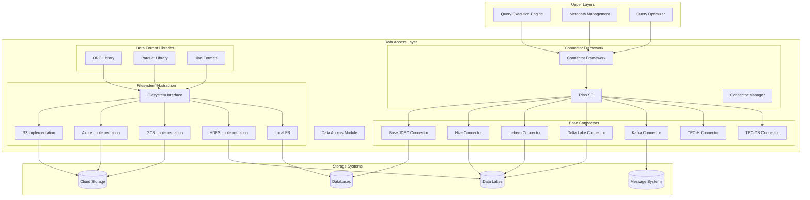
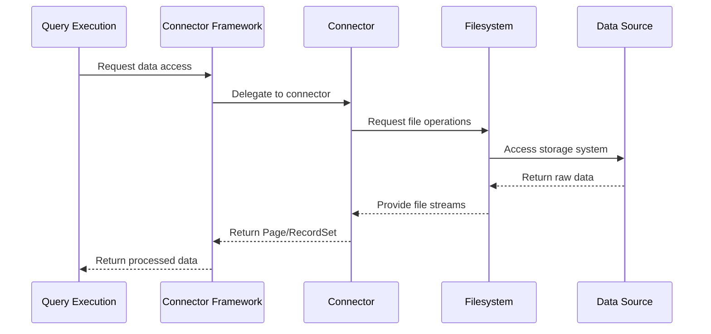
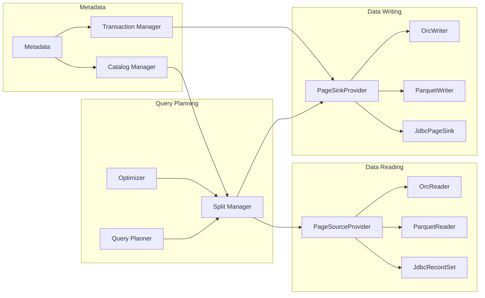
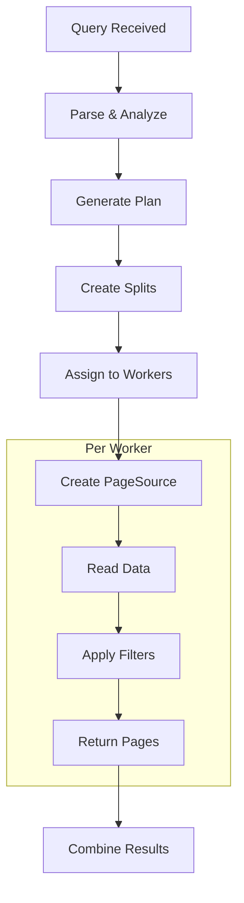
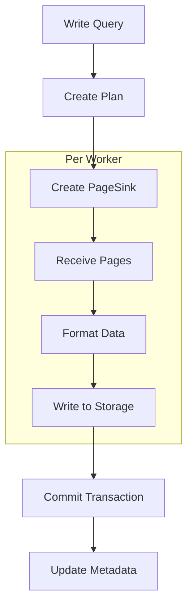

# Data Access Module

## Introduction

The Data Access module is a fundamental component of the Trino ecosystem that provides the core interfaces and implementations for reading and writing data across various data sources. This module serves as the abstraction layer between Trino's query execution engine and the underlying data storage systems, enabling seamless access to diverse data formats and storage technologies.

The module encompasses the connector framework, data format libraries, filesystem abstractions, and base implementations that allow Trino to interact with different data sources including traditional databases, cloud storage systems, and modern data lake formats.

## Architecture Overview



## Core Components

### Connector Framework

The Connector Framework provides the foundational interfaces and abstractions that enable Trino to interact with external data sources. Built on top of the Trino SPI, it defines the contracts that connectors must implement to provide data access capabilities.

**Key Components:**
- **Trino SPI**: Defines core interfaces for plugins, connectors, and data types
- **Connector Manager**: Manages connector lifecycle and registration
- **Plugin Architecture**: Enables dynamic loading of connector implementations

### Data Format Libraries

These libraries provide specialized readers and writers for popular columnar data formats, optimized for analytical workloads.

**ORC Library:**
- `OrcReader.FieldMapperFactory`: Creates field mapping strategies for ORC files
- `OrcWriter`: Handles writing data in ORC format
- `OrcDataSource`: Abstracts data source operations for ORC files

**Parquet Library:**
- `ParquetReader`: Reads Parquet files with predicate pushdown support
- `ParquetWriter`: Writes data in Parquet format
- `ParquetDataSource`: Manages data source operations for Parquet files

**Hive Formats:**
- `ColumnEncoding`: Provides encoding strategies for Hive columnar data
- `RcFileReader.Column`: Handles reading RCFile format data

### Filesystem Abstraction Layer

The filesystem abstraction provides a unified interface for accessing data across different storage systems, from local filesystems to cloud storage services.

**Core Interface:**
- `TrinoFileSystem`: Main filesystem abstraction
- `TrinoFileSystemFactory`: Factory for creating filesystem instances

**Cloud Storage Implementations:**
- **S3**: `S3FileSystemFactory` for Amazon S3 compatibility
- **Azure**: `AzureFileSystemFactory` for Microsoft Azure Blob Storage
- **GCS**: `GcsFileSystemFactory` for Google Cloud Storage

**Traditional Storage:**
- **HDFS**: `HdfsFileSystemFactory` for Hadoop Distributed File System
- **Local**: `LocalFileSystemFactory` for local filesystem access

### Base JDBC Connector

The Base JDBC Connector provides a foundation for building connectors that interact with JDBC-compliant databases.

**Core Components:**
- `JdbcClient`: Interface for JDBC operations with Top-N function support
- `JdbcConnector`: Main connector implementation
- `JdbcMetadata`: Handles metadata operations
- `JdbcSplitManager`: Manages data partitioning for distributed processing
- `JdbcPageSourceProvider`: Provides data reading capabilities
- `JdbcPageSinkProvider`: Handles data writing operations
- `ColumnMapping`: Manages type mapping between Trino and JDBC types

### Specialized Connectors

**Hive Connector:**
- `HivePlugin`: Plugin entry point
- `HiveMetadata`: Manages Hive table metadata
- `HiveSplitManager`: Handles data partitioning
- `HivePageSourceProvider`: Reads Hive table data
- `HivePageSinkProvider`: Writes data to Hive tables
- `HiveTransactionManager`: Manages transactional operations
- Metastore clients for Thrift and AWS Glue

**Iceberg Connector:**
- `IcebergPlugin`: Plugin entry point
- `IcebergMetadata`: Manages Iceberg table metadata
- `IcebergSplitManager`: Handles data partitioning
- `IcebergPageSourceProvider`: Reads Iceberg table data
- `IcebergPageSinkProvider`: Writes data to Iceberg tables
- Catalog abstraction with Hive Metastore and AWS Glue support
- `OptimizeTableProcedure`: Table optimization procedures

**Delta Lake Connector:**
- `DeltaLakePlugin`: Plugin entry point
- `DeltaLakeMetadata`: Manages Delta Lake table metadata
- `DeltaLakeSplitManager`: Handles data partitioning
- `DeltaLakePageSourceProvider`: Reads Delta Lake table data
- `DeltaLakePageSinkProvider`: Writes data to Delta Lake tables
- `TransactionLogAccess`: Manages Delta transaction log
- Maintenance procedures (Vacuum, Optimize)

**Kafka Connector:**
- `KafkaPlugin`: Plugin entry point
- `KafkaConnector`: Main connector implementation
- `KafkaMetadata`: Manages Kafka topic metadata
- `KafkaSplitManager`: Handles topic partitioning
- `KafkaRecordSetProvider`: Reads Kafka messages
- Schema registry integration (Confluent)
- Data encoding support (JSON, Avro)

**TPC Connectors:**
- `TpchConnector` and `TpcdsConnector`: Provide standardized benchmark data
- Include metadata management, data distribution, and access components

## Data Flow Architecture



## Component Interactions



## Key Features

### 1. Unified Data Access
The module provides a consistent interface for accessing data regardless of the underlying storage system, enabling Trino to query diverse data sources through a single SQL interface.

### 2. Format Optimization
Specialized readers and writers for columnar formats (ORC, Parquet) include optimizations such as:
- Predicate pushdown
- Column pruning
- Vectorized reading
- Compression support

### 3. Cloud Storage Integration
Native support for major cloud storage platforms with features like:
- Authentication and authorization
- Region-aware access
- Streaming I/O
- Multi-part uploads

### 4. Transaction Support
Advanced connectors like Iceberg and Delta Lake provide ACID transaction capabilities:
- Snapshot isolation
- Optimistic concurrency control
- Time travel queries
- Rollback capabilities

### 5. Schema Evolution
Support for schema evolution in modern table formats:
- Backward and forward compatibility
- Column addition/removal
- Type changes
- Partition evolution

## Integration with Other Modules

### [Trino SPI](Trino%20SPI.md)
The Data Access module is built upon the Trino SPI, which defines the fundamental interfaces for connectors, data types, and plugin architecture. All connectors implement SPI interfaces to integrate with Trino's query execution engine.

### [Query Execution Engine](Query%20Execution%20Engine.md)
The Query Execution Engine interacts with the Data Access module through the connector framework to read and write data during query processing. The execution engine provides the context and coordination for data access operations.

### [Metadata & Connector Abstraction](Metadata%20&%20Connector%20Abstraction.md)
This module manages connector registration, catalog configuration, and metadata operations that are essential for the Data Access module to function properly.

### [SQL Analyzer, Planner & Optimizer](SQL%20Analyzer%2C%20Planner%20&%20Optimizer.md)
The optimizer uses metadata from connectors to make informed decisions about query planning, including pushdown operations and cost-based optimizations.

## Process Flows

### Data Reading Process


### Data Writing Process


## Configuration and Deployment

### Connector Configuration
Connectors are configured through catalog properties files located in the `etc/catalog` directory. Each connector requires specific configuration parameters:

**Example JDBC Connector Configuration:**
```properties
connector.name=jdbc
connection-url=jdbc:postgresql://example.net:5432/database
connection-user=trino
connection-password=secret
```

**Example Hive Connector Configuration:**
```properties
connector.name=hive
hive.metastore.uri=thrift://hive-metastore:9083
hive.config.resources=/etc/hadoop/conf/core-site.xml,/etc/hadoop/conf/hdfs-site.xml
```

### Security Configuration
The module supports various security mechanisms:
- Authentication through Kerberos, LDAP, or native mechanisms
- Authorization through file-based or system access control
- Encryption for data in transit and at rest
- Credential management for cloud storage

## Performance Considerations

### 1. Partition Pruning
Connectors leverage partition information to eliminate unnecessary data access, significantly improving query performance.

### 2. Predicate Pushdown
Where possible, filters are pushed down to the storage layer, reducing data transfer and processing overhead.

### 3. Column Pruning
Only required columns are read from storage, minimizing I/O operations.

### 4. Parallel Processing
Data is divided into splits that can be processed in parallel across multiple workers, maximizing throughput.

### 5. Caching
Some connectors support caching mechanisms to reduce repeated access to frequently queried data.

## Extensibility

The modular design of the Data Access layer enables easy addition of new connectors and storage systems:

1. **Implement SPI Interfaces**: Create connector classes that implement the required SPI interfaces
2. **Register Plugin**: Package the connector as a plugin and register it with Trino
3. **Configure Catalog**: Add catalog configuration to enable the new connector
4. **Test Integration**: Verify functionality through the testing framework

## Monitoring and Observability

The module provides comprehensive monitoring capabilities:
- Connector-specific metrics
- Data access statistics
- Performance counters
- Error tracking and logging
- Integration with Trino's web UI for visualization

## Future Enhancements

The Data Access module continues to evolve with:
- Support for emerging data formats
- Enhanced cloud storage integrations
- Improved performance optimizations
- Advanced security features
- Better tooling for connector development

This comprehensive approach to data access makes Trino a powerful platform for federated querying across diverse data sources while maintaining performance, security, and reliability standards.