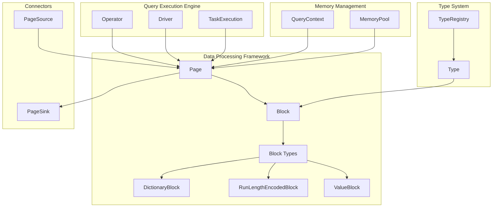
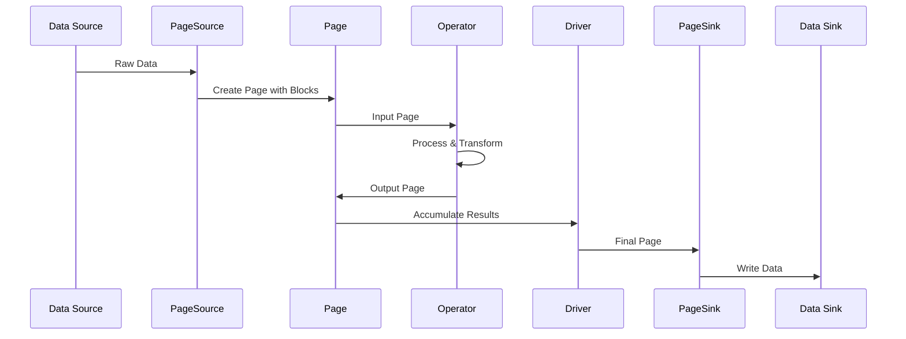
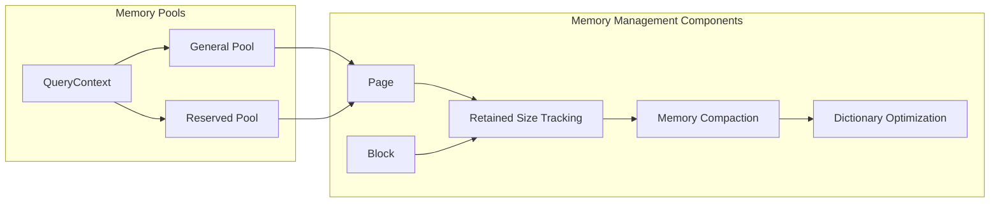
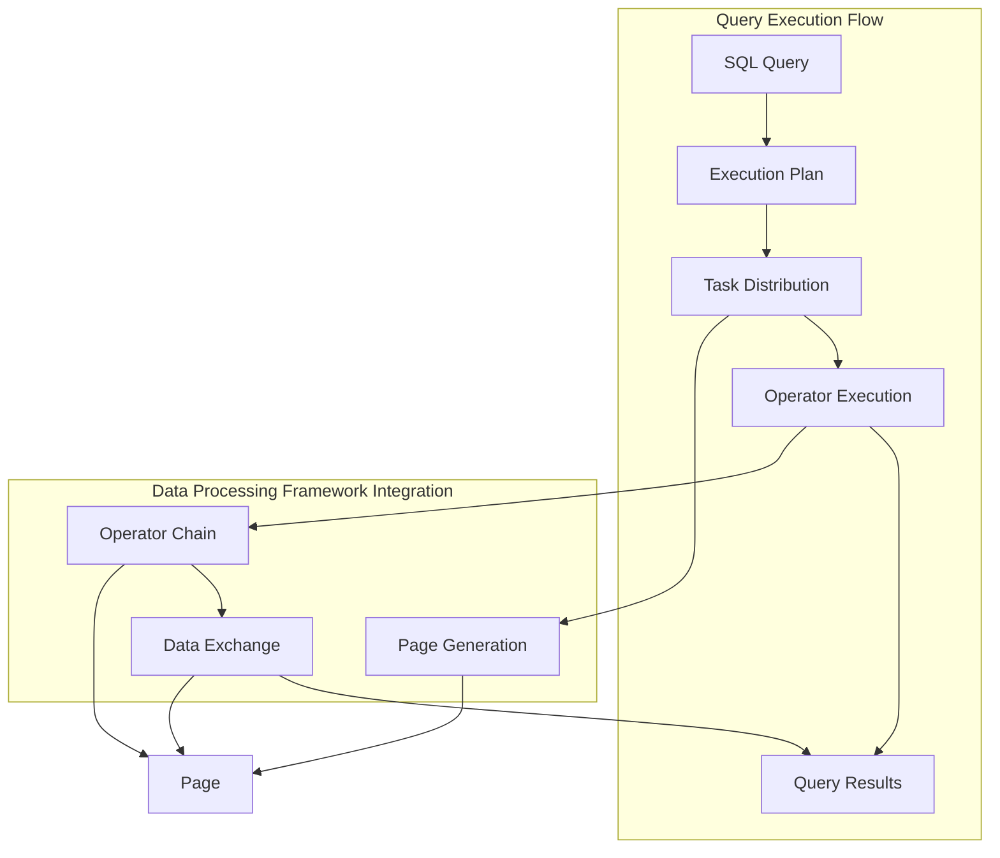
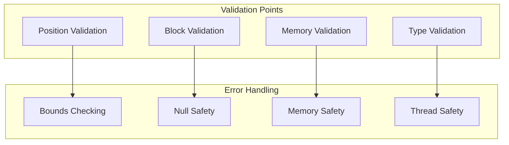

# Data Processing Framework

## Introduction

The Data Processing Framework is a fundamental component of Trino's query execution engine that provides efficient columnar data processing capabilities. It serves as the core abstraction layer for handling data in memory during query execution, enabling high-performance vectorized operations on large datasets.

The framework is built around two primary abstractions: `Page` and `Block`. These components work together to provide a memory-efficient, columnar data representation that supports Trino's distributed query processing model. The framework is designed to minimize memory allocations, support lazy evaluation, and enable efficient data transfer between operators in the execution pipeline.

## Architecture Overview

The Data Processing Framework operates as a critical layer within Trino's execution engine, providing the foundation for all data manipulation operations. It interfaces with multiple other Trino subsystems to deliver a cohesive data processing experience.

## Core Components

### Page

The `Page` class represents a collection of rows organized in columnar format. It is the fundamental unit of data that flows through Trino's execution engine. A Page contains one or more `Block` instances, where each Block represents a column of data.

**Key Characteristics:**
- **Columnar Storage**: Data is organized by columns rather than rows, enabling efficient vectorized operations
- **Position Count**: All blocks within a page must have the same number of positions (rows)
- **Memory Efficiency**: Supports lazy evaluation and memory compaction to minimize resource usage
- **Immutability**: Once created, pages are immutable, ensuring thread safety in distributed execution

**Core Operations:**
- **Slicing**: Extract regions of data without copying (`getRegion`, `getPositions`)
- **Column Selection**: Extract specific columns for projection operations (`getColumns`)
- **Column Addition**: Append or prepend columns for join or union operations (`appendColumn`, `prependColumn`)
- **Memory Compaction**: Reduce memory footprint by compacting dictionary blocks (`compact`)

### Block

The `Block` interface defines the contract for columnar data storage within Trino. It provides a unified abstraction for different encoding strategies and data types, enabling efficient operations on columnar data.

**Key Characteristics:**
- **Position-Based Access**: Data is accessed by position index, supporting random access patterns
- **Encoding Flexibility**: Supports multiple encoding strategies (dictionary, run-length, direct)
- **Null Handling**: Provides explicit null value support with efficient null checking
- **Memory Accounting**: Tracks both logical and retained memory sizes for accurate resource management

**Block Types:**
- **DictionaryBlock**: Stores data as references to a dictionary of unique values, ideal for columns with low cardinality
- **RunLengthEncodedBlock**: Compresses consecutive identical values, efficient for sorted or repetitive data
- **ValueBlock**: Direct storage of values, optimal for high-cardinality or unique data

## Data Flow Architecture

The Data Processing Framework integrates with Trino's execution pipeline through a well-defined data flow pattern:

## Memory Management

The framework implements sophisticated memory management strategies to handle large datasets efficiently:

**Memory Optimization Strategies:**
- **Lazy Evaluation**: Size calculations are performed on-demand and cached
- **Dictionary Compaction**: Related dictionary blocks are compacted to reduce memory overhead
- **Region Sharing**: Block regions can share underlying data to avoid unnecessary copying
- **Retained Size Tracking**: Accurate memory accounting for garbage collection and resource management

## Integration with Query Execution

The Data Processing Framework serves as the data backbone for Trino's query execution engine:

**Execution Integration Points:**
- **Task Execution**: Each task processes data in Page units
- **Operator Chain**: Operators consume and produce Pages through pipelined execution
- **Data Exchange**: Pages are serialized for network transfer between worker nodes
- **Spilling**: Pages can be spilled to disk when memory limits are exceeded

## Performance Optimizations

The framework incorporates several performance optimizations to maximize query execution efficiency:

### Vectorized Processing
- **SIMD Operations**: Block-based processing enables vectorized operations on columnar data
- **Batch Processing**: Operations are performed on batches of positions rather than individual rows
- **Cache Efficiency**: Columnar layout improves CPU cache utilization for analytical workloads

### Memory Efficiency
- **Dictionary Encoding**: Reduces memory footprint for low-cardinality columns
- **Run-Length Encoding**: Compresses repetitive data patterns
- **Lazy Materialization**: Data is materialized only when needed
- **Memory Pooling**: Reuses memory allocations to reduce garbage collection pressure

### Network Optimization
- **Columnar Serialization**: Efficient serialization format for network transfer
- **Compression**: Optional compression for large data transfers
- **Streaming**: Supports streaming data processing for large result sets

## Error Handling and Validation

The framework implements comprehensive error handling and data validation:

**Validation Strategies:**
- **Position Bounds**: All position accesses are validated against block boundaries
- **Block Consistency**: Page blocks are validated for consistent position counts
- **Memory Accounting**: Memory size calculations are validated for accuracy
- **Type Safety**: Type compatibility is enforced at the block level

## Dependencies and Interactions

The Data Processing Framework interacts with several other Trino modules:

### Direct Dependencies
- **[Type System](Type System.md)**: Provides type information for Block creation and operations
- **[Query Execution Engine](Query Execution Engine.md)**: Consumes Pages for operator processing
- **[Memory Management](Memory Management.md)**: Integrates with memory pools and spilling mechanisms

### Indirect Dependencies
- **[Connector Framework](Connector Framework.md)**: PageSources and PageSinks use Pages for data transfer
- **[SQL Functions & Operators](SQL Functions & Operators.md)**: Operators process data through Page interfaces
- **[Plan Optimizer](Plan Optimizer.md)**: Optimization decisions consider Page processing characteristics

## Best Practices

### Page Creation
- **Batch Size**: Create pages with appropriate batch sizes (typically 1K-10K positions)
- **Column Selection**: Only include necessary columns to minimize memory usage
- **Type Consistency**: Ensure all blocks within a page have compatible types

### Memory Management
- **Compaction**: Use `compact()` method when memory pressure is high
- **Region Operations**: Prefer region operations over copying when possible
- **Size Tracking**: Monitor both logical and retained sizes for accurate accounting

### Performance Optimization
- **Dictionary Blocks**: Use dictionary encoding for low-cardinality data
- **Batch Operations**: Process data in batches to maximize vectorization benefits
- **Column Pruning**: Eliminate unnecessary columns early in the processing pipeline

## Future Enhancements

The Data Processing Framework continues to evolve with planned enhancements:

- **Advanced Encoding**: Support for additional compression algorithms and encoding schemes
- **GPU Acceleration**: Integration with GPU processing for vectorized operations
- **Streaming Optimization**: Enhanced support for continuous data streams
- **Adaptive Processing**: Dynamic selection of optimal processing strategies based on data characteristics

## Conclusion

The Data Processing Framework serves as the cornerstone of Trino's high-performance query execution engine. Through its columnar data representation, efficient memory management, and comprehensive optimization strategies, it enables Trino to process large-scale analytical workloads with exceptional performance and scalability. The framework's design principles of immutability, lazy evaluation, and vectorized processing provide the foundation for Trino's distributed query processing capabilities.