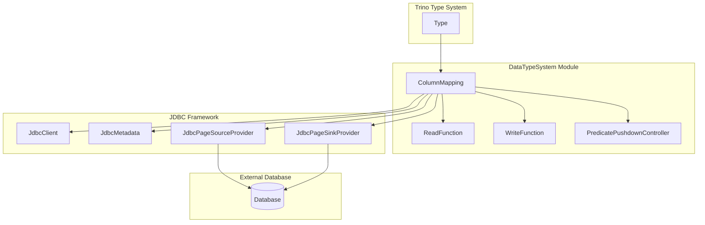
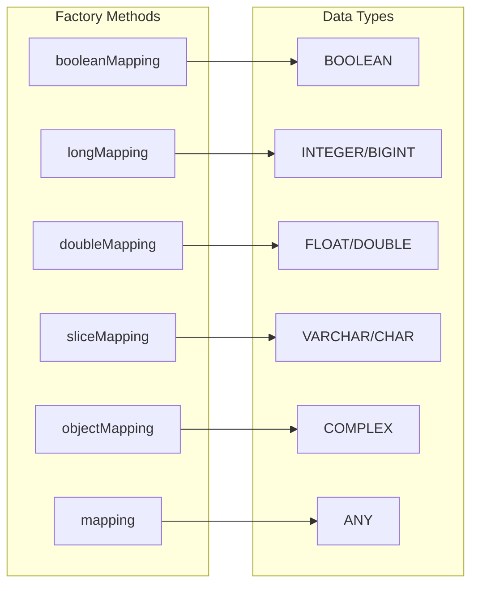
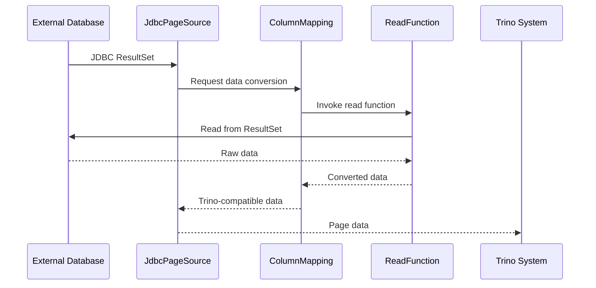
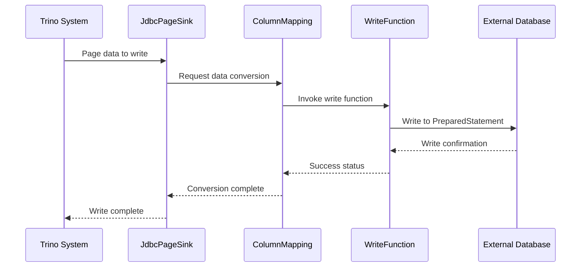
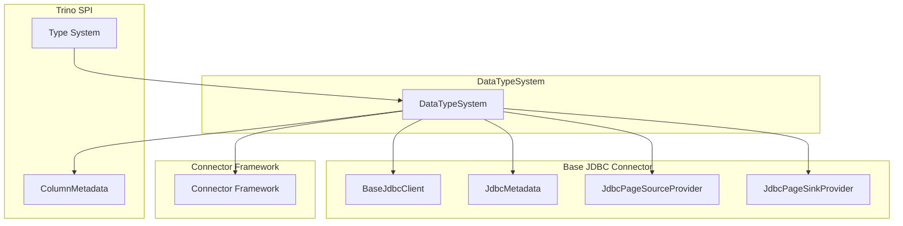
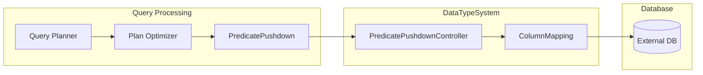
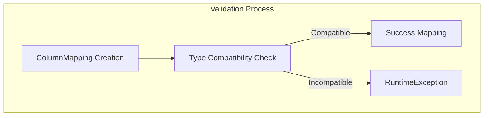
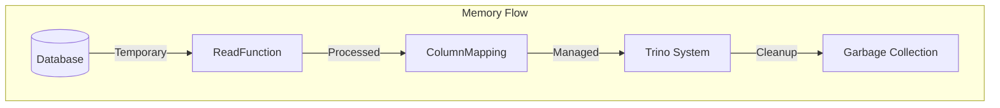
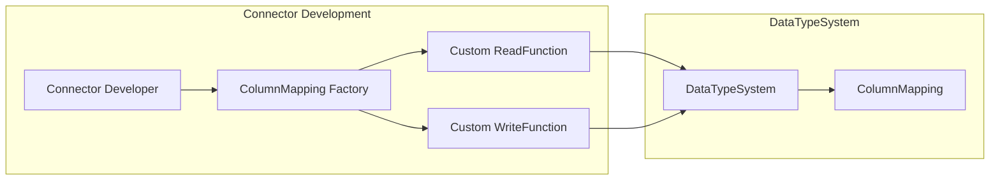

# DataTypeSystem Module Documentation

## Introduction

The DataTypeSystem module is a critical component of Trino's JDBC connector framework that handles the mapping between Trino's type system and external database systems' data types. It provides a unified abstraction layer for converting data between Trino's internal representation and various JDBC-compatible databases, ensuring seamless data type compatibility and efficient predicate pushdown operations.

## Overview

The DataTypeSystem module serves as the bridge between Trino's [Type System](TrinoSPI.md#type-system) and external database systems. It defines how data should be read from and written to JDBC sources while maintaining type safety and enabling query optimization through predicate pushdown.

## Core Architecture

### Component Structure

### Key Components

#### ColumnMapping
The central class that encapsulates the mapping between a Trino type and its JDBC representation:

- **Type**: The Trino type being mapped
- **ReadFunction**: Function to read data from JDBC result sets
- **WriteFunction**: Function to write data to JDBC prepared statements
- **PredicatePushdownController**: Controls predicate pushdown behavior

#### Type-Specific Factory Methods

The module provides specialized factory methods for common data types:

## Data Flow Architecture

### Read Path (Database → Trino)

### Write Path (Trino → Database)

## Integration with Trino Architecture

### Relationship with Core Systems

### Predicate Pushdown Integration

The DataTypeSystem plays a crucial role in query optimization by controlling predicate pushdown:

## Type Mapping Examples

### Basic Type Mappings

| Trino Type | JDBC Type | Read Function | Write Function |
|------------|-----------|---------------|----------------|
| BOOLEAN | BIT/BOOLEAN | BooleanReadFunction | BooleanWriteFunction |
| INTEGER | INTEGER | LongReadFunction | LongWriteFunction |
| BIGINT | BIGINT | LongReadFunction | LongWriteFunction |
| DOUBLE | DOUBLE | DoubleReadFunction | DoubleWriteFunction |
| VARCHAR | VARCHAR | SliceReadFunction | SliceWriteFunction |
| DATE | DATE | LongReadFunction | LongWriteFunction |

### Complex Type Handling

For complex types that don't have direct JDBC equivalents, the system uses:

- **ObjectReadFunction**: For reading complex objects from JDBC
- **ObjectWriteFunction**: For writing complex objects to JDBC
- **Custom serialization**: When database-specific formats are required

## Error Handling and Validation

### Type Compatibility Validation

The DataTypeSystem enforces strict type compatibility checks:

### Validation Rules

1. **Java Type Compatibility**: Ensures Trino type's Java type matches read/write function Java types
2. **Null Safety**: All components must be non-null
3. **Predicate Pushdown**: Must specify a valid pushdown controller

## Performance Considerations

### Optimization Strategies

1. **Type-Specific Functions**: Dedicated read/write functions for common types
2. **Predicate Pushdown**: Minimizes data transfer by pushing filters to the database
3. **Batch Operations**: Efficient handling of multiple rows
4. **Memory Management**: Proper handling of variable-length types (Slice, Object)

### Memory Management

## Extension Points

### Custom Type Mappings

Connectors can extend the DataTypeSystem by:

1. **Custom Read/Write Functions**: Implementing type-specific conversion logic
2. **Custom Predicate Pushdown Controllers**: Defining pushdown behavior
3. **Type-Specific Optimizations**: Specialized handling for connector-specific types

### Integration with Connector Development

## Testing and Validation

### Test Framework Integration

The DataTypeSystem integrates with Trino's testing framework through:

- **Type compatibility tests**: Ensuring mappings work correctly
- **Round-trip tests**: Verifying read/write consistency
- **Performance tests**: Validating efficiency of type conversions
- **Integration tests**: Testing with real database systems

## Best Practices

### For Connector Developers

1. **Use appropriate factory methods**: Leverage type-specific mappings when possible
2. **Implement efficient read/write functions**: Minimize object creation and copying
3. **Consider predicate pushdown**: Enable query optimization where appropriate
4. **Handle null values properly**: Ensure robust null handling in custom functions
5. **Document type mappings**: Clearly document supported types and limitations

### For Performance Optimization

1. **Batch operations**: Process multiple rows efficiently
2. **Minimize conversions**: Avoid unnecessary type conversions
3. **Use native types**: Prefer database-native types when possible
4. **Profile memory usage**: Monitor memory consumption for large datasets

## Related Documentation

- [Trino SPI](TrinoSPI.md) - Core type system and plugin architecture
- [Base JDBC Connector](BaseJdbcConnector.md) - JDBC connector framework
- [Connector Framework](ConnectorFramework.md) - General connector development
- [Query Execution Engine](QueryExecutionEngine.md) - Query processing and optimization
- [SQL Functions & Operators](SqlFunctionsAndOperators.md) - Type-specific function implementations

## Conclusion

The DataTypeSystem module is fundamental to Trino's ability to work with diverse external database systems. By providing a clean abstraction layer for type mapping and conversion, it enables seamless integration while maintaining performance and type safety. Understanding this module is essential for connector developers and anyone working with Trino's data access layer.