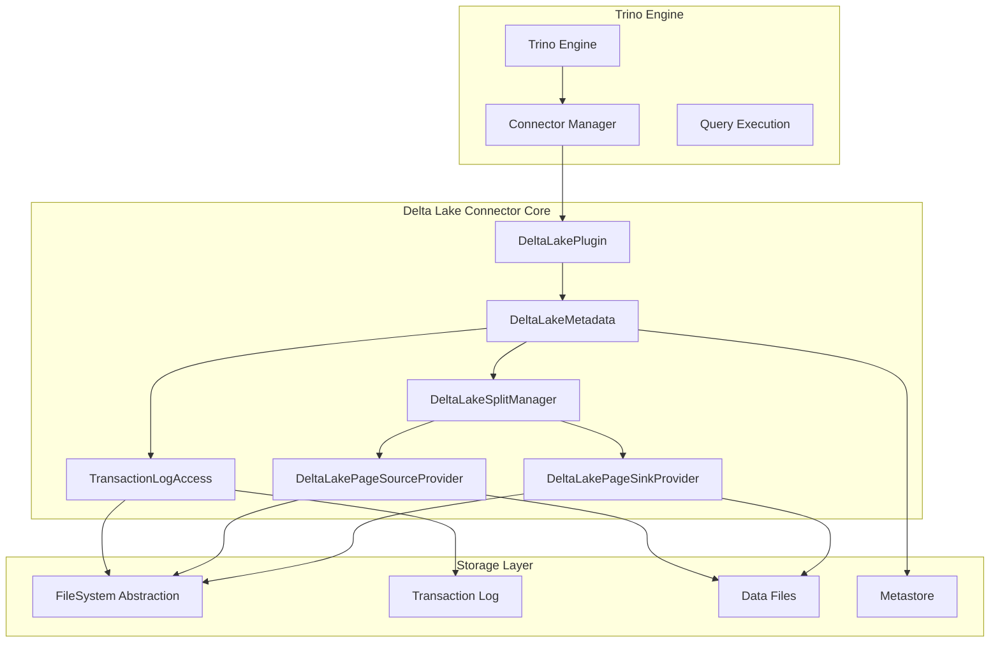
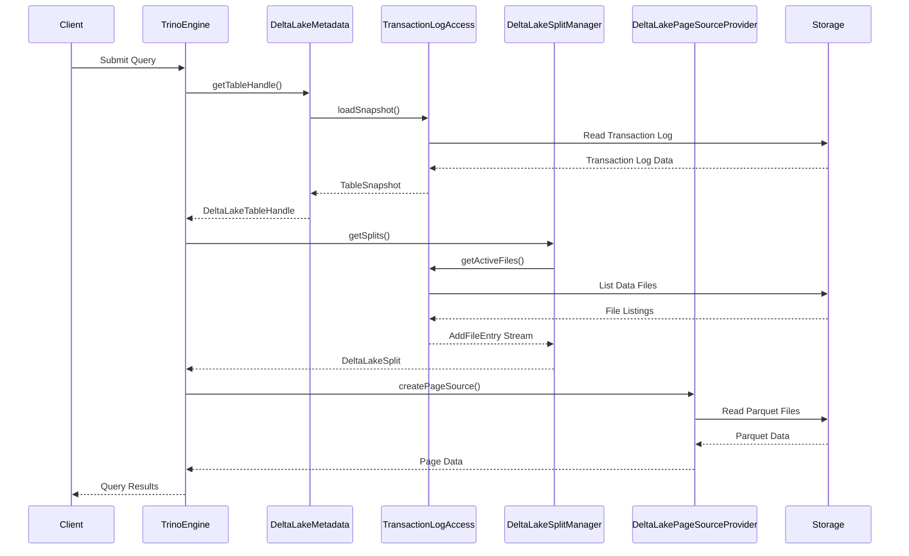
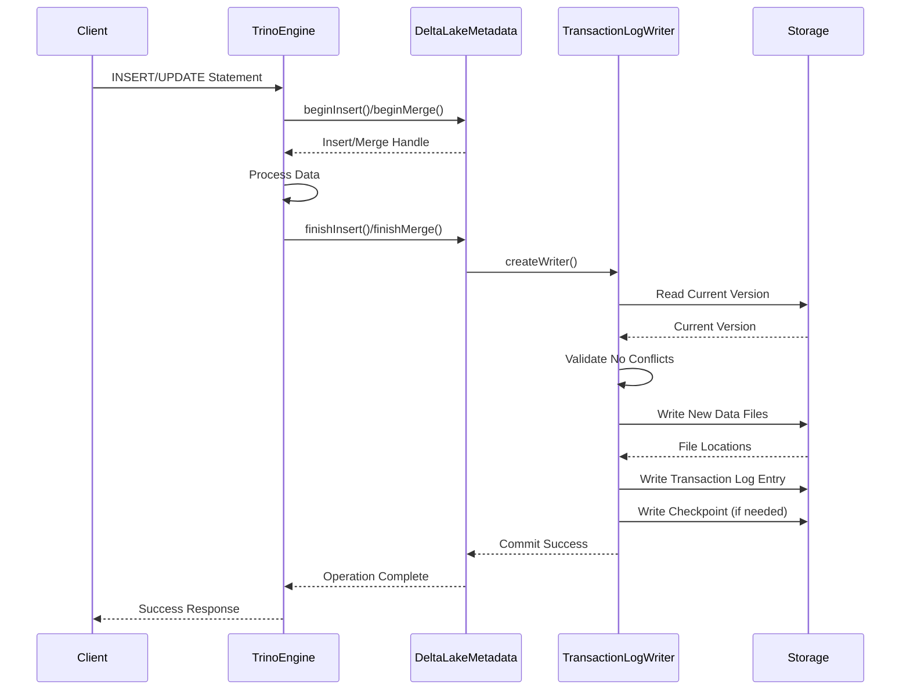
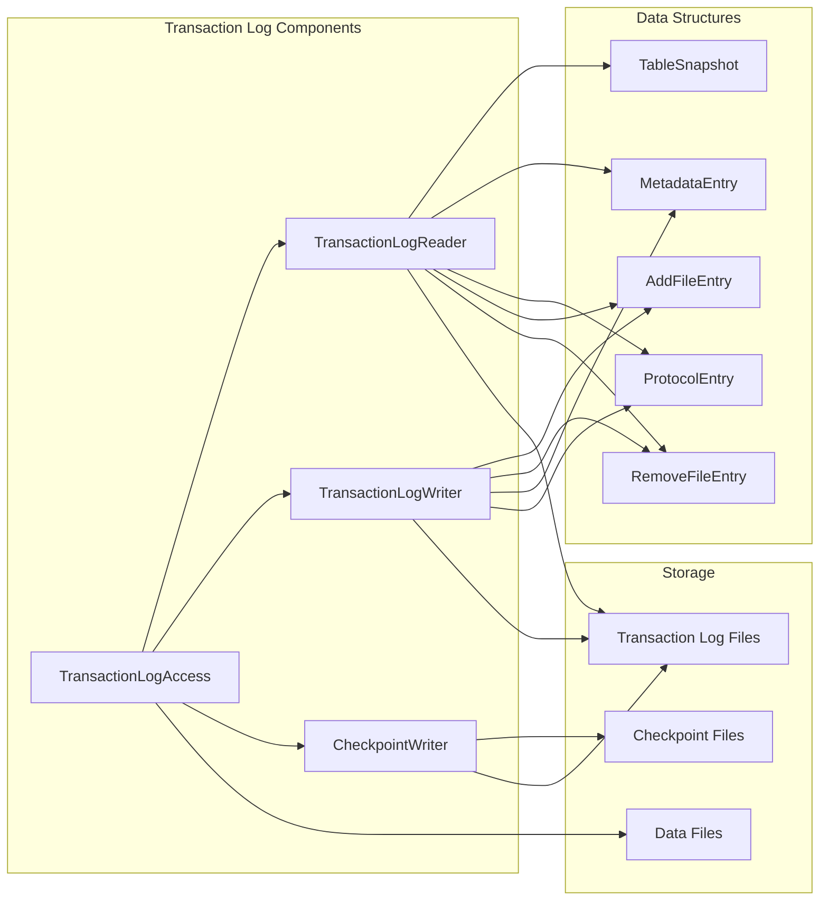
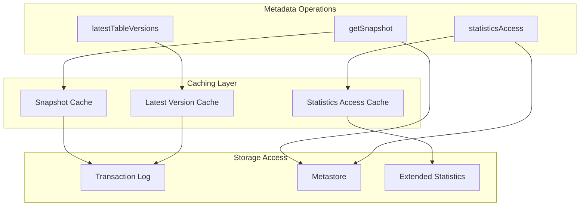
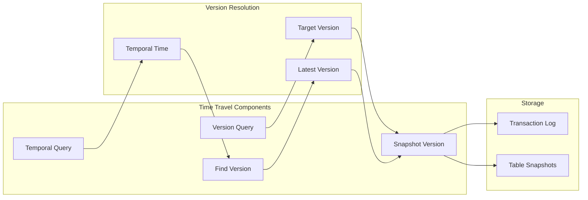
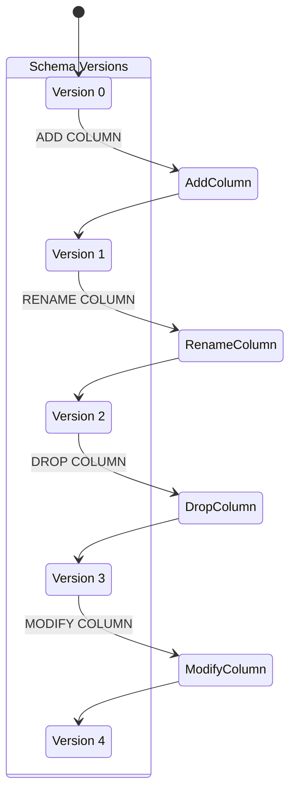
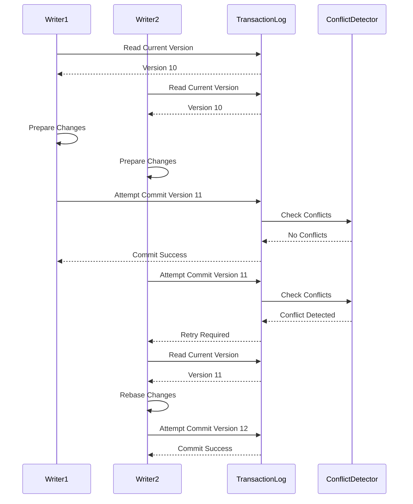
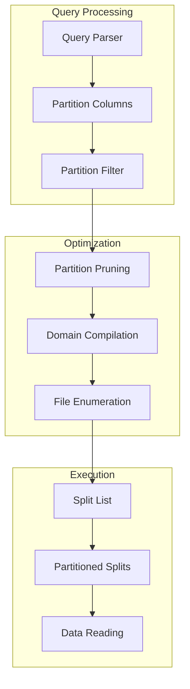
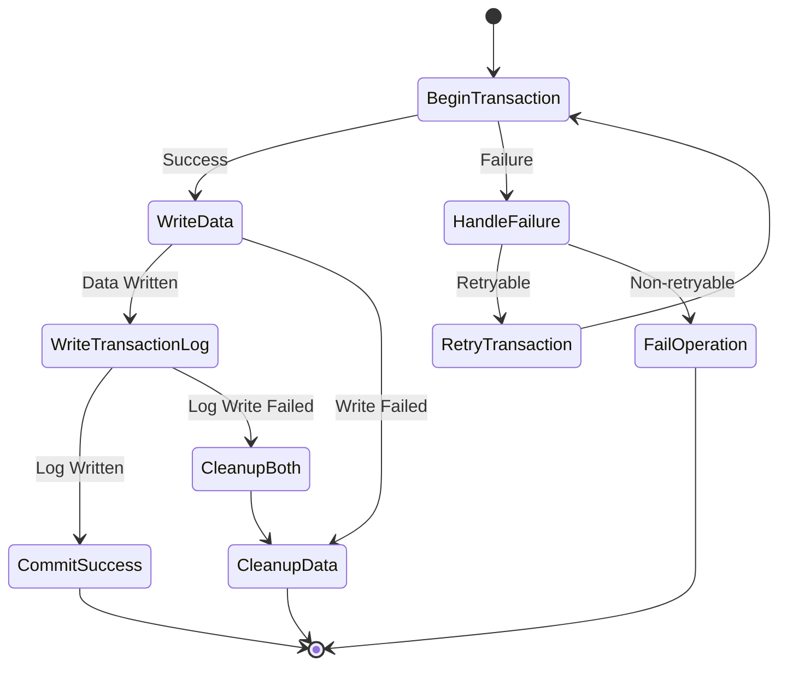

# Delta Lake Connector Core Module

## Introduction

The Delta Lake Connector Core module provides Trino's native integration with Delta Lake tables, enabling efficient querying and management of Delta Lake datasets. This module implements the core functionality that allows Trino to read from and write to Delta Lake tables while maintaining ACID transaction guarantees and leveraging Delta Lake's advanced features like time travel, schema evolution, and transaction logs.

The connector bridges Trino's distributed SQL engine with Delta Lake's storage format, providing seamless access to Delta Lake tables through standard SQL operations while preserving the reliability and performance characteristics of both systems.

## Architecture Overview

The Delta Lake Connector Core follows a layered architecture that integrates with Trino's plugin framework and leverages Delta Lake's transaction log protocol:

## Core Components

### DeltaLakePlugin

The `DeltaLakePlugin` class serves as the entry point for the Delta Lake connector, implementing Trino's `Plugin` interface. It registers the connector factory with Trino's plugin manager, enabling the creation of Delta Lake connector instances.

**Key Responsibilities:**
- Plugin registration and lifecycle management
- Connector factory provisioning
- Integration with Trino's plugin architecture

**Dependencies:**
- [Trino SPI Plugin Framework](Trino SPI.md#plugin-architecture)

### DeltaLakeMetadata

The `DeltaLakeMetadata` class is the central component that implements Trino's `ConnectorMetadata` interface. It provides comprehensive metadata operations for Delta Lake tables, including table discovery, schema management, and transaction coordination.

**Key Responsibilities:**
- Table metadata retrieval and caching
- Schema evolution and column management
- Transaction log processing and version management
- Partition pruning and constraint pushdown
- Statistics collection and management
- Time travel query support

**Core Features:**
- **Snapshot Management**: Maintains table snapshots with version tracking
- **Transaction Coordination**: Handles concurrent write operations with conflict detection
- **Schema Evolution**: Supports adding, dropping, and renaming columns
- **Partition Optimization**: Implements partition pruning for efficient queries
- **Statistics Integration**: Collects and utilizes table statistics for query optimization

**Key Methods:**
- `getSnapshot()`: Retrieves table snapshots with caching
- `getTableHandle()`: Creates table handles for query processing
- `applyFilter()`: Applies partition and column constraints
- `createTable()`: Handles table creation with transaction log initialization
- `finishInsert()`: Commits insert operations to transaction log

**Dependencies:**
- [Trino SPI Connector Framework](Trino SPI.md#connector-framework)
- [FileSystem Abstraction Layer](Filesystem Abstraction Layer.md)
- [Hive Support Libraries](Hive Support Libraries.md)

## Data Flow Architecture

### Query Execution Flow

### Write Operation Flow

## Component Interactions

### Transaction Log Processing

The connector implements a sophisticated transaction log processing system that ensures ACID properties:

### Metadata Caching and Optimization

The connector implements intelligent caching mechanisms to optimize metadata operations:

## Key Features Implementation

### Time Travel Support

The connector supports Delta Lake's time travel feature, allowing queries to access historical versions of tables:

### Schema Evolution

The connector handles schema changes while maintaining backward compatibility:

### Concurrent Write Handling

The connector implements sophisticated conflict detection and resolution for concurrent operations:

## Integration Points

### Trino SPI Integration

The connector integrates with Trino's SPI through well-defined interfaces:

- **Plugin Interface**: `DeltaLakePlugin` implements Trino's `Plugin` interface
- **ConnectorMetadata**: `DeltaLakeMetadata` provides metadata operations
- **ConnectorSplitManager**: Manages data splitting for distributed processing
- **ConnectorPageSource**: Handles data reading from Delta Lake files
- **ConnectorPageSink**: Manages data writing to Delta Lake tables

### Storage Layer Integration

The connector leverages multiple storage abstractions:

- **FileSystem Abstraction**: Unified interface for different storage systems (S3, Azure, GCS, HDFS)
- **Transaction Log Access**: Specialized component for reading/writing Delta transaction logs
- **Metastore Integration**: Connects with Hive metastore for table metadata
- **Parquet Integration**: Utilizes Trino's Parquet reader for columnar data access

### Dependencies

The Delta Lake Connector Core module depends on several key Trino modules:

- **[Trino SPI](Trino SPI.md)**: Core plugin and connector interfaces
- **[FileSystem Abstraction Layer](Filesystem Abstraction Layer.md)**: Unified storage access
- **[ORC & Parquet Libraries](ORC & Parquet Libraries.md)**: Columnar data format support
- **[Hive Support Libraries](Hive Support Libraries.md)**: Metastore integration and utilities
- **[Plugin Toolkit](Plugin Toolkit.md)**: Common plugin utilities and security frameworks

## Performance Optimizations

### Partition Pruning

The connector implements intelligent partition pruning to minimize data scanning:

### Statistics Collection

The connector supports comprehensive statistics collection for query optimization:

- **Column Statistics**: Min/max values, null counts, distinct value estimates
- **File Statistics**: Row counts, file sizes, modification times
- **Partition Statistics**: Partition-level aggregations and metadata
- **Extended Statistics**: Advanced statistics for complex query optimization

### Caching Strategies

Multiple caching layers optimize performance:

- **Snapshot Caching**: Caches table snapshots to avoid repeated transaction log reads
- **Metadata Caching**: Caches table metadata and schema information
- **Statistics Caching**: Caches collected statistics for query planning
- **File Listing Caching**: Caches data file listings for repeated queries

## Error Handling and Recovery

### Transaction Failure Handling

The connector implements robust error handling for transaction failures:

### Conflict Resolution

The connector handles various types of conflicts:

- **Concurrent Writes**: Detects and resolves write conflicts using retry mechanisms
- **Schema Conflicts**: Handles schema evolution conflicts during concurrent operations
- **Metadata Conflicts**: Resolves conflicts in table metadata updates
- **Partition Conflicts**: Manages conflicts in partition-specific operations

## Security and Access Control

### Security Integration

The connector integrates with Trino's security framework:

- **Access Control**: Leverages Trino's access control mechanisms
- **Authentication**: Supports Trino's authentication methods
- **Authorization**: Implements table-level and column-level authorization
- **Audit Logging**: Provides comprehensive audit trails for operations

### Data Protection

The connector ensures data protection through:

- **Encryption Support**: Works with encrypted storage systems
- **Secure File Access**: Implements secure file system access patterns
- **Credential Management**: Manages credentials for storage systems
- **Network Security**: Supports secure network protocols

## Monitoring and Observability

### Metrics Collection

The connector provides comprehensive metrics for monitoring:

- **Query Performance**: Execution times, data scanned, partitions pruned
- **Transaction Metrics**: Commit times, conflict rates, retry counts
- **Storage Metrics**: File access patterns, cache hit rates, I/O statistics
- **Error Metrics**: Failure rates, error types, recovery times

### Logging and Debugging

The connector includes extensive logging capabilities:

- **Transaction Logging**: Detailed transaction operation logs
- **Debug Information**: Comprehensive debug information for troubleshooting
- **Performance Logs**: Performance-related logging for optimization
- **Error Logs**: Detailed error information for problem resolution

This comprehensive documentation provides a thorough understanding of the Delta Lake Connector Core module's architecture, functionality, and integration within the Trino ecosystem. The module serves as a critical bridge between Trino's distributed SQL engine and Delta Lake's reliable storage format, enabling powerful analytics capabilities while maintaining data integrity and performance.