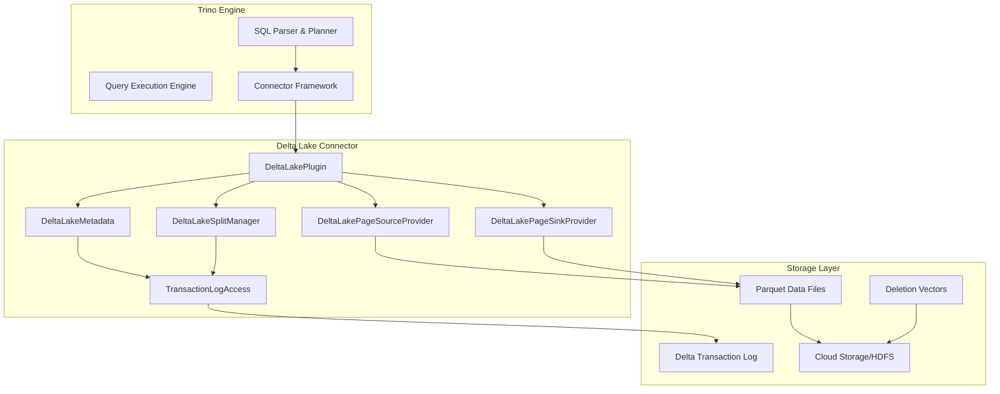

# Delta Lake Connector

## Overview

The Delta Lake Connector is a Trino plugin that enables querying and managing Delta Lake tables. Delta Lake is an open-source storage layer that brings ACID transactions, scalable metadata handling, and unified streaming/batch data processing to Apache Spark and other big data workloads.

This connector provides comprehensive support for Delta Lake tables, including reading, writing, schema evolution, time travel queries, and maintenance operations like VACUUM and OPTIMIZE.

## Architecture

The Delta Lake Connector integrates with Trino's plugin architecture and follows the standard connector pattern. It leverages Delta Lake's transaction log protocol to provide ACID guarantees and supports various storage backends including HDFS, S3, Azure Blob Storage, and Google Cloud Storage.

## Core Components

### Plugin Integration
- **DeltaLakePlugin**: Main plugin entry point that registers the connector with Trino
- Integrates with Trino's SPI framework
- Provides connector factory for creating Delta Lake connections

### Metadata Management
- **DeltaLakeMetadata**: Implements Trino's ConnectorMetadata interface
- Manages table schemas, partitions, and properties
- Handles DDL operations (CREATE, ALTER, DROP)
- Supports schema evolution and table versioning
- Manages transaction isolation and concurrency control

### Data Access Layer
- **DeltaLakeSplitManager**: Implements ConnectorSplitManager
- Generates splits for parallel query execution
- Applies partition pruning and file-level statistics filtering
- Supports dynamic filtering for query optimization

### Data Processing
- **DeltaLakePageSourceProvider**: Implements ConnectorPageSourceProvider
- Reads Parquet files and handles column projection
- Manages partition values and metadata columns
- Supports deletion vectors for efficient updates/deletes
- **DeltaLakePageSinkProvider**: Implements ConnectorPageSinkProvider
- Handles INSERT, UPDATE, and MERGE operations
- Manages file writing and transaction log updates

### Transaction Log Management
- **TransactionLogAccess**: Core component for reading Delta transaction logs
- Parses transaction log entries (JSON and Parquet checkpoints)
- Maintains table snapshots and version history
- Provides caching for improved performance

## Key Features

### ACID Transactions
- Full support for Delta Lake's transaction protocol
- Optimistic concurrency control with conflict detection
- Serializable and write-serializable isolation levels
- Automatic retry on transaction conflicts

### Schema Evolution
- Support for adding, dropping, and renaming columns
- Column mapping modes (none, name, id) for schema flexibility
- Automatic schema validation and compatibility checks

### Time Travel
- Query historical versions of tables
- Support for version-based and timestamp-based time travel
- Efficient snapshot isolation for consistent reads

### Maintenance Operations
- **VACUUM**: Remove old files and reclaim storage space
- **OPTIMIZE**: Compact small files for better query performance
- **ANALYZE**: Collect table statistics for query optimization

### Advanced Features
- Change Data Feed (CDF) support for tracking row-level changes
- Deletion vectors for efficient updates and deletes
- Column statistics and predicate pushdown
- Projection pushdown for complex data types
- Support for partitioned and non-partitioned tables

## Configuration

The connector supports various configuration options for performance tuning, security, and compatibility:

- **Storage Configuration**: File system settings, caching options
- **Performance Tuning**: Split sizes, parallelism levels, caching
- **Security**: Access control integration, authentication
- **Compatibility**: Delta Lake protocol version support

## Integration Points

The Delta Lake Connector integrates with several Trino subsystems:

- **Trino SPI**: Core plugin interfaces and contracts
- **File System Abstraction**: Unified storage layer support
- **Parquet Library**: Columnar data format processing
- **Metastore Integration**: Hive-compatible metastore support
- **Security Framework**: Access control and authentication

## Related Documentation

For detailed information about specific sub-modules, refer to:

- [Delta Lake Connector Core](Delta%20Lake%20Connector%20Core.md) - Plugin lifecycle and metadata management
- [Delta Lake Data Access](Delta%20Lake%20Data%20Access.md) - Split management and data processing
- [Delta Lake Transaction Log](Delta%20Lake%20Transaction%20Log.md) - Transaction log parsing and management
- [Delta Lake Procedures](Delta%20Lake%20Procedures.md) - Maintenance and utility procedures

For information about related Trino modules:

- [Trino SPI](Trino%20SPI.md) - Core plugin interfaces
- [Parquet Libraries](ORC%20&%20Parquet%20Libraries.md) - Columnar data format support
- [File System Abstraction](Filesystem%20Abstraction%20Layer.md) - Storage layer integration
- [Hive Support Libraries](Hive%20Support%20Libraries.md) - Hive metastore integration
- [Plugin Toolkit](Plugin%20Toolkit.md) - Base classes and utilities for plugins