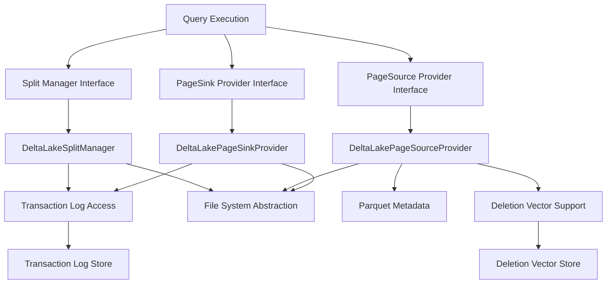
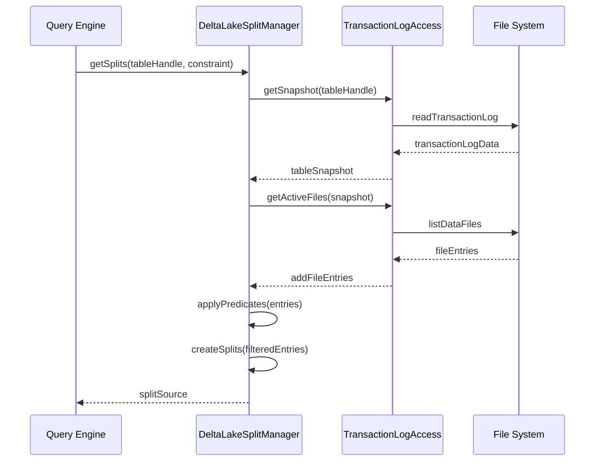
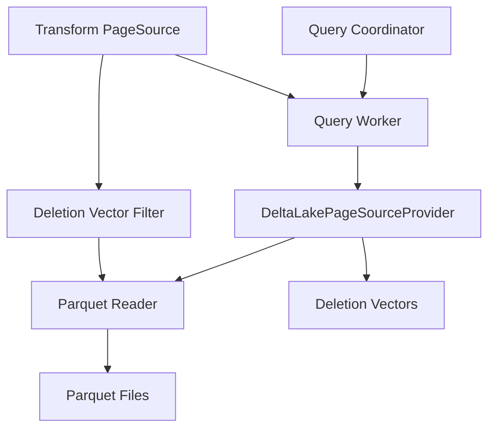

# Delta Lake Data Access Module

## Introduction

The Delta Lake Data Access module provides Trino's integration with Delta Lake tables, enabling efficient reading and writing of Delta Lake format data. This module implements the core connector interfaces to bridge Trino's query engine with Delta Lake's transaction log-based storage format, supporting ACID transactions, time travel, and schema evolution capabilities.

## Architecture Overview

The Delta Lake Data Access module consists of three primary components that work together to provide seamless data access:

### Core Components

1. **DeltaLakeSplitManager** - Responsible for generating splits (data partitions) for query execution
2. **DeltaLakePageSourceProvider** - Handles reading data from Delta Lake files and providing it to Trino's execution engine
3. **DeltaLakePageSinkProvider** - Manages writing data back to Delta Lake format during INSERT, UPDATE, and MERGE operations

## Architecture Diagram

## Component Details

### DeltaLakeSplitManager

The `DeltaLakeSplitManager` implements Trino's `ConnectorSplitManager` interface and is responsible for:

- **Split Generation**: Analyzing Delta Lake transaction logs to identify active data files
- **Predicate Pushdown**: Applying query predicates at the file level to minimize data scanning
- **Dynamic Filtering**: Integrating with Trino's dynamic filtering to further optimize split generation
- **Partition Pruning**: Leveraging Delta Lake's partitioning information to eliminate unnecessary files
- **File Statistics**: Using file-level statistics for early data pruning

#### Key Features:

- **Transaction Log Integration**: Reads Delta Lake's transaction log to determine active files
- **Deletion Vector Support**: Handles files with deletion vectors for efficient updates/deletes
- **Optimize Operation Support**: Special handling for OPTIMIZE operations to compact small files
- **Time Travel**: Supports querying specific versions of Delta Lake tables

#### Split Generation Process:

### DeltaLakePageSourceProvider

The `DeltaLakePageSourceProvider` implements `ConnectorPageSourceProvider` and handles:

- **Data Reading**: Reading Parquet files from Delta Lake storage
- **Column Projection**: Efficiently projecting only required columns
- **Partition Column Handling**: Injecting partition values without reading from files
- **Deletion Vector Application**: Filtering out deleted rows using deletion vectors
- **Statistics-based Filtering**: Using Parquet statistics for row group pruning

#### Key Features:

- **Parquet Optimization**: Leverages Trino's Parquet reader with column indexes and vectorized decoding
- **Column Mapping Support**: Handles Delta Lake's column mapping modes (ID, NAME, NONE)
- **Row ID Generation**: Creates synthetic row IDs for operations requiring unique row identification
- **File Metadata Columns**: Provides file path, size, and modification time as virtual columns

#### Data Flow:

### DeltaLakePageSinkProvider

The `DeltaLakePageSinkProvider` implements `ConnectorPageSinkProvider` and manages:

- **Data Writing**: Writing query results back to Delta Lake format
- **Transaction Management**: Coordinating with Delta Lake's transaction protocol
- **File Formatting**: Creating properly formatted Parquet files
- **Partition Organization**: Organizing data files by partition values
- **Change Data Feed**: Supporting change data capture for MERGE operations

#### Key Features:

- **Multi-operation Support**: Handles INSERT, UPDATE, DELETE, and MERGE operations
- **Partition Management**: Automatically organizes files by partition columns
- **File Optimization**: Creates optimally sized Parquet files
- **Change Tracking**: Supports Delta Lake's change data feed feature
- **Transaction Atomicity**: Ensures ACID properties for write operations

## Data Access Patterns

### Read Operations

The module supports various read patterns optimized for Delta Lake's characteristics:

1. **Full Table Scan**: Reading entire tables with partition pruning
2. **Partitioned Reads**: Leveraging partitioning for efficient data access
3. **Versioned Queries**: Reading specific table versions (time travel)
4. **Incremental Reads**: Reading only changed data between versions

### Write Operations

Write operations are designed to maintain Delta Lake's ACID properties:

1. **INSERT**: Adding new data files to the table
2. **UPDATE**: Using deletion vectors to mark updated rows
3. **DELETE**: Using deletion vectors to mark deleted rows
4. **MERGE**: Combining INSERT, UPDATE, and DELETE operations
5. **OPTIMIZE**: Compacting small files for better performance

## Integration with Trino Ecosystem

### Dependencies

The Delta Lake Data Access module integrates with several Trino components:

- **[File System Abstraction Layer](File System Abstraction Layer.md)**: Provides unified access to various storage systems (S3, Azure, GCS, HDFS)
- **[Parquet Libraries](ORC & Parquet Libraries.md)**: Handles Parquet file reading and writing
- **[Transaction Log Access](Delta Lake Transaction Log.md)**: Manages Delta Lake transaction log parsing
- **[Plugin Toolkit](Plugin Toolkit.md)**: Provides common connector utilities and security frameworks

### Configuration

The module supports various configuration options:

- **Split Size Control**: Configuring maximum split sizes for optimal parallelism
- **Parquet Reader Options**: Tuning Parquet reading performance
- **Dynamic Filtering**: Enabling dynamic filter pushdown
- **Deletion Vector Support**: Configuring deletion vector handling

## Performance Optimizations

### Predicate Pushdown

The module implements sophisticated predicate pushdown at multiple levels:

1. **File Level**: Eliminating entire files based on partition values and file statistics
2. **Row Group Level**: Using Parquet statistics to skip row groups
3. **Page Level**: Applying predicates during column reading

### Dynamic Filtering

Integration with Trino's dynamic filtering system:

1. **Build Side Collection**: Collecting filter values from join build side
2. **Probe Side Application**: Applying collected filters to Delta Lake splits
3. **Runtime Adaptation**: Adjusting filters as query execution progresses

### Column Pruning

Efficient column handling:

1. **Partition Column Injection**: Avoiding file reads for partition columns
2. **Virtual Column Computation**: Computing file metadata columns without I/O
3. **Projection Pushdown**: Reading only required columns from Parquet files

## Error Handling and Recovery

The module implements comprehensive error handling:

- **Transaction Log Corruption**: Detecting and reporting corrupted transaction logs
- **File System Errors**: Handling storage-level failures gracefully
- **Schema Mismatch**: Detecting and reporting schema evolution issues
- **Concurrent Modifications**: Handling concurrent write operations

## Security Integration

Security features provided through Trino's security framework:

- **Access Control**: Integrating with Trino's access control system
- **Encryption Support**: Supporting encrypted storage systems
- **Audit Logging**: Providing detailed audit trails for data access

## Monitoring and Observability

The module provides comprehensive monitoring capabilities:

- **Split Generation Metrics**: Tracking split generation performance
- **Data Access Statistics**: Monitoring read/write throughput
- **Error Rates**: Tracking and reporting error conditions
- **Resource Usage**: Monitoring memory and CPU usage

## Future Enhancements

Planned improvements for the Delta Lake Data Access module:

1. **Enhanced Deletion Vectors**: Support for more complex deletion patterns
2. **Improved Column Mapping**: Better handling of schema evolution scenarios
3. **Advanced Statistics**: More sophisticated file-level statistics
4. **Streaming Integration**: Support for streaming data ingestion
5. **Performance Optimizations**: Continued improvements in read/write performance