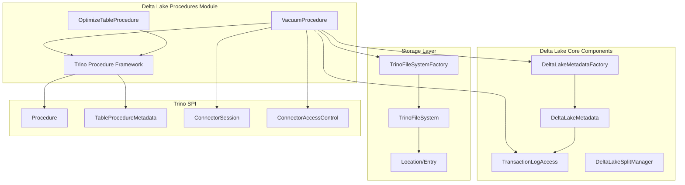
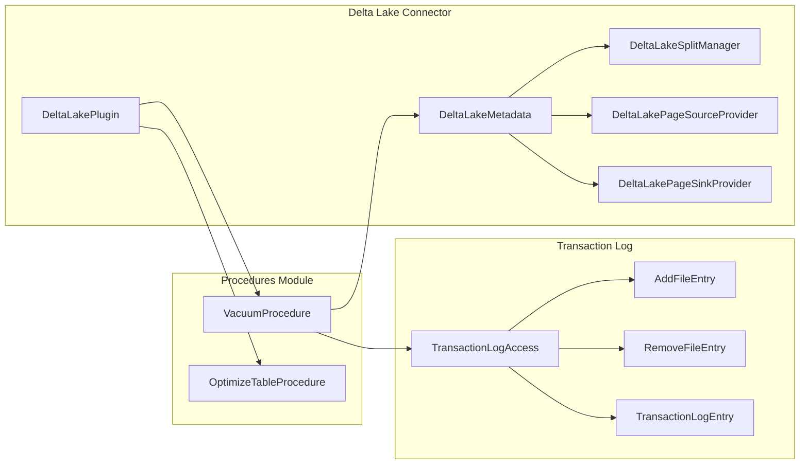
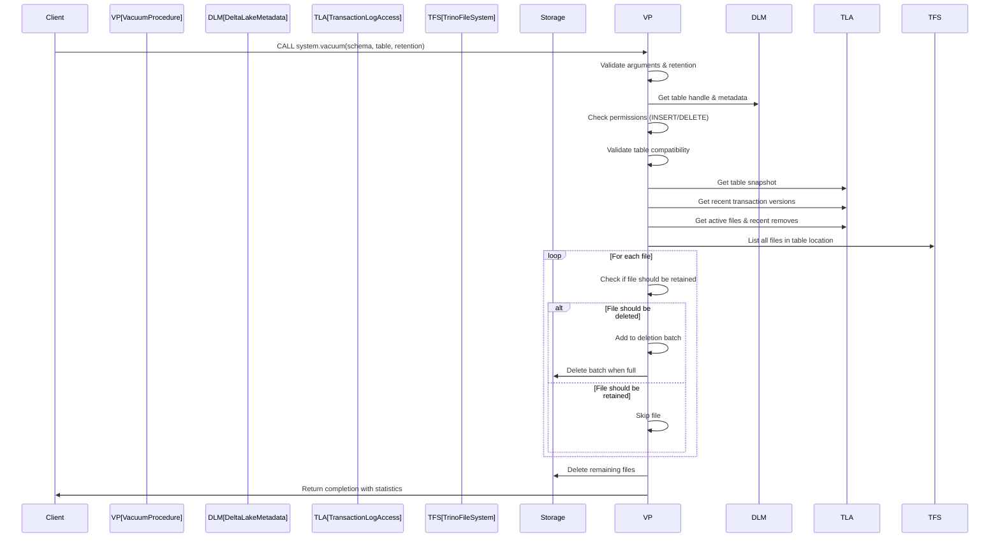
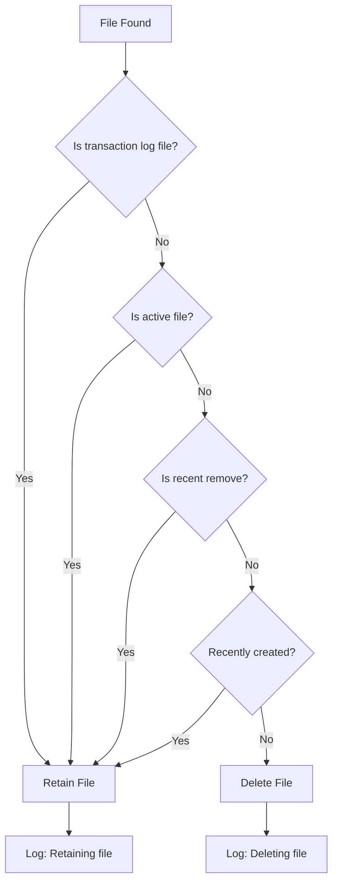
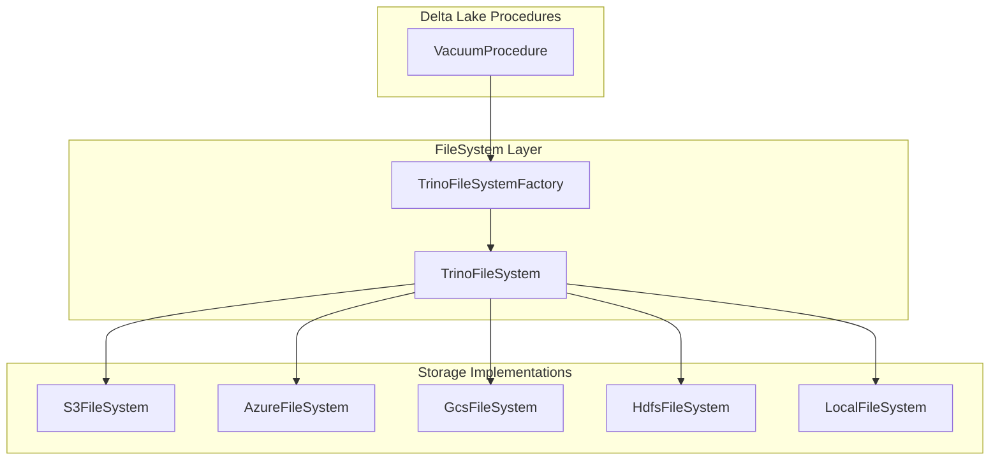
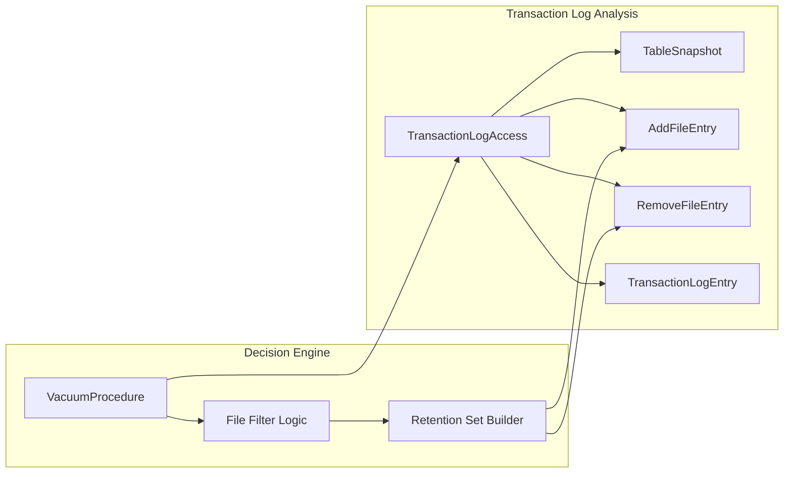

# Delta Lake Procedures Module

## Introduction

The Delta Lake Procedures module provides specialized maintenance procedures for Delta Lake tables in Trino. This module implements critical table maintenance operations that help optimize storage, improve query performance, and manage data lifecycle in Delta Lake tables. The procedures are exposed through Trino's procedure framework and can be invoked using SQL `CALL` statements.

## Module Overview

The Delta Lake Procedures module is part of the broader Delta Lake connector ecosystem and provides two primary maintenance procedures:

- **VACUUM Procedure**: Removes obsolete files that are no longer needed for table operations
- **OPTIMIZE Procedure**: Compacts small files to improve query performance and storage efficiency

These procedures are essential for maintaining healthy Delta Lake tables, especially in high-throughput environments where frequent writes can create many small files or accumulate obsolete data files.

## Architecture

### Component Architecture



### Integration with Delta Lake Connector



## Core Components

### VacuumProcedure

The `VacuumProcedure` is a comprehensive file cleanup utility that removes obsolete files from Delta Lake tables while ensuring data integrity and recoverability.

#### Key Features:
- **Retention-based cleanup**: Only removes files older than the specified retention period
- **Transaction log awareness**: Preserves files needed for recent snapshots
- **Batch processing**: Deletes files in configurable batches (default: 1000 files)
- **Safety checks**: Validates table compatibility and user permissions
- **Comprehensive logging**: Provides detailed operation statistics

#### Process Flow:



#### File Retention Logic:



#### Configuration Parameters:

| Parameter | Type | Required | Description |
|-----------|------|----------|-------------|
| SCHEMA_NAME | VARCHAR | Yes | The schema containing the target table |
| TABLE_NAME | VARCHAR | Yes | The name of the Delta Lake table to vacuum |
| RETENTION | VARCHAR | Yes | Minimum age of files to delete (e.g., '7d', '24h') |

#### Safety Mechanisms:

1. **Minimum Retention Enforcement**: Prevents accidental deletion of recent files
2. **Permission Validation**: Requires INSERT and DELETE privileges on the table
3. **Feature Compatibility**: Checks for unsupported writer features (e.g., deletion vectors)
4. **Version Compatibility**: Validates writer version support
5. **Transaction Log Preservation**: Never deletes transaction log files
6. **Absolute Path Handling**: Properly handles shallow-cloned tables with absolute paths

### OptimizeTableProcedure

The `OptimizeTableProcedure` provides table optimization capabilities to improve query performance by compacting small files into larger ones.

#### Key Features:
- **File compaction**: Combines small files into optimally sized files
- **Configurable thresholds**: Allows setting file size thresholds for compaction
- **Distributed execution**: Supports distributed processing for large tables
- **Filtering and repartitioning**: Uses Trino's distributed execution framework

#### Configuration Parameters:

| Parameter | Type | Required | Default | Description |
|-----------|------|----------|---------|-------------|
| file_size_threshold | DataSize | No | 100MB | Only compact files smaller than this threshold |

#### Execution Mode:
The procedure uses `distributedWithFilteringAndRepartitioning()` execution mode, which enables:
- Parallel processing across worker nodes
- Intelligent data filtering to reduce I/O
- Dynamic repartitioning for optimal resource utilization

## Dependencies and Integration

### Core Dependencies

The Delta Lake Procedures module integrates with several key Trino components:

1. **Trino SPI Procedure Framework**: Provides the base `Procedure` and `TableProcedureMetadata` interfaces
2. **Delta Lake Metadata Layer**: Accesses table metadata, snapshots, and transaction logs
3. **Trino FileSystem Abstraction**: Handles file operations across different storage systems
4. **Transaction Log Access**: Reads and interprets Delta Lake transaction logs
5. **Security Framework**: Validates user permissions and access controls

### Storage System Integration



### Transaction Log Processing

The procedures heavily rely on the transaction log to make informed decisions about file retention and optimization:



## Error Handling and Safety

### Exception Handling Strategy

The procedures implement comprehensive error handling to ensure safe operation:

```java
// Three-tier exception handling in VacuumProcedure
try (ThreadContextClassLoader _ = new ThreadContextClassLoader(getClass().getClassLoader())) {
    doVacuum(session, accessControl, schema, table, retention);
}
catch (TrinoException e) {
    throw e;  // Already categorized, re-throw
}
catch (IOException e) {
    throw new TrinoException(DELTA_LAKE_FILESYSTEM_ERROR, format("Failure when vacuuming %s.%s with retention %s: %s", schema, table, retention, e), e);
}
catch (RuntimeException e) {
    // Wrap unexpected exceptions with context
    throw new RuntimeException(format("Failure when vacuuming %s.%s with retention %s: %s", schema, table, retention, e), e);
}
```

### Validation Checks

Both procedures perform extensive validation before execution:

1. **Argument Validation**: Ensures all required parameters are provided and valid
2. **Table Existence**: Verifies the target table exists and is accessible
3. **Permission Validation**: Checks user privileges for required operations
4. **Feature Compatibility**: Validates table features and writer versions
5. **Configuration Validation**: Ensures retention periods meet minimum requirements

## Performance Considerations

### Vacuum Procedure Performance

- **Batch Processing**: Files are deleted in batches of 1000 to optimize I/O operations
- **Streaming File Listing**: Uses iterator-based file listing to handle large tables efficiently
- **Memory Efficiency**: Builds retention sets using streams to minimize memory usage
- **Parallel Processing**: Leverages Trino's distributed execution framework

### Optimize Procedure Performance

- **Distributed Execution**: Spans across multiple worker nodes for large tables
- **Filtering**: Applies predicates to reduce data processing
- **Repartitioning**: Dynamically redistributes work for optimal load balancing

## Monitoring and Observability

### Logging and Metrics

The VacuumProcedure provides comprehensive logging with detailed statistics:

```
[%s] finished vacuuming table %s [%s]: 
files checked: %s; 
metadata files: %s; 
retained known files: %s; 
retained unknown files: %s; 
removed files: %s
```

### Debug Logging

Detailed debug logging is available for troubleshooting:
- File retention decisions
- Deletion batch processing
- Transaction log analysis
- Permission validation results

## Usage Examples

### Basic Vacuum Operation

```sql
-- Remove files older than 7 days
CALL system.vacuum('my_schema', 'my_table', '7d');
```

### Table Optimization

```sql
-- Optimize table by compacting small files
CALL system.optimize('my_schema', 'my_table');
```

### Advanced Optimization

```sql
-- Optimize with custom file size threshold
CALL system.optimize('my_schema', 'my_table', file_size_threshold => '50MB');
```

## Integration with Other Modules

The Delta Lake Procedures module integrates with several other Trino modules:

- **[Delta Lake Connector](Delta Lake Connector.md)**: Provides core table metadata and transaction log access
- **[Trino SPI](Trino SPI.md)**: Supplies procedure framework and security interfaces
- **[FileSystem Abstraction Layer](FileSystem Abstraction Layer.md)**: Enables storage system independence
- **[Transaction Log Processing](Transaction Log Processing.md)**: Handles Delta Lake transaction log interpretation

## Best Practices

### Vacuum Procedure

1. **Regular Scheduling**: Run vacuum operations regularly to prevent storage bloat
2. **Conservative Retention**: Use longer retention periods initially, then adjust based on needs
3. **Monitor Performance**: Track execution times and file deletion rates
4. **Test in Staging**: Validate retention periods in non-production environments first

### Optimize Procedure

1. **Threshold Tuning**: Adjust file_size_threshold based on your workload patterns
2. **Timing**: Run during low-traffic periods for large tables
3. **Incremental Approach**: Start with smaller thresholds and increase gradually
4. **Monitor Impact**: Track query performance improvements after optimization

## Configuration

### System-Level Configuration

The procedures respect several system-level configurations:

- `delta.vacuum.min-retention`: Minimum retention period for vacuum operations
- Session properties for per-query overrides
- Catalog-specific settings for procedure behavior

### Session Properties

Users can override certain behaviors using session properties:

```sql
-- Set custom minimum retention for current session
SET SESSION delta.vacuum_min_retention = '24h';
```

This comprehensive module provides essential maintenance capabilities for Delta Lake tables, ensuring optimal performance and efficient storage utilization while maintaining data integrity and providing robust error handling.