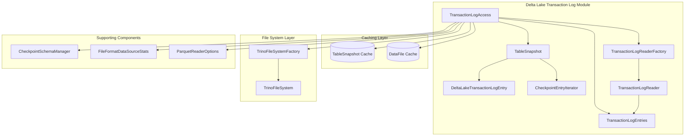
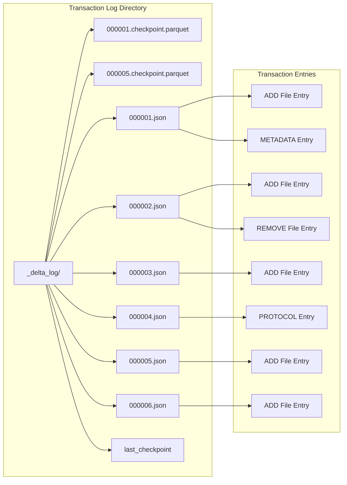
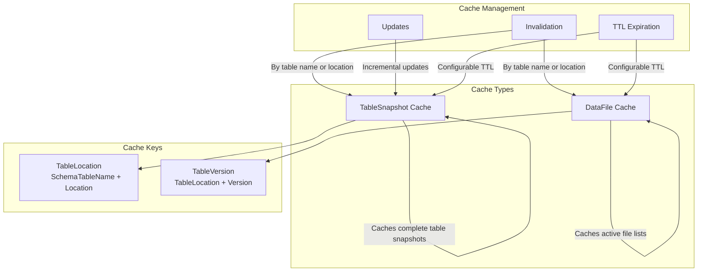
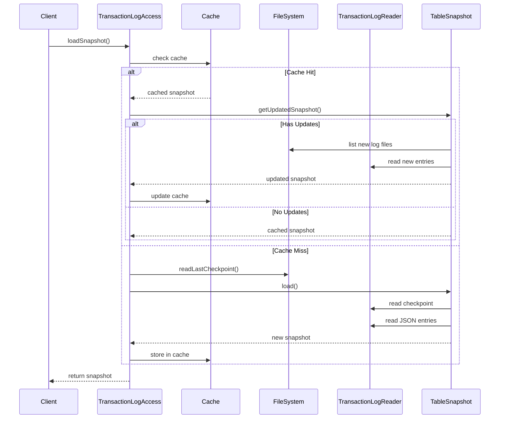
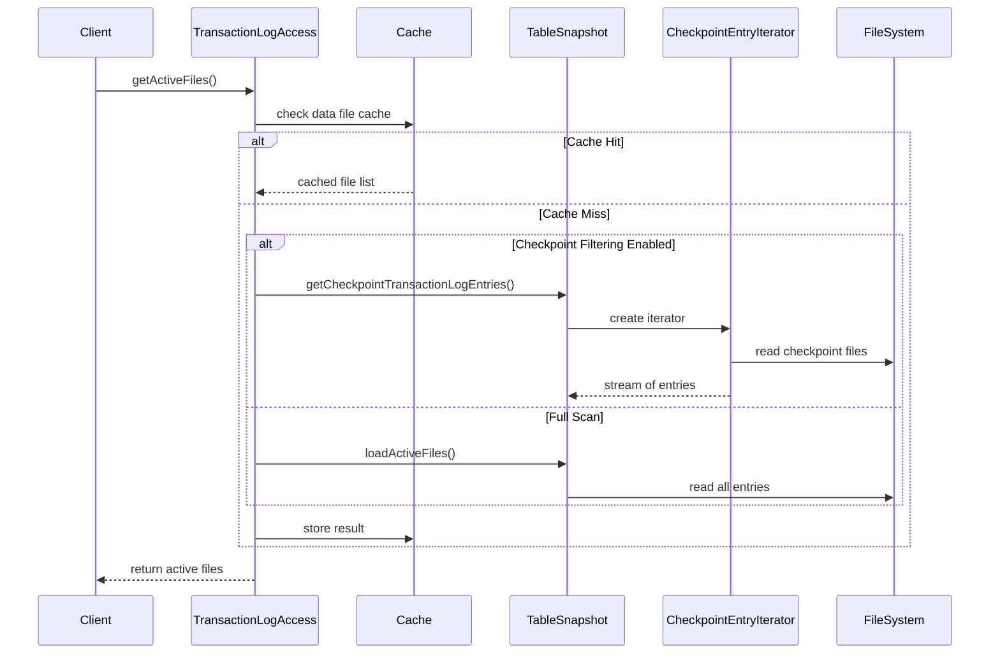
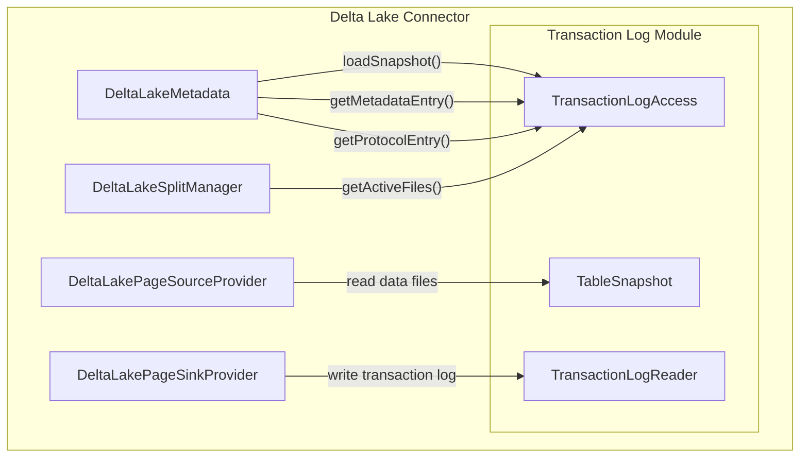

# Delta Lake Transaction Log Module

## Introduction

The Delta Lake Transaction Log module is a critical component of Trino's Delta Lake connector that manages the reading, parsing, and caching of Delta Lake transaction logs. This module provides the foundation for understanding the current state of Delta Lake tables by processing the transaction log entries that record all changes to the table over time.

## Overview

Delta Lake uses a transaction log (also known as the Delta Log) to provide ACID transactions and time travel capabilities. The transaction log is a record of all changes made to a Delta Lake table, stored as a series of JSON files in the `_delta_log` directory within the table's root location. This module is responsible for:

- Reading and parsing transaction log entries
- Managing table snapshots and caching
- Processing checkpoint files for efficient log reconstruction
- Providing access to active file entries and metadata
- Supporting time travel queries
- Handling transaction log versioning and consistency

## Architecture

### Core Components

The module is built around the `TransactionLogAccess` class, which serves as the main entry point for all transaction log operations. The architecture follows a layered approach:



### Transaction Log Structure

Delta Lake transaction logs follow a specific structure that this module processes:



## Key Functionality

### Table Snapshot Management

The module maintains table snapshots that represent the state of a Delta Lake table at a specific version. Snapshots are cached to improve performance and include:

- **Metadata entries**: Table schema, partitioning information, and table properties
- **Protocol entries**: Delta Lake protocol version information
- **Active files**: Current set of data files that make up the table
- **Transaction history**: All changes applied to reach the current state

### Checkpoint Processing

Delta Lake uses checkpoint files to provide efficient access to table state without reading all transaction log entries. The module supports multiple checkpoint formats:

- **Classic checkpoints**: Single Parquet file containing all state
- **Multi-part checkpoints**: Distributed across multiple Parquet files
- **V2 checkpoints**: Modern format with improved performance

### Active File Management

The module determines which data files are currently active for a table by:

1. Processing ADD entries to identify files added to the table
2. Processing REMOVE entries to identify files removed from the table
3. Applying transaction log entries in order to compute the final state
4. Filtering files based on partition constraints and column statistics

### Caching Strategy

The module implements a sophisticated caching strategy to optimize performance:



## Data Flow

### Loading a Table Snapshot



### Getting Active Files



## Integration with Delta Lake Connector

The Transaction Log module integrates with other components of the Delta Lake connector:



## Configuration

The module is configured through the `DeltaLakeConfig` class and supports various parameters:

- **Metadata cache settings**: Maximum size and TTL for table snapshot caching
- **Data file cache settings**: Size and TTL for active file list caching
- **Checkpoint processing**: Parallelism and filtering options
- **Transaction log reader settings**: Maximum cached file size and reader options

## Error Handling

The module implements comprehensive error handling for various scenarios:

- **Missing transaction log files**: Handles cases where log files have been expired or deleted
- **Corrupted checkpoint files**: Validates checkpoint file integrity
- **Inconsistent table state**: Detects and reports invalid table configurations
- **File system errors**: Handles I/O errors during log reading

## Performance Optimizations

The module includes several performance optimizations:

1. **Caching**: Multi-level caching of table snapshots and active file lists
2. **Incremental updates**: Only processes new transaction log entries when possible
3. **Parallel processing**: Uses bounded executors for checkpoint processing
4. **Predicate pushdown**: Applies partition constraints during file listing
5. **Column statistics filtering**: Uses min/max statistics to skip files

## Dependencies

The Transaction Log module depends on several other Trino modules:

- **[Trino SPI](Trino SPI.md)**: Core interfaces for connectors, sessions, and types
- **[Filesystem Abstraction Layer](Filesystem Abstraction Layer.md)**: File system operations for reading transaction logs
- **[Parquet Library](ORC & Parquet Libraries.md)**: Reading checkpoint files in Parquet format
- **[Delta Lake Connector](Delta Lake Connector.md)**: Integration with the main connector components

## Usage Examples

### Loading a Table Snapshot

```java
// Load the current snapshot for a table
TableSnapshot snapshot = transactionLogAccess.loadSnapshot(
    session, 
    tableHandle, 
    Optional.empty() // current version
);

// Load a specific version for time travel
TableSnapshot historicalSnapshot = transactionLogAccess.loadSnapshot(
    session,
    tableHandle,
    Optional.of(100L) // version 100
);
```

### Getting Active Files

```java
// Get all active files for a table
Stream<AddFileEntry> activeFiles = transactionLogAccess.getActiveFiles(
    session,
    tableHandle,
    tableSnapshot
);

// Get active files with partition filtering
Stream<AddFileEntry> filteredFiles = transactionLogAccess.getActiveFiles(
    session,
    tableHandle,
    tableSnapshot,
    partitionConstraint,
    columnFilter
);
```

### Accessing Metadata

```java
// Get table metadata
MetadataEntry metadata = transactionLogAccess.getMetadataEntry(session, tableSnapshot);

// Get protocol information
ProtocolEntry protocol = transactionLogAccess.getProtocolEntry(session, tableSnapshot);

// Get both metadata and protocol
MetadataAndProtocolEntries entries = transactionLogAccess.getMetadataAndProtocolEntry(session, tableSnapshot);
```

## Monitoring and Metrics

The module exposes JMX metrics for monitoring:

- **Cache statistics**: Hit rates, load times, and eviction counts for both caches
- **File system operations**: Read operations and data transfer statistics
- **Transaction log processing**: Time spent reading and parsing log entries

These metrics can be accessed through the `CacheStatsMBean` interfaces exposed by the module.