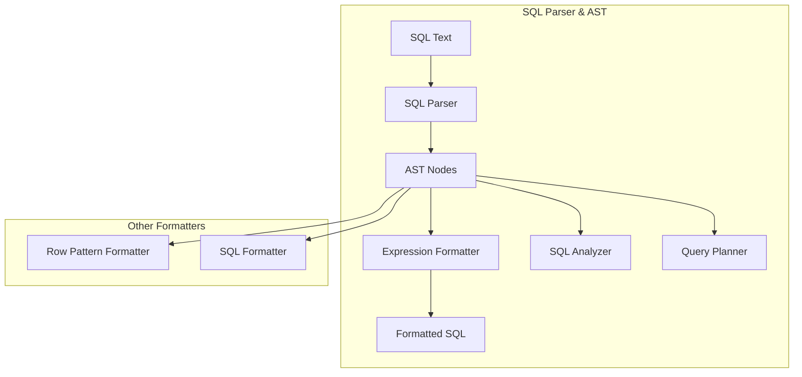
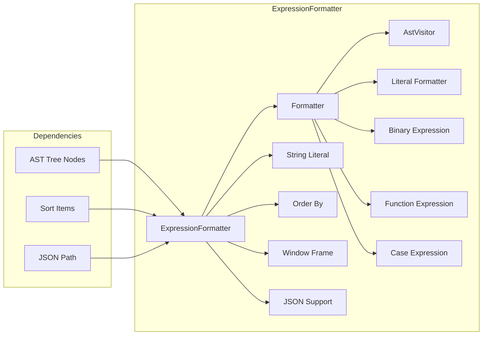
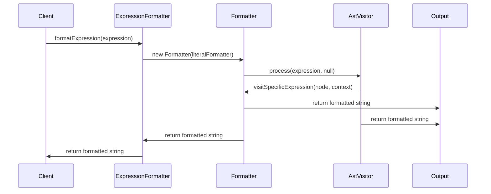
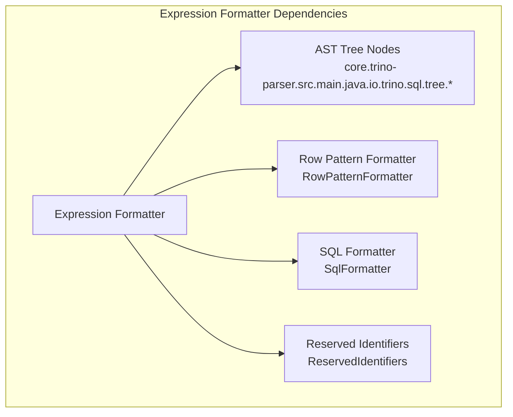

# Expression Formatting Module

## Introduction

The Expression Formatting module is a critical component of Trino's SQL parser infrastructure, responsible for converting abstract syntax tree (AST) expression nodes back into human-readable SQL strings. This module serves as the reverse operation of parsing - taking structured expression objects and producing properly formatted SQL text that can be executed, logged, or displayed to users.

## Purpose and Core Functionality

The Expression Formatter provides essential functionality for:

- **SQL Generation**: Converting parsed AST expressions back to executable SQL strings
- **Query Logging**: Formatting expressions for audit logs and query history
- **Error Reporting**: Displaying problematic expressions in user-friendly formats
- **Query Plan Visualization**: Showing expressions in explain plans and debug output
- **Round-trip Testing**: Ensuring parsed expressions can be accurately reconstructed

## Architecture and Component Relationships

### Module Position in Trino Ecosystem

### Core Component Architecture

## Core Components

### ExpressionFormatter Class

The main entry point providing static methods for formatting expressions:

- **`formatExpression(Expression)`**: Primary method for formatting any expression
- **`formatStringLiteral(String)`**: Handles proper string escaping and quoting
- **`formatOrderBy(OrderBy)`**: Formats ORDER BY clauses
- **`formatSortItems(List<SortItem>)`**: Processes sort specifications
- **`formatGroupBy(List<GroupingElement>)`**: Handles GROUP BY formatting

### Formatter Inner Class

A comprehensive `AstVisitor` implementation that handles over 50 different expression types:

#### Literal Formatting
- **String Literals**: Proper escaping with single quotes
- **Numeric Literals**: Decimal, double, and long formatting
- **Binary Literals**: Hexadecimal representation
- **Boolean Literals**: True/false values
- **Null Literals**: NULL keyword
- **Interval Literals**: INTERVAL syntax with units

#### Function and Operator Formatting
- **Function Calls**: Standard and special functions (LISTAGG)
- **Binary Expressions**: Arithmetic and comparison operators
- **Logical Expressions**: AND/OR with proper precedence
- **Unary Expressions**: NOT, arithmetic signs

#### Complex Expression Types
- **Case Expressions**: Both simple and searched CASE
- **Subqueries**: Parenthesized query expressions
- **Window Functions**: OVER clauses with partitioning and ordering
- **Lambda Expressions**: Arrow function syntax
- **JSON Operations**: JSON_EXISTS, JSON_VALUE, JSON_QUERY, JSON_OBJECT, JSON_ARRAY

#### Special Handling
- **LISTAGG Function**: Custom formatting for Oracle-style LISTAGG with overflow handling
- **Window Specifications**: Complex window frame definitions
- **Grouping Operations**: GROUPING sets, CUBE, ROLLUP
- **Field References**: Special :input() syntax for internal references

## Data Flow and Processing

### Expression Formatting Pipeline

### Visitor Pattern Implementation

The formatter uses the visitor pattern to traverse the AST:

1. **Entry Point**: `formatExpression()` creates a Formatter instance
2. **Visitor Dispatch**: Calls `process()` which delegates to appropriate visit method
3. **Recursive Processing**: Each visit method may call `process()` on child nodes
4. **String Building**: Results are concatenated with proper SQL syntax
5. **Context Passing**: Optional literal formatter for custom literal handling

## Integration with Trino System

### Dependencies on Other Modules

### Usage Across Trino Components

- **Query Planning**: Formatting expressions in execution plans
- **Error Messages**: Displaying problematic expressions
- **Logging**: Recording query expressions in logs
- **Testing**: Verifying round-trip parsing/formatting
- **Client Communication**: Sending formatted expressions to clients

## Key Features and Capabilities

### Comprehensive Expression Support

The formatter handles all SQL expression types including:

- **Arithmetic**: Binary and unary operations
- **Comparison**: All comparison operators with quantifiers
- **Logical**: AND, OR, NOT with proper precedence
- **String**: LIKE, concatenation, trimming
- **Temporal**: Date/time functions and literals
- **JSON**: Complete JSON path and function support
- **Window**: Complex window specifications
- **Grouping**: Advanced grouping operations

### Literal Formatting Options

- **Standard Formatting**: Default SQL-compliant output
- **Custom Literal Formatter**: Optional function for specialized literal handling
- **Proper Escaping**: Safe string and identifier formatting

### Identifier Handling

- **Reserved Words**: Automatic quoting of reserved identifiers
- **Delimited Identifiers**: Preserving user-specified quotes
- **Qualified Names**: Proper dot notation for qualified identifiers

## Error Handling and Edge Cases

### Unsupported Operations

- **visitNode()**: Throws `UnsupportedOperationException` for unhandled node types
- **visitExpression()**: Provides detailed error messages for unimplemented expressions

### Special Cases

- **Field References**: Uses special `:input(index)` syntax for internal field references
- **Empty Arguments**: Handles COUNT(*) and similar constructs
- **LISTAGG Overflow**: Custom formatting for Oracle compatibility

## Performance Considerations

### Thread Safety

- **ThreadLocal DecimalFormat**: Safe double formatting across threads
- **Immutable Operations**: No shared mutable state
- **Static Methods**: No instance state to synchronize

### Memory Efficiency

- **StringBuilder Usage**: Efficient string concatenation
- **Stream Processing**: Lazy evaluation where possible
- **Immutable Collections**: Using Guava's ImmutableList for building results

## Testing and Quality Assurance

### Round-trip Testing

The formatter is critical for ensuring that:
- Parsed expressions can be accurately reconstructed
- SQL text remains equivalent after parse/format cycles
- Edge cases in expression syntax are handled correctly

### Integration Points

- **Parser Testing**: Verifying parser output can be formatted correctly
- **Analyzer Testing**: Ensuring analyzed expressions format properly
- **Client Testing**: Validating formatted output sent to clients

## Future Enhancements

### Potential Improvements

- **Performance Optimization**: Caching for frequently formatted expressions
- **Customization**: More granular formatting options
- **Internationalization**: Locale-specific formatting preferences
- **Validation**: Optional syntax validation during formatting

### Extension Points

- **Custom Literal Formatters**: Plugin system for specialized literal handling
- **Dialect Support**: Database-specific SQL dialect formatting
- **Pretty Printing**: Optional formatting with indentation and line breaks

## Related Documentation

- [SQL Parser & AST](SQL Parser & AST.md) - Understanding the AST node structure
- [Row Pattern Formatting](Row Pattern Formatting.md) - Related pattern formatting functionality
- [SQL Analyzer, Planner & Optimizer](SQL Analyzer, Planner & Optimizer.md) - Where formatted expressions are used
- [SQL Functions & Operators](SQL Functions & Operators.md) - Expression types being formatted

## Conclusion

The Expression Formatting module is a fundamental component that bridges the gap between Trino's internal AST representation and human-readable SQL. Its comprehensive support for all SQL expression types, robust error handling, and integration with the broader Trino ecosystem make it essential for query processing, debugging, and user interaction. The module's design using the visitor pattern ensures extensibility and maintainability as new expression types are added to the SQL language.