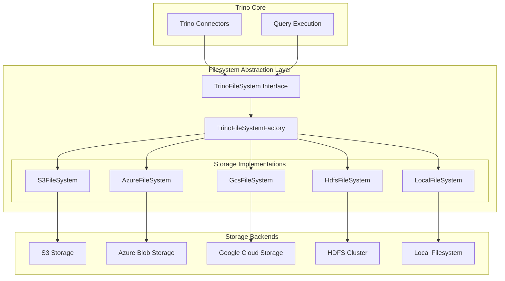
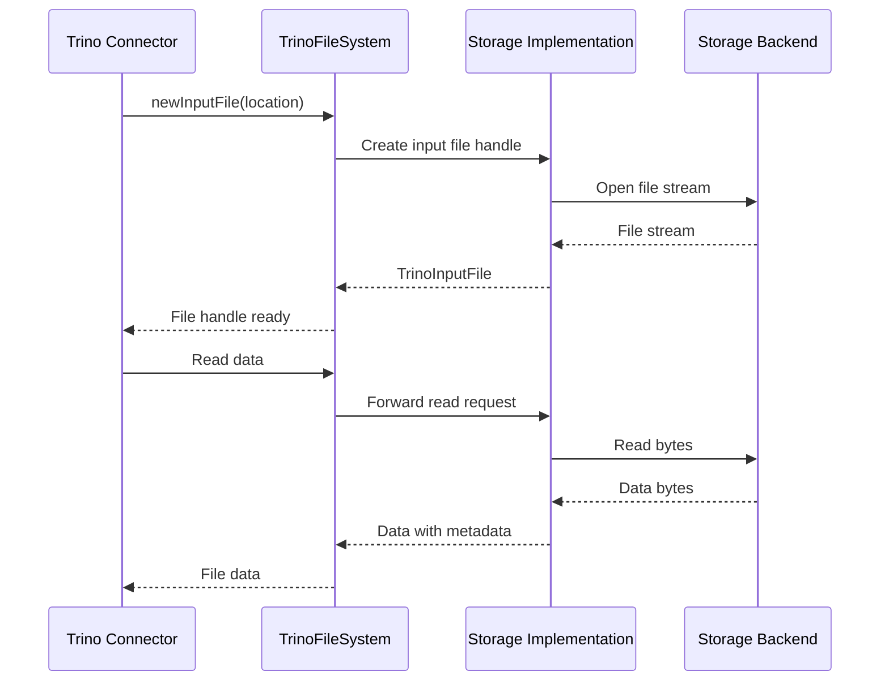

# Filesystem Abstraction Layer

## Overview

The Filesystem Abstraction Layer provides a unified interface for Trino to interact with various storage systems, replacing the traditional HDFS APIs with a modern, cloud-native approach. This layer abstracts the differences between hierarchical filesystems (like HDFS and local filesystems) and blob storage systems (like S3, Azure Blob Storage, and Google Cloud Storage), enabling seamless data access across diverse storage backends.

## Purpose

The primary goals of the Filesystem Abstraction Layer are to:

- **Provide Storage Agnostic Access**: Enable Trino to read and write data from various storage systems without requiring storage-specific code
- **Support Cloud-Native Storage**: Optimize for cloud storage systems while maintaining compatibility with traditional hierarchical filesystems
- **Enable Security Integration**: Support encryption and authentication mechanisms specific to each storage system
- **Optimize Performance**: Leverage storage-specific optimizations and features like pre-signed URLs for direct client access
- **Simplify Maintenance**: Reduce the complexity of supporting multiple storage backends through a unified API

## Architecture



## Core Components

### TrinoFileSystem Interface
The central abstraction that defines the contract for all filesystem operations. It provides methods for:
- File operations: create, read, write, delete files
- Directory operations: create, list, delete directories
- Advanced features: encryption, pre-signed URLs, batch operations

### TrinoFileSystemFactory
Factory pattern implementation for creating filesystem instances with proper authentication and configuration context.

### Storage-Specific Implementations
Each storage backend has its own implementation that handles the specific APIs and optimizations:
- **S3FileSystem**: Amazon S3 and S3-compatible storage
- **AzureFileSystem**: Microsoft Azure Blob Storage
- **GcsFileSystem**: Google Cloud Storage
- **HdfsFileSystem**: Hadoop Distributed File System
- **LocalFileSystem**: Local filesystem for testing and development

## Key Features

### Unified API
All storage systems provide the same interface regardless of their underlying architecture:



### Hierarchical vs Blob Storage Support
The abstraction layer handles the fundamental differences between storage types:

- **Hierarchical Storage**: Traditional directory-based structure (HDFS, local filesystem)
- **Blob Storage**: Key-value storage with prefix-based organization (S3, Azure, GCS)

### Security and Encryption
Built-in support for:
- Server-side encryption for supported storage systems
- Authentication through ConnectorIdentity
- Pre-signed URLs for secure direct access

### Performance Optimizations
- Batch operations for bulk file operations
- Streaming for large file handling
- Storage-specific optimizations (multipart uploads, parallel reads)

## Sub-modules

### [Core Filesystem Interface](Core Filesystem Interface.md)
Defines the fundamental abstractions and contracts for the filesystem layer, including the main TrinoFileSystem interface and supporting classes.

### [Cloud Storage Implementations](Cloud Storage Implementations.md)
Contains the implementations for major cloud storage providers:
- Amazon S3 implementation with full S3 API support
- Microsoft Azure Blob Storage implementation
- Google Cloud Storage implementation

### [Traditional Storage Support](Traditional Storage Support.md)
Provides support for traditional storage systems:
- HDFS integration for Hadoop clusters
- Local filesystem for development and testing

## Integration with Trino

The Filesystem Abstraction Layer integrates with various Trino components:

- **Connectors**: All storage-based connectors (Hive, Iceberg, Delta Lake) use this layer for data access
- **Query Execution**: Execution engine uses it for reading input data and writing results
- **Security Framework**: Integrates with Trino's security model for authentication and authorization
- **Configuration Management**: Uses Trino's configuration system for storage-specific settings

## Usage Patterns

### Basic File Operations
```java
// Create filesystem factory
TrinoFileSystemFactory factory = new S3FileSystemFactory(...);

// Create filesystem instance
TrinoFileSystem fs = factory.create(identity);

// Read a file
TrinoInputFile inputFile = fs.newInputFile(location);
try (InputStream stream = inputFile.newStream()) {
    // Read data
}

// Write a file
TrinoOutputFile outputFile = fs.newOutputFile(location);
try (OutputStream stream = outputFile.create()) {
    // Write data
}
```

### Directory Operations
```java
// List files in directory
FileIterator files = fs.listFiles(directoryLocation);
while (files.hasNext()) {
    FileEntry file = files.next();
    // Process file
}

// Create directory
fs.createDirectory(newDirectoryLocation);
```

## Error Handling

The filesystem layer provides consistent error handling across all storage implementations:
- **IOException**: For general I/O errors
- **FileNotFoundException**: When files don't exist
- **UnsupportedOperationException**: For operations not supported by specific storage systems
- **TrinoFileSystemException**: For filesystem-specific errors

## Configuration

Each storage implementation has its own configuration options:
- **S3**: Region, credentials, encryption settings
- **Azure**: Endpoint, authentication, block sizes
- **GCS**: Project ID, credentials, batch settings
- **HDFS**: Configuration files, replication settings
- **Local**: Root path, permission settings

## Performance Considerations

### Read Optimization
- Block size configuration for optimal read performance
- Parallel read operations where supported
- Caching of file metadata

### Write Optimization
- Multipart uploads for large files
- Batch operations for multiple files
- Streaming writes to avoid memory issues

### Network Optimization
- Connection pooling for cloud storage clients
- Retry policies with exponential backoff
- Direct client access through pre-signed URLs

## Security Features

### Authentication
- Integration with Trino's identity system
- Support for various authentication methods per storage system
- Credential management and rotation

### Encryption
- Server-side encryption support
- Client-side encryption where applicable
- Key management integration

### Access Control
- Integration with storage-native access controls
- Support for fine-grained permissions
- Audit logging for access tracking

## Testing and Development

### Local Testing
The LocalFileSystem implementation provides a lightweight option for testing and development without requiring external storage systems.

### Mock Implementations
The architecture supports mock implementations for unit testing connector logic without actual storage dependencies.

### Integration Testing
Each storage implementation includes comprehensive integration tests that verify compatibility with actual storage systems.

## Future Enhancements

### Planned Features
- Additional storage system support
- Enhanced encryption capabilities
- Improved performance monitoring
- Better error recovery mechanisms

### Extensibility
The modular design allows for easy addition of new storage backends while maintaining the unified interface contract.