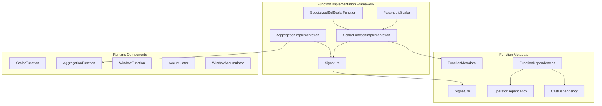
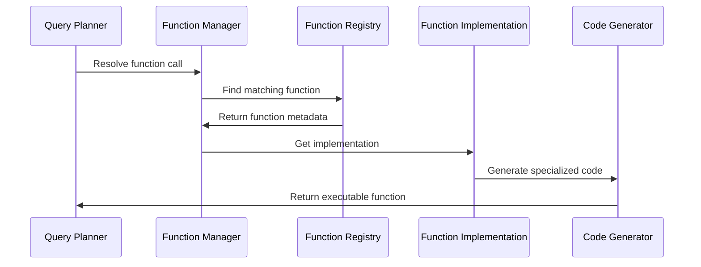
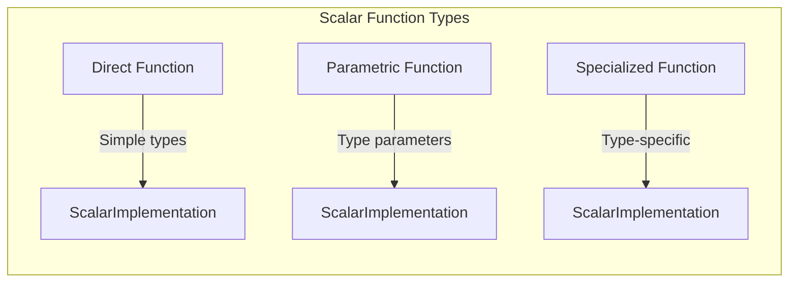
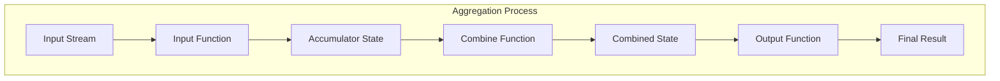
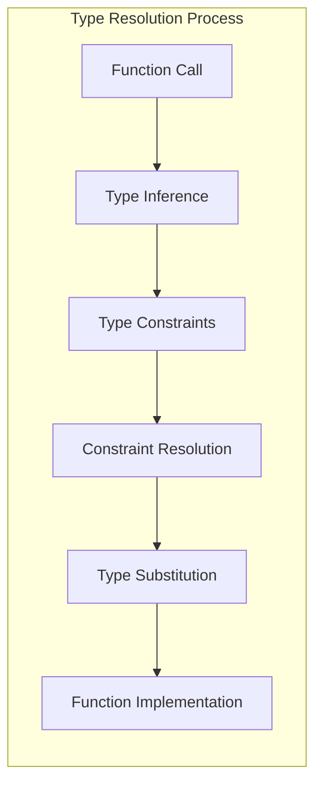
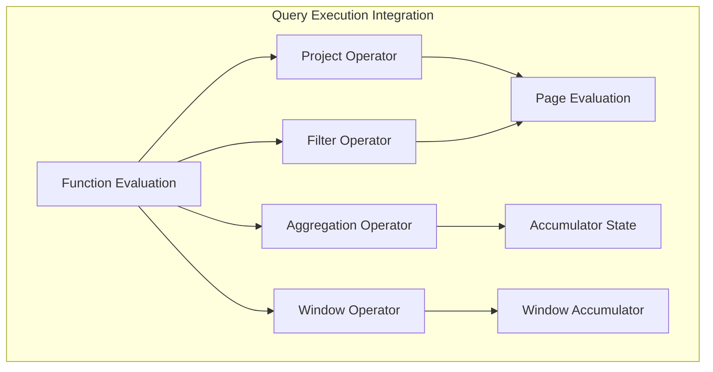

# Function Implementation Framework

## Introduction

The Function Implementation Framework is the core component of Trino's SQL function system, providing the infrastructure for implementing, managing, and executing scalar functions, aggregate functions, and window functions. This framework serves as the bridge between SQL function definitions and their runtime execution, handling function resolution, type checking, and code generation.

## Overview

The framework encompasses three main categories of SQL functions:

- **Scalar Functions**: Functions that operate on individual values and return single values (e.g., `UPPER()`, `CONCAT()`)
- **Aggregate Functions**: Functions that combine multiple values into a single result (e.g., `SUM()`, `AVG()`, `COUNT()`)
- **Window Functions**: Functions that operate over a set of rows (e.g., `ROW_NUMBER()`, `RANK()`)

## Architecture

### Core Components



### Function Resolution Flow



## Key Components

### ScalarFunctionImplementation

The `ScalarFunctionImplementation` class represents the runtime implementation of a scalar function. It contains:

- **MethodHandle**: The compiled method that performs the actual computation
- **InstanceFactory**: Optional factory for creating function instances
- **LambdaInterfaces**: Interfaces for lambda expressions used by the function

```java
public class ScalarFunctionImplementation {
    private final MethodHandle methodHandle;
    private final Optional<MethodHandle> instanceFactory;
    private final List<Class<?>> lambdaInterfaces;
    
    // Builder pattern for construction
    public static Builder builder() { ... }
}
```

### AggregationImplementation

The `AggregationImplementation` class handles aggregate functions with:

- **InputFunction**: Processes input values into accumulator state
- **CombineFunction**: Combines partial results (for distributed execution)
- **OutputFunction**: Produces final result from accumulator state
- **AccumulatorStateDescriptors**: State management for intermediate results

```java
public class AggregationImplementation {
    private final MethodHandle inputFunction;
    private final Optional<MethodHandle> combineFunction;
    private final MethodHandle outputFunction;
    private final List<AccumulatorStateDescriptor<?>> accumulatorStateDescriptors;
    private final List<Class<?>> lambdaInterfaces;
    private final Optional<Class<? extends WindowAccumulator>> windowAccumulator;
}
```

### Signature

The `Signature` class defines function signatures with type constraints:

- **TypeVariableConstraints**: Generic type parameters and their constraints
- **LongVariableConstraints**: Compile-time constant constraints
- **ReturnType**: The function's return type
- **ArgumentTypes**: Input parameter types
- **VariableArity**: Whether the function accepts variable arguments

```java
public class Signature {
    private final List<TypeVariableConstraint> typeVariableConstraints;
    private final List<LongVariableConstraint> longVariableConstraints;
    private final TypeSignature returnType;
    private final List<TypeSignature> argumentTypes;
    private final boolean variableArity;
}
```

## Function Types and Implementation Patterns

### Scalar Functions

Scalar functions operate on individual values and return single values. Implementation patterns include:

1. **Direct Implementation**: Simple functions with fixed types
2. **Parametric Implementation**: Generic functions with type parameters
3. **Specialized Implementation**: Functions that generate specialized code based on input types



### Aggregate Functions

Aggregate functions combine multiple values into single results. Key components:

1. **Accumulator State**: Maintains intermediate computation state
2. **Input Function**: Processes individual input values
3. **Combine Function**: Merges partial results (for distributed execution)
4. **Output Function**: Produces final result



### Window Functions

Window functions operate over sets of rows defined by window specifications:

1. **Partitioning**: Groups rows into partitions
2. **Ordering**: Defines row order within partitions
3. **Framing**: Specifies the window frame for each row

## Function Resolution and Type System Integration

### Type Resolution

The framework integrates with Trino's type system to handle:

- **Type Inference**: Determining function types from arguments
- **Type Constraints**: Enforcing type parameter constraints
- **Type Coercion**: Automatic type conversions when safe
- **Polymorphism**: Supporting multiple implementations for different types



### Function Dependencies

Functions can declare dependencies on:

- **Operators**: Basic operations like addition, comparison
- **Casts**: Type conversion functions
- **Other Functions**: Higher-order functions

## Code Generation and Optimization

### Runtime Code Generation

The framework uses bytecode generation to create optimized function implementations:

1. **Specialization**: Generate type-specific implementations
2. **Inlining**: Inline simple functions for performance
3. **Vectorization**: Generate vectorized operations when possible

### Performance Optimizations

- **MethodHandle Caching**: Reuse compiled function handles
- **Type Specialization**: Generate optimized code for specific types
- **Null Handling**: Optimize null value processing
- **Memory Layout**: Efficient accumulator state management

## Integration with Query Execution

### Operator Integration

Functions are integrated into the query execution engine through:

- **Filter Operators**: For predicate functions
- **Project Operators**: For expression evaluation
- **Aggregation Operators**: For aggregate functions
- **Window Operators**: For window functions



### Memory Management

The framework handles memory management for:

- **Accumulator States**: Efficient state allocation and cleanup
- **Intermediate Results**: Managing temporary computation results
- **Spilling**: Handling large aggregations that exceed memory

## Extension Points

### Custom Function Implementation

Developers can extend the framework by:

1. **Implementing Scalar Functions**: Using `@ScalarFunction` annotation
2. **Creating Aggregate Functions**: Using `@AggregationFunction` annotation
3. **Adding Window Functions**: Implementing `WindowFunction` interface
4. **Custom Type Operators**: Implementing type-specific operations

### Plugin Integration

The framework supports function registration through:

- **Plugin Interface**: Functions registered via `Plugin` interface
- **Function Providers**: Custom function discovery mechanisms
- **Dynamic Loading**: Runtime function registration

## Dependencies

The Function Implementation Framework depends on:

- **[Trino SPI](Trino SPI.md)**: Core interfaces and annotations
- **[Type System](Type System.md)**: Type resolution and constraint handling
- **[Query Execution Engine](Query Execution Engine.md)**: Runtime execution context
- **[Metadata & Connector Abstraction](Metadata & Connector Abstraction.md)**: Function registration and management

## Related Documentation

- [SQL Functions & Operators](SQL Functions & Operators.md) - Built-in function implementations
- [Function System](Function System.md) - Function metadata and registration
- [Query Execution Engine](Query Execution Engine.md) - Runtime execution context
- [Type System](Type System.md) - Type resolution and constraints

## Summary

The Function Implementation Framework provides a comprehensive foundation for SQL function execution in Trino. It handles the complete lifecycle from function definition through type resolution to optimized runtime execution. The framework's extensible design allows for custom function implementations while maintaining high performance through code generation and optimization techniques.

Key strengths of the framework include:

- **Type Safety**: Comprehensive type checking and constraint validation
- **Performance**: Runtime code generation and optimization
- **Extensibility**: Plugin-based function registration
- **Flexibility**: Support for scalar, aggregate, and window functions
- **Integration**: Seamless integration with query execution engine

This framework enables Trino to provide a rich set of SQL functions while maintaining the flexibility for users to extend functionality through custom implementations.