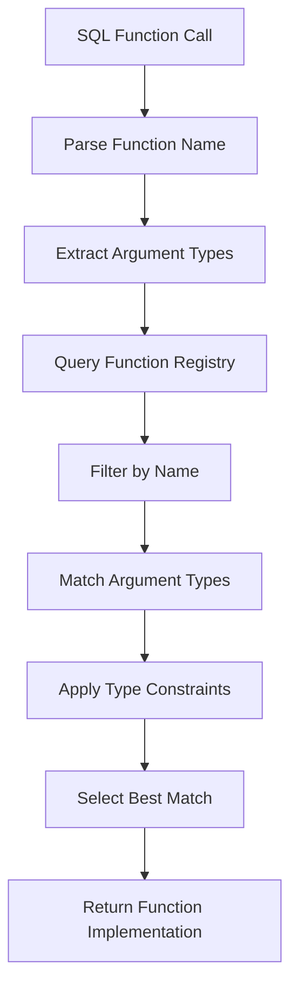
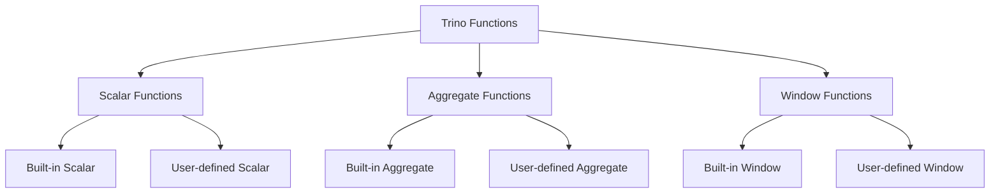
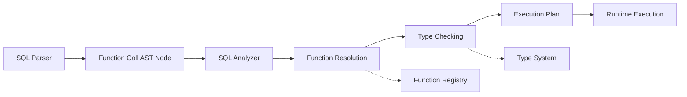

# Function System

The Function System is a core component of Trino's SPI (Service Provider Interface) that provides the foundation for defining, managing, and executing SQL functions within the Trino query engine. It enables both built-in and user-defined functions to be registered, resolved, and invoked during query execution.

## Overview

The Function System serves as the central mechanism for:
- **Function Definition**: Specifying function signatures, including parameter types and return types
- **Type System Integration**: Working with Trino's type system to ensure type safety and compatibility
- **Function Resolution**: Matching function calls to appropriate implementations during query analysis
- **Extensibility**: Allowing plugins and connectors to register custom functions

## Core Architecture

### Signature System

The `Signature` class is the cornerstone of the Function System, providing a flexible way to define function prototypes with support for:

- **Type Variables**: Generic type parameters that can be constrained (comparable, orderable, castable)
- **Long Variables**: Numeric constraints for variable-length arguments
- **Variable Arity**: Support for functions with varying numbers of arguments
- **Type Constraints**: Complex relationships between types

```java
// Example signature for a generic comparison function
Signature.builder()
    .comparableTypeParameter("T")
    .argumentType(new TypeSignature("T"))
    .argumentType(new TypeSignature("T"))
    .returnType(BOOLEAN)
    .build()
```

## Component Relationships

### Integration with Type System

The Function System heavily relies on Trino's Type System for type resolution and validation:

- **Type Signatures**: Functions use `TypeSignature` objects to declare their parameter and return types
- **Type Variables**: Generic type parameters are resolved against actual types during function resolution
- **Type Constraints**: Ensures functions are only applicable to compatible types

### Function Resolution Process



### Function Categories

The Function System supports multiple function types, each with specific characteristics:



## Function Registration and Management

### Plugin Integration

Functions are registered through Trino's Plugin Architecture:

1. **Plugin Registration**: Plugins declare their functions during initialization
2. **Function Bundles**: Related functions are grouped into bundles for efficient management
3. **Function Manager**: Central registry that maintains all available functions
4. **Language Support**: Support for functions implemented in different languages (SQL, Java, etc.)

### Function Resolution Algorithm

The Function System employs a sophisticated resolution algorithm that considers:

- **Exact Type Matches**: Functions with exactly matching argument types
- **Implicit Casts**: Functions that require implicit type conversions
- **Type Variables**: Generic functions that can be specialized
- **Variable Arity**: Functions that accept varying numbers of arguments
- **Constraint Satisfaction**: Type constraints must be satisfied

## Data Flow

### Query Processing Integration



### Function Execution Pipeline

1. **Parsing**: SQL parser identifies function calls in the query
2. **Analysis**: Analyzer resolves function references using the Function System
3. **Type Checking**: Validates that arguments match the function signature
4. **Optimization**: Planner may optimize function calls based on properties
5. **Execution**: Runtime executes the resolved function implementation

## Key Features

### Type Safety

- **Compile-time Checking**: Function signatures are validated during query analysis
- **Runtime Type Enforcement**: Type constraints are enforced during execution
- **Implicit Conversion Support**: Handles type conversions when safe and unambiguous

### Extensibility

- **Plugin Functions**: Plugins can register custom functions
- **Dynamic Loading**: Functions can be added without restarting the system
- **Language Support**: Support for functions in multiple implementation languages

### Performance Optimization

- **Function Caching**: Resolved functions are cached for performance
- **Specialization**: Generic functions can be specialized for specific types
- **Inlining**: Optimizer may inline simple functions

## Integration Points

### SQL Analyzer

The Function System integrates closely with the [SQL Analyzer](SQL%20Analyzer.md) to:
- Resolve function calls during semantic analysis
- Validate function arguments and return types
- Apply type constraints and conversions

### Query Planner

Works with the [Query Planner](Query%20Planner%20&%20Plan%20Representation.md) to:
- Optimize function calls in the execution plan
- Select efficient function implementations
- Handle function pushdown to connectors

### Type System

Deep integration with the [Type System](Type%20System.md) provides:
- Type signature validation
- Type variable resolution
- Constraint checking

### Metadata Management

The [Metadata & Connector Abstraction](Metadata%20&%20Connector%20Abstraction.md) layer uses the Function System to:
- Register connector-specific functions
- Manage function visibility and access
- Handle function authorization

## Usage Examples

### Built-in Functions

Trino includes a comprehensive set of built-in functions:

```sql
-- String functions
SELECT upper('hello'), concat('a', 'b'), length('text')

-- Mathematical functions  
SELECT abs(-5), sqrt(16), pow(2, 3)

-- Date/time functions
SELECT current_date, date_add('day', 7, current_date)

-- Aggregate functions
SELECT count(*), sum(amount), avg(score) FROM table
```

### User-defined Functions

Plugins and connectors can provide custom functions:

```sql
-- Custom geospatial function (from plugin)
SELECT st_distance(point1, point2) FROM locations

-- Custom aggregation (from connector)
SELECT custom_agg(metric) FROM sensor_data
```

## Advanced Features

### Polymorphic Functions

Functions can be defined with type variables for maximum flexibility:

```java
// Generic array function
Signature.builder()
    .typeVariable("E")
    .argumentType(arrayType(new TypeSignature("E")))
    .returnType(new TypeSignature("E"))
    .build()
```

### Constraint-based Functions

Functions can specify complex type constraints:

```java
// Function requiring comparable types
Signature.builder()
    .comparableTypeParameter("T")
    .argumentType(new TypeSignature("T"))
    .argumentType(new TypeSignature("T"))
    .returnType(BOOLEAN)
    .build()
```

### Variable-arity Functions

Support for functions with varying argument counts:

```java
// Coalesce function with variable arguments
Signature.builder()
    .typeVariable("T")
    .argumentType(new TypeSignature("T"))
    .variableArity()
    .returnType(new TypeSignature("T"))
    .build()
```

## Performance Considerations

### Function Resolution Cost

- Function resolution happens during query analysis, not execution
- Complex signatures with many type variables may increase resolution time
- Function registry is optimized for fast lookups

### Runtime Performance

- Function implementations are highly optimized
- Built-in functions use efficient algorithms and data structures
- User-defined functions may have performance overhead

### Memory Usage

- Function signatures are cached to avoid repeated parsing
- Type constraint resolution may create temporary objects
- Large numbers of functions increase memory footprint

## Error Handling

### Resolution Errors

- **Function Not Found**: Clear error messages when functions don't exist
- **Ambiguous Function Call**: Helpful messages for overloaded functions
- **Type Mismatch**: Detailed information about type incompatibilities

### Runtime Errors

- **Argument Validation**: Functions validate arguments at runtime
- **Type Safety**: Runtime type checking prevents data corruption
- **Error Propagation**: Function errors are properly propagated to users

## Future Enhancements

### Planned Features

- **Enhanced Type Inference**: More sophisticated type variable resolution
- **Function Overloading**: Better support for complex overload scenarios
- **Performance Optimizations**: Faster resolution and execution
- **Extended Language Support**: More languages for function implementation

### Extensibility Improvements

- **Function Categories**: Better organization of function namespaces
- **Dynamic Registration**: Runtime function registration and updates
- **Function Versioning**: Support for multiple versions of functions
- **Custom Constraints**: User-defined type constraints

## Related Documentation

- [Type System](Type%20System.md) - Type system that works with function signatures
- [SQL Analyzer](SQL%20Analyzer.md) - Component that resolves function calls
- [Query Planner & Plan Representation](Query%20Planner%20&%20Plan%20Representation.md) - Optimizes function execution
- [Plugin Architecture](Plugin%20Architecture.md) - How plugins register functions
- [Metadata & Connector Abstraction](Metadata%20&%20Connector%20Abstraction.md) - Function management and access control
- [SQL Functions & Operators](SQL%20Functions%20&%20Operators.md) - Built-in function implementations