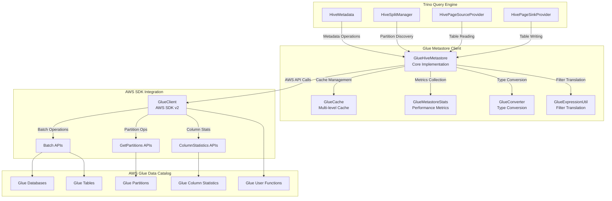
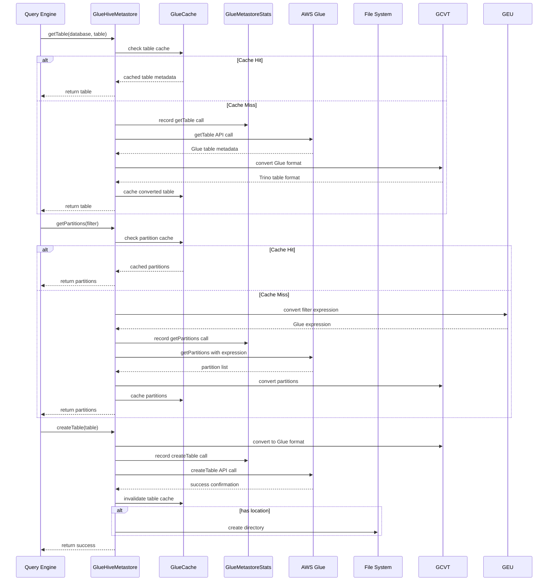
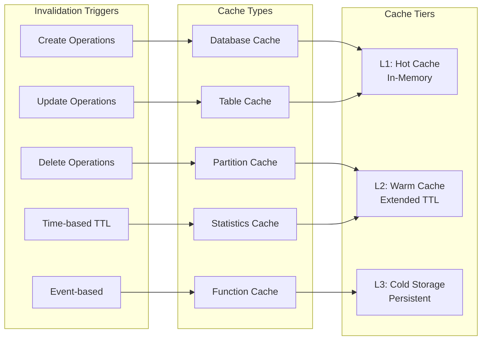

# Glue Metastore Client Module

## Introduction

The Glue Metastore Client module provides Trino with seamless integration to AWS Glue Data Catalog, serving as a critical bridge between Trino's query engine and AWS's managed metadata service. This module enables Trino to discover, query, and manage Hive-compatible table metadata stored in AWS Glue, eliminating the need for self-managed Hive metastore deployments while maintaining full compatibility with existing Hive ecosystem tools.

As part of Trino's [Hive Connector](Hive Connector.md) ecosystem, the Glue Metastore Client implements the `HiveMetastore` interface, providing a unified abstraction that allows Trino to interact with AWS Glue Data Catalog using the same APIs as traditional Hive metastores. This design ensures that users can migrate from on-premises Hive deployments to AWS Glue without modifying their queries or data pipelines.

## Architecture Overview

The Glue Metastore Client is architected as a high-performance, fault-tolerant client that efficiently manages metadata operations between Trino and AWS Glue Data Catalog. The module implements comprehensive caching, batching, and parallel processing strategies to minimize AWS API calls and reduce query latency.

## Core Components

### GlueHiveMetastore

The `GlueHiveMetastore` class serves as the primary implementation of the `HiveMetastore` interface, providing comprehensive metadata management capabilities for AWS Glue Data Catalog. This component orchestrates all interactions between Trino and AWS Glue, implementing sophisticated caching, batching, and error handling strategies.

**Key Responsibilities:**
- **Database Management**: Create, drop, rename, and configure Glue databases with automatic directory creation
- **Table Operations**: Full lifecycle management including creation, deletion, renaming, and metadata updates
- **Partition Management**: Efficient partition discovery, creation, deletion, and statistics management
- **Statistics Management**: Comprehensive column and table statistics with incremental update support
- **Function Management**: User-defined function lifecycle management within Glue
- **Access Control**: Integration with AWS IAM for security and permissions

**Performance Optimizations:**
- **Multi-level Caching**: Database, table, partition, and statistics caching with intelligent invalidation
- **Parallel Processing**: Configurable thread pools for batch operations and partition scanning
- **Segmented Partition Scanning**: Distributed partition discovery across multiple segments
- **Batch API Utilization**: Optimized batch operations for partitions and statistics
- **Pagination Handling**: Efficient handling of AWS API pagination for large datasets

### GlueCache

The `GlueCache` component provides intelligent caching mechanisms that significantly reduce AWS API calls and improve query performance. The cache implements multi-level caching strategies with fine-grained invalidation to ensure data consistency while maximizing performance benefits.

**Cache Levels:**
- **Database Cache**: Database metadata and names with automatic invalidation
- **Table Cache**: Complete table metadata with dependency tracking
- **Partition Cache**: Partition metadata with filter-based caching
- **Statistics Cache**: Column statistics with update tracking
- **Function Cache**: User-defined function metadata

**Cache Invalidation Strategy:**
The cache implements sophisticated invalidation patterns that maintain consistency across distributed Trino clusters while minimizing unnecessary cache clears. Invalidation occurs based on operation type, affected resources, and cross-table dependencies.

### GlueMetastoreStats

The `GlueMetastoreStats` component provides comprehensive performance monitoring and metrics collection for all AWS Glue interactions. This component enables operators to monitor metastore performance, identify bottlenecks, and optimize configurations.

**Metrics Collection:**
- **API Call Metrics**: Request/response times, success rates, and error categorization
- **Cache Performance**: Hit rates, miss rates, and eviction patterns
- **Operation Latency**: Detailed timing for each metastore operation type
- **Error Analysis**: Categorized error types with retry patterns
- **Resource Utilization**: Thread pool usage and queue depths

### GlueConverter

The `GlueConverter` utility provides bidirectional translation between Trino's internal metadata representations and AWS Glue Data Catalog formats. This component ensures seamless compatibility between Trino's type system and AWS Glue's data model.

**Conversion Capabilities:**
- **Type Mapping**: Hive type to Trino type conversion with precision handling
- **Statistics Translation**: Bidirectional conversion of column statistics
- **Metadata Transformation**: Table and partition metadata format conversion
- **Parameter Handling**: Special parameter processing for Trino-specific features
- **Storage Format Mapping**: File format and serialization library translation

## Data Flow Architecture

## Integration with Trino Ecosystem

### Hive Connector Integration

The Glue Metastore Client seamlessly integrates with Trino's [Hive Connector](Hive Connector.md), providing the metadata foundation for Hive-compatible table operations. The integration follows Trino's standard connector architecture while adding AWS-specific optimizations.

**Integration Points:**
- **Metadata Resolution**: Table and partition discovery for query planning
- **Statistics Integration**: Cost-based optimization using Glue statistics
- **Security Integration**: AWS IAM-based access control
- **Transaction Support**: ACID properties through Glue's consistency model
- **Format Support**: Comprehensive file format compatibility

### Iceberg Connector Integration

The module also supports [Iceberg Connector](Iceberg Connector.md) integration through AWS Glue's Iceberg table format support, enabling modern data lakehouse architectures with AWS-native metadata management.

**Iceberg Features:**
- **Snapshot Management**: Iceberg table snapshot discovery and management
- **Schema Evolution**: Automatic schema change detection and handling
- **Partition Evolution**: Dynamic partition specification handling
- **Metadata Tables**: Support for Iceberg system tables via Glue metadata

## Performance Characteristics

### Caching Strategy

The Glue Metastore Client implements a sophisticated multi-tier caching strategy that balances performance with consistency:

### Batch Processing

The module implements intelligent batching strategies to minimize AWS API calls and improve throughput:

**Batch Operations:**
- **Partition Creation**: Batch partition creation with configurable batch sizes
- **Statistics Updates**: Batch column statistics updates with pagination
- **Partition Retrieval**: Batch partition fetching with parallel processing
- **Function Management**: Batch user-defined function operations

### Parallel Processing

Configurable parallel processing capabilities enable optimal resource utilization:

**Parallel Operations:**
- **Partition Scanning**: Distributed partition discovery across segments
- **Statistics Collection**: Parallel column statistics retrieval
- **Batch Operations**: Concurrent batch API calls
- **Cache Warming**: Background cache population

## Configuration and Deployment

### AWS Integration

The Glue Metastore Client integrates with AWS services through standard AWS SDK v2, supporting multiple authentication and configuration patterns:

**Authentication Methods:**
- **IAM Roles**: EC2 instance profiles and ECS task roles
- **Access Keys**: Static AWS access key and secret key
- **Web Identity**: OIDC and SAML federation
- **Credential Providers**: Custom credential provider chains

**Configuration Options:**
- **Region Configuration**: AWS region specification and endpoint overrides
- **Retry Policies**: Configurable retry strategies with exponential backoff
- **Timeout Settings**: Connection and request timeout configurations
- **Proxy Support**: HTTP/HTTPS proxy configuration for corporate environments

### Performance Tuning

The module provides extensive configuration options for performance optimization:

**Cache Configuration:**
- **Cache Sizes**: Configurable cache sizes for different metadata types
- **TTL Settings**: Time-to-live configurations for cache entries
- **Eviction Policies**: LRU and custom eviction strategies
- **Warmup Strategies**: Background cache population patterns

**Thread Pool Configuration:**
- **Core Pool Size**: Base thread pool size for parallel operations
- **Maximum Pool Size**: Maximum concurrent operations
- **Queue Capacity**: Work queue sizing for batch operations
- **Keep-Alive Time**: Thread lifecycle management

## Error Handling and Resilience

### Exception Management

The Glue Metastore Client implements comprehensive error handling strategies that provide clear error messages while maintaining system stability:

**Error Categories:**
- **AWS SDK Exceptions**: Network, authentication, and service errors
- **Data Consistency Errors**: Concurrent modification and race conditions
- **Validation Errors**: Schema validation and type compatibility issues
- **Resource Errors**: Missing tables, partitions, and permissions

**Retry Strategies:**
- **Exponential Backoff**: Progressive delay increases for transient errors
- **Circuit Breaker**: Protection against cascading failures
- **Fallback Mechanisms**: Alternative data sources and cached data
- **Error Propagation**: Appropriate error translation to Trino exceptions

### Monitoring and Observability

Comprehensive monitoring capabilities enable proactive system management:

**Metrics and Alerts:**
- **Performance Metrics**: Response times, throughput, and error rates
- **Resource Utilization**: Cache hit rates, thread pool usage, and memory consumption
- **AWS API Metrics**: API call patterns, throttling, and cost tracking
- **Health Checks**: System health monitoring and alerting

## Security and Compliance

### AWS IAM Integration

The module integrates with AWS IAM for comprehensive security management:

**Permission Model:**
- **Fine-grained Access**: Table, database, and column-level permissions
- **Cross-account Access**: Support for cross-account IAM roles
- **Resource Policies**: Glue Data Catalog resource-based policies
- **Audit Logging**: Comprehensive access logging and monitoring

**Data Protection:**
- **Encryption at Rest**: Support for encrypted metadata storage
- **Encryption in Transit**: TLS encryption for all AWS communications
- **Data Classification**: Support for sensitive data classification
- **Compliance Standards**: SOC, PCI DSS, and HIPAA compliance support

## Best Practices and Optimization

### Performance Optimization

**Caching Strategies:**
- Implement appropriate cache sizes based on metadata volume
- Configure TTL values based on metadata change frequency
- Use cache warming for frequently accessed metadata
- Monitor cache hit rates and adjust configurations

**Batch Operations:**
- Configure optimal batch sizes based on AWS API limits
- Use parallel processing for large partition operations
- Implement appropriate retry strategies for batch failures
- Monitor AWS API usage and costs

**Query Optimization:**
- Leverage partition pruning with appropriate filter expressions
- Use column statistics for cost-based optimization
- Implement appropriate table formats for query patterns
- Monitor query performance and adjust configurations

### Operational Excellence

**Monitoring and Alerting:**
- Implement comprehensive metrics collection and monitoring
- Configure appropriate alerting thresholds for key metrics
- Monitor AWS API usage and costs
- Implement health checks and automated recovery

**Capacity Planning:**
- Monitor resource utilization and plan for growth
- Implement appropriate scaling strategies
- Plan for disaster recovery and business continuity
- Optimize costs through efficient resource utilization

## Future Enhancements

The Glue Metastore Client continues to evolve with new AWS Glue features and Trino capabilities:

**Planned Enhancements:**
- **AWS Lake Formation Integration**: Advanced security and governance features
- **Federated Query Support**: Cross-region and cross-account query capabilities
- **Machine Learning Integration**: Automated statistics collection and optimization
- **Serverless Architectures**: Enhanced support for serverless compute patterns

**Emerging Patterns:**
- **Data Mesh Architectures**: Distributed data ownership and governance
- **Real-time Analytics**: Streaming data integration and processing
- **Multi-cloud Strategies**: Cross-cloud metadata management
- **Data Lakehouse Patterns**: Unified analytics on data lake architectures