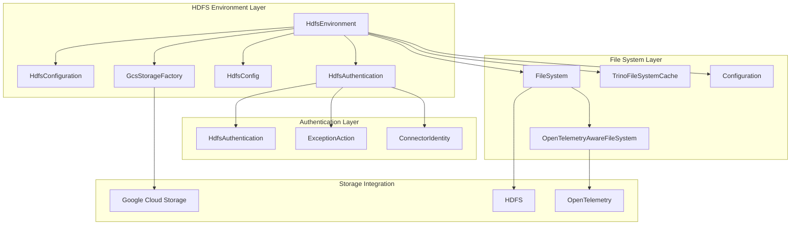
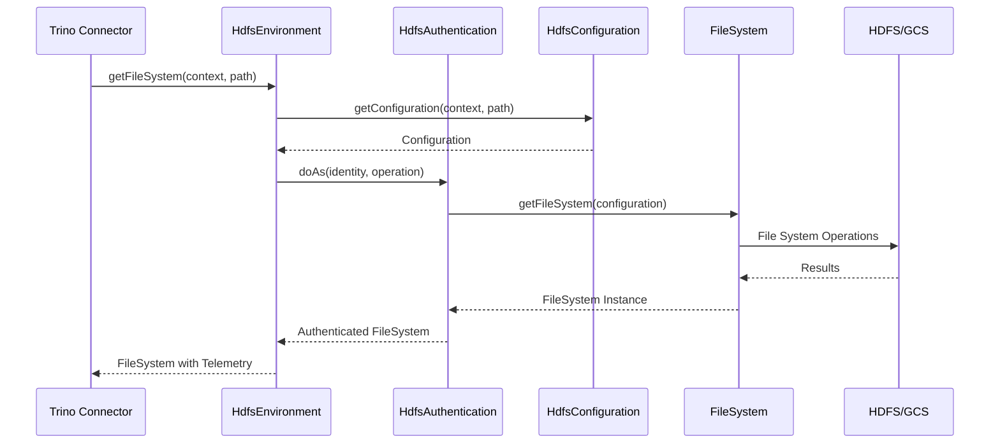

# HDFS Environment Module

## Introduction

The HDFS Environment module provides a comprehensive abstraction layer for Hadoop Distributed File System (HDFS) operations within the Trino ecosystem. It serves as the primary interface between Trino's storage layer and HDFS, offering secure, authenticated access to distributed file systems while managing configuration, authentication, and resource lifecycle.

This module is essential for Trino connectors that need to interact with HDFS-based storage systems, particularly the Hive, Iceberg, and Delta Lake connectors. It handles the complexity of Hadoop configuration management, authentication, and provides a unified interface for file system operations across different storage backends.

## Architecture Overview

The HDFS Environment module is built around the central `HdfsEnvironment` class, which orchestrates various components to provide secure and efficient file system access. The architecture follows a layered approach with clear separation of concerns:



## Core Components

### HdfsEnvironment

The `HdfsEnvironment` class is the central component that provides a unified interface for HDFS operations. It manages:

- **Configuration Management**: Handles Hadoop configuration for different contexts and paths
- **Authentication**: Manages secure access to file systems through pluggable authentication mechanisms
- **File System Lifecycle**: Creates, caches, and manages FileSystem instances
- **Permission Management**: Controls directory and file permissions
- **Cloud Storage Integration**: Provides seamless integration with Google Cloud Storage
- **Observability**: Integrates with OpenTelemetry for monitoring and tracing

#### Key Features:

1. **Thread-Safe Operations**: Uses `ThreadContextClassLoader` to ensure proper classloader isolation
2. **Authentication Integration**: Delegates authentication to `HdfsAuthentication` for flexible security models
3. **Configuration Caching**: Leverages `TrinoFileSystemCache` for efficient FileSystem reuse
4. **Checksum Verification**: Configurable checksum verification for data integrity
5. **Permission Inheritance**: Supports ownership inheritance for newly created files

### Configuration Management

The module integrates with Trino's configuration system through `HdfsConfig`, which provides:

- Directory permission settings (`newDirectoryFsPermissions`)
- File ownership inheritance control (`newFileInheritOwnership`)
- Checksum verification settings (`verifyChecksum`)

### Authentication Framework

Authentication is handled through the `HdfsAuthentication` interface, which supports:

- **Identity-based Access**: Uses `ConnectorIdentity` for user context
- **Exception Handling**: Provides `ExceptionAction` for authenticated operations
- **Pluggable Authentication**: Allows different authentication mechanisms to be implemented

## Data Flow Architecture



## Integration with Trino Ecosystem

The HDFS Environment module integrates with several other Trino modules:

### Filesystem Abstraction Layer
The module is part of Trino's broader filesystem abstraction, working alongside:
- [Filesystem Abstraction Layer](Filesystem%20Abstraction%20Layer.md) - Provides unified interface for different storage systems
- Cloud storage implementations (S3, Azure, GCS)
- Local filesystem support

### Connector Integration
HDFS Environment is primarily used by:
- [Hive Connector](Hive%20Connector.md) - For accessing Hive tables stored in HDFS
- [Iceberg Connector](Iceberg%20Connector.md) - For Iceberg tables on HDFS
- [Delta Lake Connector](Delta%20Lake%20Connector.md) - For Delta Lake tables on HDFS

### Security Framework
Integrates with Trino's security framework through:
- [Trino Server & API](Trino%20Server%20&%20API.md) - Security management
- [Plugin Toolkit](Plugin%20Toolkit.md) - Authentication and authorization

## Configuration and Usage

### Basic Configuration

The HDFS Environment is configured through dependency injection with the following parameters:

```java
@Inject
public HdfsEnvironment(
    OpenTelemetry openTelemetry,
    HdfsConfiguration hdfsConfiguration,
    HdfsConfig config,
    HdfsAuthentication hdfsAuthentication,
    Optional<GcsStorageFactory> gcsStorageFactory)
```

### File System Access Pattern

Typical usage pattern for accessing HDFS:

```java
// Get configuration for specific context and path
Configuration config = hdfsEnvironment.getConfiguration(context, path);

// Get authenticated file system
FileSystem fs = hdfsEnvironment.getFileSystem(context, path);

// Perform operations within authenticated context
hdfsEnvironment.doAs(identity, () -> {
    // File system operations
    return result;
});
```

## Security Considerations

### Authentication
- All file system operations are performed within an authenticated context
- Supports pluggable authentication mechanisms through `HdfsAuthentication`
- Thread-safe authentication with proper classloader isolation

### Permission Management
- Configurable directory permissions for new directories
- File ownership inheritance support
- Integration with Hadoop's permission system

### Resource Management
- Proper cleanup of FileSystem instances through `TrinoFileSystemCache`
- Shutdown hooks for resource cleanup in isolated classloaders
- Thread interruption for cleanup operations

## Performance Optimizations

### Caching Strategy
- `TrinoFileSystemCache` provides efficient FileSystem instance reuse
- Configuration caching reduces overhead for repeated operations
- Thread-local context management minimizes synchronization overhead

### Monitoring and Observability
- OpenTelemetry integration for distributed tracing
- File system statistics and monitoring
- Error logging and diagnostics

## Error Handling

The module implements comprehensive error handling:

- **Authentication Failures**: Proper exception propagation from authentication layer
- **File System Errors**: IOException handling with proper resource cleanup
- **Configuration Errors**: Validation and error reporting for misconfigurations
- **Reflection Errors**: Graceful handling of reflection operations for cleanup

## Lifecycle Management

### Initialization
- Static initialization of Hadoop native libraries
- FileSystem cache registration
- Configuration validation

### Runtime
- Dynamic configuration resolution based on context
- Authentication state management
- Resource pooling and reuse

### Shutdown
- Cleanup of FileSystem instances
- Thread interruption for background services
- Resource finalization in isolated classloaders

## Dependencies

The HDFS Environment module depends on:

- **Hadoop Libraries**: Core HDFS client libraries
- **Trino SPI**: For identity and context management
- **OpenTelemetry**: For observability integration
- **Google Cloud Libraries**: For GCS integration
- **Airlift**: For logging and configuration

## Future Considerations

The module is designed to be extensible for:
- Additional cloud storage integrations
- Enhanced authentication mechanisms
- Improved caching strategies
- Better observability and monitoring

This architecture provides a robust foundation for HDFS operations within Trino while maintaining flexibility for future enhancements and integrations.