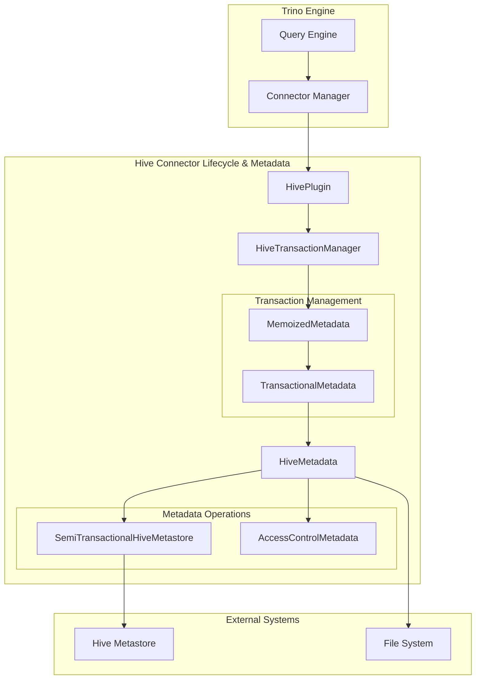

# Hive Connector Lifecycle & Metadata Module

## Overview

The Hive Connector Lifecycle & Metadata module is a core component of the Trino Hive connector that manages the complete lifecycle of Hive tables and provides comprehensive metadata operations. This module serves as the primary interface between Trino's query engine and Hive's metastore, handling table creation, modification, transaction management, and metadata operations.

## Architecture

## Core Components

### 1. HivePlugin
The entry point for the Hive connector that implements Trino's Plugin interface. It provides connector factories and registers Hive-specific functions.

**Key Responsibilities:**
- Register Hive connector with Trino
- Provide connector factory instances
- Register Hive-specific functions like `CanonicalizeHiveTimezoneId`

### 2. HiveTransactionManager
Manages the lifecycle of Hive transactions, ensuring proper isolation and consistency across multiple operations.

**Key Responsibilities:**
- Transaction lifecycle management (begin, commit, rollback)
- Per-transaction metadata instance management
- Thread-safe transaction handle operations
- Integration with Trino's transaction framework

### 3. HiveMetadata
The central metadata management component that implements TransactionalMetadata interface. This is the largest and most complex component handling all metadata operations.

**Key Responsibilities:**
- Table lifecycle operations (create, drop, alter)
- Schema management
- View management and translation
- Statistics collection and management
- Partition operations
- Access control integration
- Query optimization support

## Sub-modules

### [Transaction Management](Transaction Management.md)
Handles the complete transaction lifecycle for Hive operations, ensuring ACID properties and proper isolation.

**Key Features:**
- Memoized metadata instances per transaction
- Thread-safe transaction operations
- Automatic cleanup on transaction completion
- Support for both auto-commit and explicit transactions

### [Metadata Operations](Metadata Operations.md)
Comprehensive metadata management covering all aspects of Hive table metadata.

**Key Features:**
- Table creation with various storage formats
- Partition management and projection
- Statistics collection and updates
- View creation and translation
- Schema and database operations
- Column and table property management

### [Plugin Integration](Plugin Integration.md)
Manages the integration between the Hive connector and Trino's plugin framework.

**Key Features:**
- Connector factory registration
- Function registration and management
- Plugin lifecycle management
- Integration with Trino's connector discovery mechanism

### Storage Format Support
Extensive support for various Hive storage formats with format-specific optimizations.

**Supported Formats:**
- ORC with bloom filters and ACID support
- Parquet with bloom filters
- Avro with schema evolution
- TextFile and CSV with custom delimiters
- RCFile and SequenceFile
- Regex format for custom parsing

## Integration Points

### With Trino Engine
- Implements Trino's ConnectorMetadata interface
- Integrates with Trino's transaction framework
- Supports Trino's security and access control models
- Participates in query planning and optimization

### With Hive Metastore
- Uses SemiTransactionalHiveMetastore for metastore operations
- Supports both Thrift and Glue metastore implementations
- Handles metastore concurrency and consistency
- Manages metastore transaction boundaries

### With File Systems
- Integrates with Trino's filesystem abstraction layer
- Supports HDFS, S3, Azure, GCS, and local filesystems
- Handles file-level operations for table data
- Manages file permissions and ownership

## Key Features

### Transactional Table Support
- Full ACID table support with INSERT, UPDATE, DELETE operations
- Transactional metadata management
- Write-ahead logging for durability
- Conflict resolution and concurrency control

### Partition Management
- Dynamic partition pruning
- Partition projection for efficient querying
- Partition statistics collection
- Bulk partition operations

### Statistics and Optimization
- Automatic statistics collection
- Column-level statistics
- Partition-level statistics
- Integration with Trino's cost-based optimizer

### Security Integration
- Role-based access control
- Privilege management
- Schema and table-level security
- Integration with external authorization systems

## Configuration

The module supports extensive configuration options for:
- Transaction behavior and isolation levels
- Storage format preferences
- Statistics collection behavior
- Partition management strategies
- Security and access control settings

## Error Handling

Comprehensive error handling for:
- Metastore connectivity issues
- File system errors
- Transaction conflicts
- Schema validation failures
- Permission and access violations

## Performance Considerations

- Memoized metadata to avoid repeated metastore calls
- Batch operations for bulk metadata updates
- Lazy loading of partition information
- Caching of frequently accessed metadata
- Parallel processing for large partition sets

## Related Documentation

- [Transaction Management](Transaction Management.md) - Detailed transaction lifecycle management
- [Metadata Operations](Metadata Operations.md) - Comprehensive metadata operation details
- [Plugin Integration](Plugin Integration.md) - Plugin framework integration details
- [Hive Connector Core](Hive Connector Core.md) - Core connector functionality
- [Hive Data Access](Hive Data Access.md) - Data reading and writing operations
- [Hive Metastore Clients](Hive Metastore Clients.md) - Metastore client implementations
- [Trino SPI](Trino SPI.md) - Trino Service Provider Interface
- [Metadata & Connector Abstraction](Metadata & Connector Abstraction.md) - General metadata management