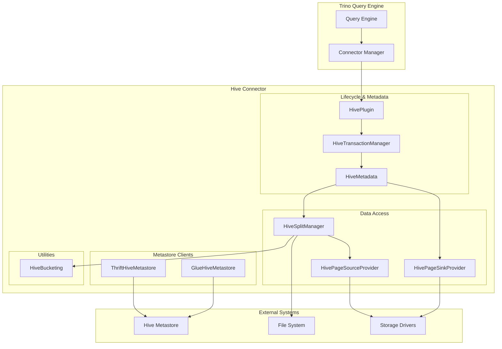

# Hive Connector Module

## Purpose

The Hive Connector module enables Trino to query and manipulate data stored in Apache Hive data warehouses. It provides comprehensive integration with Hive tables across various storage formats (ORC, Parquet, Avro, TextFile, RCFile, SequenceFile) and distributed file systems (HDFS, S3, Azure, GCS). The module handles the complete lifecycle of Hive table operations including metadata management, data access, transaction coordination, and integration with different Hive metastore implementations.

## Architecture

## Core Components

### Hive Connector Core
- **HivePlugin**: Entry point that registers the connector with Trino and provides connector factories
- **HiveTransactionManager**: Manages transaction lifecycle and provides per-transaction metadata instances
- **HiveMetadata**: Central component handling all metadata operations including table creation, alteration, statistics management, and partition operations
- **HiveSplitManager**: Generates splits for Hive tables by querying metastore and applying dynamic filtering
- **HivePageSourceProvider**: Creates page sources for reading Hive data with support for column mapping and type coercion
- **HivePageSinkProvider**: Handles data writing operations for INSERT, CREATE TABLE, and MERGE operations

### Hive Metastore Clients
- **ThriftHiveMetastore**: Traditional Hive metastore client using Thrift protocol
- **GlueHiveMetastore**: AWS Glue Data Catalog integration for cloud-native deployments

## Key Features

- **Multi-format Support**: Native support for ORC, Parquet, Avro, TextFile, RCFile, and SequenceFile formats
- **Transaction Management**: Full ACID table support with INSERT, UPDATE, DELETE operations
- **Partition Management**: Dynamic partition pruning, projection, and bulk operations
- **Schema Evolution**: Automatic type coercion and column mapping for evolving schemas
- **Bucketing Support**: Optimized queries on bucketed tables with bucket pruning
- **Statistics Integration**: Automatic statistics collection for cost-based optimization
- **Security Integration**: Role-based access control and privilege management
- **Cloud Storage**: Seamless integration with S3, Azure, and GCS through unified filesystem abstraction

## References to Core Components

- [Hive Connector Core](Hive Connector/Hive Connector Core.md) - Detailed documentation of plugin integration, transaction management, and metadata operations
- [Hive Metastore Clients](Hive Connector/Hive Metastore Clients.md) - Documentation for Thrift and Glue metastore implementations
- [Trino SPI](Trino SPI.md) - Service Provider Interface that Hive connector implements
- [Metadata & Connector Abstraction](Metadata & Connector Abstraction.md) - General metadata management framework
- [Filesystem Abstraction Layer](Filesystem Abstraction Layer.md) - Unified filesystem interface for storage access
- [ORC & Parquet Libraries](ORC & Parquet Libraries.md) - Columnar format support libraries
- [Hive Support Libraries](Hive Support Libraries.md) - Metastore and format libraries for Hive-specific operations