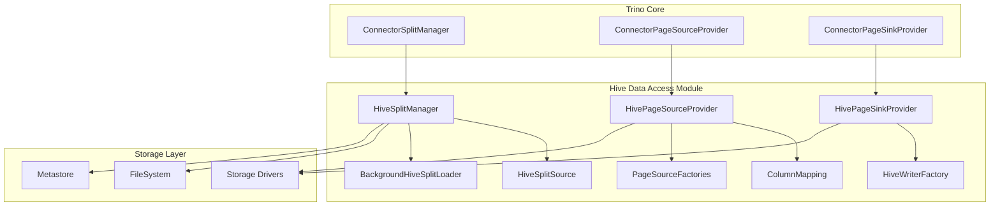
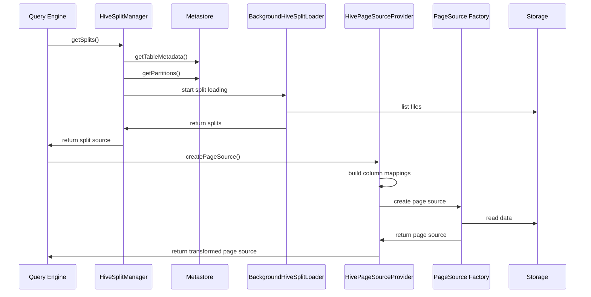

# Hive Data Access Module

## Overview

The Hive Data Access module is a core component of the Trino Hive connector that provides efficient data access capabilities for Hive tables. It serves as the bridge between Trino's query execution engine and Hive's distributed storage systems, handling the complexities of reading from and writing to Hive tables across various storage formats and partitioning schemes.

## Purpose

The module is designed to:
- Provide high-performance data access for Hive tables in Trino
- Handle complex partitioning schemes and bucketed tables
- Support multiple storage formats (ORC, Parquet, Avro, etc.)
- Manage data type coercions and schema evolution
- Optimize query execution through intelligent split generation
- Ensure data consistency and transactional integrity

## Architecture

## Core Components

### 1. HiveSplitManager
The `HiveSplitManager` is responsible for generating splits (data chunks) for Hive tables. It:
- Queries the Hive metastore to retrieve table metadata and partition information
- Applies dynamic filtering to reduce the number of splits
- Handles partitioned and bucketed tables
- Manages schema validation and type coercion
- Coordinates with the BackgroundHiveSplitLoader for parallel split generation

**Key Features:**
- Dynamic partition pruning
- Bucket-aware split generation
- Schema evolution support
- Parallel split loading with configurable concurrency

For detailed documentation, see [HiveSplitManager.md](HiveSplitManager.md)

### 2. HivePageSourceProvider
The `HivePageSourceProvider` creates page sources for reading Hive data. It:
- Maps logical columns to physical storage columns
- Handles column projections and dereferences
- Manages type coercions for schema evolution
- Provides bucket adaptation and validation
- Supports various storage formats through factory pattern

**Key Features:**
- Column mapping and projection
- Type coercion support
- Bucket validation
- Multi-format storage support

For detailed documentation, see [HivePageSourceProvider.md](HivePageSourceProvider.md)

### 3. HivePageSinkProvider
The `HivePageSinkProvider` handles data writing operations for Hive tables. It:
- Creates page sinks for INSERT, CREATE TABLE, and MERGE operations
- Manages file writers for different storage formats
- Handles partitioning and bucketing during writes
- Coordinates with the metastore for metadata updates

**Key Features:**
- Multi-format write support
- Partitioned and bucketed table writes
- Transactional write operations
- Staging directory management

For detailed documentation, see [HivePageSinkProvider.md](HivePageSinkProvider.md)

## Data Flow

## Integration with Trino Ecosystem

The Hive Data Access module integrates with several other Trino modules:

- **[Trino SPI](Trino SPI.md)**: Implements connector interfaces for split management and data access
- **[Hive Support Libraries](Hive Support Libraries.md)**: Leverages metastore and format libraries for Hive-specific operations
- **[Filesystem Abstraction Layer](Filesystem Abstraction Layer.md)**: Uses unified filesystem interface for storage access
- **[ORC & Parquet Libraries](ORC & Parquet Libraries.md)**: Integrates with columnar format readers and writers

## Configuration

The module supports various configuration options through `HiveConfig`:

- **Split Management**: `max-outstanding-splits`, `max-initial-splits`, `split-loader-concurrency`
- **Partition Handling**: `max-partitions-per-scan`, `min-partition-batch-size`, `max-partition-batch-size`
- **Performance Tuning**: `max-splits-per-second`, `recursive-dir-walker-enabled`
- **Schema Evolution**: Type coercion and column mapping settings

## Performance Optimizations

1. **Dynamic Partition Pruning**: Reduces data scanned by applying filters during split generation
2. **Bucket-Aware Execution**: Optimizes joins and aggregations on bucketed tables
3. **Parallel Split Loading**: Concurrent file listing and split generation
4. **Column Projection**: Reads only required columns from storage
5. **Type Coercion Caching**: Efficient handling of schema evolution scenarios

## Error Handling

The module implements comprehensive error handling for:
- **Schema Mismatches**: Detects and reports incompatible table/partition schemas
- **Missing Partitions**: Handles cases where partitions are dropped during query execution
- **File Access Errors**: Manages filesystem-level exceptions
- **Type Coercion Failures**: Validates and reports type conversion issues

## Monitoring and Observability

The module provides metrics through JMX:
- Split generation statistics
- High memory split source tracking
- Partition processing metrics
- Error rates and types

This documentation provides a comprehensive overview of the Hive Data Access module. For detailed information about specific sub-modules, refer to their individual documentation files.