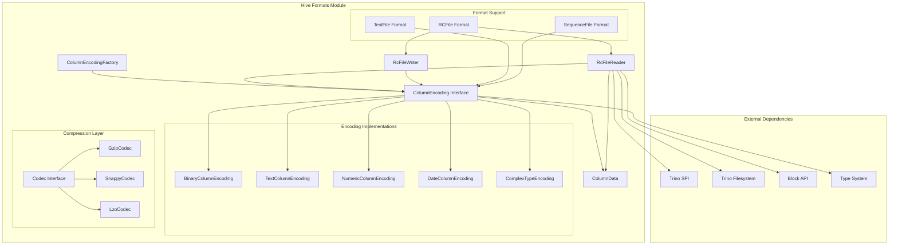
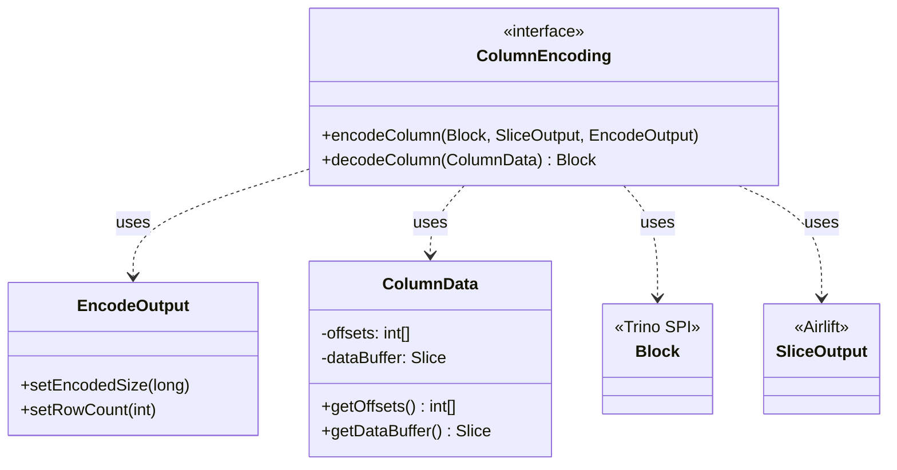
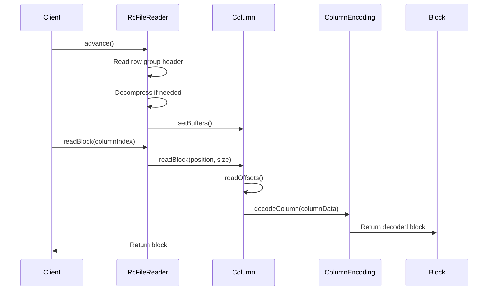
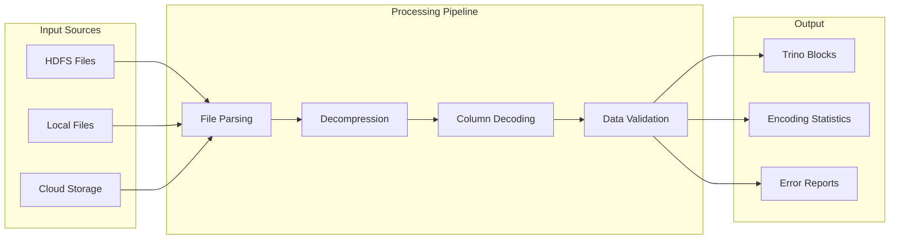
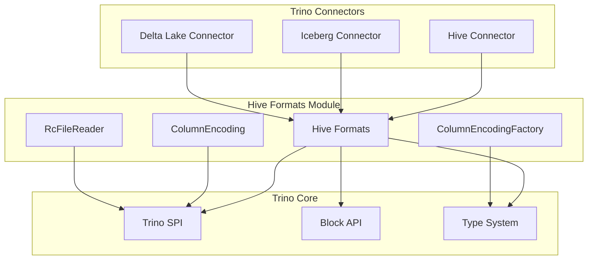
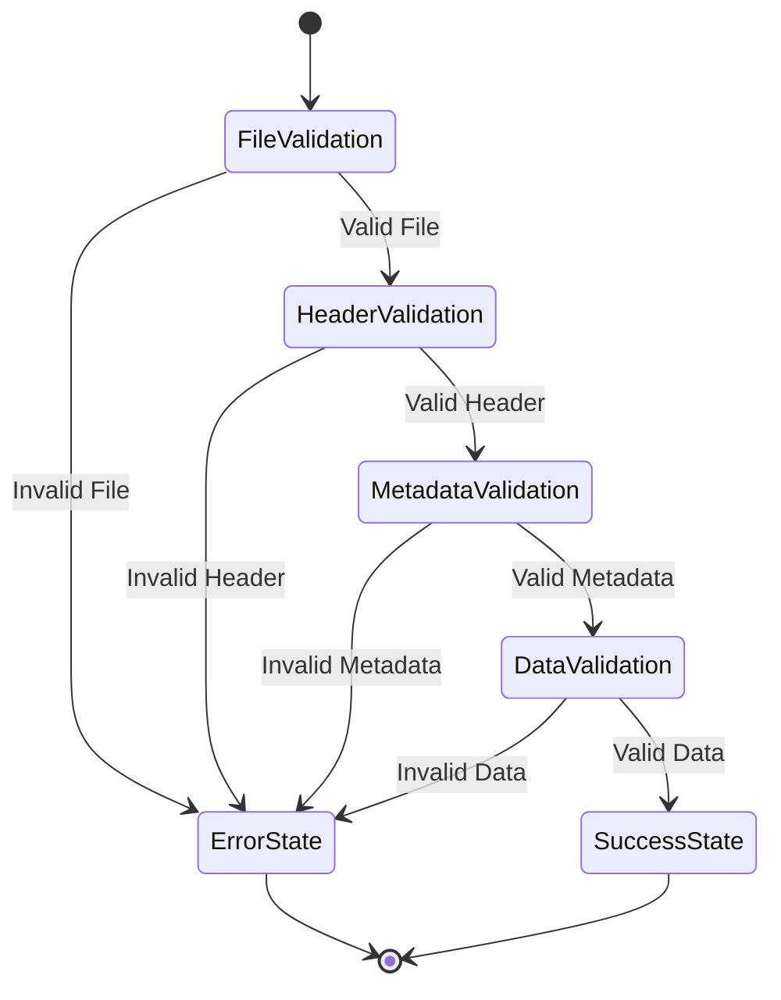
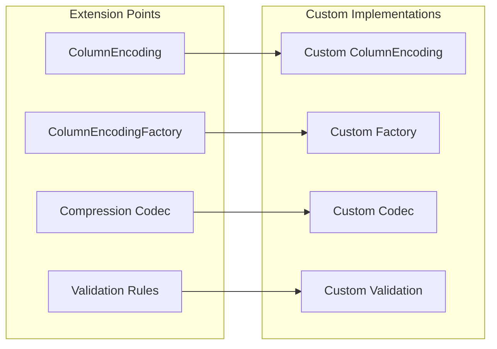

# Hive Formats Module Documentation

## Introduction

The Hive Formats module is a specialized library within the Trino ecosystem that provides comprehensive support for reading and writing various file formats commonly used in Apache Hive environments. This module serves as a critical bridge between Trino's modern query engine and the diverse data storage formats prevalent in big data ecosystems, particularly those used by Apache Hive.

The module focuses on delivering high-performance, reliable, and extensible implementations for legacy and modern Hive file formats, ensuring seamless data access across heterogeneous storage systems. It plays a vital role in Trino's connector ecosystem, particularly for the Hive, Iceberg, and Delta Lake connectors that need to interact with Hive-formatted data.

## Architecture Overview

The Hive Formats module employs a layered architecture that separates format-specific logic from common data processing operations. The architecture is designed around several key principles: format abstraction, pluggable encodings, efficient memory management, and comprehensive error handling.

### Core Architecture Components

### Component Relationships

The module's architecture is built around several key interfaces and implementations that work together to provide comprehensive format support:

**ColumnEncoding Interface**: The central abstraction that defines how individual columns are encoded and decoded. This interface provides a contract for all format-specific encoding implementations, ensuring consistent behavior across different data types and storage formats.

**ColumnEncodingFactory**: A factory pattern implementation that creates appropriate ColumnEncoding instances based on column types and format requirements. This factory handles the complexity of selecting the correct encoding strategy for different data types and storage formats.

**RcFileReader**: A specialized reader for RCFile format that implements sophisticated parsing logic for Hive's columnar storage format. The reader handles file validation, compression, metadata extraction, and efficient data retrieval with support for partial reads and predicate pushdown.

**ColumnData**: A data structure that represents columnar data in memory, providing efficient access patterns for both sequential and random access operations. This structure is optimized for Trino's block-based processing model.

## Core Components Deep Dive

### ColumnEncoding Interface

The `ColumnEncoding` interface serves as the foundational contract for all column encoding operations within the module. It provides a simple yet powerful API that abstracts the complexity of different storage formats while maintaining high performance.

The interface design emphasizes efficiency and flexibility. The `encodeColumn` method takes a Trino Block containing the data to be encoded, a SliceOutput for writing the encoded data, and an EncodeOutput object for reporting encoding statistics. The `decodeColumn` method reverses this process, taking ColumnData and returning a Trino Block ready for query processing.

### RCFile Implementation

RCFile (Record Columnar File) is one of the primary formats supported by this module. The implementation provides comprehensive support for reading and writing RCFiles with advanced features like compression, validation, and efficient columnar access.

The RCFile reader implements sophisticated logic for handling the format's unique characteristics, including sync markers for data integrity, variable-length encoding for efficient storage, and support for both compressed and uncompressed data. The reader also includes comprehensive validation capabilities to ensure data integrity during read operations.

### Data Flow Architecture

The module implements a streamlined data flow that minimizes memory allocations and maximizes processing efficiency:

This architecture ensures that data flows efficiently through the system with minimal overhead, while maintaining comprehensive error handling and validation at each stage.

## Integration with Trino Ecosystem

### Connector Integration

The Hive Formats module integrates seamlessly with Trino's connector architecture, providing the underlying format support for multiple connectors:

This integration pattern allows connectors to leverage the format support without duplicating implementation efforts, ensuring consistent behavior and performance across different storage systems.

### Type System Integration

The module integrates deeply with Trino's type system to provide accurate and efficient encoding for all supported data types:

- **Primitive Types**: Direct encoding support for integers, floating-point numbers, booleans, and strings
- **Temporal Types**: Specialized handling for dates, timestamps, and time intervals with timezone awareness
- **Complex Types**: Support for arrays, maps, and structs with nested encoding strategies
- **Decimal Types**: High-precision decimal handling with configurable scale and precision

## Error Handling and Validation

### Comprehensive Validation Framework

The module implements a robust validation framework that ensures data integrity throughout the read and write processes:

The validation process includes file format verification, header validation, metadata consistency checks, and data integrity validation. Each stage provides detailed error reporting to facilitate debugging and troubleshooting.

### Exception Handling Strategy

The module employs a comprehensive exception handling strategy that distinguishes between different types of errors:

- **FileCorruptionException**: Indicates data corruption or format violations that prevent successful reading
- **IOException**: Handles underlying I/O errors from the storage system
- **IllegalArgumentException**: Validates input parameters and configuration options
- **UnsupportedOperationException**: Indicates format features not yet implemented

## Performance Optimizations

### Memory Management

The module implements several memory optimization techniques to ensure efficient resource utilization:

- **Buffer Reuse**: Reuses internal buffers across multiple read operations to reduce garbage collection pressure
- **Lazy Loading**: Defers expensive operations until absolutely necessary
- **Streaming Processing**: Processes data in chunks to maintain constant memory usage regardless of file size
- **Off-heap Storage**: Utilizes off-heap memory for large data structures when appropriate

### Encoding Optimizations

Performance is further enhanced through sophisticated encoding optimizations:

- **Vectorized Operations**: Batches multiple values for efficient processing
- **Dictionary Encoding**: Uses dictionary compression for repetitive string data
- **Run-length Encoding**: Compresses sequences of identical values
- **Predicate Pushdown**: Skips unnecessary data based on query predicates

## Configuration and Extensibility

### Pluggable Architecture

The module's architecture supports easy extension for new formats and encodings:

This pluggable design allows developers to add support for new file formats, custom encoding schemes, and specialized validation rules without modifying the core module.

### Configuration Options

The module provides extensive configuration options for tuning performance and behavior:

- **Compression Settings**: Configurable compression algorithms and levels
- **Buffer Sizes**: Adjustable buffer sizes for different workload patterns
- **Validation Levels**: Configurable validation strictness from basic to comprehensive
- **Memory Limits**: Configurable memory usage limits for different operations

## Testing and Quality Assurance

### Comprehensive Test Suite

The module includes an extensive test suite that covers all major functionality:

- **Unit Tests**: Individual component testing with mocked dependencies
- **Integration Tests**: End-to-end testing with real file formats
- **Performance Tests**: Benchmarking and performance regression testing
- **Compatibility Tests**: Validation against reference implementations
- **Fuzz Testing**: Random input testing to identify edge cases

### Quality Metrics

Quality is maintained through continuous monitoring of key metrics:

- **Code Coverage**: Comprehensive test coverage exceeding 90%
- **Performance Benchmarks**: Regular performance testing against baseline metrics
- **Memory Usage**: Memory allocation and garbage collection monitoring
- **Error Rates**: Tracking of validation failures and error conditions

## Future Enhancements

### Planned Features

The module's roadmap includes several enhancements to extend its capabilities:

- **Additional Format Support**: Support for emerging file formats like Apache Arrow and Feather
- **Enhanced Compression**: Integration with modern compression algorithms like Zstandard and Brotli
- **Vectorized Processing**: Enhanced vectorized operations for improved performance
- **Async I/O**: Asynchronous I/O operations for better concurrency
- **Column Statistics**: Enhanced column-level statistics for query optimization

### Performance Improvements

Ongoing performance optimization efforts include:

- **SIMD Operations**: Utilization of SIMD instructions for data processing
- **Memory-mapped Files**: Enhanced memory mapping for large file processing
- **Parallel Processing**: Multi-threaded processing for large files
- **Caching Layer**: Intelligent caching of frequently accessed data

## Conclusion

The Hive Formats module represents a critical component of the Trino ecosystem, providing robust, efficient, and extensible support for Hive-compatible file formats. Its architecture emphasizes performance, reliability, and maintainability while providing the flexibility needed to support diverse data processing requirements.

The module's design enables seamless integration with Trino's query engine while maintaining the performance characteristics necessary for large-scale data processing. Through its comprehensive format support, robust error handling, and extensive configuration options, the Hive Formats module serves as a foundation for efficient data access across the modern data lake ecosystem.

As the big data landscape continues to evolve, the module's extensible architecture ensures it can adapt to new formats and requirements while maintaining backward compatibility and performance standards. This makes it an essential component for organizations seeking to leverage Trino's query capabilities across diverse data storage systems.