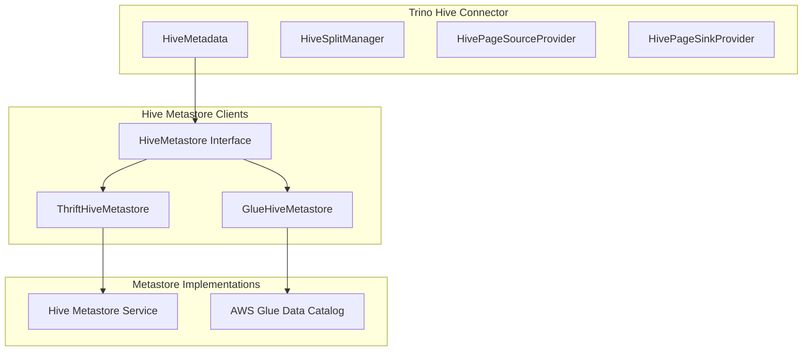
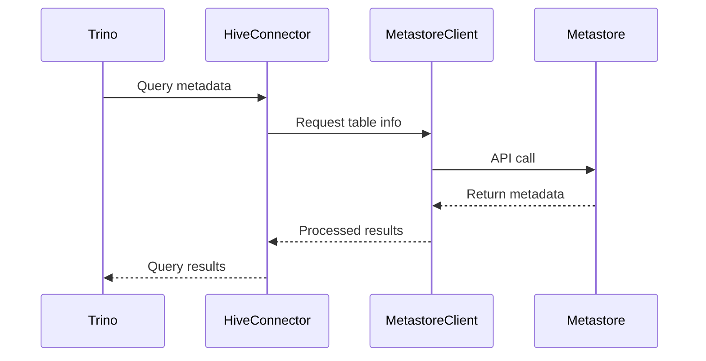

# Hive Metastore Clients Module

## Overview

The Hive Metastore Clients module provides Trino with the ability to interact with different Hive metastore implementations. This module serves as an abstraction layer that allows Trino to access metadata from various Hive-compatible metastores, including traditional Thrift-based Hive metastores and AWS Glue Data Catalog.

## Purpose

The primary purpose of this module is to:
- Provide unified access to Hive metadata across different metastore implementations
- Handle metadata operations such as table creation, partition management, and statistics
- Support both on-premises Hive deployments and cloud-based metastore services
- Enable seamless integration with the broader Trino ecosystem

## Architecture

## Core Components

### 1. ThriftHiveMetastore
The `ThriftHiveMetastore` class provides connectivity to traditional Hive Metastore services using the Thrift protocol. For detailed information about this implementation, see [Thrift Metastore Client](Thrift Metastore Client.md).

Key capabilities:
- **Database Management**: Create, drop, and alter databases
- **Table Operations**: Create, drop, alter tables with full metadata support
- **Partition Management**: Add, drop, and alter partitions with statistics
- **Transaction Support**: ACID transaction management for Hive tables
- **Security**: Role-based access control and privilege management
- **Statistics**: Table and partition-level column statistics

### 2. GlueHiveMetastore
The `GlueHiveMetastore` class provides integration with AWS Glue Data Catalog. For detailed information about this implementation, see [Glue Metastore Client](Glue Metastore Client.md).

Key capabilities:
- **Cloud-Native Integration**: Direct API calls to AWS Glue service
- **Partition Segmentation**: Efficient handling of large partition sets
- **Batch Operations**: Optimized batch processing for partitions and statistics
- **Function Support**: User-defined function management
- **Caching**: Built-in caching layer for improved performance

## Data Flow

## Integration with Trino

The Hive Metastore Clients module integrates with several other Trino components:

- **[Hive Connector](Hive Connector.md)**: Primary consumer of metastore services
- **[Trino SPI](Trino SPI.md)**: Provides the foundational interfaces and types
- **[Filesystem Abstraction Layer](Filesystem Abstraction Layer.md)**: Handles file operations for table data
- **[Plugin Toolkit](Plugin Toolkit.md)**: Offers utility classes and security frameworks

## Configuration

Both metastore implementations support extensive configuration options:

### ThriftHiveMetastore Configuration
- Connection settings (host, port, timeout)
- Retry policies (max retries, backoff parameters)
- Security settings (authentication, SSL)
- Performance tuning (batch sizes, caching)

### GlueHiveMetastore Configuration
- AWS credentials and region settings
- Thread pool configuration for parallel operations
- Cache settings for metadata and statistics
- Table visibility filters for multi-engine environments

## Error Handling

The module implements comprehensive error handling:
- **Retry Logic**: Automatic retry for transient failures
- **Exception Mapping**: Conversion of metastore-specific errors to Trino exceptions
- **Graceful Degradation**: Continued operation when non-critical features fail
- **Detailed Logging**: Comprehensive logging for debugging and monitoring

## Performance Considerations

- **Caching**: Both implementations support caching of frequently accessed metadata
- **Batching**: Operations are batched where possible to reduce network overhead
- **Parallel Processing**: Glue implementation uses parallel execution for large operations
- **Connection Pooling**: Thrift implementation maintains connection pools for efficiency

## Security

- **Authentication**: Support for various authentication mechanisms
- **Authorization**: Integration with Trino's access control system
- **Encryption**: Support for encrypted connections to metastore services
- **Audit Logging**: Comprehensive audit trails for metadata operations

## Monitoring and Observability

Both implementations provide:
- **Metrics**: Detailed performance and usage statistics
- **Health Checks**: Monitoring of metastore connectivity
- **Logging**: Structured logging for troubleshooting
- **JMX Integration**: Expose metrics for monitoring systems

## Future Enhancements

Potential areas for future development:
- Additional metastore implementations (e.g., Azure Data Catalog)
- Enhanced caching strategies
- Improved parallel processing capabilities
- Better integration with cloud-native services