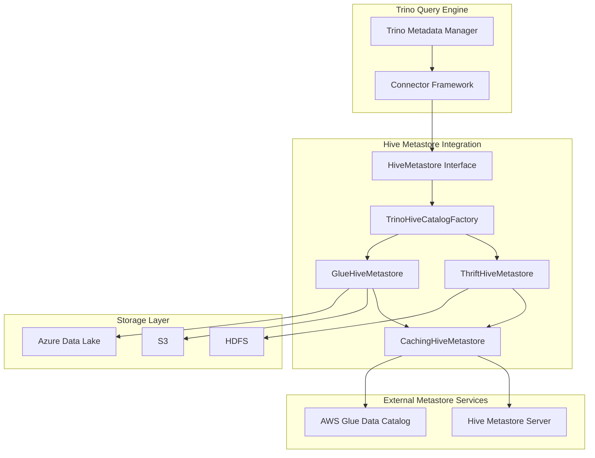
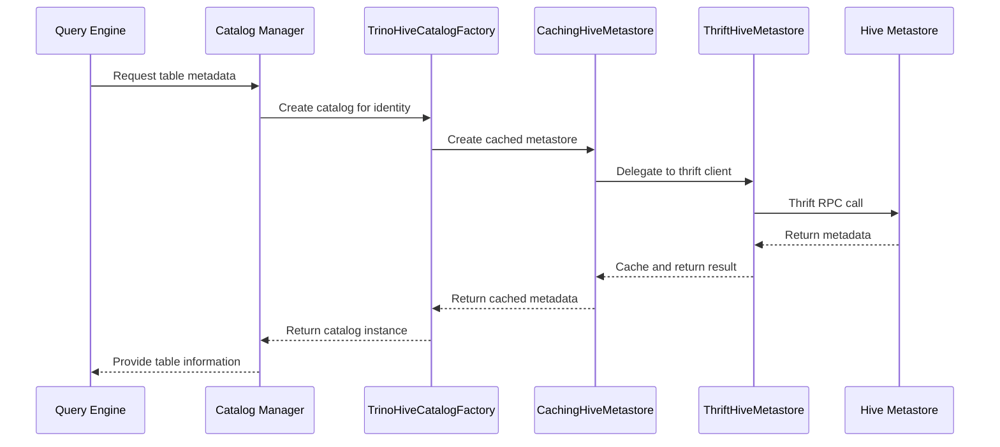
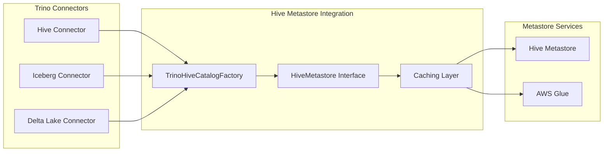
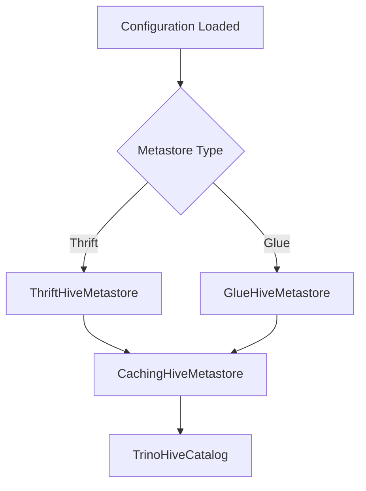

# Hive Metastore Integration Module

## Introduction

The Hive Metastore Integration module provides Trino with the ability to interact with Hive Metastore services, enabling seamless access to Hive-managed datasets and metadata. This integration serves as a critical bridge between Trino's query engine and the Hive ecosystem, supporting both traditional Hive tables and modern table formats like Iceberg that leverage Hive Metastore for metadata management.

The module implements multiple metastore client implementations, including Thrift-based Hive Metastore and AWS Glue Data Catalog, providing flexibility for different deployment environments and cloud platforms.

## Architecture Overview

The Hive Metastore Integration follows a layered architecture that abstracts the underlying metastore implementation while providing consistent metadata operations across different storage systems.



## Core Components

### HiveMetastore Interface
The central abstraction that defines the contract for all metastore operations. This interface provides methods for database, table, partition, and statistics management, ensuring consistent behavior across different metastore implementations.

### TrinoHiveCatalogFactory
A factory class responsible for creating Hive catalog instances with appropriate metastore clients. It handles configuration, caching setup, and dependency injection for different metastore types.

### ThriftHiveMetastore
Implementation of the HiveMetastore interface that communicates with traditional Hive Metastore servers using the Thrift protocol. This implementation provides comprehensive support for all Hive features including ACID transactions, statistics, and privilege management.

### GlueHiveMetastore
AWS-specific implementation that interfaces with the AWS Glue Data Catalog service. This implementation is optimized for cloud deployments and provides seamless integration with AWS services while maintaining compatibility with the Hive Metastore API.

### CachingHiveMetastore
A wrapper implementation that adds caching capabilities to any underlying metastore client, significantly improving performance by reducing redundant metadata fetch operations.

## Data Flow Architecture



## Key Features

### Multi-Metastore Support
The integration supports multiple metastore backends, allowing organizations to choose the most appropriate metadata service for their infrastructure:

- **Traditional Hive Metastore**: Full-featured support for on-premises deployments
- **AWS Glue Data Catalog**: Cloud-native metadata management with automatic scaling
- **Caching Layer**: Performance optimization across all metastore types

### Comprehensive Metadata Operations
The module provides complete support for Hive metadata operations including:

- Database lifecycle management (create, drop, rename)
- Table operations with full schema evolution support
- Partition management for large datasets
- Column statistics for query optimization
- Privilege and role management for security
- Function management for user-defined functions

### Transaction Support
Advanced support for ACID transactions in Hive tables, including:

- Transaction lifecycle management
- Lock acquisition and release
- Write ID allocation
- Dynamic partition management

### Statistics Management
Comprehensive statistics support for query optimization:

- Table-level statistics (row count, file size)
- Column-level statistics (min/max, null count, distinct values)
- Partition statistics for partitioned tables
- Automatic statistics updates during data modifications

## Integration with Trino Ecosystem

### Connector Framework Integration
The Hive Metastore Integration seamlessly integrates with Trino's connector framework, providing metadata services to various connectors:



### File System Abstraction
The integration works with Trino's file system abstraction layer to support multiple storage backends:

- **HDFS**: Traditional Hadoop Distributed File System
- **S3**: Amazon Simple Storage Service
- **Azure Data Lake**: Microsoft Azure storage
- **Google Cloud Storage**: GCP object storage
- **Local File System**: Development and testing environments

## Configuration and Deployment

### Metastore Client Selection
The appropriate metastore client is selected based on configuration parameters:



### Security Integration
The module integrates with Trino's security framework to provide:

- Authentication through connector identity
- Authorization via metastore privilege checks
- Role-based access control
- Table and column-level security

## Performance Optimizations

### Metadata Caching
Multi-level caching strategy reduces metastore load and improves query performance:

- **Database cache**: List of databases per catalog
- **Table cache**: Table metadata with TTL-based expiration
- **Partition cache**: Partition lists and metadata
- **Statistics cache**: Column and table statistics

### Parallel Operations
The integration supports parallel metadata operations for improved performance:

- Batch partition operations
- Concurrent statistics updates
- Parallel table listing
- Multi-threaded metadata fetching

### Connection Pooling
Efficient connection management for metastore clients:

- Reusable client connections
- Connection timeout handling
- Retry logic with exponential backoff
- Circuit breaker pattern for fault tolerance

## Error Handling and Resilience

### Retry Mechanisms
Comprehensive retry logic handles transient failures:

- Exponential backoff for network errors
- Configurable retry limits
- Timeout management
- Graceful degradation

### Consistency Guarantees
The integration maintains consistency through:

- Transactional metadata updates
- Cache invalidation on modifications
- Version-based conflict detection
- Atomic operations where supported

## Monitoring and Observability

### Metrics Collection
Comprehensive metrics for monitoring metastore operations:

- Operation latency and throughput
- Cache hit rates and effectiveness
- Error rates and types
- Connection pool utilization

### Logging and Debugging
Detailed logging for troubleshooting:

- Request/response logging for debugging
- Performance metrics for optimization
- Error context for quick resolution
- Audit trail for security compliance

## Usage Patterns

### Basic Table Operations
```sql
-- Create table with Hive metastore
CREATE TABLE hive.default.customers (
    id BIGINT,
    name VARCHAR,
    email VARCHAR
)
WITH (
    format = 'ORC',
    partitioned_by = ARRAY['country']
);

-- Query table metadata
DESCRIBE hive.default.customers;
```

### Partition Management
```sql
-- Add partitions
ALTER TABLE hive.default.customers 
ADD PARTITION (country = 'US');

-- Query partition information
SHOW PARTITIONS hive.default.customers;
```

### Statistics Management
```sql
-- Update table statistics
ANALYZE hive.default.customers;

-- View statistics
SHOW STATS FOR hive.default.customers;
```

## Integration with Modern Table Formats

The Hive Metastore Integration serves as the metadata backbone for modern table formats:

### Iceberg Integration
Iceberg tables use Hive Metastore for metadata storage while providing additional capabilities like:
- Snapshot isolation
- Schema evolution
- Partition evolution
- Time travel queries

### Delta Lake Support
Delta Lake tables leverage Hive Metastore for:
- Transaction log metadata
- Table versioning information
- Partition metadata
- Statistics storage

## Best Practices

### Performance Optimization
- Enable caching for frequently accessed metadata
- Configure appropriate cache sizes based on dataset scale
- Use parallel metadata operations for large tables
- Implement connection pooling for high-throughput scenarios

### Security Configuration
- Configure proper authentication for metastore access
- Implement role-based access control
- Enable audit logging for compliance
- Use encrypted connections for sensitive data

### Operational Excellence
- Monitor metastore health and performance
- Implement proper backup strategies
- Plan for metastore scaling and capacity
- Establish clear upgrade procedures

## Future Enhancements

The Hive Metastore Integration continues to evolve with planned improvements:

- Enhanced caching strategies with machine learning
- Support for additional cloud metadata services
- Improved performance through asynchronous operations
- Extended support for modern table formats
- Enhanced security features and compliance capabilities

## Related Documentation

- [Iceberg Connector](Iceberg Connector.md) - Modern table format using Hive Metastore
- [Hive Connector](Hive Connector.md) - Traditional Hive table support
- [Delta Lake Connector](Delta Lake Connector.md) - Delta Lake table format integration
- [Metadata & Connector Abstraction](Metadata & Connector Abstraction.md) - Core metadata management framework
- [Filesystem Abstraction Layer](Filesystem Abstraction Layer.md) - Storage backend support
- [Plugin Toolkit](Plugin Toolkit.md) - Development utilities for connectors

This integration represents a critical component of Trino's ecosystem, enabling seamless access to Hive-managed data while providing the performance and reliability required for modern analytical workloads.