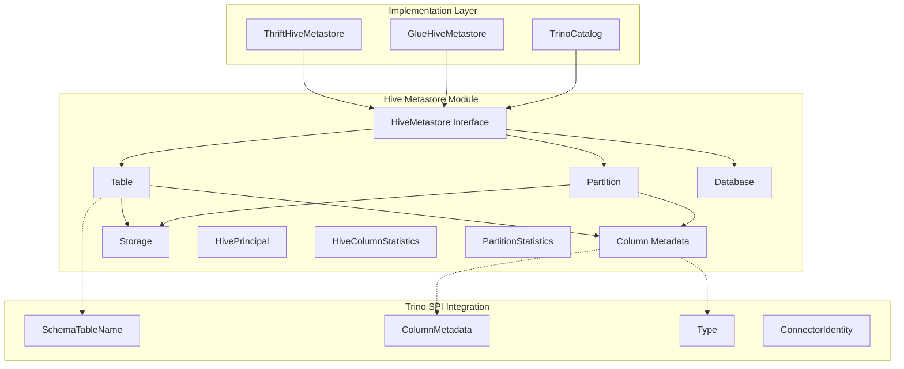
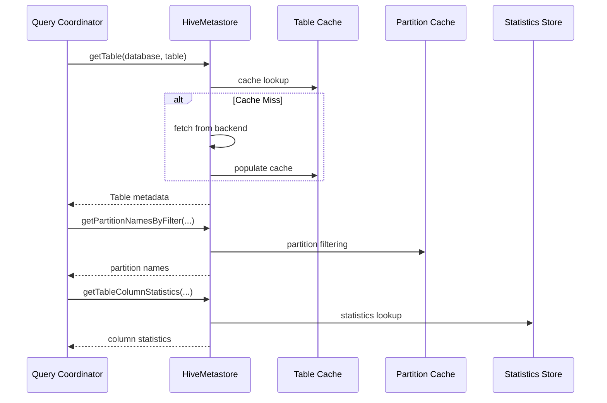
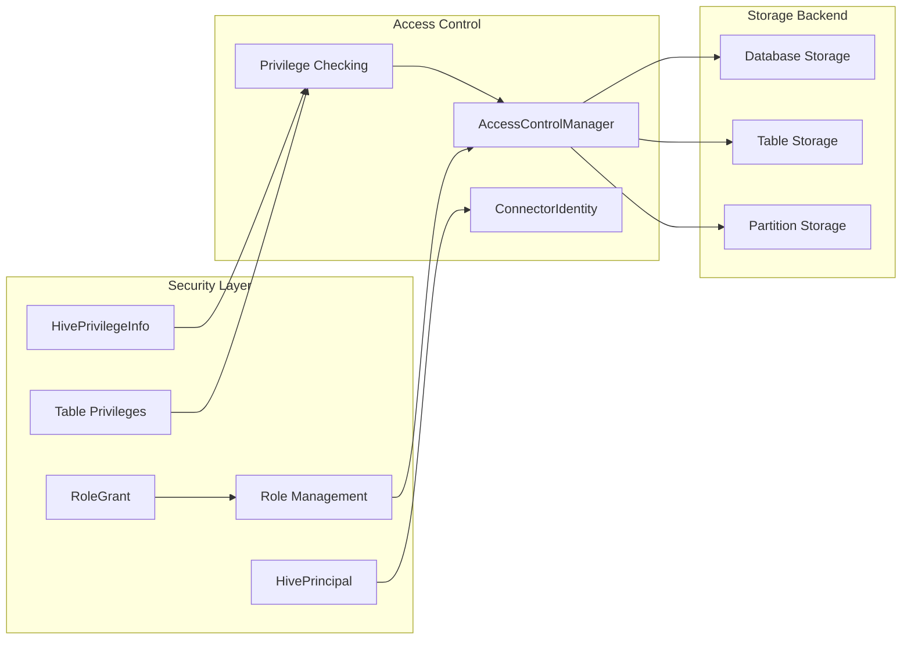

# Hive Metastore Module

## Introduction

The Hive Metastore module provides a unified abstraction layer for interacting with Hive-compatible metadata stores. It serves as the central metadata management component for Trino's Hive connector and other data lake connectors that rely on Hive-style metadata storage. This module defines the core interfaces and data structures for managing databases, tables, partitions, and associated metadata in a Hive-compatible format.

## Architecture Overview

The Hive Metastore module is built around a clean interface-based architecture that abstracts the underlying metadata storage implementation. It provides both synchronous and transactional operations for metadata management while maintaining compatibility with various Hive metastore implementations.

## Core Components

### HiveMetastore Interface

The `HiveMetastore` interface is the primary contract for all metadata operations. It provides a comprehensive set of methods for managing databases, tables, partitions, privileges, and functions. The interface supports both traditional metadata operations and advanced features like ACID transactions, role-based access control, and function management.

Key capabilities include:
- **Database Management**: Create, drop, rename databases with location and owner information
- **Table Operations**: Full CRUD operations for tables including schema evolution, ownership, and commenting
- **Partition Management**: Dynamic partition discovery, filtering, and bulk operations
- **Statistics Management**: Table and partition-level column statistics for query optimization
- **Security Framework**: Role-based access control, privilege management, and principal handling
- **Transaction Support**: ACID transaction lifecycle management for transactional tables
- **Function Management**: User-defined function storage and retrieval

### Table Entity

The `Table` class represents a comprehensive table metadata structure that encapsulates all aspects of a Hive table definition. It includes storage information, column definitions, partitioning schemes, view definitions, and table parameters. The class provides immutable operations for schema evolution, supporting column addition, removal, renaming, and commenting.

Table features include:
- **Storage Abstraction**: Flexible storage format support with location, format, and serialization information
- **Column Management**: Separate handling of data and partition columns with type information
- **View Support**: Original and expanded view text for logical table definitions
- **Parameter Storage**: Extensible key-value metadata storage for table properties
- **Schema Evolution**: Immutable builder pattern for safe table modifications
- **Write ID Tracking**: Support for ACID table write identification

### Partition Entity

The `Partition` class represents individual partition metadata within partitioned tables. It maintains partition values, storage information, column schemas, and partition-specific parameters. The design supports both static and dynamic partitioning schemes with efficient bulk operations.

Partition capabilities include:
- **Value-based Partitioning**: Multi-column partition key support with string value representation
- **Storage Flexibility**: Per-partition storage format and location customization
- **Column Schema**: Partition-specific column definitions for schema evolution scenarios
- **Parameter Storage**: Partition-level metadata for optimization hints and properties
- **Bulk Operations**: Efficient batch processing for partition creation and modification

### Database Entity

The `Database` class represents the top-level namespace container for tables and functions. It manages database-level properties including location, ownership, comments, and configuration parameters. The design supports both file-based and cloud-native database implementations.

Database features include:
- **Location Management**: Optional filesystem location for database storage
- **Ownership Model**: Principal-based ownership with type and name information
- **Comment Support**: Descriptive metadata for database documentation
- **Parameter Storage**: Database-level configuration and properties
- **Default Handling**: Special handling for the default database namespace

## Data Flow Architecture

## Integration with Trino Ecosystem

### Connector Framework Integration

The Hive Metastore module integrates seamlessly with Trino's [Connector Framework](Connector Framework.md) through the metadata abstraction layer. Connectors implement the `HiveMetastore` interface to provide their specific metadata storage backend while maintaining consistent behavior across different storage systems.

Integration points include:
- **Metadata Translation**: Conversion between Hive metadata format and Trino SPI representations
- **Type Mapping**: Hive type system integration with Trino's [Type System](Type System.md)
- **Security Integration**: Principal and privilege mapping to Trino's [Security Framework](Security Framework.md)
- **Statistics Integration**: Hive statistics translation for Trino's [Cost and Statistics Framework](Cost and Statistics.md)

### Query Planning Integration

The metastore provides critical metadata for query planning and optimization. Statistics information flows into the [SQL Analyzer, Planner & Optimizer](SQL Analyzer, Planner & Optimizer.md) for cost-based optimization decisions. Partition metadata enables partition pruning and dynamic filtering optimizations.

### Execution Engine Integration

During query execution, the metastore provides runtime metadata for split generation and data access. The [Query Execution Engine](Query Execution Engine.md) uses table and partition storage information to create appropriate data source implementations.

## Implementation Variants

### ThriftHiveMetastore

The traditional Hive metastore implementation using Apache Thrift protocol for communication with Hive Metastore services. This implementation provides full compatibility with existing Hive deployments and supports all advanced features including ACID transactions and security integration.

### GlueHiveMetastore

AWS Glue Data Catalog integration that provides serverless metadata management. This implementation offers cloud-native scalability and integration with AWS analytics services while maintaining Hive compatibility.

### Custom Implementations

The interface design supports custom metastore implementations for specialized environments. Examples include file-based metadata stores, database-backed implementations, and cloud-native metadata services.

## Security Architecture

## Transaction Support

The module provides comprehensive ACID transaction support for transactional tables through the Hive Metastore interface. Transaction management includes lifecycle operations, lock management, and write ID allocation for consistent data modifications.

Transaction features include:
- **Transaction Lifecycle**: Open, commit, and abort operations with proper isolation
- **Lock Management**: Shared read locks and exclusive write locks for concurrency control
- **Write ID Management**: Unique write identification for snapshot isolation
- **Heartbeat Mechanism**: Active transaction monitoring and timeout handling
- **Dynamic Partition Support**: Transaction-safe partition creation and modification

## Performance Optimizations

### Caching Strategy

The metastore implementation employs multi-level caching for optimal performance. Table and partition metadata are cached with invalidation strategies based on modification timestamps and event notifications.

### Batch Operations

Bulk metadata operations are optimized for efficiency. Partition creation, statistics updates, and privilege modifications support batch processing to minimize network overhead and backend storage operations.

### Filtering and Projection

Partition filtering uses predicate pushdown to minimize metadata transfer. Column statistics retrieval supports projection to fetch only required statistics for query optimization.

## Error Handling and Recovery

The module implements comprehensive error handling for metadata operations with specific exception types for different failure scenarios. Recovery mechanisms include retry logic for transient failures and graceful degradation for unavailable features.

Error handling includes:
- **Validation Errors**: Schema validation and constraint checking with detailed error messages
- **Concurrency Errors**: Optimistic locking and conflict resolution for concurrent modifications
- **Network Errors**: Retry logic and circuit breaker patterns for network failures
- **Storage Errors**: Backend-specific error translation and recovery strategies

## Monitoring and Observability

The metastore operations are instrumented with comprehensive metrics for monitoring and troubleshooting. Performance metrics include operation latency, cache hit rates, and error frequencies. Audit logging provides detailed operation tracking for security and compliance requirements.

Monitoring capabilities include:
- **Operation Metrics**: Latency and throughput tracking for all metastore operations
- **Cache Statistics**: Hit rates, miss rates, and eviction patterns for metadata caching
- **Error Tracking**: Error rate monitoring with categorization by error type
- **Resource Utilization**: Backend storage and network resource usage tracking

## Future Enhancements

The Hive Metastore module continues to evolve with support for emerging data lake formats and cloud-native metadata services. Planned enhancements include improved transaction performance, enhanced security integration, and support for metadata federation across multiple storage systems.