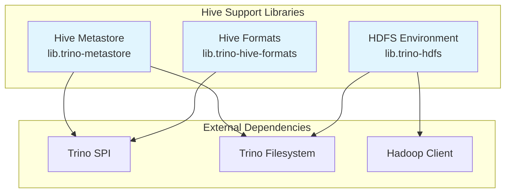
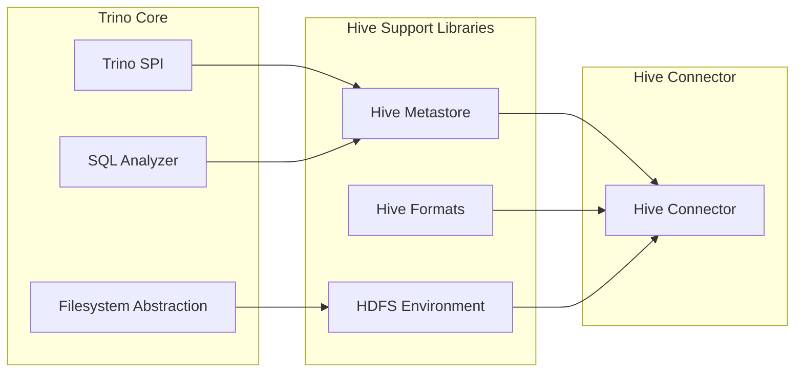

# Hive Support Libraries

## Overview

The Hive Support Libraries module provides essential components for integrating Trino with Apache Hive data warehouses. This module serves as the foundation for Hive connector functionality, offering metastore interaction capabilities, specialized file format support, and HDFS environment management. It enables Trino to query and manage Hive tables while maintaining compatibility with the Hive ecosystem.

## Architecture

The Hive Support Libraries module consists of three primary sub-modules that work together to provide comprehensive Hive integration:



## Sub-modules

### 1. Hive Metastore (lib.trino-metastore)

The Hive Metastore component provides a unified interface for interacting with Hive metadata repositories. It abstracts the complexity of different metastore implementations and offers a consistent API for table, partition, and database operations.

**Key Features:**
- Unified metastore interface supporting multiple backends
- Comprehensive metadata operations (tables, partitions, databases)
- Security and privilege management
- Transaction support for ACID operations
- Function management capabilities

**Core Components:**
- `HiveMetastore` - Main interface for metastore operations
- `Table` - Immutable table metadata representation
- `Partition` - Partition metadata with builder pattern
- `Database` - Database metadata management

For detailed documentation, see [Hive Metastore](Hive Metastore.md)

### 2. Hive Formats (lib.trino-hive-formats)

The Hive Formats component provides specialized readers and writers for Hive-specific file formats, including RCFile and custom column encodings. This ensures Trino can efficiently read and write data in formats commonly used by Hive tables.

**Key Features:**
- RCFile format support with optimized reading
- Column encoding framework for custom data types
- Compression support for reduced storage footprint
- Validation mechanisms for data integrity

**Core Components:**
- `ColumnEncoding` - Interface for column-specific encoding/decoding
- `RcFileReader` - Efficient RCFile format reader with column selection

For detailed documentation, see [Hive Formats](Hive Formats.md)

### 3. HDFS Environment (lib.trino-hdfs)

The HDFS Environment component provides a secure and configurable interface to Hadoop Distributed File System (HDFS) and compatible storage systems. It handles authentication, configuration management, and provides seamless integration with various storage backends.

**Key Features:**
- Multi-user authentication and authorization
- Configuration management for different HDFS setups
- Support for various storage systems (HDFS, GCS, etc.)
- Security integration with Trino's authentication framework
- File system lifecycle management

**Core Components:**
- `HdfsEnvironment` - Main environment interface for HDFS operations

For detailed documentation, see [HDFS Environment](HDFS Environment.md)

## Integration with Trino Ecosystem

The Hive Support Libraries integrate seamlessly with other Trino modules:



## Usage Patterns

### Metastore Operations
The Hive Metastore interface provides a consistent way to perform CRUD operations on Hive metadata:

```java
// Example: Creating a table through metastore
HiveMetastore metastore = // obtain metastore instance
Table table = Table.builder()
    .setDatabaseName("mydb")
    .setTableName("mytable")
    .setDataColumns(columns)
    .setStorage(storage)
    .build();

metastore.createTable(table, principalPrivileges);
```

### File Format Handling
The Hive Formats library enables reading Hive-specific file formats:

```java
// Example: Reading RCFile format
RcFileReader reader = new RcFileReader(
    inputFile,
    encodingFactory,
    readColumns,
    offset,
    length
);

while (reader.advance() >= 0) {
    Block block = reader.readBlock(columnIndex);
    // Process the block
}
```

### HDFS Operations
The HDFS Environment provides secure file system access:

```java
// Example: Accessing HDFS with proper authentication
HdfsEnvironment hdfsEnv = // obtain environment
FileSystem fs = hdfsEnv.getFileSystem(context, path);
// Perform file operations with proper security context
```

## Security Considerations

The Hive Support Libraries implement several security measures:

1. **Authentication**: HDFS Environment supports multiple authentication mechanisms
2. **Authorization**: Metastore operations respect Hive's privilege model
3. **Data Integrity**: File format readers include validation mechanisms
4. **Secure Configuration**: Sensitive configuration is properly isolated

## Performance Optimizations

The module includes several performance optimizations:

- **Lazy Loading**: Metadata objects are loaded on-demand
- **Caching**: Strategic caching of frequently accessed metadata
- **Column Pruning**: File format readers support reading only required columns
- **Batch Operations**: Bulk operations for better throughput

## Error Handling

The Hive Support Libraries provide comprehensive error handling:

- **File Corruption Detection**: Built-in validation for file formats
- **Metastore Connectivity**: Graceful handling of metastore unavailability
- **Authentication Failures**: Clear error messages for security issues
- **Data Type Mismatches**: Proper handling of schema evolution scenarios

## Future Enhancements

Potential areas for future development include:

- Additional file format support (ORC, Parquet optimizations)
- Enhanced caching strategies for metadata
- Improved transaction support
- Better integration with cloud storage systems
- Performance optimizations for large-scale deployments