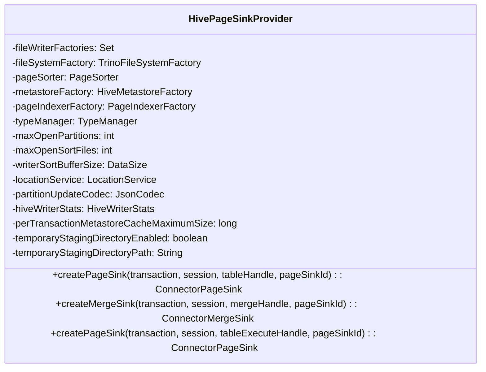
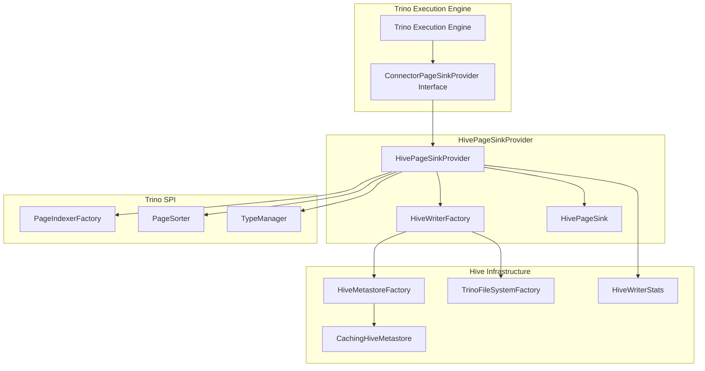
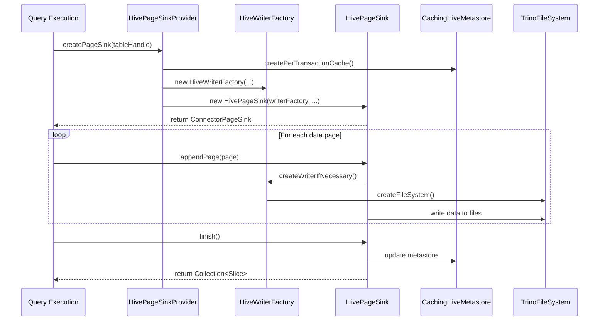

# HivePageSinkProvider Module Documentation

## Overview

The `HivePageSinkProvider` is a critical component of the Trino Hive connector that manages the creation of page sinks for writing data to Hive tables. It implements the `ConnectorPageSinkProvider` interface from the Trino SPI, providing the bridge between Trino's execution engine and Hive's storage layer for data modification operations.

## Purpose and Core Functionality

The primary purpose of `HivePageSinkProvider` is to:

1. **Create Page Sinks**: Instantiate appropriate page sinks for different Hive write operations (CREATE TABLE, INSERT, MERGE, table execution)
2. **Manage Write Operations**: Coordinate the writing of data pages to Hive tables with proper partitioning, bucketing, and sorting
3. **Handle Transaction Integration**: Ensure proper transaction handling for ACID operations in Hive
4. **Provide Metadata Access**: Integrate with Hive metastore for table metadata and partition information
5. **Optimize Write Performance**: Manage writer resources including partition limits, sort buffers, and file handles

## Architecture

### Component Structure



### Integration Architecture



## Data Flow

### Write Operation Flow



## Key Dependencies

### Direct Dependencies

1. **Trino SPI Components**:
   - `ConnectorPageSinkProvider`: Interface implementation
   - `PageIndexerFactory`: For column indexing operations
   - `PageSorter`: For sorting data during writes
   - `TypeManager`: For type system integration
   - `ConnectorSession`: Session context
   - `ConnectorTransactionHandle`: Transaction management

2. **Hive Connector Components**:
   - `HiveFileWriterFactory`: Factory for creating file writers
   - `HiveMetastoreFactory`: Hive metastore access
   - `HivePageSinkMetadataProvider`: Metadata provider for page sinks
   - `HiveWriterStats`: Performance statistics
   - `LocationService`: HDFS location management

3. **File System Integration**:
   - `TrinoFileSystemFactory`: Abstraction over various file systems (HDFS, S3, etc.)

4. **Configuration**:
   - `HiveConfig`: General Hive connector configuration
   - `SortingFileWriterConfig`: Sort-specific configuration

### Related Modules

- [HiveConnector](HiveConnector.md): Main Hive connector module
- [HiveMetadata](HiveMetadata.md): Metadata management
- [HiveSplitManager](HiveSplitManager.md): Read operations
- [TrinoFileSystem](TrinoFileSystem.md): File system abstraction
- [HiveMetastore](HiveMetastore.md): Metastore integration

## Configuration Parameters

| Parameter | Type | Description |
|-----------|------|-------------|
| `maxOpenPartitions` | int | Maximum number of open partitions per writer |
| `maxOpenSortFiles` | int | Maximum number of open sort files |
| `writerSortBufferSize` | DataSize | Buffer size for sorting operations |
| `perTransactionMetastoreCacheMaximumSize` | long | Maximum cache size per transaction |
| `temporaryStagingDirectoryEnabled` | boolean | Enable temporary staging directory |
| `temporaryStagingDirectoryPath` | String | Path for temporary staging directory |

## Supported Operations

### 1. CREATE TABLE Operations
```java
// Creates page sink for new table creation
ConnectorPageSink createPageSink(transaction, session, outputTableHandle, pageSinkId)
```

### 2. INSERT Operations
```java
// Creates page sink for data insertion
ConnectorPageSink createPageSink(transaction, session, insertTableHandle, pageSinkId)
```

### 3. MERGE Operations
```java
// Creates merge sink for ACID merge operations
ConnectorMergeSink createMergeSink(transaction, session, mergeHandle, pageSinkId)
```

### 4. Table Execution Operations
```java
// Creates page sink for table execution operations
ConnectorPageSink createPageSink(transaction, session, tableExecuteHandle, pageSinkId)
```

## Performance Considerations

### Resource Management
- **Partition Limits**: Controls maximum open partitions to prevent memory exhaustion
- **Sort File Management**: Limits concurrent sort files for efficient memory usage
- **Buffer Sizing**: Configurable sort buffer size for optimal performance

### Caching Strategy
- **Metastore Caching**: Per-transaction caching of Hive metastore to reduce RPC calls
- **Cache Size Limits**: Configurable maximum cache size per transaction

### Writer Optimization
- **File Writer Factories**: Pluggable file writer factories for different file formats
- **Staging Directory**: Optional temporary staging for improved write performance
- **Statistics Collection**: Built-in writer statistics for performance monitoring

## Error Handling

The `HivePageSinkProvider` handles various error scenarios:

1. **Invalid Handle Types**: Validates table handle types before casting
2. **Resource Exhaustion**: Manages partition and file handle limits
3. **Transaction Validation**: Ensures proper transaction state for operations
4. **Configuration Validation**: Validates configuration parameters during initialization

## Thread Safety

- **Immutable Dependencies**: All injected dependencies are immutable after construction
- **Thread-Local State**: Uses thread-local state where necessary
- **Concurrent Access**: Designed for concurrent query execution

## Monitoring and Observability

### Metrics Collection
- **Writer Statistics**: `HiveWriterStats` collects detailed performance metrics
- **Cache Performance**: Metastore cache hit/miss ratios
- **Resource Usage**: Partition and file handle utilization

### Logging
- **Operation Logging**: Logs major operations and configuration
- **Error Logging**: Detailed error information for troubleshooting
- **Performance Logging**: Key performance metrics

## Future Enhancements

Potential areas for improvement:

1. **Dynamic Configuration**: Runtime configuration updates
2. **Advanced Caching**: More sophisticated caching strategies
3. **Format Optimization**: Enhanced support for new file formats
4. **Memory Management**: Improved memory usage patterns
5. **Parallel Writing**: Enhanced parallel write capabilities

## References

- [Trino SPI Documentation](TrinoSPI.md)
- [Hive Connector Architecture](HiveConnector.md)
- [File System Abstraction](TrinoFileSystem.md)
- [Hive Metastore Integration](HiveMetastore.md)
- [Query Execution Engine](QueryExecutionEngine.md)