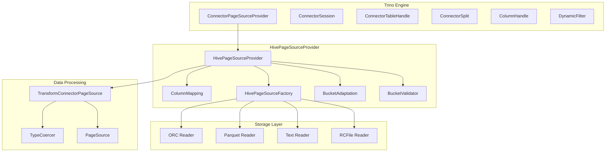
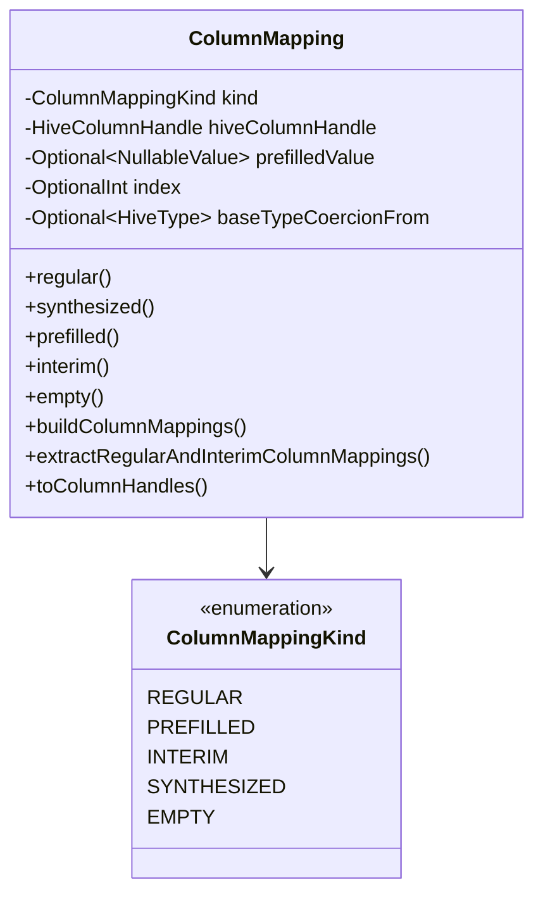
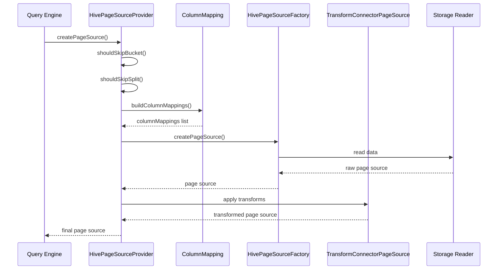
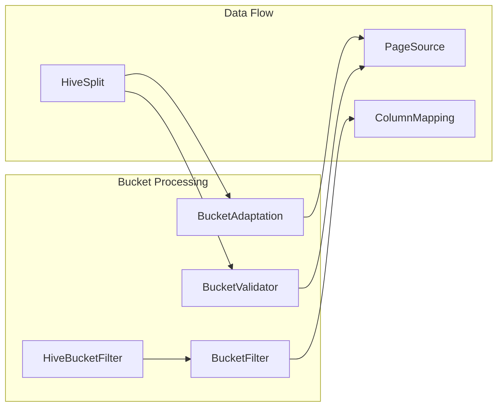
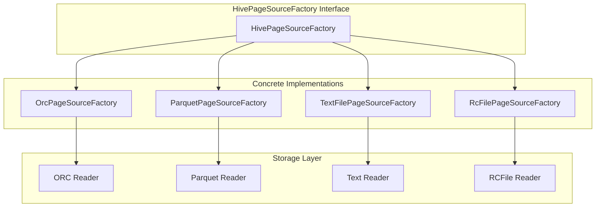

# HivePageSourceProvider Module Documentation

## Introduction

The HivePageSourceProvider is a critical component of the Trino Hive connector that bridges the gap between Hive's storage formats and Trino's columnar data processing engine. It implements the `ConnectorPageSourceProvider` interface to create page sources that read data from Hive tables, handling complex scenarios like partition pruning, column projection, type coercion, and bucket filtering.

This module serves as the primary entry point for reading Hive data in Trino, orchestrating various data transformation operations and ensuring efficient data access patterns across different storage formats and Hive configurations.

## Architecture Overview

The HivePageSourceProvider operates as a central coordinator in the Hive connector's data reading pipeline, managing the interaction between multiple subsystems:



## Core Components

### HivePageSourceProvider Class

The main class that implements `ConnectorPageSourceProvider` and orchestrates the creation of page sources for Hive data reading operations.

**Key Responsibilities:**
- Dynamic partition pruning based on runtime filters
- Column mapping and projection optimization
- Type coercion handling for schema evolution
- Bucket filtering and validation
- Integration with multiple storage format readers

### ColumnMapping System

The `ColumnMapping` class is a sophisticated data structure that manages the relationship between logical columns requested by queries and physical columns in storage.



**Column Mapping Types:**

- **REGULAR**: Standard columns that exist in the underlying file
- **PREFILLED**: Partition columns or synthesized values filled from metadata
- **INTERIM**: Temporary columns needed for processing but not in final output
- **SYNTHESIZED**: Special columns like row IDs generated during reading
- **EMPTY**: Columns that cannot be read due to type coercion issues

## Data Flow Architecture



## Key Functional Areas

### 1. Dynamic Partition Pruning

The provider implements sophisticated partition pruning mechanisms:

```java
private static boolean shouldSkipSplit(List<ColumnMapping> columnMappings, DynamicFilter dynamicFilter)
```

This method evaluates runtime filters against partition values to skip entire splits that don't match the filter criteria, significantly improving query performance.

### 2. Column Projection and Dereference

The system handles complex column projections including nested field dereferences:

```java
public static ConnectorPageSource projectColumnDereferences(List<HiveColumnHandle> columns, 
                                                           Function<List<HiveColumnHandle>, ConnectorPageSource> pageSourceFactory)
```

This utility enables reading only the necessary base columns and projecting complex nested structures, optimizing I/O operations.

### 3. Type Coercion and Schema Evolution

The provider supports reading data with different schemas through type coercion:

```java
Optional<TypeCoercer<? extends Type, ? extends Type>> coercer = createCoercer(typeManager, 
                                                                               fromType, 
                                                                               toType, 
                                                                               coercionContext);
```

This feature allows reading Hive tables where the file schema differs from the table schema, supporting schema evolution scenarios.

### 4. Bucket Processing

The system includes comprehensive bucket support:

- **Bucket Adaptation**: Converts between different bucket formats
- **Bucket Validation**: Ensures data integrity in bucketed tables
- **Bucket Filtering**: Skips irrelevant buckets based on query predicates



## Integration with Storage Formats

The HivePageSourceProvider works with multiple storage format factories:

### Supported Formats
- **ORC**: Optimized Row Columnar format
- **Parquet**: Columnar storage format
- **Text**: Delimited text files
- **RCFile**: Record Columnar File format
- **SequenceFile**: Hadoop sequence files

### Factory Pattern Implementation



## Performance Optimizations

### 1. Domain Compaction

The provider uses domain compaction to optimize predicate pushdown:

```java
hiveTable.getCompactEffectivePredicate().intersect(dynamicFilter.getCurrentPredicate())
    .simplify(domainCompactionThreshold)
```

This reduces the complexity of filter expressions while maintaining filtering effectiveness.

### 2. Column Pruning

Only necessary columns are read from storage, with sophisticated projection handling for nested structures.

### 3. Early Filtering

Multiple levels of filtering occur before data reading:
- Bucket-level filtering
- Partition-level filtering  
- Split-level filtering
- Page-level filtering

## Error Handling and Validation

### Unsupported Format Detection

The provider includes comprehensive format validation:

```java
throw new TrinoException(HIVE_UNSUPPORTED_FORMAT, 
    "Unsupported input format: serde=%s, format=%s, partition=%s, path=%s"
    .formatted(serde, format, partition, path));
```

### Bucket Validation

Ensures data integrity in bucketed tables by validating that rows belong to their designated buckets.

## Dependencies and Integration

### Internal Dependencies

- **HiveConnector**: Main connector integration point
- **HiveSplitManager**: Provides split information
- **HiveMetadata**: Supplies table metadata
- **TypeCoercer**: Handles type conversions
- **TransformConnectorPageSource**: Applies column transformations

### External Dependencies

- **Trino SPI**: Core interfaces and types
- **Hive Metastore**: Table and partition metadata
- **File System Abstraction**: Unified file system access
- **Storage Format Libraries**: ORC, Parquet, and other format readers

## Configuration and Tuning

### Key Configuration Parameters

- **Domain Compaction Threshold**: Controls predicate simplification
- **Type Manager**: Handles type resolution and coercion
- **Page Source Factories**: Configurable set of format readers

### Performance Tuning

The provider's performance can be optimized through:
- Proper bucket and partition design
- Appropriate file sizes and formats
- Dynamic filter configuration
- Memory management settings

## Testing and Validation

The module includes comprehensive testing utilities:

- **VisibleForTesting**: Methods exposed for unit testing
- **Mock implementations**: For testing various scenarios
- **Integration tests**: End-to-end validation with different storage formats

## Future Enhancements

Potential areas for improvement include:

1. **Vectorized Reading**: Enhanced support for vectorized operations
2. **Adaptive Query Processing**: Dynamic optimization based on runtime statistics
3. **Enhanced Caching**: Improved metadata and data caching strategies
4. **Parallel Reading**: Better parallelization of data reading operations
5. **Cloud Storage Optimization**: Specialized handling for cloud storage patterns

## Related Documentation

- [HiveConnector.md](HiveConnector.md) - Main Hive connector documentation
- [HiveSplitManager.md](HiveSplitManager.md) - Split management details
- [HiveMetadata.md](HiveMetadata.md) - Metadata operations
- [TransformConnectorPageSource.md](TransformConnectorPageSource.md) - Column transformation framework
- [TypeCoercer.md](TypeCoercer.md) - Type coercion system
- [ORC Reader Documentation](OrcReader.md) - ORC format support
- [Parquet Reader Documentation](ParquetReader.md) - Parquet format support