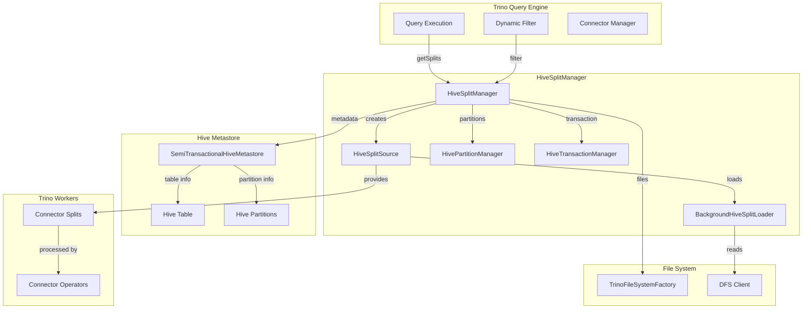
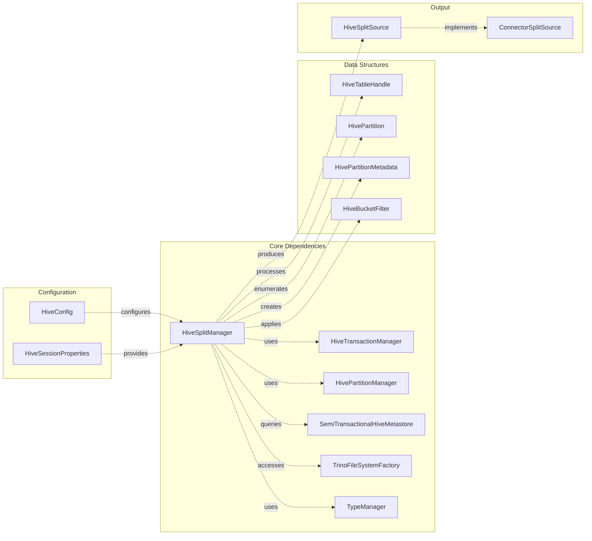
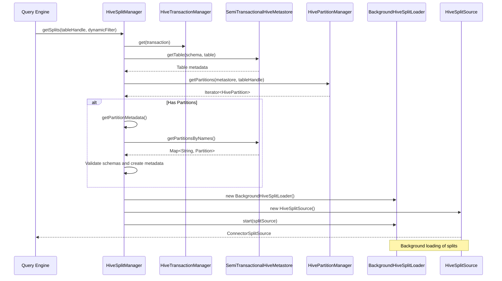
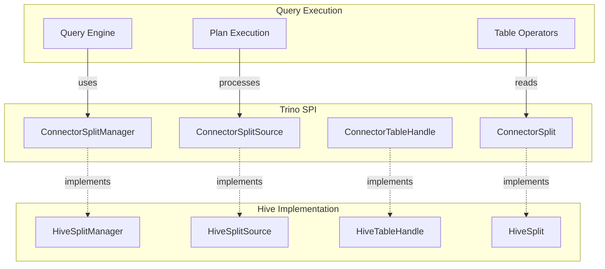

# HiveSplitManager Module Documentation

## Introduction

The HiveSplitManager is a critical component of the Trino Hive Connector that manages the discovery and creation of data splits for Hive tables. It implements the `ConnectorSplitManager` interface and is responsible for efficiently partitioning Hive table data into manageable chunks (splits) that can be processed in parallel by Trino workers.

## Core Functionality

The HiveSplitManager serves as the bridge between Hive's metadata system and Trino's distributed query execution engine. Its primary responsibilities include:

- **Split Discovery**: Locating and enumerating data files across Hive partitions
- **Partition Management**: Handling partitioned tables and applying partition pruning
- **Data Format Support**: Supporting various Hive storage formats (ORC, Parquet, Avro, etc.)
- **Bucketing Support**: Managing bucketed tables and bucket pruning
- **Dynamic Filtering**: Integrating with Trino's dynamic filtering optimization
- **Schema Validation**: Ensuring partition schemas are compatible with table schemas
- **Parallel Processing**: Efficiently loading splits in parallel while managing resource usage

## Architecture Overview



## Component Relationships



## Key Components

### HiveSplitManager Class

The main class that implements `ConnectorSplitManager` and orchestrates the split discovery process.

**Key Responsibilities:**
- Transaction management and validation
- Partition enumeration and filtering
- Split creation and batching
- Resource management and concurrency control
- Schema validation and type coercion

**Constructor Parameters:**
- `HiveConfig`: Configuration settings for split management
- `HiveTransactionManager`: Manages transactional metadata
- `HivePartitionManager`: Handles partition discovery and filtering
- `TrinoFileSystemFactory`: Provides access to underlying file systems
- `ExecutorService`: Thread pool for parallel operations
- `TypeManager`: Handles type conversions and validations

### Key Methods

#### getSplits()
The primary method that returns a `ConnectorSplitSource` for a given table handle.

```java
public ConnectorSplitSource getSplits(
    ConnectorTransactionHandle transaction,
    ConnectorSession session,
    ConnectorTableHandle tableHandle,
    DynamicFilter dynamicFilter,
    Constraint constraint)
```

**Process Flow:**
1. **Transaction Validation**: Ensures the table is readable within the transaction
2. **Table Metadata Retrieval**: Fetches table information from metastore
3. **Partition Discovery**: Enumerates relevant partitions based on constraints
4. **Schema Validation**: Validates partition schemas against table schema
5. **Split Loading**: Creates background loader to discover data files
6. **Split Source Creation**: Returns a HiveSplitSource for streaming splits

#### getPartitionMetadata()
Processes partition metadata in batches, applying dynamic filtering and schema validation.

**Key Features:**
- Exponential batching for efficient processing
- Dynamic filter application for partition pruning
- Schema compatibility checking
- Type coercion handling
- Bucket property validation

## Data Flow Architecture



## Configuration and Performance Tuning

### Key Configuration Parameters

| Parameter | Description | Default |
|-----------|-------------|---------|
| `maxOutstandingSplits` | Maximum splits queued for processing | 1000 |
| `maxOutstandingSplitsSize` | Maximum memory for queued splits | 32MB |
| `minPartitionBatchSize` | Minimum partitions per batch | 10 |
| `maxPartitionBatchSize` | Maximum partitions per batch | 100 |
| `maxInitialSplits` | Initial splits to load | 200 |
| `splitLoaderConcurrency` | Parallel loader threads | 4 |
| `maxSplitsPerSecond` | Rate limit for split discovery | Unlimited |
| `maxPartitionsPerScan` | Maximum partitions per query | 100,000 |

### Performance Optimizations

1. **Exponential Batching**: Partitions are processed in exponentially increasing batch sizes for efficiency
2. **Parallel Loading**: Multiple threads discover splits concurrently
3. **Dynamic Filtering**: Reduces partitions to scan based on runtime filters
4. **Memory Management**: Bounded queues prevent memory exhaustion
5. **Rate Limiting**: Optional throttling to prevent metastore overload

## Error Handling and Validation

### Schema Validation

The manager performs comprehensive schema validation:

- **Column Type Compatibility**: Ensures partition columns can be coerced to table types
- **Bucket Compatibility**: Validates bucket counts and columns match
- **Sorting Compatibility**: Checks sort order consistency when enabled
- **Column Name Mapping**: Handles case-insensitive column matching

### Error Conditions

- **Table Not Found**: Throws `TableNotFoundException` for missing tables
- **Partition Dropped**: Throws `HIVE_PARTITION_DROPPED_DURING_QUERY` if partitions disappear
- **Schema Mismatch**: Throws `HIVE_PARTITION_SCHEMA_MISMATCH` for incompatible schemas
- **Not Readable**: Throws `HiveNotReadableException` for tables marked as unreadable
- **Server Shutdown**: Throws `SERVER_SHUTTING_DOWN` during graceful shutdown

## Integration with Trino Ecosystem

### Connector Framework Integration



### Related Components

- **[HiveMetadata](HiveMetadata.md)**: Manages table metadata and DDL operations
- **[HivePageSourceProvider](HivePageSourceProvider.md)**: Creates page sources for reading data
- **[HivePartitionManager](HivePartitionManager.md)**: Handles partition discovery and filtering
- **[BackgroundHiveSplitLoader](BackgroundHiveSplitLoader.md)**: Background split discovery
- **[HiveSplitSource](HiveSplitSource.md)**: Streaming split source implementation

## Best Practices

### For Administrators

1. **Monitor Split Discovery**: Use JMX metrics to track split discovery performance
2. **Tune Batch Sizes**: Adjust partition batch sizes based on metastore performance
3. **Configure Concurrency**: Set appropriate loader concurrency for your environment
4. **Enable Dynamic Filtering**: Leverage dynamic filters for partition pruning
5. **Set Rate Limits**: Use `maxSplitsPerSecond` to prevent metastore overload

### For Developers

1. **Handle Schema Evolution**: Design tables with compatible schema evolution in mind
2. **Use Appropriate Formats**: Choose storage formats that support efficient split discovery
3. **Partition Strategically**: Design partition schemes that enable effective pruning
4. **Test Compatibility**: Validate partition compatibility before production deployment

## Monitoring and Metrics

### JMX Metrics

- **High Memory Split Sources**: Counter for split sources using excessive memory
- **Split Discovery Rate**: Rate of split discovery operations
- **Partition Batch Sizes**: Distribution of partition batch sizes processed
- **Error Rates**: Frequency of various error conditions

### Logging

The manager provides detailed logging for:
- Partition discovery operations
- Schema validation failures
- Performance metrics
- Error conditions and recovery

## Future Enhancements

Potential areas for improvement include:

1. **Adaptive Batching**: Dynamic batch sizing based on performance metrics
2. **Predictive Loading**: Pre-loading splits based on query patterns
3. **Enhanced Caching**: Improved metadata caching for repeated queries
4. **Parallel Metastore**: Concurrent metadata operations
5. **Smart Partitioning**: Automatic partition optimization suggestions