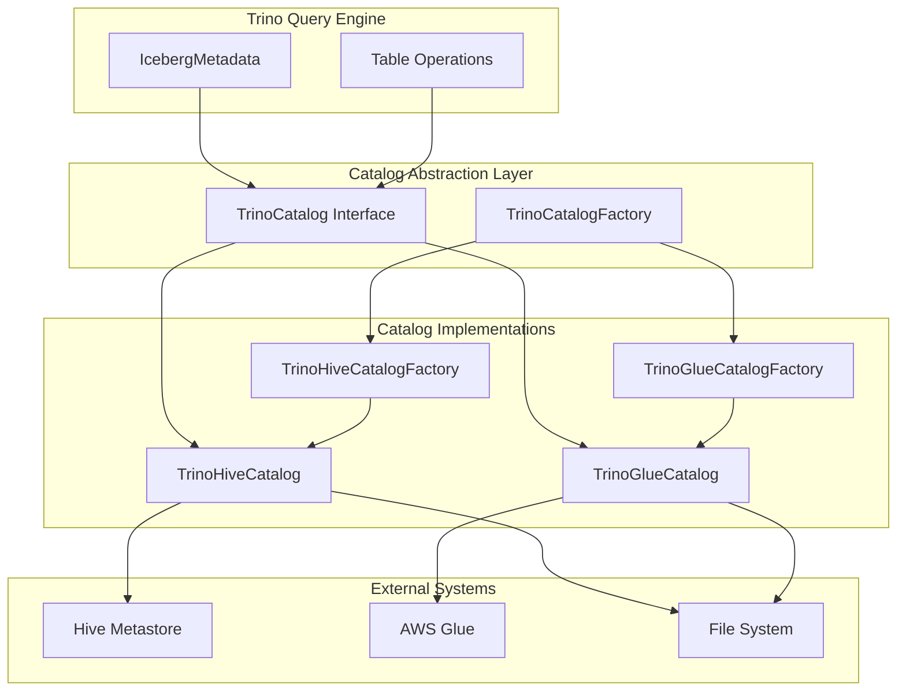

# Iceberg Catalog Abstraction & Factories

## Overview

The Iceberg Catalog Abstraction & Factories module provides a flexible and extensible framework for integrating Apache Iceberg table format with different metadata catalog backends in Trino. This module serves as the bridge between Trino's query engine and various Iceberg catalog implementations, enabling seamless access to Iceberg tables across different storage and metadata systems.

## Purpose

The primary purpose of this module is to:
- Abstract catalog operations behind a unified interface (`TrinoCatalog`)
- Support multiple catalog backends (Hive Metastore, AWS Glue, etc.)
- Provide factory patterns for creating catalog instances
- Enable consistent table operations regardless of the underlying catalog implementation
- Facilitate metadata management for Iceberg tables in distributed environments

## Architecture



## Core Components

### TrinoCatalog Interface
The central abstraction that defines the contract for all catalog operations. For detailed information, see [Catalog Interface & Core Abstraction](Catalog Interface & Core Abstraction.md).

Key capabilities:
- Namespace management (create, drop, list namespaces)
- Table operations (create, drop, rename, load tables)
- View and materialized view management
- Authorization and principal management
- Metadata operations (comments, properties)

### TrinoCatalogFactory
Factory interface for creating catalog instances. Each catalog implementation provides its own factory that handles:
- Configuration management
- Resource initialization
- Security context setup
- Performance optimization (caching, parallelization)

### Catalog Implementations

#### Hive Metastore Catalog
- **Factory**: `TrinoHiveCatalogFactory`
- **Implementation**: `TrinoHiveCatalog`
- **Purpose**: Integrates with traditional Hive Metastore for metadata storage
- **Features**: Caching, transaction support, view management
- **Documentation**: [Hive Metastore Integration](Hive Metastore Integration.md)

#### AWS Glue Catalog
- **Factory**: `TrinoGlueCatalogFactory`
- **Implementation**: `TrinoGlueCatalog`
- **Purpose**: Integrates with AWS Glue Data Catalog
- **Features**: Serverless metadata management, AWS integration, scalable architecture
- **Documentation**: [AWS Glue Integration](AWS Glue Integration.md)

## Key Features

### 1. Unified Interface
All catalog operations are exposed through the `TrinoCatalog` interface, ensuring consistent behavior across different backends.

### 2. Session-Aware Operations
Every catalog operation includes `ConnectorSession` parameter, enabling:
- User-specific authorization
- Session-level configuration
- Audit logging
- Resource management

### 3. Flexible Namespace Handling
- Support for multi-level namespaces
- Configurable namespace separators
- Optional namespace principal management

### 4. Transaction Support
- Iceberg transaction integration
- Atomic table operations
- Consistent metadata updates

### 5. Performance Optimization
- Parallel metadata fetching
- Configurable caching layers
- Bulk operations for efficiency

## Integration with Trino Ecosystem

### Dependency on Core Trino Modules
- **Trino SPI**: For connector interfaces and type system
- **Plugin Toolkit**: For security and session management
- **Filesystem Abstraction**: For storage layer integration
- **Hive Support Libraries**: For metastore integration

### Related Modules
- [Iceberg Connector Core](Iceberg Connector Core.md) - Main connector implementation
- [Hive Metastore](Hive Metastore.md) - Hive metadata integration
- [Plugin Toolkit](Plugin Toolkit.md) - Security and utility frameworks

## Configuration and Usage

### Catalog Configuration
Catalogs are configured through Trino's connector configuration system, with each catalog type requiring specific parameters:

```properties
# Hive Metastore Catalog
connector.name=iceberg
iceberg.catalog.type=hive
hive.metastore.uri=thrift://localhost:9083

# AWS Glue Catalog
connector.name=iceberg
iceberg.catalog.type=glue
hive.metastore.glue.region=us-east-1
```

### Runtime Behavior
- Catalog instances are created per transaction
- Metadata operations are parallelized for performance
- Caching is applied at multiple levels for efficiency
- Security context is propagated through all operations

## Extensibility

The modular design allows for easy addition of new catalog implementations:

1. Implement `TrinoCatalog` interface
2. Create corresponding `TrinoCatalogFactory`
3. Register in the connector's dependency injection module
4. Add configuration support for the new catalog type

This extensibility ensures that Trino can adapt to new metadata management systems as they emerge in the data ecosystem.