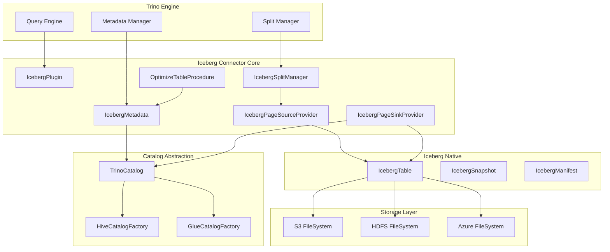

# Iceberg Connector Core Module

## Purpose

The Iceberg Connector Core module is the central component of Trino's Apache Iceberg connector, providing comprehensive integration between Trino's distributed SQL engine and Iceberg's modern table format. This module enables users to query, manage, and optimize Iceberg tables with full ACID transaction support, schema evolution capabilities, and advanced features like time travel and incremental processing.

## Architecture

The module follows a layered architecture that abstracts Iceberg's complexity while providing efficient data access:

## Core Components

### 1. Iceberg Connector Lifecycle & Metadata
Manages the complete lifecycle of Iceberg tables within Trino, including plugin registration, metadata operations, transaction handling, and table maintenance procedures.

**Key Responsibilities:**
- Plugin integration and lifecycle management
- Schema and table CRUD operations
- ACID transaction support with snapshot isolation
- Statistics collection and management
- Maintenance procedure execution

**See also**: [Iceberg Connector Lifecycle & Metadata Documentation](Iceberg Connector Core/Iceberg Connector Lifecycle & Metadata.md)

### 2. Iceberg Data Access
Provides efficient data access capabilities through split management, page source providers, and page sink providers for reading and writing Iceberg data.

**Key Capabilities:**
- Multi-format support (ORC, Parquet, Avro)
- Dynamic filtering and predicate pushdown
- Delete file handling for merge-on-read operations
- Partitioned and sorted data writing
- Incremental scanning for materialized views

**See also**: [Iceberg Data Access Documentation](Iceberg Connector Core/Iceberg Data Access.md)

### 3. Iceberg Procedures
Implements specialized maintenance procedures for Iceberg tables, including table optimization, snapshot management, and cleanup operations.

**Current Procedures:**
- `OPTIMIZE`: Compacts small files to improve query performance
- Future: Snapshot expiration, orphan file cleanup, statistics collection

**See also**: [Iceberg Procedures Documentation](Iceberg Connector Core/Iceberg Procedures.md)

### 4. Catalog Abstraction & Factories
Provides a unified interface for different Iceberg catalog implementations, supporting both Hive Metastore and AWS Glue catalogs.

**Supported Catalogs:**
- Hive Metastore (HMS)
- AWS Glue
- File system-based catalogs
- Custom catalog implementations

## Integration Points

The module integrates with several Trino core components:

- **[Trino SPI](Trino SPI.md)**: Implements connector interfaces for seamless plugin integration
- **[SQL Analyzer, Planner & Optimizer](SQL Analyzer, Planner & Optimizer.md)**: Provides metadata for query planning and cost-based optimization
- **[Query Execution Engine](Query Execution Engine.md)**: Coordinates with execution framework for distributed data processing
- **[File System Abstraction Layer](Filesystem Abstraction Layer.md)**: Handles storage operations across different cloud and on-premises systems
- **[ORC & Parquet Libraries](ORC & Parquet Libraries.md)**: Provides optimized file format readers and writers

## Key Features

### Modern Table Format Support
- **ACID Transactions**: Full support for atomic, consistent, isolated, and durable operations
- **Schema Evolution**: Safe schema changes without rewriting data
- **Time Travel**: Query historical snapshots of data
- **Partition Evolution**: Dynamic partitioning changes over time
- **Hidden Partitioning**: Partition values derived from column transformations

### Performance Optimizations
- **Vectorized Reading**: Efficient columnar data access
- **Predicate Pushdown**: Filters applied at the file format level
- **Dynamic Filtering**: Runtime filter optimization
- **Statistics-Driven Planning**: Detailed table statistics for optimal query plans
- **File Pruning**: Skip irrelevant files based on metadata

### Cloud-Native Architecture
- **Object Storage Optimized**: Designed for S3, Azure Blob, and GCS
- **Elastic Scaling**: Handle petabyte-scale tables efficiently
- **Multi-Cloud Support**: Works across different cloud providers
- **Cost Optimization**: Minimize data movement and storage costs

## Configuration and Usage

The connector supports extensive configuration options for different deployment scenarios:

- **Catalog Configuration**: Warehouse location, metastore type, security settings
- **Table Properties**: File format, compression, partitioning strategies
- **Session Properties**: Query-level behavior control
- **Performance Tuning**: Buffer sizes, parallelism, caching settings

This module provides the foundation for building modern data lakehouse architectures with Trino and Iceberg, combining the power of distributed SQL processing with the reliability and features of a modern table format.