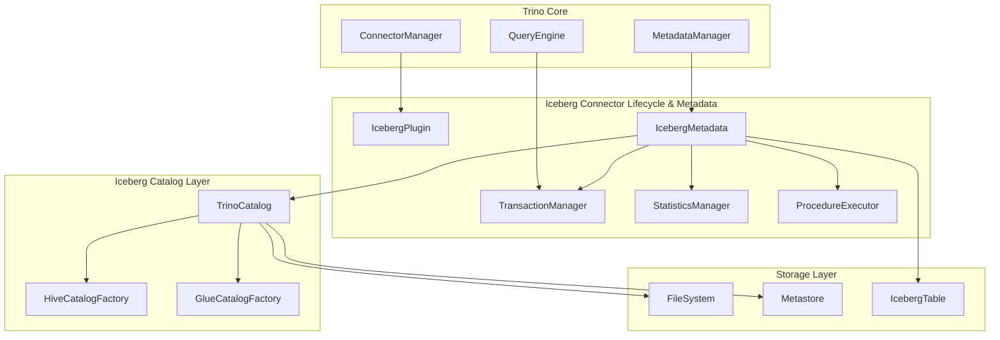
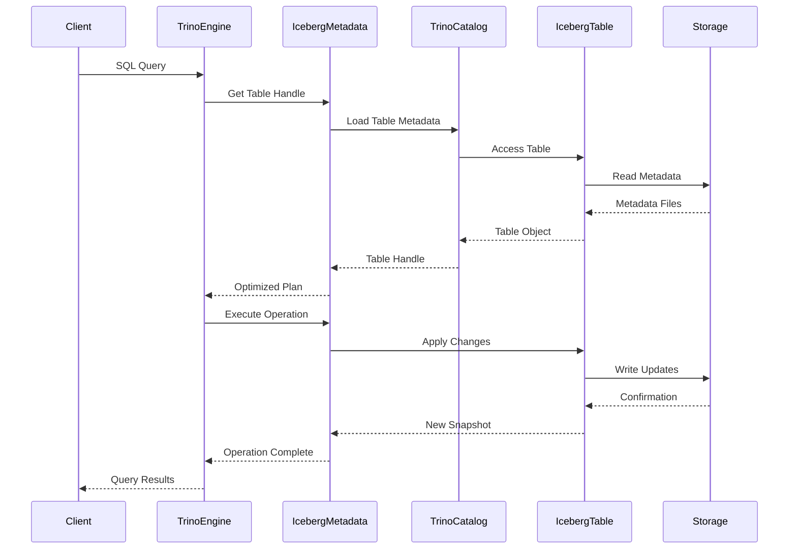

# Iceberg Connector Lifecycle & Metadata Module

## Overview

The Iceberg Connector Lifecycle & Metadata module is a core component of the Trino Iceberg connector that manages the complete lifecycle of Apache Iceberg tables within the Trino query engine. This module provides comprehensive metadata management, transaction handling, and table lifecycle operations for Iceberg tables, enabling seamless integration between Trino's distributed SQL engine and Iceberg's modern table format.

## Purpose and Core Functionality

This module serves as the primary interface between Trino's connector framework and Apache Iceberg's table format, providing:

- **Plugin Integration**: Registration and lifecycle management of the Iceberg connector within Trino's plugin architecture
- **Metadata Operations**: Complete CRUD operations for schemas, tables, views, and materialized views
- **Transaction Management**: ACID-compliant transaction handling for all table operations
- **Table Lifecycle**: Creation, modification, optimization, and maintenance of Iceberg tables
- **Statistics Management**: Collection and management of table statistics for query optimization
- **Procedure Execution**: Support for Iceberg-specific maintenance procedures

## Architecture Overview

## Component Relationships

The module consists of two primary components that work together to provide comprehensive Iceberg table management:

### IcebergPlugin
The entry point that registers the Iceberg connector with Trino's plugin system and provides connector factory instances.

**See also**: [Plugin Integration](Plugin Integration.md) for detailed documentation on plugin registration and lifecycle management.

### IcebergMetadata
The core metadata implementation that handles all table operations, transaction management, and integration with Iceberg's native APIs.

**See also**: [Metadata Operations](Metadata Operations.md) for comprehensive documentation on metadata management, table operations, and transaction handling.

## Key Features

### 1. Schema Management
- **Namespace Operations**: Create, drop, rename, and manage Iceberg namespaces/schemas
- **Schema Properties**: Manage metadata properties for namespaces
- **Authorization**: Handle schema-level security and ownership

### 2. Table Operations
- **CRUD Operations**: Create, read, update, and delete Iceberg tables
- **Schema Evolution**: Support for adding, dropping, renaming, and modifying columns
- **Partition Management**: Dynamic partitioning with multiple partition specs
- **Table Properties**: Comprehensive property management including format, compression, and layout settings

### 3. Transaction Management
- **ACID Compliance**: Full support for ACID transactions
- **Concurrent Operations**: Handle concurrent read and write operations
- **Conflict Resolution**: Automatic detection and resolution of transaction conflicts
- **Snapshot Isolation**: Ensure consistent views of data across operations

### 4. Statistics and Optimization
- **Extended Statistics**: Collection and management of detailed table statistics
- **NDV Tracking**: Number of distinct values estimation using Theta sketches
- **Query Optimization**: Statistics-driven query planning and optimization
- **Incremental Updates**: Efficient statistics updates for large tables

### 5. Maintenance Procedures
- **Table Optimization**: Compact small files and optimize table layout
- **Snapshot Management**: Expire old snapshots and manage table history
- **Orphan File Cleanup**: Remove unused files from storage
- **Manifest Optimization**: Optimize manifest file organization

## Integration with Trino Ecosystem

The module integrates seamlessly with other Trino components:

- **[Trino SPI](Trino SPI.md)**: Implements connector interfaces for plugin integration
- **[SQL Analyzer, Planner & Optimizer](SQL Analyzer, Planner & Optimizer.md)**: Provides metadata for query planning and optimization
- **[Query Execution Engine](Query Execution Engine.md)**: Coordinates with execution engine for data operations
- **[Metadata & Connector Abstraction](Metadata & Connector Abstraction.md)**: Integrates with Trino's metadata management system

## Data Flow Architecture

## Configuration and Extensibility

The module supports extensive configuration options:

- **Catalog Properties**: Configure catalog-specific settings like warehouse location and file format
- **Table Properties**: Set table-level properties for compression, partitioning, and sorting
- **Session Properties**: Control behavior per query session
- **Security Integration**: Support for various authentication and authorization mechanisms

## Performance Considerations

- **Metadata Caching**: Intelligent caching of table metadata to reduce catalog calls
- **Parallel Operations**: Utilize multiple threads for metadata operations
- **Batch Processing**: Efficient batch operations for large-scale metadata updates
- **Incremental Statistics**: Minimize statistics collection overhead with incremental updates

## Error Handling and Recovery

- **Comprehensive Error Codes**: Detailed error reporting with specific error codes
- **Transaction Rollback**: Automatic rollback of failed transactions
- **Corruption Detection**: Identify and handle corrupted table metadata
- **Graceful Degradation**: Continue operations when possible despite errors

This module forms the foundation of Trino's Iceberg connector, providing robust and scalable metadata management for modern data lakehouse architectures.