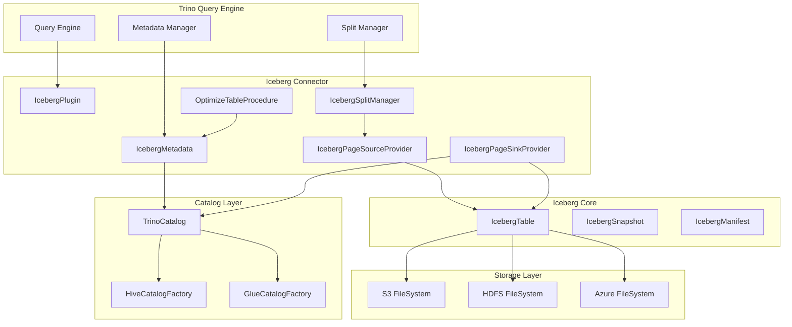

# Iceberg Connector Module Overview

## Purpose

The Iceberg Connector module provides Trino with native support for Apache Iceberg table format, enabling users to query and manage modern data lakehouse tables with full ACID transaction support, schema evolution, and time travel capabilities. This connector bridges Trino's distributed SQL engine with Iceberg's advanced table format features, delivering high-performance analytics on petabyte-scale datasets stored in cloud object storage.

## Architecture



## Core Components

### 1. Iceberg Connector Core
The central module that implements Trino's connector interfaces for Iceberg tables, providing metadata management, data access, and maintenance procedures.

**Key Features:**
- ACID transaction support with snapshot isolation
- Schema evolution and partition evolution
- Time travel queries using historical snapshots
- Multi-format support (ORC, Parquet, Avro)
- Maintenance procedures (OPTIMIZE, VACUUM)

**References:** [Iceberg Connector Core Documentation](Iceberg Connector/Iceberg Connector Core.md)

### 2. Iceberg Catalog Abstraction & Factories
Provides a unified interface for different Iceberg catalog implementations, supporting Hive Metastore, AWS Glue, and file system-based catalogs.

**Key Features:**
- Pluggable catalog architecture
- Session-aware operations with security context
- Parallel metadata fetching and caching
- Transaction support across catalog types

**References:** [Iceberg Catalog Abstraction Documentation](Iceberg Connector/Iceberg Catalog Abstraction & Factories.md)

## Integration Points

The Iceberg Connector integrates with several core Trino modules:

- **[Trino SPI](Trino SPI.md)**: Implements connector interfaces for plugin integration
- **[SQL Analyzer, Planner & Optimizer](SQL Analyzer, Planner & Optimizer.md)**: Provides metadata for query planning and cost-based optimization
- **[Query Execution Engine](Query Execution Engine.md)**: Coordinates with execution framework for distributed processing
- **[Filesystem Abstraction Layer](Filesystem Abstraction Layer.md)**: Handles storage operations across cloud and on-premises systems
- **[ORC & Parquet Libraries](ORC & Parquet Libraries.md)**: Provides optimized file format readers and writers

## Key Capabilities

### Modern Table Format Features
- **ACID Transactions**: Full support for atomic operations with snapshot isolation
- **Schema Evolution**: Safe schema changes without data rewriting
- **Time Travel**: Query historical data snapshots
- **Hidden Partitioning**: Partition values derived from column transformations
- **Delete Vectors**: Efficient row-level deletes with merge-on-read

### Performance Optimizations
- **Vectorized Reading**: Efficient columnar data access
- **Predicate Pushdown**: Filters applied at file format level
- **Dynamic Filtering**: Runtime filter optimization
- **File Pruning**: Skip irrelevant files using metadata
- **Statistics-Driven Planning**: Detailed table statistics for optimal plans

### Cloud-Native Design
- **Object Storage Optimized**: Designed for S3, Azure Blob, and GCS
- **Elastic Scaling**: Handle petabyte-scale tables efficiently
- **Multi-Cloud Support**: Works across different cloud providers
- **Cost Optimization**: Minimize data movement and storage costs

## Usage

The connector enables SQL operations on Iceberg tables:

```sql
-- Create Iceberg table
CREATE TABLE iceberg_catalog.db.table (
    id BIGINT,
    name VARCHAR,
    created_date DATE
) WITH (
    format = 'ORC',
    partitioning = ARRAY['month(created_date)']
);

-- Time travel query
SELECT * FROM iceberg_catalog.db.table 
FOR VERSION AS OF 1234567890;

-- Optimize table
CALL iceberg_catalog.system.optimize('db.table');
```

This module provides the foundation for building modern data lakehouse architectures, combining Trino's distributed SQL processing with Iceberg's reliable table format features.