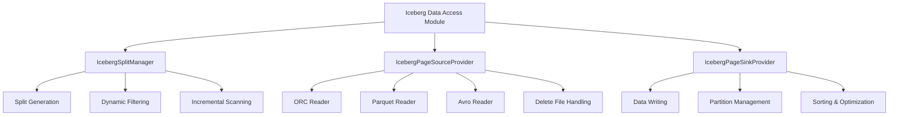
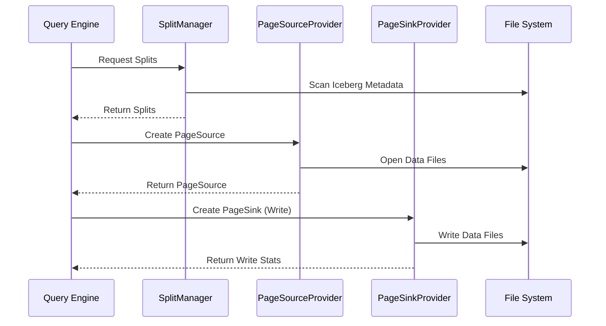

# Iceberg Data Access Module

## Overview

The Iceberg Data Access module is a critical component of Trino's Iceberg connector that provides efficient data access capabilities for Apache Iceberg tables. This module handles the core functionality of reading and writing data from Iceberg tables, managing splits, and providing page sources for query execution.

## Purpose

The primary purpose of this module is to:
- Provide efficient data access for Iceberg tables through split management
- Handle reading data from various file formats (ORC, Parquet, Avro)  
- Manage data writing operations with proper partitioning and sorting
- Support advanced features like delete file handling and incremental refreshes
- Integrate with Trino's execution engine through page source providers

## Architecture

The Iceberg Data Access module consists of three main sub-modules that work together to provide comprehensive data access capabilities:

## Core Components

### 1. IcebergSplitManager
The `IcebergSplitManager` is responsible for generating splits for Iceberg tables. See [IcebergSplitManager.md](IcebergSplitManager.md) for detailed documentation.

**Key Responsibilities:**
- **Split Generation**: Creates splits based on Iceberg table snapshots and file metadata
- **Dynamic Filtering**: Integrates with Trino's dynamic filtering to prune splits at runtime
- **Incremental Scanning**: Supports incremental refresh capabilities for materialized views
- **Table Function Support**: Provides specialized splits for table changes functions

**Key Features:**
- Uses Iceberg's scanning API to plan efficient data access
- Supports both full table scans and incremental append scans
- Integrates with caching host address providers for performance optimization
- Handles domain compaction for efficient predicate pushdown

### 2. IcebergPageSourceProvider  
The `IcebergPageSourceProvider` creates page sources for reading data from Iceberg files. See [IcebergPageSourceProvider.md](IcebergPageSourceProvider.md) for detailed documentation.

**Key Capabilities:**
- **Multi-Format Support**: Handles ORC, Parquet, and Avro file formats
- **Column Projection**: Efficiently projects only required columns
- **Predicate Pushdown**: Applies filters at the file format level
- **Delete File Handling**: Manages both position and equality deletes
- **Partition Data**: Handles partition column values without reading files

**Advanced Features:**
- Supports nested column projection and dereferencing
- Integrates with name mapping for schema evolution
- Handles metadata columns (file path, partition, modification time)
- Provides row position information for merge operations

### 3. IcebergPageSinkProvider
The `IcebergPageSinkProvider` manages data writing operations. See [IcebergPageSinkProvider.md](IcebergPageSinkProvider.md) for detailed documentation.

**Key Responsibilities:**
- **Data Ingestion**: Handles INSERT and CREATE TABLE operations
- **Partition Management**: Manages partitioned writes efficiently
- **Sorting Support**: Provides configurable sorting for optimized file layouts
- **Procedure Integration**: Supports table optimization procedures

**Key Features:**
- Configurable writer buffer sizes and file limits
- Integration with Trino's page sorting framework
- Support for various file formats and compression
- Handles table optimization and maintenance procedures

## Data Flow

## Integration Points

The Iceberg Data Access module integrates with several other Trino components:

- **[Iceberg Connector Core](Iceberg Connector.md)**: Provides metadata and transaction management
- **[File System Abstraction Layer](Filesystem Abstraction Layer.md)**: Handles file operations across different storage systems
- **[ORC & Parquet Libraries](ORC & Parquet Libraries.md)**: Provides low-level file format support
- **[Query Execution Engine](Query Execution Engine.md)**: Integrates with Trino's execution framework

## Performance Optimizations

The module implements several performance optimizations:

1. **Dynamic Filtering**: Reduces data scanning by applying runtime filters
2. **Column Pruning**: Only reads required columns from files
3. **Predicate Pushdown**: Applies filters at the file format level
4. **Partition Pruning**: Eliminates unnecessary partition scans
5. **File Statistics**: Uses Iceberg's file-level statistics for early pruning
6. **Caching**: Integrates with host address caching for repeated access

## Error Handling

The module provides comprehensive error handling:
- **File Corruption**: Handles corrupted ORC/Parquet files gracefully
- **Missing Snapshots**: Manages cases where referenced snapshots are expired
- **Schema Mismatches**: Handles schema evolution and name mapping
- **I/O Errors**: Provides detailed error messages for file access issues

## Configuration

Key configuration options include:
- Split source and planning executor thread pools
- File format reader options (buffer sizes, lazy reading)
- Dynamic filtering timeout settings
- Partition writer limits and buffer sizes

This module forms the foundation for efficient Iceberg data access in Trino, providing the performance and reliability needed for production analytics workloads.