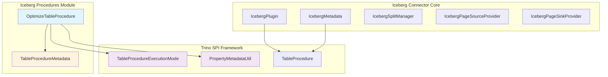
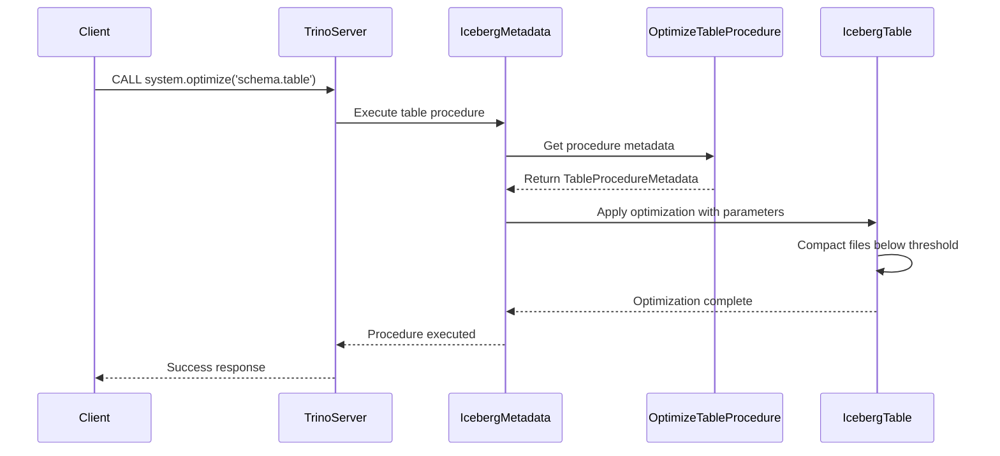
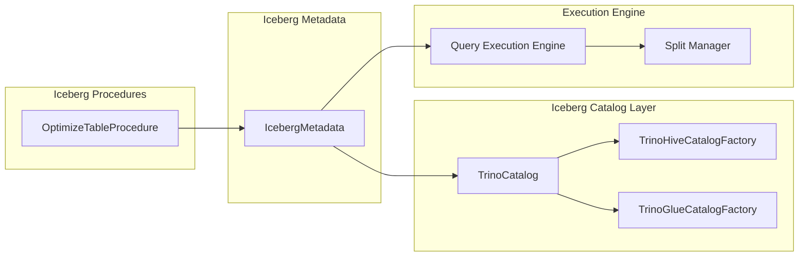

# Iceberg Procedures Module

## Introduction

The Iceberg Procedures module provides specialized table maintenance and optimization procedures for Apache Iceberg tables within the Trino query engine. This module implements the `OptimizeTableProcedure` which enables users to compact small files in Iceberg tables to improve query performance and storage efficiency.

## Architecture Overview

The Iceberg Procedures module is an integral part of the Iceberg Connector ecosystem, providing table-level maintenance operations that complement the core data access and metadata management capabilities.



## Core Components

### OptimizeTableProcedure

The `OptimizeTableProcedure` class implements the `Provider<TableProcedureMetadata>` interface and serves as the main entry point for table optimization operations in Iceberg.

**Key Responsibilities:**
- Defines the OPTIMIZE procedure metadata and configuration
- Specifies execution mode as distributed with filtering and repartitioning
- Configures the file size threshold parameter for compaction

**Configuration Parameters:**
- `file_size_threshold`: Only compact files smaller than the given threshold (default: 100MB)



## Integration with Iceberg Connector

The Iceberg Procedures module integrates seamlessly with the broader Iceberg Connector architecture:



## Dependencies and Interactions

### Trino SPI Dependencies

The module relies on several key Trino SPI components:

- **TableProcedureMetadata**: Defines procedure metadata and execution characteristics
- **TableProcedureExecutionMode**: Specifies distributed execution with filtering and repartitioning
- **PropertyMetadataUtil**: Provides utility methods for property configuration

### Iceberg Connector Dependencies

The procedures integrate with:

- **IcebergMetadata**: Handles metadata operations and procedure execution
- **IcebergPlugin**: Provides plugin registration and lifecycle management
- **TrinoCatalog**: Abstracts catalog operations across different metastore implementations

## Data Flow Architecture

```mermaid
graph TD
    subgraph "Procedure Execution Flow"
        A[CALL Statement] --> B[SQL Parser]
        B --> C[Statement Analyzer]
        C --> D[IcebergMetadata]
        D --> E[OptimizeTableProcedure]
        E --> F[TableProcedureMetadata]
        F --> G[Execution Planning]
        G --> H[Distributed Execution]
        H --> I[File Compaction]
        I --> J[Metadata Update]
        J --> K[Completion Status]
    end
    
    style E fill:#e1f5fe
    style F fill:#fff3e0
```



## Configuration and Usage

### Procedure Registration

The `OptimizeTableProcedure` is automatically registered through the Iceberg plugin's dependency injection framework, implementing the `Provider<TableProcedureMetadata>` interface.

### Execution Parameters

| Parameter | Type | Default | Description |
|-----------|------|---------|-------------|
| file_size_threshold | DataSize | 100MB | Only compact files smaller than this threshold |

### Usage Example

```sql
-- Optimize a table with default settings
CALL system.optimize('schema.table');

-- Optimize with custom file size threshold
CALL system.optimize('schema.table', file_size_threshold => '50MB');
```

## Performance Considerations

### Distributed Execution

The procedure utilizes Trino's distributed execution framework with filtering and repartitioning capabilities, enabling efficient parallel processing across worker nodes.

### File Selection Strategy

Files are selected for compaction based on:
- Size threshold comparison
- File format compatibility
- Partition boundaries
- Snapshot isolation requirements

### Resource Management

The optimization process respects:
- Query memory limits
- Worker node capacity
- Concurrent execution constraints
- Transaction isolation levels

## Error Handling and Recovery

The procedure implements robust error handling for:
- Concurrent modification conflicts
- Insufficient permissions
- Invalid table states
- Resource exhaustion scenarios

## Related Documentation

- [Iceberg Connector](Iceberg Connector.md) - Core Iceberg connector functionality
- [Trino SPI](Trino SPI.md) - Service Provider Interface framework
- [Query Execution Engine](Query Execution Engine.md) - Distributed execution framework
- [SQL Analyzer, Planner & Optimizer](SQL Analyzer, Planner & Optimizer.md) - Query planning and optimization

## Future Enhancements

Potential extensions to the procedures module include:
- Additional maintenance procedures (expire snapshots, remove orphan files)
- Advanced compaction strategies
- Statistics collection procedures
- Table migration utilities