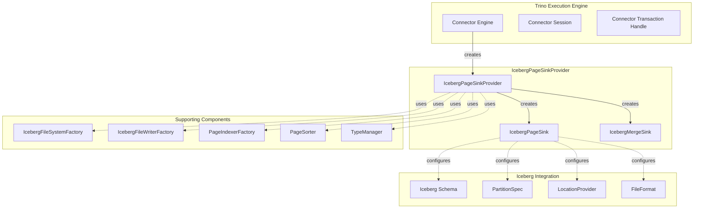
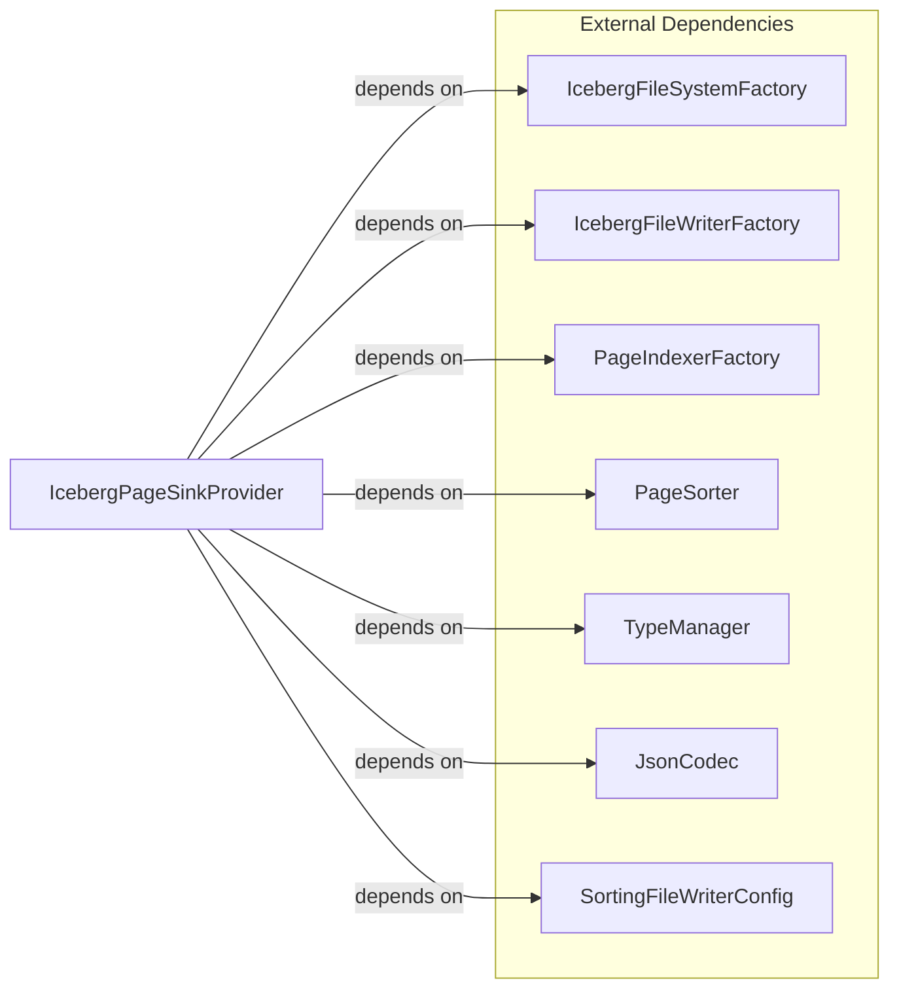
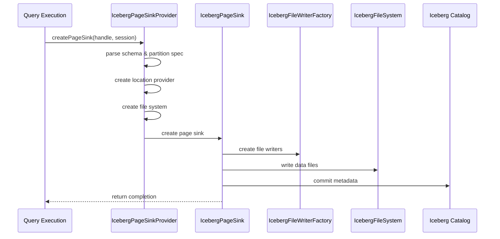
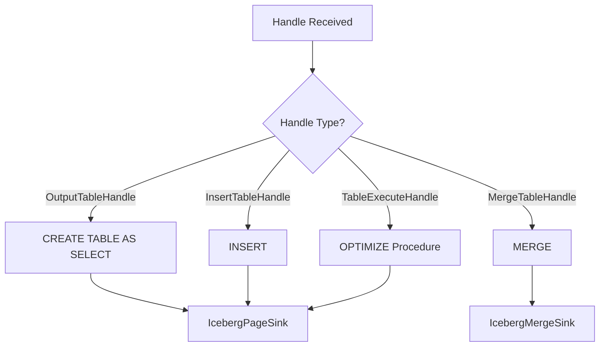
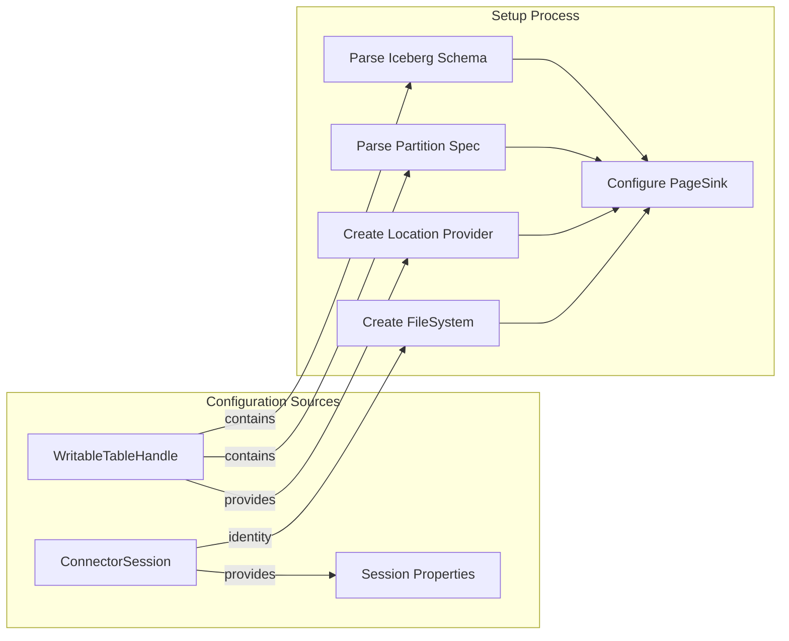
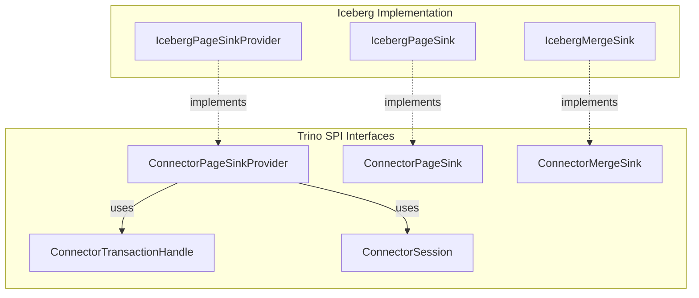
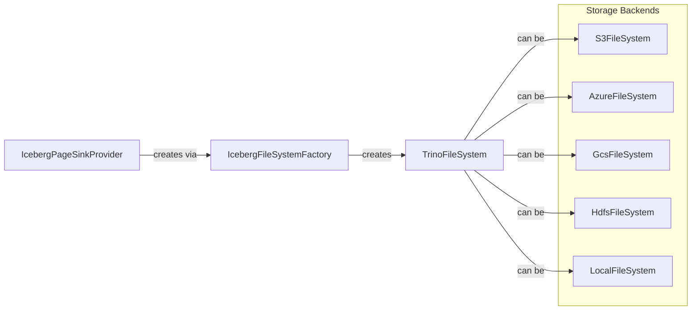
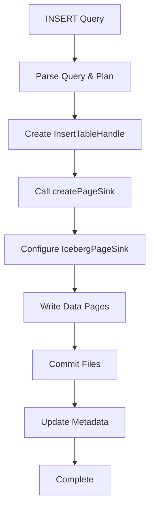
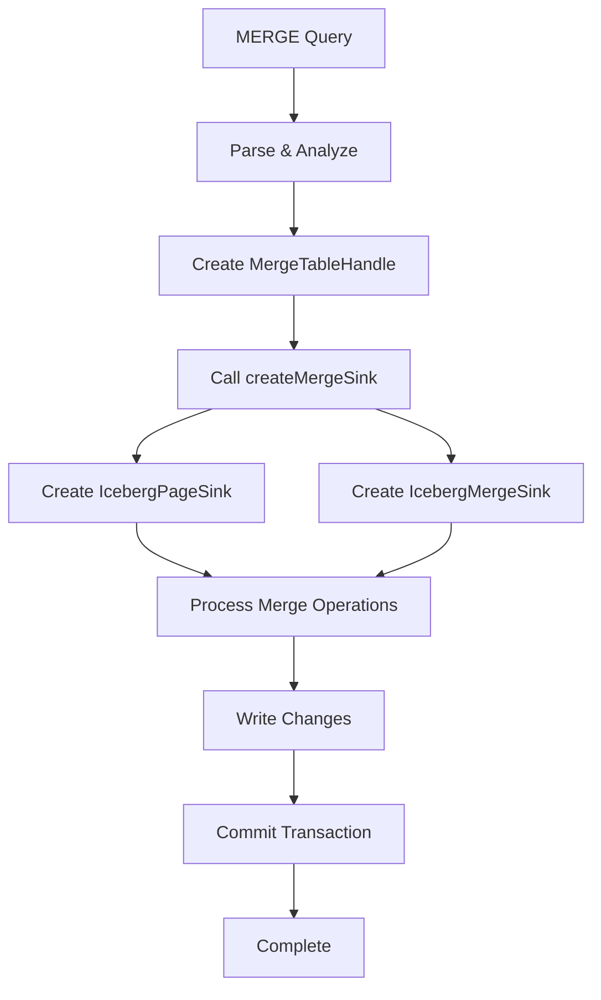

# IcebergPageSinkProvider Module Documentation

## Introduction

The IcebergPageSinkProvider module is a critical component of the Trino Iceberg connector that handles the creation of page sinks for writing data to Iceberg tables. It implements the `ConnectorPageSinkProvider` interface and serves as the factory for creating different types of page sinks used in INSERT, CREATE TABLE AS SELECT (CTAS), MERGE, and table optimization operations.

This module bridges the gap between Trino's execution engine and Iceberg's data writing capabilities, providing a unified interface for various write operations while handling the complexities of Iceberg's table format, partitioning, and file organization.

## Architecture Overview

The IcebergPageSinkProvider acts as a central factory that creates specialized page sinks based on the type of operation being performed. It integrates with multiple Trino and Iceberg components to provide a comprehensive data writing solution.

## Core Components

### IcebergPageSinkProvider

The main class that implements `ConnectorPageSinkProvider` interface. It serves as the entry point for creating page sinks and handles different types of write operations:

- **INSERT operations**: Creates page sinks for inserting data into existing tables
- **CREATE TABLE AS SELECT (CTAS)**: Creates page sinks for writing data during table creation
- **MERGE operations**: Creates specialized merge sinks for handling UPDATE/INSERT/DELETE operations
- **Table optimization**: Creates page sinks for table optimization procedures like OPTIMIZE

#### Key Dependencies

## Data Flow Architecture

The data flow through IcebergPageSinkProvider varies based on the operation type:

## Component Interactions

### Page Sink Creation Process

The provider creates different types of page sinks based on the handle type:

### Configuration and Setup

Each page sink creation involves several configuration steps:

## Integration with Trino Ecosystem

### Connector Framework Integration

The IcebergPageSinkProvider integrates with Trino's connector framework through several interfaces:

### File System Abstraction

The provider leverages Trino's file system abstraction layer for flexible storage support:

## Supported Operations

### Standard Write Operations

1. **INSERT INTO**: Writes data to existing Iceberg tables
2. **CREATE TABLE AS SELECT**: Creates new tables with query results
3. **MERGE**: Handles complex UPDATE/INSERT/DELETE operations

### Table Maintenance Operations

1. **OPTIMIZE**: Rewrites data files for better performance
2. **OPTIMIZE_MANIFESTS**: Manages manifest file organization
3. **Other procedures**: Handled through metadata operations

## Error Handling and Validation

The provider includes several validation mechanisms:

- **Schema validation**: Ensures Iceberg schema compatibility
- **Partition spec validation**: Validates partition specifications
- **File format validation**: Confirms supported file formats
- **Location validation**: Verifies output paths and permissions

## Performance Considerations

### Memory Management

- Configurable buffer sizes for sorting operations
- Maximum open file limits for concurrent writes
- Partition-aware memory allocation

### Parallel Processing

- Support for parallel writer instances
- Partition-based data distribution
- Concurrent file writing capabilities

## Dependencies

### Internal Dependencies

- **IcebergFileSystemFactory**: Creates file system instances
- **IcebergFileWriterFactory**: Creates file writers for different formats
- **IcebergPageSink**: Handles actual data writing
- **IcebergMergeSink**: Handles merge operations

### External Dependencies

- **Trino SPI**: Core interfaces and types
- **Iceberg Library**: Table format and metadata handling
- **File System Libraries**: Storage backend support

## Configuration

### Session Properties

- `max_partitions_per_writer`: Controls partition parallelism
- Sorting buffer sizes and file limits

### Table Properties

- File format selection (PARQUET, ORC, AVRO)
- Storage properties for location configuration
- Partition specifications

## Related Documentation

- [Iceberg Connector](IcebergConnector.md) - Overall Iceberg connector architecture
- [IcebergMetadata](IcebergMetadata.md) - Metadata management operations
- [IcebergPageSourceProvider](IcebergPageSourceProvider.md) - Data reading operations
- [IcebergFileSystemFactory](IcebergFileSystemFactory.md) - File system abstraction
- [TrinoFileSystem](TrinoFileSystem.md) - File system interface

## Process Flows

### INSERT Operation Flow

### MERGE Operation Flow

This comprehensive documentation provides a complete understanding of the IcebergPageSinkProvider module's role, architecture, and integration within the Trino ecosystem.