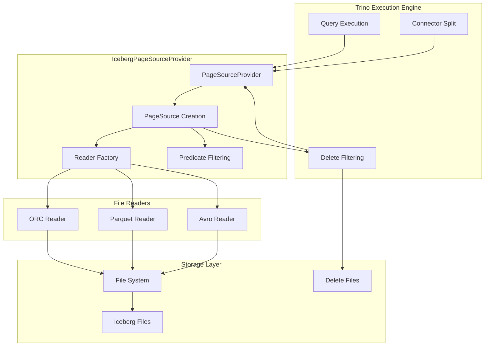
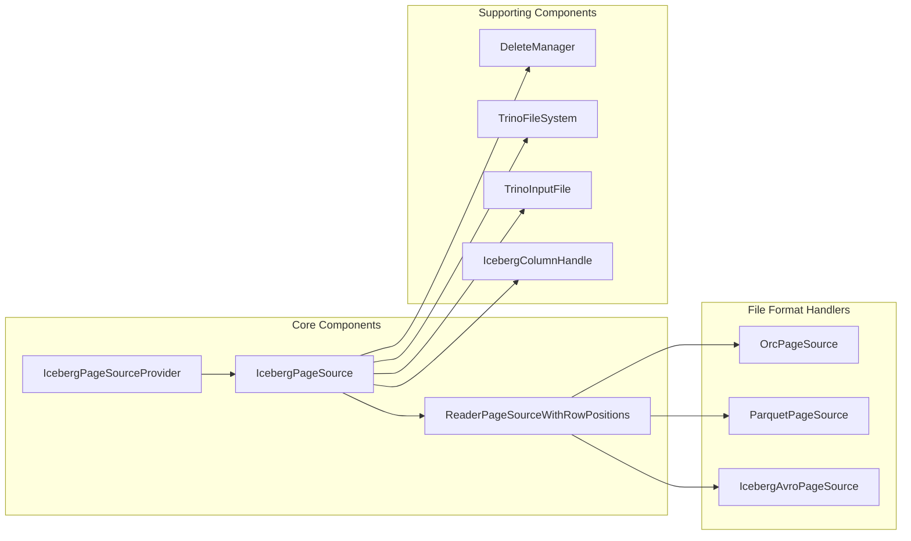
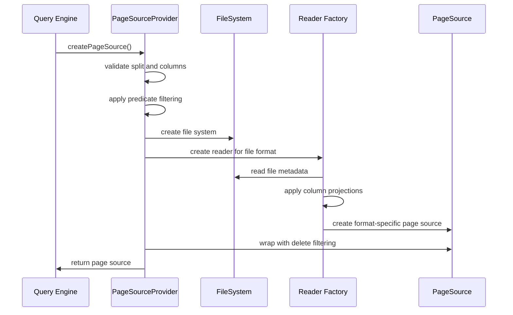
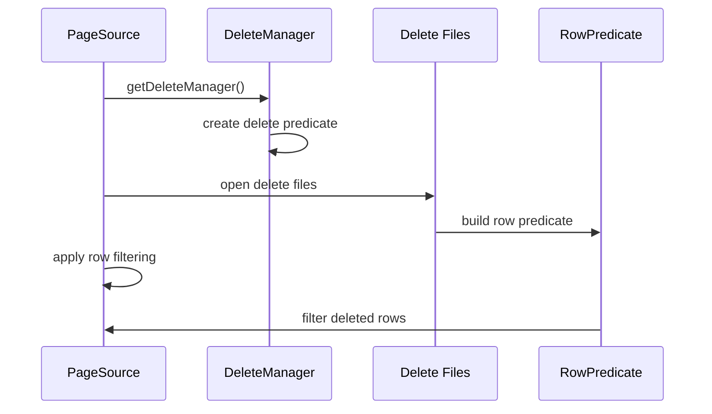
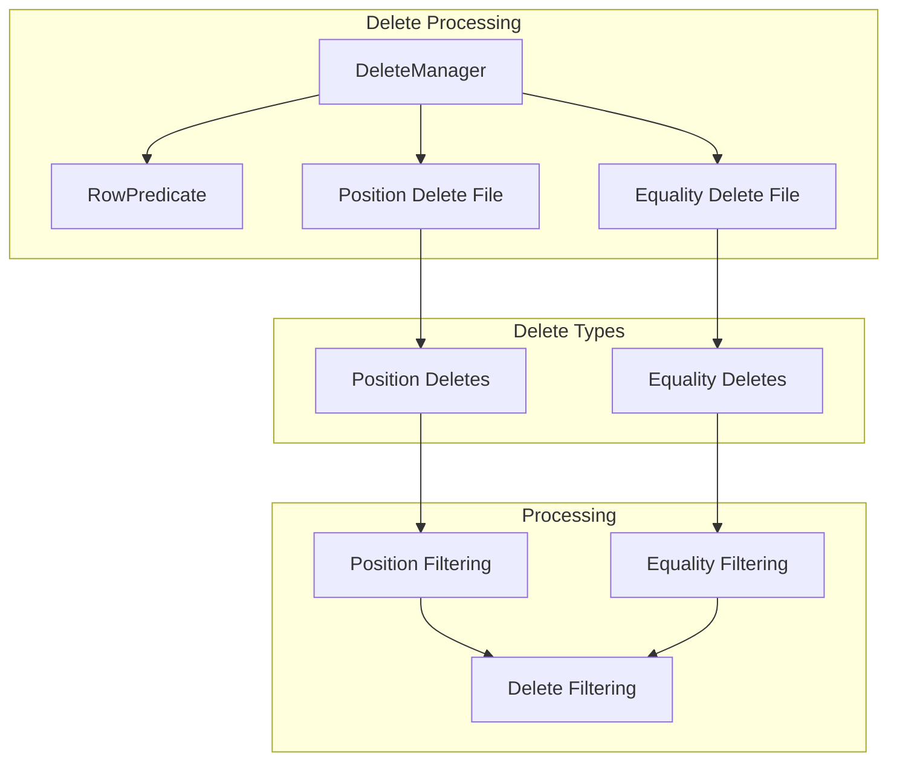
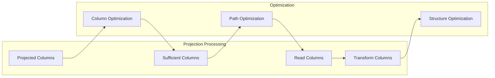

# IcebergPageSourceProvider Module Documentation

## Introduction

The `IcebergPageSourceProvider` module is a core component of the Trino Iceberg connector that handles the reading and processing of data from Iceberg table files. It implements the `ConnectorPageSourceProvider` interface and is responsible for creating page sources that can read data from various file formats (ORC, Parquet, Avro) stored in Iceberg tables, while applying predicates, handling deletes, and managing partition data.

## Module Overview

The IcebergPageSourceProvider serves as the primary data access layer for the Iceberg connector, bridging the gap between Iceberg's table format and Trino's execution engine. It handles complex scenarios including:

- Reading multiple file formats (ORC, Parquet, Avro)
- Applying predicate pushdown and dynamic filtering
- Processing delete files (position and equality deletes)
- Managing partition data and metadata columns
- Handling column projections and nested data structures
- Supporting Iceberg's evolving schema capabilities

## Architecture

### High-Level Architecture

### Component Relationships

## Core Components

### IcebergPageSourceProvider

The main class that implements `ConnectorPageSourceProvider` interface. It orchestrates the creation of page sources for reading Iceberg data files.

**Key Responsibilities:**
- Creating page sources for different file formats
- Managing delete file processing
- Handling partition data and metadata columns
- Applying predicates and dynamic filters
- Coordinating with the file system abstraction layer

**Key Dependencies:**
- `IcebergFileSystemFactory` - Creates file system instances
- `ForwardingFileIoFactory` - Provides Iceberg file I/O
- `FileFormatDataSourceStats` - Tracks file format statistics
- `OrcReaderOptions` & `ParquetReaderOptions` - Configuration for readers
- `TypeManager` - Manages Trino type system
- `DeleteManager` - Handles delete file processing

### ReaderPageSourceWithRowPositions

A wrapper class that combines a page source with row position information, essential for delete file processing.

**Components:**
- `ConnectorPageSource` - The actual data source
- `Optional<Long> startRowPosition` - Starting row position
- `Optional<Long> endRowPosition` - Ending row position

## Data Flow

### Page Source Creation Flow

### Delete File Processing Flow

## File Format Support

### ORC Format

The provider uses `OrcPageSource` for reading ORC files with features including:
- Column pruning and projection
- Predicate pushdown with bloom filters
- Nested data structure support
- Iceberg ID-based field mapping

**Key Components:**
- `TrinoOrcDataSource` - ORC data source implementation
- `OrcReader` - ORC file reader
- `OrcRecordReader` - Record-level reading
- `IdBasedFieldMapper` - Iceberg ID mapping

### Parquet Format

Parquet files are handled by `ParquetPageSource` with capabilities:
- Column statistics-based filtering
- Vectorized decoding
- Bloom filter support
- Name mapping for schema evolution

**Key Components:**
- `ParquetDataSource` - Parquet data source
- `ParquetReader` - Parquet file reader
- `ParquetMetadata` - File metadata handling
- `TupleDomainParquetPredicate` - Predicate evaluation

### Avro Format

Avro files are processed using `IcebergAvroPageSource`:
- Schema evolution support
- Name mapping integration
- Field ID mapping

**Key Components:**
- `DataFileStream` - Avro file streaming
- `GenericDatumReader` - Datum reading
- `NameMapping` - Schema mapping

## Delete File Handling

### Delete Manager Architecture

### Delete File Types

1. **Position Delete Files**: Contain row positions to be deleted
2. **Equality Delete Files**: Contain values for equality-based deletion

The system processes both types by:
- Building appropriate predicates
- Applying filters during page processing
- Maintaining delete managers per partition

## Column and Projection Handling

### Column Types

The provider handles various column types:

- **Regular Columns**: Standard data columns
- **Partition Columns**: Partition key values
- **Metadata Columns**: File path, modification time, etc.
- **System Columns**: Row position, merge row ID, deleted flag

### Projection Optimization

The system optimizes column reading by:
- Identifying sufficient columns for projections
- Minimizing file I/O through column pruning
- Applying transformations for nested data

## Integration with Trino Ecosystem

### Connector Framework Integration

The module integrates with Trino's connector framework through:
- `ConnectorPageSourceProvider` interface implementation
- `ConnectorSplit` and `ConnectorTableHandle` processing
- `DynamicFilter` integration for runtime filtering
- `TupleDomain` predicate handling

### File System Abstraction

Leverages Trino's file system abstraction:
- `TrinoFileSystem` for storage access
- `TrinoInputFile` for file operations
- Support for various storage systems (S3, Azure, GCS, HDFS)

### Type System Integration

Works with Trino's type system:
- `TypeManager` for type handling
- `Block` and `Page` for data representation
- Support for complex types (arrays, maps, structs)

## Performance Optimizations

### Predicate Pushdown

- File-level statistics filtering
- Row-group/stripe-level filtering
- Bloom filter utilization
- Dynamic filter integration

### Column Pruning

- Reading only required columns
- Optimizing nested column access
- Minimizing data transfer

### Memory Management

- `AggregatedMemoryContext` for memory tracking
- Efficient page size management
- Resource cleanup and error handling

## Error Handling

The module implements comprehensive error handling:
- `TrinoException` for query-level errors
- Format-specific corruption handling
- Graceful resource cleanup
- Detailed error messages with context

## Configuration and Session Properties

The provider respects various session properties:
- ORC reader options (buffer sizes, lazy reading)
- Parquet reader options (block sizes, vectorization)
- File format-specific settings
- Performance tuning parameters

## Related Modules

- [IcebergConnector](IcebergConnector.md) - Main Iceberg connector module
- [IcebergMetadata](IcebergMetadata.md) - Metadata management
- [IcebergSplitManager](IcebergSplitManager.md) - Split generation
- [IcebergPageSinkProvider](IcebergPageSinkProvider.md) - Data writing
- [TrinoFileSystem](TrinoFileSystem.md) - File system abstraction
- [OrcReader](OrcReader.md) - ORC format support
- [ParquetReader](ParquetReader.md) - Parquet format support

## Conclusion

The IcebergPageSourceProvider is a sophisticated component that enables efficient reading of Iceberg table data in Trino. It handles the complexity of multiple file formats, delete file processing, predicate pushdown, and column projections while maintaining high performance and reliability. Its modular design allows for easy extension and maintenance while providing comprehensive data access capabilities for the Iceberg connector.