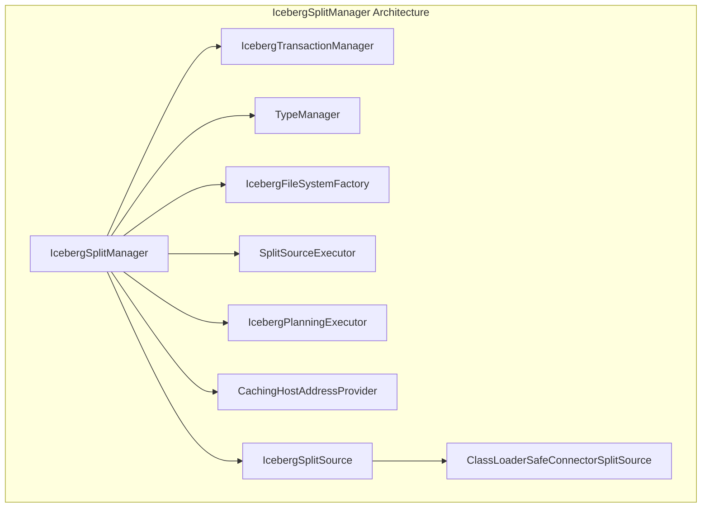
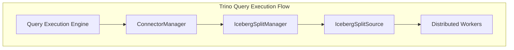
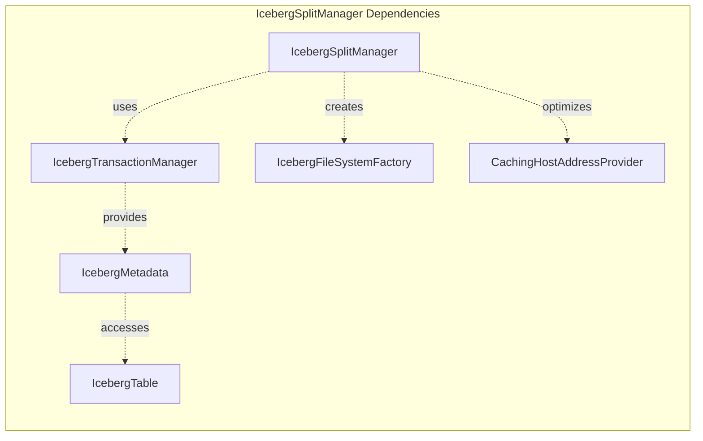
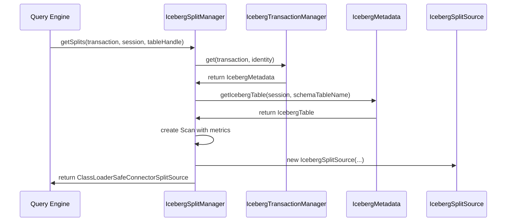
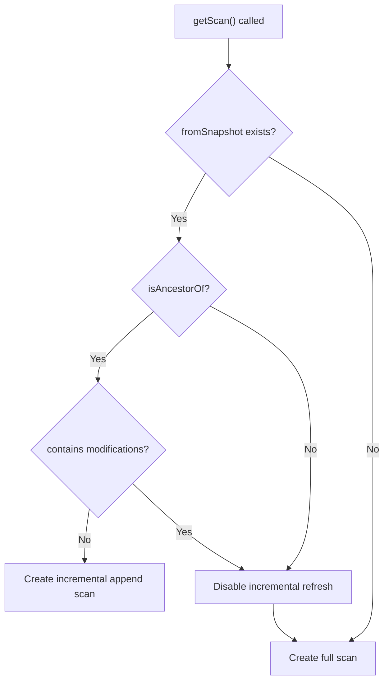
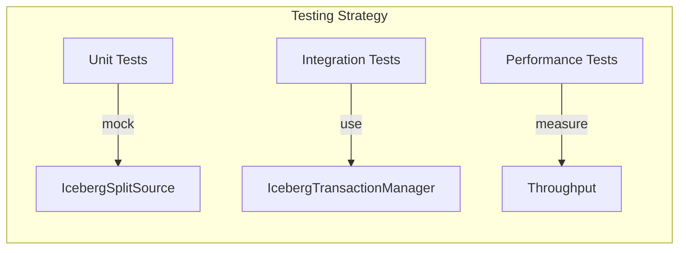

# IcebergSplitManager Module Documentation

## Introduction

The IcebergSplitManager is a core component of the Trino Iceberg connector responsible for managing data splits during query execution. It implements the `ConnectorSplitManager` interface and provides the logic for splitting Iceberg tables into manageable chunks (splits) that can be processed in parallel by Trino workers. This module is essential for efficient data processing and query performance optimization in Iceberg-based data lakes.

## Core Functionality

The IcebergSplitManager serves as the bridge between Iceberg's table format and Trino's distributed query execution engine. It handles:

- **Split Generation**: Creates splits from Iceberg tables based on file layout and partitioning
- **Dynamic Filtering**: Integrates with Trino's dynamic filtering to reduce data scanning
- **Incremental Processing**: Supports incremental refresh for append-only tables
- **Table Function Support**: Handles special table functions like table changes
- **Performance Optimization**: Uses metrics reporting and caching for split planning

## Architecture

### Component Overview

### Integration with Trino Ecosystem

## Key Components

### IcebergSplitManager Class

The main class that implements `ConnectorSplitManager` interface and orchestrates split generation:

- **Primary Method**: `getSplits()` - Generates splits for table scanning
- **Table Function Support**: Handles special functions like table changes
- **Incremental Processing**: Manages append-only incremental refresh
- **Dynamic Filtering**: Integrates with Trino's runtime filter optimization

### Dependencies and Collaborators

## Data Flow

### Split Generation Process

### Incremental Refresh Logic

## Configuration and Performance

### Key Configuration Parameters

- **Dynamic Filtering Wait Timeout**: Controls how long to wait for dynamic filters
- **Minimum Assigned Split Weight**: Sets the minimum weight for split assignment
- **Domain Compaction Threshold**: Limits domain compaction (set to 1000)

### Performance Optimizations

1. **Caching Host Address Provider**: Reduces network overhead for split location resolution
2. **Metrics Reporting**: Uses `InMemoryMetricsReporter` for performance monitoring
3. **Parallel Planning**: Utilizes dedicated executor service for Iceberg planning
4. **ClassLoader Safety**: Wraps splits in `ClassLoaderSafeConnectorSplitSource` for isolation

## Error Handling and Edge Cases

### Snapshot Management

- **Missing Snapshots**: Handles cases where incremental refresh snapshots are expired or rolled back
- **Modification Detection**: Falls back to full refresh when modifications (deletes/overwrites) are detected
- **Snapshot Validation**: Validates snapshot ancestry before incremental processing

### Table State Handling

- **Empty Snapshots**: Returns empty split source when no snapshot is available
- **File Recording**: Supports recording scanned files for query analysis
- **Dynamic Filter Integration**: Gracefully handles dynamic filter timeouts

## Integration with Iceberg Features

### Table Format Support

- **Snapshot Isolation**: Uses specific snapshots for consistent reads
- **Incremental Changelog**: Supports table changes function for CDC scenarios
- **File-Level Metrics**: Leverages Iceberg's file statistics for split optimization

### Catalog Integration

The IcebergSplitManager works with various catalog implementations:

- **Hive Metastore**: Traditional Hive catalog support
- **AWS Glue**: Cloud-native catalog integration
- **Custom Catalogs**: Extensible catalog factory pattern

## Testing and Validation

### Unit Testing Approach

### Key Test Scenarios

- **Empty Table Handling**: Validates behavior with empty tables
- **Large Table Processing**: Tests performance with millions of files
- **Concurrent Access**: Ensures thread safety in multi-user scenarios
- **Catalog Failures**: Handles catalog connectivity issues gracefully

## Best Practices

### Performance Tuning

1. **Executor Service Sizing**: Configure split source and planning executors based on cluster size
2. **Dynamic Filtering**: Enable dynamic filtering for selective queries
3. **Snapshot Management**: Regular snapshot cleanup to maintain performance
4. **File System Caching**: Leverage caching host address provider for repeated queries

### Operational Considerations

1. **Memory Management**: Monitor memory usage during large table scanning
2. **Network Optimization**: Ensure efficient split distribution across workers
3. **Catalog Health**: Maintain healthy catalog connections for metadata operations
4. **Error Monitoring**: Set up alerts for split generation failures

## Related Documentation

- [IcebergMetadata](IcebergMetadata.md) - Metadata management for Iceberg tables
- [IcebergTransactionManager](IcebergTransactionManager.md) - Transaction handling for Iceberg operations
- [IcebergSplitSource](IcebergSplitSource.md) - Split source implementation details
- [Trino Connector Framework](TrinoConnectorFramework.md) - General connector architecture
- [Query Execution Engine](QueryExecutionEngine.md) - How splits are processed during query execution

## Future Enhancements

### Planned Improvements

1. **Advanced Statistics Integration**: Better integration with Iceberg's column statistics
2. **Predicate Pushdown Optimization**: Enhanced predicate pushdown for file pruning
3. **Vectorized Split Processing**: Support for vectorized split generation
4. **Multi-Threaded Planning**: Parallel planning for very large tables

### Research Areas

- **Machine Learning Integration**: ML-based split size prediction
- **Adaptive Split Sizing**: Dynamic split sizing based on file characteristics
- **Cross-Table Optimization**: Optimizing splits for join operations
- **Cloud Storage Optimization**: Storage-specific optimizations for cloud platforms