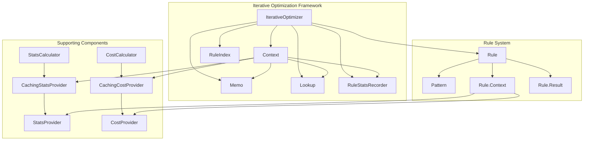
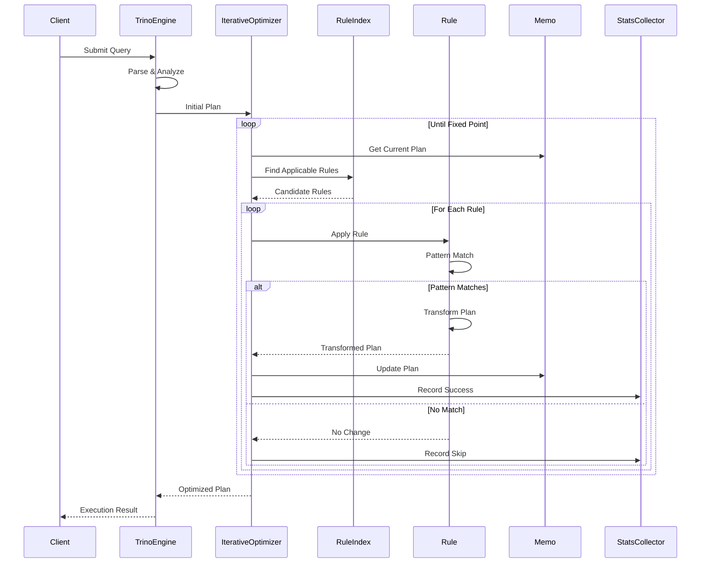
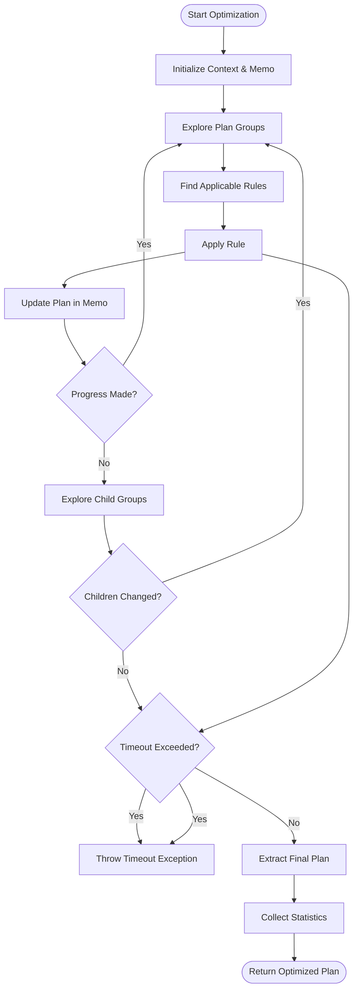
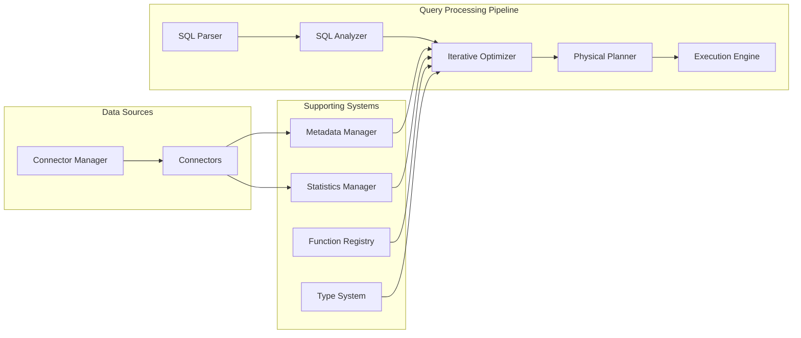

# Iterative Optimization Framework

## Introduction

The Iterative Optimization Framework is a core component of Trino's query optimization engine that implements a rule-based, iterative approach to transforming query execution plans. This framework provides a flexible and extensible architecture for applying optimization rules repeatedly until no further improvements can be made, enabling sophisticated query transformations that significantly improve query performance.

The framework operates on logical query plans represented as trees of `PlanNode` objects, applying a set of configurable rules that transform the plan structure. Each rule targets specific patterns in the plan and applies transformations that preserve semantic correctness while improving performance characteristics such as reduced data movement, better predicate pushdown, or more efficient join ordering.

## Architecture Overview

The Iterative Optimization Framework employs a sophisticated architecture that combines pattern matching, memoization, and iterative refinement to achieve optimal query plans. The framework's design enables both local and global optimizations through a unified interface while providing detailed statistics and monitoring capabilities.

## Core Components

### IterativeOptimizer

The `IterativeOptimizer` class serves as the main entry point for the optimization framework. It implements the `AdaptivePlanOptimizer` interface and orchestrates the entire optimization process. The optimizer maintains a collection of rules, statistics recorders, and supporting components necessary for plan transformation.

Key responsibilities include:
- Managing the optimization lifecycle from initial plan to optimized result
- Coordinating rule application through the `RuleIndex` for efficient pattern matching
- Implementing timeout mechanisms to prevent excessive optimization time
- Collecting and reporting optimization statistics for monitoring and debugging
- Supporting both iterative rules and legacy plan optimizers for backward compatibility

The optimizer employs a sophisticated exploration strategy that processes plan nodes in groups, applying rules iteratively until a fixed point is reached where no further transformations are possible. This approach ensures that optimizations are applied exhaustively while maintaining reasonable execution times.

### Context

The `Context` class encapsulates the state and services required during optimization. It provides a unified interface for rules to access necessary resources while maintaining isolation between different optimization phases. The context includes memoization structures, lookup services, allocation utilities, and statistical components.

The context manages several critical aspects:
- **Memoization**: Through the `Memo` class, it tracks plan transformations and enables efficient reuse of previously optimized sub-plans
- **Symbol Allocation**: Provides consistent symbol allocation across rule applications
- **Timeout Management**: Implements configurable timeout mechanisms to prevent runaway optimizations
- **Statistics Collection**: Gathers detailed metrics about rule applications, timing, and effectiveness
- **Resource Access**: Provides access to metadata, session information, and table statistics

### Rule System

The rule system forms the core transformation engine of the framework. Each rule implements a specific optimization pattern and can be applied to matching sub-plans. The system supports both simple local transformations and complex global optimizations through a unified interface.

Rules are characterized by:
- **Patterns**: Define the structural conditions that must be met for rule application
- **Transformations**: Specify how matched plans should be modified
- **Conditions**: Include semantic checks to ensure transformations are valid
- **Priorities**: Enable ordering of rule applications for optimal results

The framework supports extensive rule categorization, including predicate pushdown, join reordering, aggregation optimization, and many other specialized transformations. Each rule is self-contained and can be enabled or disabled independently, providing fine-grained control over the optimization process.

## Data Flow Architecture

## Optimization Process Flow

The optimization process follows a systematic approach that ensures comprehensive plan improvement while maintaining correctness and performance boundaries. The process begins with an initial logical plan and applies transformations iteratively until convergence.

## Integration with Trino Architecture

The Iterative Optimization Framework integrates seamlessly with Trino's broader query processing architecture, serving as a critical component in the query planning pipeline. It receives logical plans from the analyzer and produces optimized plans ready for physical execution planning.

## Rule Categories and Examples

The framework supports a comprehensive set of optimization rules organized into logical categories. Each category addresses specific aspects of query optimization, from basic predicate pushdown to complex join reordering strategies.

### Predicate Pushdown Rules
Predicate pushdown rules focus on moving filtering operations closer to data sources, reducing the amount of data that needs to be processed. These rules analyze predicate distributions and data source capabilities to determine optimal placement.

Key transformations include:
- **Filter Pushdown**: Moves filter operations below joins and aggregations when semantically equivalent
- **Predicate Inference**: Derives additional predicates from existing constraints
- **Range Optimization**: Optimizes range predicates for indexed access
- **Partition Pruning**: Eliminates unnecessary partition scans based on predicates

### Join Optimization Rules
Join optimization rules implement sophisticated strategies for improving join performance, including reordering, algorithm selection, and distribution optimization. These rules consider statistics, data distributions, and system resources to make optimal choices.

Transformations include:
- **Join Reordering**: Reorders join sequences to minimize intermediate result sizes
- **Join Distribution**: Selects optimal distribution strategies (broadcast vs. partitioned)
- **Join Algorithm Selection**: Chooses between hash, merge, and nested loop joins
- **Semi-join Optimization**: Optimizes EXISTS and IN subqueries

### Aggregation Optimization Rules
Aggregation rules optimize grouping and aggregation operations through various techniques including partial aggregation, grouping set optimization, and distinct operation improvements.

Optimizations include:
- **Partial Aggregation**: Introduces pre-aggregation steps to reduce data volume
- **Grouping Set Optimization**: Optimizes ROLLUP, CUBE, and GROUPING SETS operations
- **Distinct Optimization**: Transforms DISTINCT operations into more efficient forms
- **Window Function Optimization**: Optimizes window function computations

## Performance Characteristics

The Iterative Optimization Framework is designed to deliver consistent optimization quality while maintaining predictable performance characteristics. The framework employs several strategies to balance optimization effectiveness with execution time.

### Scalability Considerations
The framework scales efficiently with query complexity through several mechanisms:
- **Memoization**: Prevents redundant optimization of identical sub-plans
- **Rule Indexing**: Enables rapid identification of applicable rules
- **Incremental Processing**: Processes only changed portions of the plan
- **Parallel Exploration**: Supports concurrent exploration of independent plan branches

### Memory Management
Memory usage is carefully controlled through:
- **Plan Compaction**: Eliminates redundant plan representations
- **Garbage Collection**: Removes intermediate results promptly
- **Resource Limits**: Enforces configurable memory bounds
- **Streaming Processing**: Processes large plans in chunks when necessary

### Timeout Handling
The framework implements sophisticated timeout mechanisms to prevent excessive optimization time:
- **Progressive Timeouts**: Adjusts timeout based on query complexity
- **Rule Prioritization**: Applies most beneficial rules first
- **Early Termination**: Stops optimization when diminishing returns are detected
- **Graceful Degradation**: Returns best plan found when timeout occurs

## Monitoring and Diagnostics

The framework provides comprehensive monitoring and diagnostic capabilities to support performance tuning and troubleshooting. These features enable both real-time monitoring and post-execution analysis of optimization behavior.

### Statistics Collection
Detailed statistics are collected throughout the optimization process:
- **Rule Application Metrics**: Tracks invocation counts, success rates, and timing
- **Plan Transformation Statistics**: Records plan size changes and complexity metrics
- **Resource Usage**: Monitors memory consumption and processing time
- **Timeout Analysis**: Captures timeout triggers and partial optimization results

### Debug Capabilities
Extensive debugging support includes:
- **Plan Visualization**: Generates detailed plan representations before and after optimization
- **Rule Tracing**: Provides step-by-step execution traces for rule applications
- **Performance Profiling**: Identifies bottlenecks in the optimization process
- **Configuration Validation**: Verifies rule configurations and dependencies

## Configuration and Extensibility

The framework offers extensive configuration options and extension points to adapt to different deployment scenarios and optimization requirements. Configuration can be applied at system, session, and query levels to provide fine-grained control.

### Rule Configuration
Rules can be configured through multiple mechanisms:
- **Enable/Disable Flags**: Individual rule control for targeted optimization
- **Priority Settings**: Influence rule application order
- **Threshold Parameters**: Configure rule applicability conditions
- **Custom Rules**: Support for user-defined optimization rules

### Session Properties
Session-level properties provide runtime control:
- **Optimizer Timeout**: Configures maximum optimization time
- **Rule Selection**: Enables dynamic rule set modification
- **Statistics Usage**: Controls statistics incorporation
- **Debug Mode**: Activates detailed logging and tracing

## Error Handling and Recovery

The framework implements robust error handling to ensure optimization failures don't compromise query execution. Recovery mechanisms maintain system stability while providing meaningful error information for troubleshooting.

### Rule Failure Handling
Individual rule failures are handled gracefully:
- **Exception Isolation**: Prevents rule failures from affecting other rules
- **Failure Recording**: Captures failure details for analysis
- **Fallback Strategies**: Employs alternative optimization approaches
- **User Notification**: Provides meaningful error messages when appropriate

### Timeout Recovery
Timeout situations are managed through:
- **Partial Results**: Returns best plan found before timeout
- **Statistics Reporting**: Provides detailed timeout analysis
- **Retry Mechanisms**: Supports re-optimization with different parameters
- **Graceful Degradation**: Falls back to simpler optimization strategies

## Dependencies and Integration Points

The Iterative Optimization Framework integrates with numerous other Trino components, creating a cohesive optimization ecosystem that leverages system-wide capabilities.

### Core Dependencies
- **[SQL Analyzer](SQL Analyzer.md)**: Provides semantic analysis and initial plan structure
- **[Cost & Statistics Framework](Cost and Statistics Framework.md)**: Supplies cost estimation and statistical information
- **[Plan Representation](Plan Representation Framework.md)**: Defines plan node structures and relationships
- **[Metadata Management](Metadata and Connector Abstraction.md)**: Provides schema and table information

### Supporting Systems
- **[Query Execution Engine](Query Execution Engine.md)**: Consumes optimized plans for execution
- **[Session Management](Trino Server & API.md)**: Provides configuration and context information
- **[Warning Collection](SQL Analyzer.md)**: Aggregates optimization warnings and recommendations
- **[Event System](Trino Server & API.md)**: Reports optimization statistics and events

This comprehensive integration ensures that the optimization framework operates effectively within Trino's broader architecture while maintaining clear separation of concerns and enabling independent evolution of components.