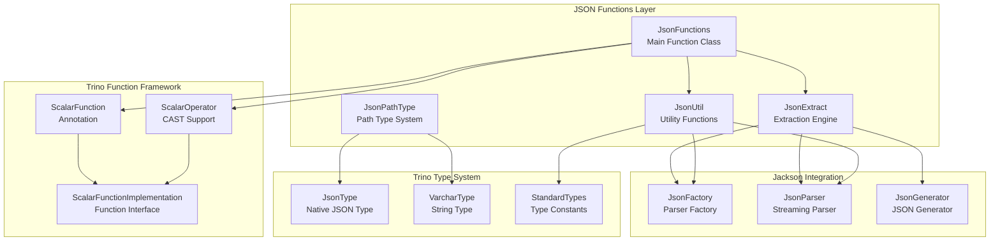
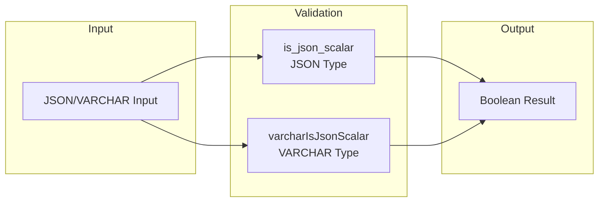
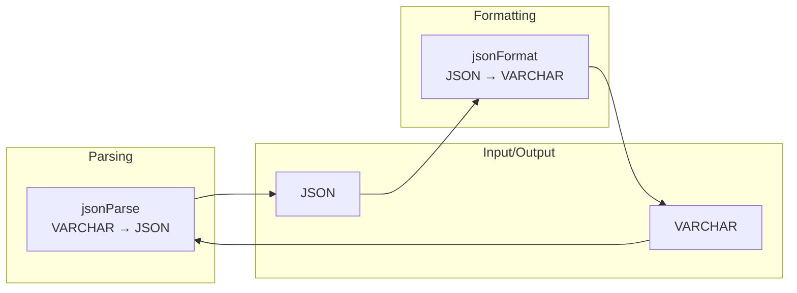
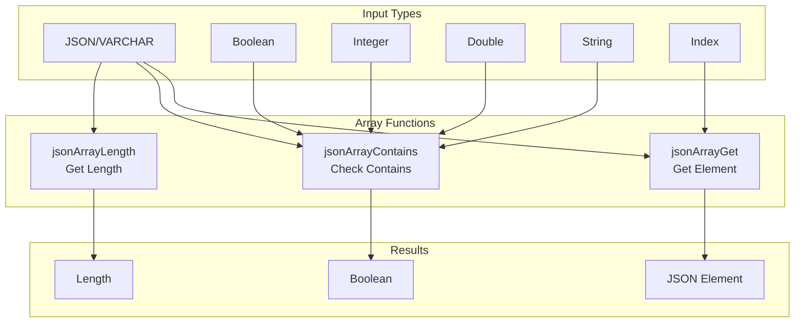
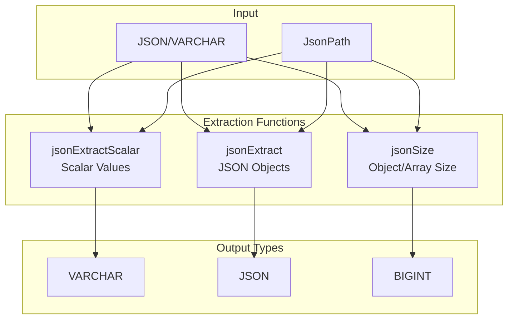
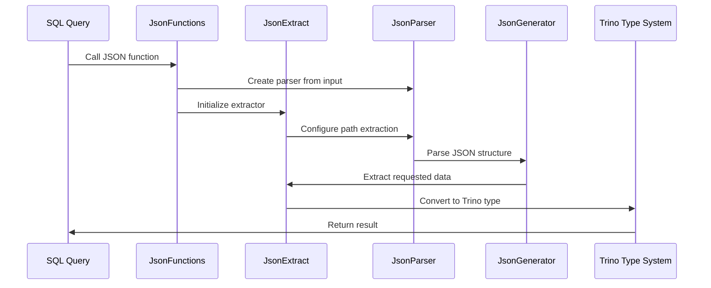
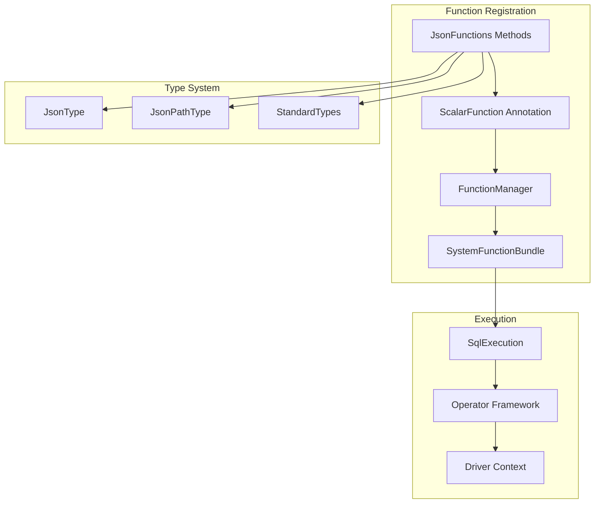
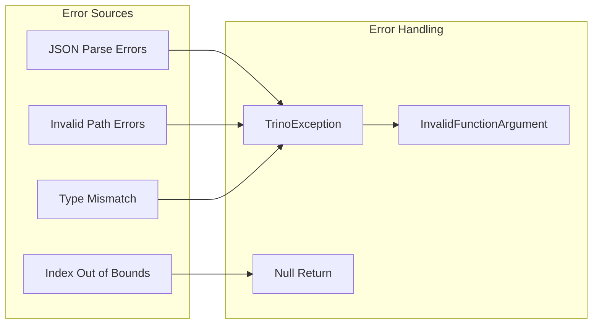

# JSON Functions Module

## Introduction

The JSON Functions module provides comprehensive JSON processing capabilities within Trino's SQL function system. It implements a complete set of scalar functions for parsing, validating, extracting, and manipulating JSON data, supporting both the native JSON type and VARCHAR representations. This module is essential for modern data processing workflows that need to handle semi-structured JSON data alongside traditional relational data.

## Architecture Overview

The JSON Functions module is built on a layered architecture that integrates with Trino's broader function system:



## Core Components

### JsonFunctions Class
The main entry point providing all JSON scalar functions. It implements functions for:
- JSON validation and type checking
- JSON parsing and formatting
- Array operations (length, contains, get)
- Path-based extraction (json_extract, json_extract_scalar)
- Size calculations

### JsonExtract Engine
A sophisticated extraction framework that:
- Parses JSON path expressions
- Generates optimized extractors for different data types
- Supports both scalar and object extraction
- Handles nested path navigation

### JsonPathType
A custom Trino type that represents JSON path expressions, enabling type-safe path operations within SQL queries.

### JsonUtil
Comprehensive utility functions for:
- JSON parsing and generation
- Type conversion and validation
- Error handling and truncation
- Block-level operations for columnar processing

## Function Categories

### Validation Functions


### Parsing and Formatting


### Array Operations


### Path-based Extraction


## Data Flow Architecture



## Integration with Trino Ecosystem

### Function System Integration
The JSON Functions module integrates deeply with Trino's function framework:



### Error Handling and Validation


## Performance Optimizations

### Streaming JSON Processing
- Uses Jackson's streaming API for memory-efficient parsing
- Avoids loading entire JSON documents into memory
- Processes JSON in a single pass where possible

### Path Compilation
- JSON paths are tokenized and compiled into efficient extractors
- Reuses extractor instances across function calls
- Supports both object field and array index navigation

### Type-Specific Optimizations
- Specialized extractors for different data types (scalar, object, size)
- Optimized array operations with early termination
- Efficient string handling with Slice operations

## Dependencies and Relationships

### Core Dependencies
- **Trino SPI**: Function annotations and type system ([Trino SPI](Trino SPI.md))
- **Jackson Core**: JSON parsing and generation
- **Plugin Toolkit**: JSON utility functions
- **Trino Main**: Core operator framework ([SQL Functions & Operators](SQL Functions & Operators.md))

### Related Modules
- **Type System**: Integrates with Trino's type system for JSON type support
- **Function Framework**: Part of the broader scalar function ecosystem
- **Error Handling**: Uses Trino's exception framework for consistent error reporting

## Usage Examples

### Basic JSON Operations
```sql
-- Check if JSON is scalar
SELECT is_json_scalar('{"key": "value"}'); -- false
SELECT is_json_scalar('"string"'); -- true

-- Parse and format JSON
SELECT json_parse('{"name": "John", "age": 30}');
SELECT json_format(JSON '{"key": "value"}');
```

### Array Operations
```sql
-- Get array length
SELECT json_array_length('[1, 2, 3, 4]'); -- 4

-- Check if array contains value
SELECT json_array_contains('[1, 2, 3]', 2); -- true
SELECT json_array_contains('["a", "b", "c"]', 'b'); -- true

-- Get array element
SELECT json_array_get('["first", "second", "third"]', 1); -- "second"
```

### Path-based Extraction
```sql
-- Extract scalar values
SELECT json_extract_scalar('{"user": {"name": "John", "age": 30}}', '$.user.name'); -- "John"

-- Extract JSON objects
SELECT json_extract('{"users": [{"name": "John"}, {"name": "Jane"}]}', '$.users[0]'); -- {"name": "John"}

-- Get object/array size
SELECT json_size('{"users": [{"name": "John"}, {"name": "Jane"}]}', '$.users'); -- 2
```

## Error Handling

The module implements comprehensive error handling:
- **Invalid JSON**: Returns NULL or throws TrinoException for invalid input
- **Path Errors**: Handles missing fields and invalid path expressions gracefully
- **Type Mismatches**: Validates types and provides meaningful error messages
- **Index Bounds**: Handles out-of-bounds array access safely

## Future Enhancements

Potential areas for expansion:
- JSON construction functions (json_object, json_array)
- Advanced path expressions with filtering
- JSON schema validation
- Performance optimizations for large JSON documents
- Additional aggregation functions for JSON data