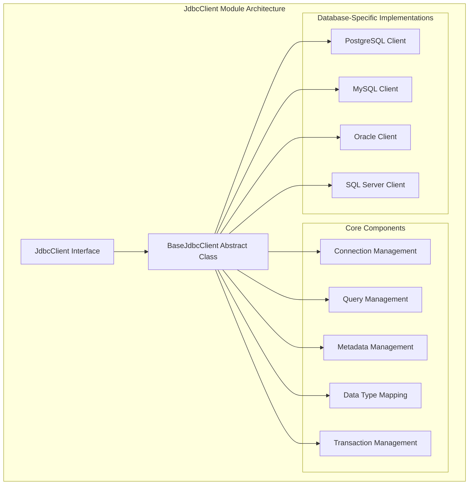
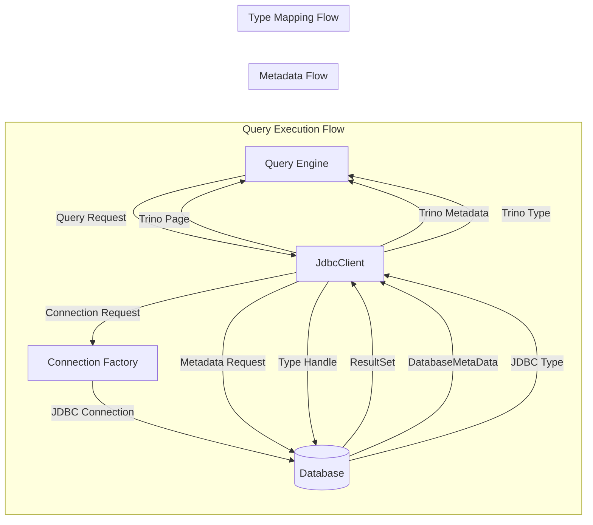
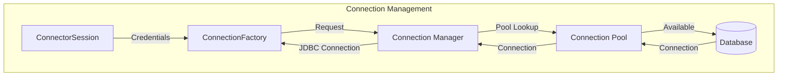
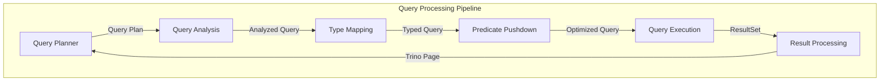
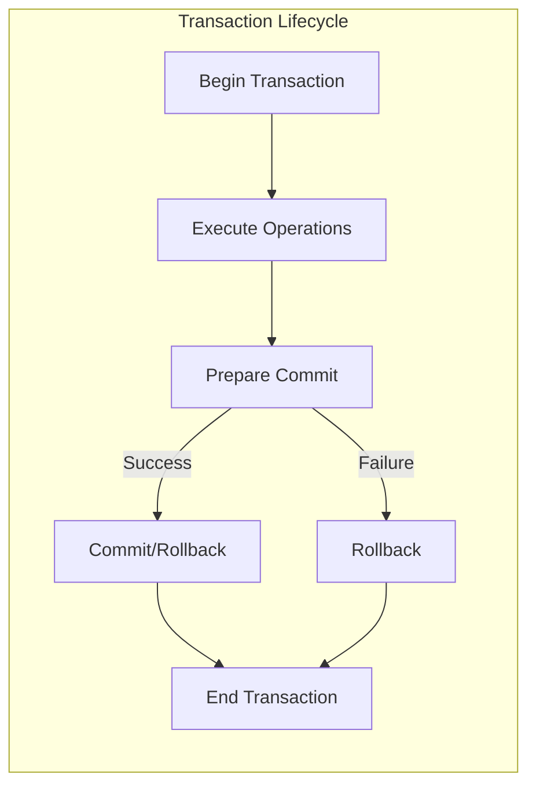

# JdbcClient Module Documentation

## Introduction

The JdbcClient module is a core component of Trino's Base JDBC Connector that provides the foundational abstraction layer for connecting Trino to relational databases via JDBC. This module serves as the primary interface between Trino's query engine and external JDBC-compliant databases, enabling seamless data access and query execution across diverse database systems.

The JdbcClient module implements a comprehensive set of interfaces and abstract classes that handle database metadata operations, query planning, data type mapping, and transaction management. It forms the backbone of Trino's JDBC connector ecosystem, supporting popular databases like PostgreSQL, MySQL, Oracle, SQL Server, and many others.

## Architecture Overview

The JdbcClient module is built around a layered architecture that separates concerns between connection management, query processing, metadata operations, and data type handling. The architecture follows the Strategy pattern to allow different database-specific implementations while maintaining a consistent interface.

## Core Components

### JdbcClient Interface

The `JdbcClient` interface defines the contract that all JDBC connector implementations must fulfill. It provides a comprehensive set of methods for database operations, metadata retrieval, query execution, and transaction management. The interface is designed to be database-agnostic while allowing for database-specific optimizations and features.

Key responsibilities include:
- Schema and table management operations
- Column metadata and type mapping
- Query preparation and execution
- Transaction lifecycle management
- Statistics and optimization support
- Connection pooling and management

### BaseJdbcClient Abstract Class

The `BaseJdbcClient` abstract class provides a default implementation of the `JdbcClient` interface, offering common functionality that can be shared across different database implementations. It handles the majority of JDBC operations using standard SQL and JDBC API calls, while providing extension points for database-specific customizations.

The class implements sophisticated features such as:
- Automatic type mapping between Trino and JDBC types
- Query optimization and pushdown capabilities
- Transaction management with fault-tolerant execution support
- Connection lifecycle management
- Metadata caching and optimization

## Data Flow Architecture

## Component Interactions

The JdbcClient module interacts extensively with other Trino components to provide seamless database integration:

### Integration with Trino SPI

The module heavily relies on Trino's Service Provider Interface (SPI) for connector development. Key SPI components used include:

- **ConnectorSession**: Provides session context and configuration
- **ConnectorTableMetadata**: Represents table structure and properties
- **ColumnMetadata**: Defines column characteristics and constraints
- **TableStatistics**: Enables query optimization and cost-based planning
- **ConnectorSplitSource**: Handles data partitioning and parallel processing

### Connection Management

Connection management is handled through the `ConnectionFactory` interface, which provides database connections based on session configuration. The module implements connection pooling, authentication, and transaction isolation level management.

## Query Processing Pipeline

The JdbcClient module implements a sophisticated query processing pipeline that optimizes query execution for different database systems:

### Query Preparation

The query preparation phase involves several steps:

1. **Query Analysis**: Analyzes the query structure and identifies optimization opportunities
2. **Type Mapping**: Maps Trino types to appropriate JDBC types
3. **Predicate Pushdown**: Determines which filters can be pushed to the database
4. **Join Optimization**: Evaluates join strategies and pushdown capabilities
5. **Aggregation Pushdown**: Identifies aggregations that can be executed remotely

### Query Execution

The execution phase handles:

- **Connection Acquisition**: Obtains appropriate database connections
- **Statement Preparation**: Prepares JDBC statements with proper parameter binding
- **Result Processing**: Transforms JDBC ResultSets into Trino Pages
- **Error Handling**: Manages database-specific error conditions
- **Resource Cleanup**: Ensures proper resource disposal

## Type System Integration

The JdbcClient module implements a comprehensive type mapping system that handles the conversion between Trino's rich type system and JDBC SQL types. This integration is crucial for maintaining data integrity and query correctness across different database systems.

### Type Mapping Strategy

The type mapping system employs a multi-layered approach:

1. **Standard Mappings**: Handles common SQL types (INTEGER, VARCHAR, DECIMAL, etc.)
2. **Database-Specific Mappings**: Addresses database-specific type variations
3. **Fallback Mappings**: Provides safe fallbacks for unsupported types
4. **Custom Mappings**: Allows connector-specific type handling

### Column Mapping Framework

The `ColumnMapping` class encapsulates the bidirectional conversion between Trino and JDBC representations, including:

- **Read Functions**: Convert JDBC values to Trino types
- **Write Functions**: Convert Trino values to JDBC parameters
- **Pushdown Rules**: Determine predicate pushdown capabilities
- **Null Handling**: Manage NULL value semantics

## Transaction Management

The JdbcClient module provides robust transaction management capabilities that support both traditional ACID transactions and modern fault-tolerant execution models.

### Transaction Types

1. **Standard Transactions**: Traditional commit/rollback semantics
2. **Non-Transactional Operations**: For databases without transaction support
3. **Fault-Tolerant Execution**: Supports Trino's retry mechanisms
4. **Merge Operations**: Handles complex UPDATE/DELETE/INSERT scenarios

### Transaction Lifecycle

## Optimization Features

The JdbcClient module implements several optimization techniques to improve query performance and reduce database load:

### Predicate Pushdown

The module analyzes query predicates and pushes appropriate filters to the database level, reducing data transfer and improving query performance. The pushdown logic considers:

- **Column Types**: Ensures type compatibility for pushed predicates
- **Database Capabilities**: Respects database-specific limitations
- **Expression Complexity**: Handles complex expressions and functions
- **Join Conditions**: Optimizes join predicate placement

### Aggregation Pushdown

When supported by the underlying database, the module can push aggregation operations to the database level, significantly reducing the amount of data that needs to be processed by Trino.

### Join Optimization

The module implements sophisticated join optimization strategies:

- **Join Reordering**: Optimizes join order based on statistics
- **Join Pushdown**: Pushes entire join operations to the database
- **Join Type Selection**: Chooses optimal join algorithms
- **Statistics-Based Optimization**: Uses table statistics for join planning

### Top-N Optimization

For databases that support it, the module can push TOP-N operations to the database, combining sorting and limiting operations for improved performance.

## Error Handling and Resilience

The JdbcClient module implements comprehensive error handling strategies to ensure robust operation across different database systems:

### Exception Management

- **SQL Exception Translation**: Converts database-specific errors to Trino exceptions
- **Connection Recovery**: Implements automatic connection recovery mechanisms
- **Retry Logic**: Provides configurable retry strategies for transient failures
- **Resource Cleanup**: Ensures proper cleanup of database resources

### Database-Specific Handling

Different databases have varying capabilities and limitations. The module provides:

- **Capability Detection**: Runtime detection of database capabilities
- **Fallback Strategies**: Alternative approaches when features are unsupported
- **Dialect-Specific Logic**: Database-specific query generation and optimization
- **Version Compatibility**: Handles different database versions gracefully

## Security Integration

The JdbcClient module integrates with Trino's security framework to provide comprehensive access control and authentication:

### Authentication

- **Credential Management**: Secure handling of database credentials
- **Kerberos Support**: Integration with Kerberos authentication
- **SSL/TLS**: Support for encrypted database connections
- **Connection Pool Security**: Secure connection pooling mechanisms

### Access Control

- **Schema-Level Security**: Controls access to database schemas
- **Table-Level Security**: Manages table access permissions
- **Column-Level Security**: Supports column-level access restrictions
- **Row-Level Security**: Implements row-level security policies

## Performance Monitoring

The module provides extensive monitoring and metrics collection capabilities:

### Query Metrics

- **Execution Time**: Tracks query execution duration
- **Row Counts**: Monitors data volume processed
- **Connection Usage**: Tracks connection pool utilization
- **Error Rates**: Monitors failure rates and types

### Resource Monitoring

- **Memory Usage**: Tracks memory consumption during query processing
- **Network I/O**: Monitors data transfer volumes
- **Database Load**: Tracks database resource utilization
- **Cache Performance**: Monitors metadata caching effectiveness

## Extension Points

The JdbcClient module is designed for extensibility, providing numerous extension points for database-specific customizations:

### Abstract Methods

Database-specific implementations can override key methods to provide custom behavior for:

- **Type Mapping**: Custom type conversion logic
- **Query Generation**: Database-specific SQL generation
- **Metadata Retrieval**: Custom metadata handling
- **Connection Management**: Database-specific connection handling

### Plugin Architecture

The module supports a plugin architecture that allows:

- **Custom Functions**: Database-specific function implementations
- **Optimization Rules**: Database-specific query optimization
- **Security Plugins**: Custom authentication and authorization
- **Monitoring Extensions**: Custom metrics and monitoring

## Integration with Base JDBC Connector

The JdbcClient module is the cornerstone of the Base JDBC Connector, which provides the foundation for all JDBC-based connectors in Trino. The integration includes:

### Connector Lifecycle

The JdbcClient manages the complete connector lifecycle:

- **Initialization**: Sets up connection factories and configuration
- **Query Processing**: Handles incoming queries from Trino's engine
- **Metadata Management**: Provides table and column metadata
- **Cleanup**: Ensures proper resource disposal

### Split Management

The module works with Trino's split management system to:

- **Generate Splits**: Creates work units for parallel processing
- **Handle Parallelism**: Manages concurrent database connections
- **Optimize Data Locality**: Minimizes data movement
- **Balance Load**: Distributes work across cluster nodes

## Dependencies and Relationships

The JdbcClient module has important dependencies on other Trino components:

### Trino SPI Integration

The module extensively uses Trino SPI components:

- **[Plugin Architecture](Plugin.md)**: Integrates with Trino's plugin system
- **[Type System](TypeSystem.md)**: Leverages Trino's rich type system
- **[Connector Framework](ConnectorFramework.md)**: Implements connector interfaces
- **[Security Framework](SecurityFramework.md)**: Integrates with security components

### Related Modules

The JdbcClient module works closely with:

- **[Base JDBC Connector](BaseJdbcConnector.md)**: Provides the main connector implementation
- **[Query Processing Framework](QueryProcessing.md)**: Integrates with query execution
- **[Metadata Management](MetadataManagement.md)**: Handles metadata operations
- **[Transaction Management](TransactionManagement.md)**: Manages transaction semantics

## Best Practices

When implementing or extending the JdbcClient module, consider these best practices:

### Performance Optimization

- **Connection Pooling**: Implement efficient connection pooling
- **Metadata Caching**: Cache metadata to reduce database queries
- **Batch Operations**: Use batch operations for bulk data processing
- **Index Utilization**: Leverage database indexes effectively

### Error Handling

- **Graceful Degradation**: Handle unsupported features gracefully
- **Detailed Logging**: Provide comprehensive error information
- **Retry Strategies**: Implement appropriate retry mechanisms
- **Resource Cleanup**: Ensure proper resource disposal

### Security Considerations

- **Credential Security**: Secure credential storage and transmission
- **SQL Injection**: Prevent SQL injection vulnerabilities
- **Access Control**: Implement proper access controls
- **Audit Logging**: Maintain audit trails for security events

## Future Enhancements

The JdbcClient module continues to evolve with planned enhancements:

### Advanced Optimizations

- **Machine Learning Integration**: ML-based query optimization
- **Adaptive Query Processing**: Dynamic query plan adjustment
- **Enhanced Statistics**: More sophisticated statistical analysis
- **Predictive Caching**: Intelligent metadata caching

### Extended Database Support

- **Cloud-Native Features**: Enhanced cloud database integration
- **NoSQL Integration**: Support for NoSQL databases with JDBC drivers
- **Real-time Streaming**: Integration with streaming databases
- **Graph Database Support**: Enhanced graph database capabilities

The JdbcClient module represents a mature, robust foundation for database connectivity in Trino, providing the flexibility and performance needed for modern data analytics workloads while maintaining the extensibility required for future enhancements.