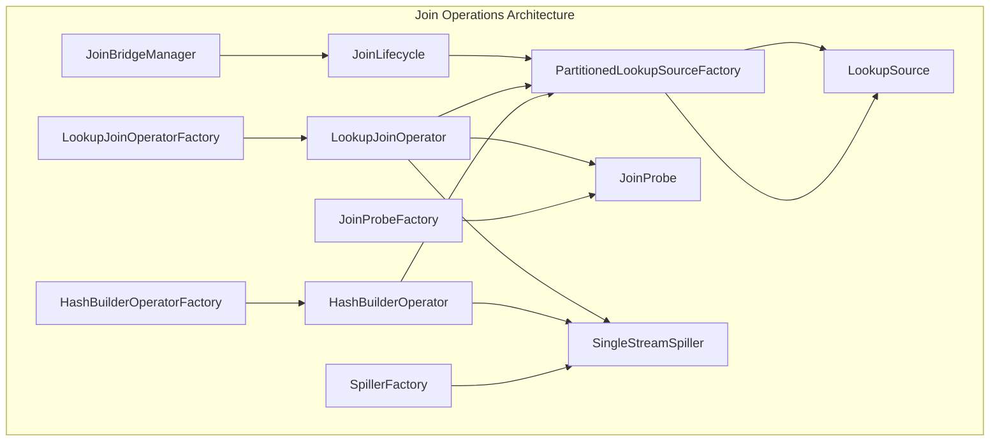
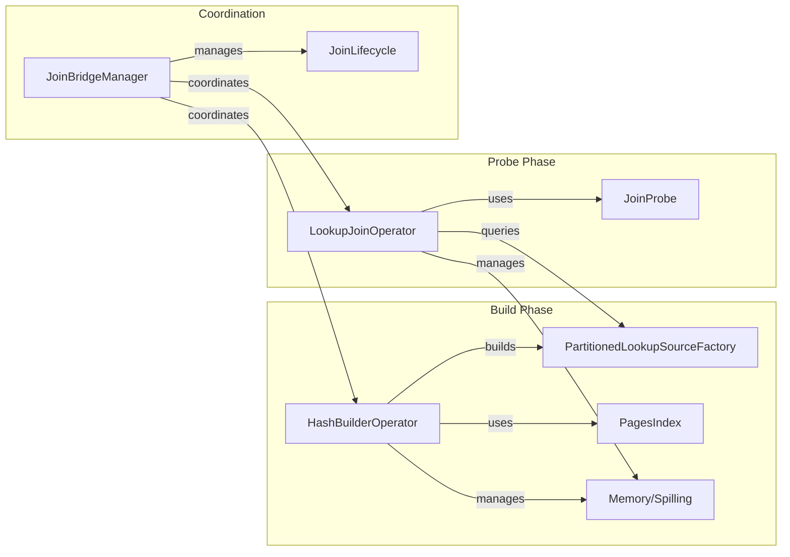
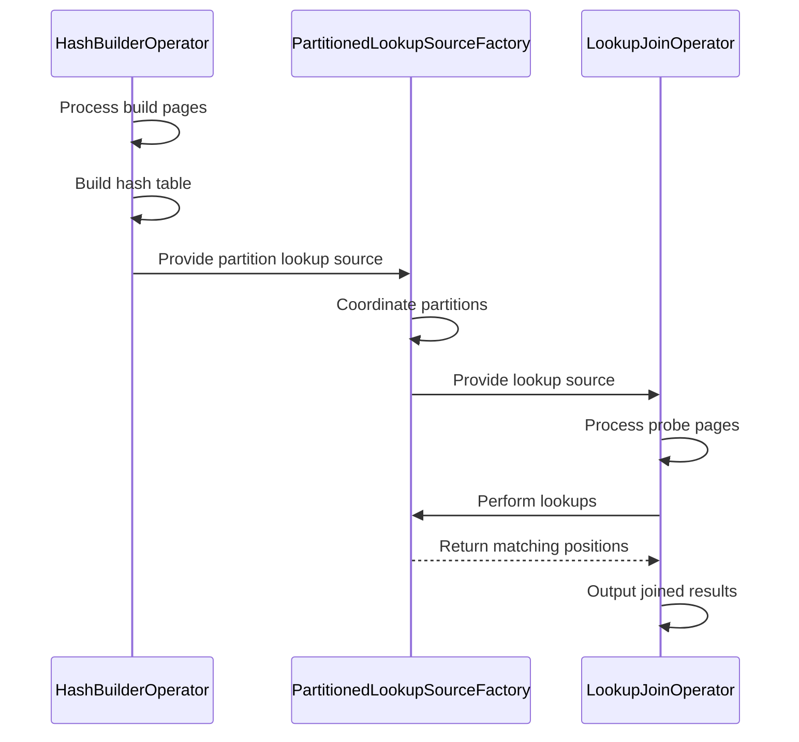
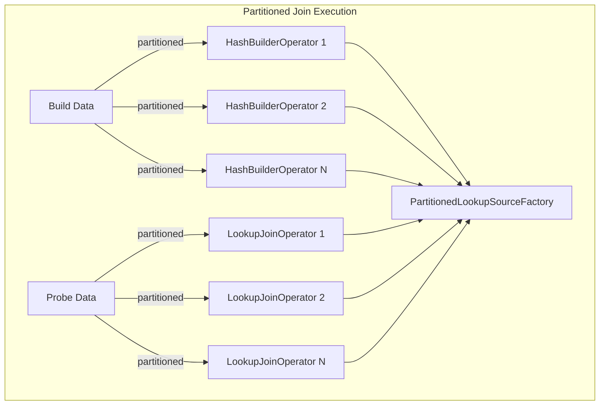
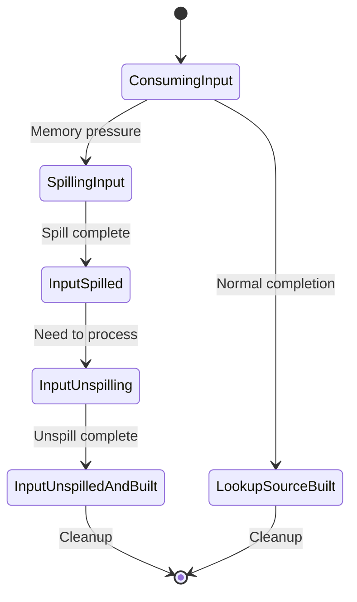
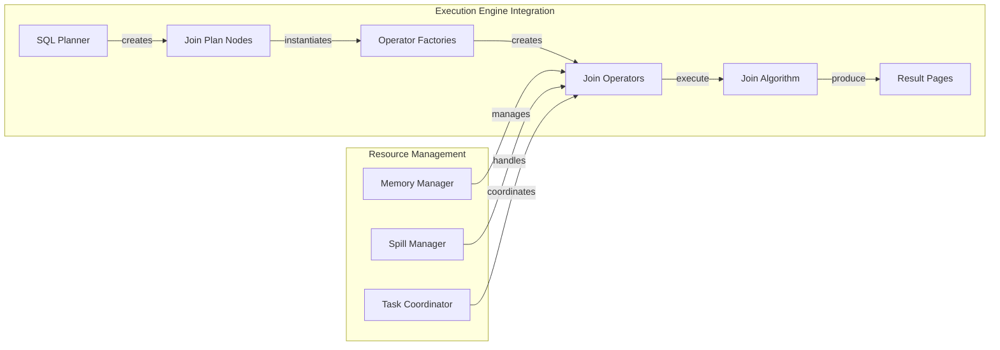

# Join Operations Module

## Introduction

The Join Operations module is a critical component of Trino's query execution engine, responsible for implementing efficient distributed join algorithms. This module provides the core infrastructure for executing various types of joins (inner, outer, full) using sophisticated techniques like hash joins, partitioned execution, and spilling to handle large datasets that exceed memory constraints.

## Architecture Overview

The Join Operations module implements a distributed hash join algorithm with support for memory management and spilling. The architecture consists of several key components that work together to provide efficient join processing across Trino's distributed cluster.

### Core Architecture Components

### Component Relationships

## Core Components

### HashBuilderOperator

The `HashBuilderOperator` is responsible for the build phase of hash joins. It processes input pages from the build side of the join, constructs hash tables, and manages memory usage with support for spilling when memory limits are exceeded.

**Key Responsibilities:**
- Build hash tables from build-side input pages
- Manage memory allocation and track usage
- Handle spilling to disk when memory constraints are reached
- Create `LookupSource` objects for the probe phase
- Support partitioned execution for distributed joins

**State Management:**
The operator implements a sophisticated state machine to handle various scenarios:
- `CONSUMING_INPUT`: Normal processing of input pages
- `SPILLING_INPUT`: Spilling pages to disk due to memory pressure
- `LOOKUP_SOURCE_BUILT`: Hash table construction complete
- `INPUT_SPILLED`: All input spilled to disk
- `INPUT_UNSPILLING`: Reading spilled data back to memory
- `INPUT_UNSPILLED_AND_BUILT`: Spilled data processed and hash table built
- `CLOSED`: Operator cleanup complete

### LookupJoinOperator

The `LookupJoinOperator` implements the probe phase of hash joins. It processes probe-side input pages and performs lookups against the hash tables built by `HashBuilderOperator`.

**Key Features:**
- Support for different join types (INNER, PROBE_OUTER, LOOKUP_OUTER, FULL_OUTER)
- Efficient hash-based lookups
- Spilling support for handling large probe datasets
- Statistics collection for query optimization
- Work processor integration for pipelined execution

### PartitionedLookupSourceFactory

This factory manages partitioned lookup sources for distributed join execution. It coordinates multiple `HashBuilderOperator` instances building different partitions of the hash table.

**Key Capabilities:**
- Partition management across multiple build operators
- Spill-aware lookup source provision
- Lifecycle management for lookup sources
- Support for outer joins with position tracking
- Thread-safe coordination of partition building

### JoinBridgeManager

The `JoinBridgeManager` coordinates the lifecycle of join operations, managing the interaction between build and probe phases across distributed workers.

**Responsibilities:**
- Reference counting for build and probe operators
- Lifecycle coordination between different join phases
- Resource cleanup and memory management
- Outer position iterator management for outer joins

## Join Algorithms

### Hash Join Algorithm

The module implements a classic distributed hash join algorithm with several optimizations:

### Partitioned Execution

For large datasets, the join operation is partitioned across multiple workers:

## Memory Management and Spilling

### Memory Management Strategy

The join operations implement sophisticated memory management to handle large datasets:

1. **Memory Tracking**: Accurate tracking of memory usage for both user and revocable memory
2. **Memory Revocation**: Support for memory revocation when the system is under memory pressure
3. **Index Compaction**: Automatic compaction of hash tables to reduce memory footprint
4. **Partitioned Memory**: Memory management across multiple partitions

### Spilling Mechanism

When memory limits are exceeded, the system can spill data to disk:

**Spilling Process:**
1. **Detection**: Memory revocation requests trigger spilling
2. **Spill Decision**: Based on memory usage and compaction effectiveness
3. **Spill Execution**: Write pages to disk using `SingleStreamSpiller`
4. **Spill Tracking**: Track spilled data for later recovery
5. **Unspilling**: Read spilled data back when needed
6. **Checksum Validation**: Ensure data integrity after unspilling

## Integration with Trino Architecture

### Query Planning Integration

The join operations integrate with Trino's query planning and optimization framework:

- **Plan Node Integration**: Join operators are created based on planner decisions
- **Statistics Integration**: Join statistics inform optimization decisions
- **Cost-Based Optimization**: Join algorithm selection based on cost estimates

### Execution Engine Integration

The module integrates with Trino's distributed execution engine:

### Data Processing Integration

The join operations work with Trino's data processing framework:

- **Page Processing**: Input and output using Trino's `Page` format
- **Type System**: Integration with Trino's type system for data handling
- **Block Processing**: Efficient processing of columnar data blocks

## Performance Optimizations

### Hash Table Optimizations

- **Hash Array Sizing**: Dynamic sizing based on data characteristics
- **Collision Handling**: Efficient collision resolution strategies
- **Memory Layout**: Optimized memory layout for cache efficiency
- **Parallel Building**: Support for parallel hash table construction

### Join Processing Optimizations

- **Early Filtering**: Apply filters during join processing
- **Single Match Optimization**: Optimize for joins that produce single matches
- **Outer Join Optimization**: Efficient handling of outer join semantics
- **Spill-Aware Processing**: Optimize processing when spilling occurs

### Distributed Execution Optimizations

- **Partition Pruning**: Eliminate unnecessary partition processing
- **Data Locality**: Optimize data placement for join performance
- **Network Optimization**: Minimize data transfer during distributed joins
- **Load Balancing**: Balance work across distributed workers

## Error Handling and Recovery

### Fault Tolerance

The join operations implement several mechanisms for fault tolerance:

- **Checksum Validation**: Verify data integrity after spilling/unspilling
- **State Consistency**: Maintain consistent state across failures
- **Resource Cleanup**: Proper cleanup of resources on failure
- **Memory Recovery**: Recovery from memory revocation scenarios

### Error Scenarios

Common error scenarios and their handling:

- **Memory Exhaustion**: Trigger spilling or query failure
- **Spill Failures**: Handle disk I/O errors during spilling
- **Data Corruption**: Detect and handle data corruption
- **Resource Leaks**: Prevent resource leaks through proper cleanup

## Monitoring and Observability

### Metrics Collection

The join operations collect comprehensive metrics for monitoring:

- **Performance Metrics**: Join processing time, throughput
- **Memory Metrics**: Memory usage, spilling statistics
- **Data Metrics**: Rows processed, join selectivity
- **Resource Metrics**: CPU usage, I/O statistics

### Logging and Debugging

- **State Transitions**: Detailed logging of operator state changes
- **Performance Events**: Logging of performance-critical events
- **Error Conditions**: Comprehensive error logging
- **Debug Information**: Detailed debug information for troubleshooting

## Configuration and Tuning

### Memory Configuration

- **Memory Limits**: Configure memory limits for join operations
- **Spill Thresholds**: Set thresholds for triggering spilling
- **Partition Sizes**: Configure optimal partition sizes
- **Buffer Sizes**: Tune buffer sizes for optimal performance

### Performance Tuning

- **Hash Table Parameters**: Tune hash table construction parameters
- **Parallelism**: Configure parallelism levels for join operations
- **Spill Configuration**: Tune spilling behavior and disk usage
- **Network Settings**: Optimize network parameters for distributed joins

## Future Enhancements

### Planned Improvements

- **Adaptive Join Algorithms**: Dynamic selection of join algorithms
- **Advanced Spilling**: Improved spilling strategies and algorithms
- **Vectorized Processing**: Enhanced vectorized join processing
- **Machine Learning Integration**: ML-based optimization for join processing

### Scalability Enhancements

- **Elastic Scaling**: Support for elastic scaling of join operations
- **Multi-Cloud Support**: Enhanced support for multi-cloud deployments
- **Edge Computing**: Support for edge computing scenarios
- **Real-time Processing**: Enhanced support for real-time join processing

## Related Documentation

- [Query Execution Engine](Query%20Execution%20Engine.md) - Overview of Trino's execution engine
- [SQL Analyzer, Planner & Optimizer](SQL%20Analyzer,%20Planner%20&%20Optimizer.md) - Query planning and optimization
- [Data Processing Framework](Data%20Processing%20Framework.md) - Core data processing components
- [Memory Management](Memory%20Management.md) - Memory management across Trino
- [Spilling and Disk Management](Spilling%20and%20Disk%20Management.md) - Detailed spilling mechanisms