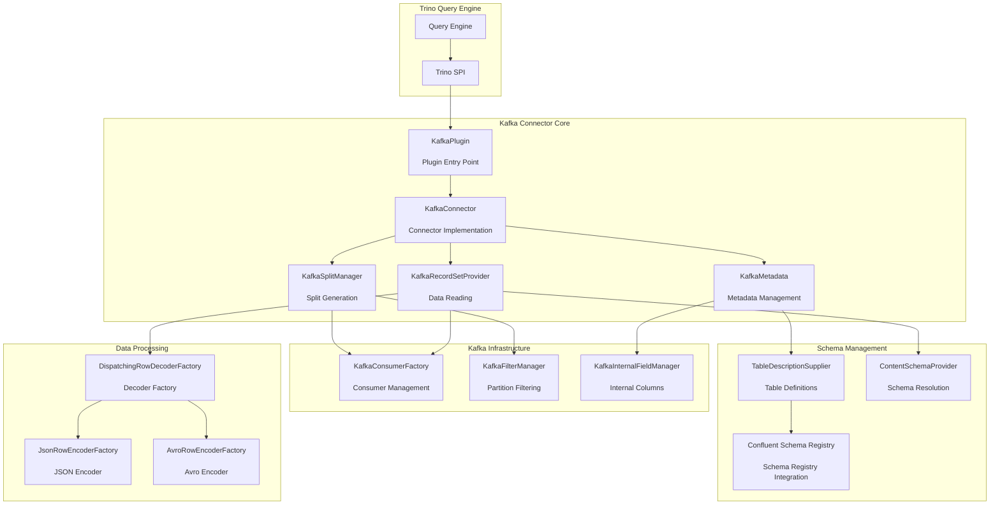
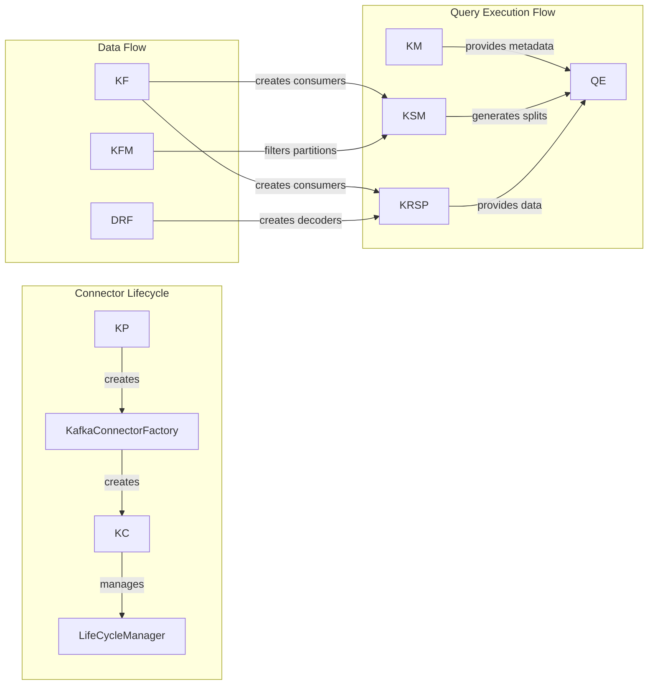
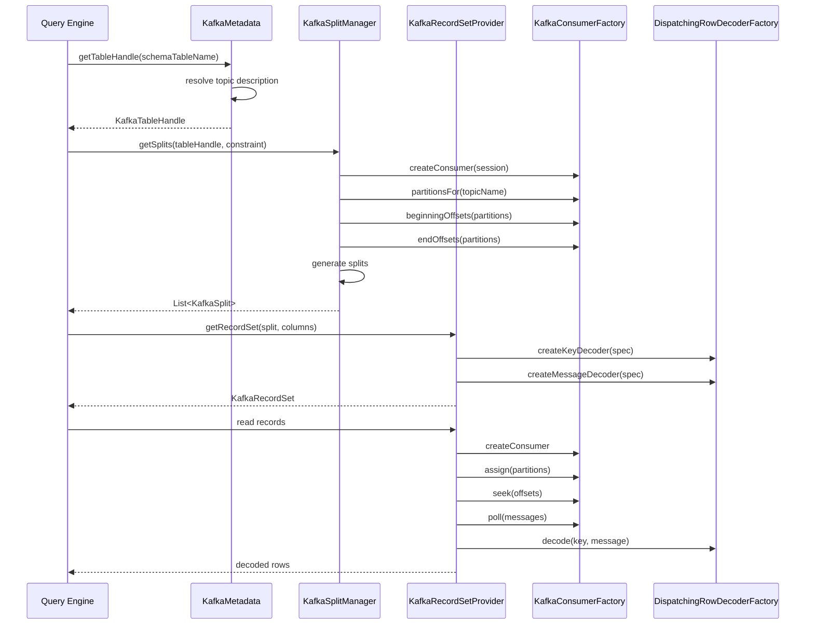
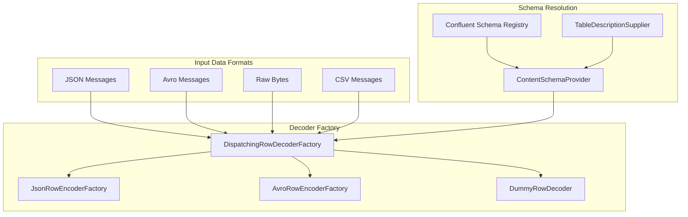

# Kafka Connector Core Module

## Introduction

The Kafka Connector Core module provides Trino's integration with Apache Kafka, enabling SQL queries against Kafka topics as if they were database tables. This connector bridges the gap between streaming data platforms and analytical query engines, allowing users to perform real-time analytics on Kafka message streams using standard SQL syntax.

The connector supports various data formats including JSON, Avro, and raw formats, with schema management through Confluent Schema Registry integration. It provides both read and write capabilities, making it suitable for both analytical workloads and data pipeline scenarios.

## Architecture Overview

The Kafka Connector follows Trino's standard connector architecture, implementing the SPI interfaces to provide seamless integration with the Trino query engine. The module is built around several key architectural principles:

### Core Architecture Components

### Component Relationships

## Core Components

### KafkaPlugin
The entry point for the Kafka connector that implements Trino's Plugin interface. It registers the connector factory and manages plugin lifecycle.

**Key Responsibilities:**
- Register connector factories with Trino
- Manage plugin extensions
- Provide plugin metadata

**Integration Points:**
- Implements [Trino SPI Plugin interface](Trino SPI.md#plugin-architecture)
- Creates KafkaConnectorFactory instances
- Supports dependency injection extensions

### KafkaConnector
The main connector implementation that coordinates all connector operations and manages the lifecycle of connector components.

**Key Responsibilities:**
- Transaction management (READ_COMMITTED isolation level)
- Component coordination (metadata, splits, record sets)
- Session property management
- Lifecycle management via LifeCycleManager

**Integration Points:**
- Implements Trino's Connector interface
- Delegates to KafkaMetadata for metadata operations
- Delegates to KafkaSplitManager for split generation
- Delegates to KafkaRecordSetProvider for data reading

### KafkaMetadata
Manages metadata operations for Kafka topics, including table discovery, column mapping, and schema resolution.

**Key Responsibilities:**
- Schema and table discovery
- Column handle management
- Table metadata construction
- Constraint application and filtering
- Internal column management

**Key Features:**
- **Internal Columns**: Provides additional Kafka-specific columns (_partition, _offset, _timestamp, etc.)
- **Schema Resolution**: Supports multiple data formats (JSON, Avro, raw)
- **Table Mapping**: Maps Kafka topics to Trino tables
- **Constraint Pushdown**: Applies filters to reduce data scanning

### KafkaSplitManager
Generates splits for parallel processing of Kafka partitions, enabling distributed query execution across multiple workers.

**Key Responsibilities:**
- Partition discovery and metadata retrieval
- Split generation based on message ranges
- Leader assignment for optimal data locality
- Integration with Kafka consumer API

**Split Generation Logic:**
- Discovers all partitions for a topic
- Retrieves beginning and end offsets
- Applies filtering based on constraints
- Creates splits with configurable message count limits
- Assigns splits to Kafka partition leaders

### KafkaRecordSetProvider
Provides record sets for reading data from Kafka topics, coordinating decoders and consumer management.

**Key Responsibilities:**
- Record set creation for query execution
- Decoder factory coordination
- Column filtering and projection
- Consumer lifecycle management

**Data Processing Flow:**
1. Creates appropriate decoders for key and message data
2. Filters columns based on query requirements
3. Instantiates KafkaRecordSet with proper configuration
4. Manages decoder parameters and schema resolution

## Data Flow Architecture

### Query Execution Flow

### Data Format Support

## Schema Management

### Table Description System
The connector uses a flexible table description system that maps Kafka topics to Trino tables with customizable schemas.

**Components:**
- **TableDescriptionSupplier**: Provides table definitions
- **KafkaTopicDescription**: Defines topic structure and field mappings
- **KafkaTopicFieldGroup**: Groups key and message fields
- **KafkaTopicFieldDescription**: Individual field definitions

### Schema Registry Integration
Integration with Confluent Schema Registry enables automatic schema discovery and evolution support.

**Features:**
- Automatic schema retrieval by subject
- Schema version management
- Compatibility checking
- Multiple serialization formats (Avro, JSON Schema, Protobuf)

### Internal Field Management
The connector provides Kafka-specific internal fields that expose message metadata.

**Available Internal Fields:**
- `_partition`: Kafka partition number
- `_offset`: Message offset within partition
- `_timestamp`: Message timestamp
- `_key`: Raw message key
- `_message`: Raw message content
- `_headers`: Message headers

## Configuration and Extension Points

### Kafka Configuration
The connector provides extensive configuration options through KafkaConfig:

**Key Configuration Areas:**
- Consumer properties and behavior
- Split generation parameters
- Internal column visibility
- Schema registry settings
- Message processing limits

### Extension Mechanisms
The plugin supports dependency injection extensions for customization:

**Extension Points:**
- Custom table description suppliers
- Additional decoders and encoders
- Specialized filtering logic
- Custom authentication mechanisms

### Session Properties
Runtime configuration through session properties:

**Available Properties:**
- Message format preferences
- Consumer configuration overrides
- Schema resolution behavior
- Internal column visibility

## Integration with Trino Ecosystem

### SPI Integration
The connector fully implements Trino's SPI interfaces, ensuring seamless integration with the query engine.

**SPI Implementations:**
- [Plugin](Trino SPI.md#plugin-architecture): Entry point registration
- [Connector](Trino SPI.md#connector-framework): Main connector interface
- [ConnectorMetadata](Trino SPI.md#connector-framework): Metadata operations
- [ConnectorSplitManager](Trino SPI.md#connector-framework): Split generation
- [ConnectorRecordSetProvider](Trino SPI.md#connector-framework): Data reading

### Transaction Support
The connector supports READ_COMMITTED isolation level, appropriate for Kafka's streaming nature.

**Transaction Behavior:**
- Single transaction handle per query
- No support for versioned tables
- Read-only transaction optimization
- No retry support for inserts

### Error Handling
Comprehensive error handling for Kafka-specific scenarios:

**Error Types:**
- Connection failures and timeouts
- Schema resolution errors
- Message decoding failures
- Partition leadership changes
- Offset validation issues

## Performance Optimization

### Split Generation Strategy
The connector optimizes split generation for parallel processing:

**Optimization Techniques:**
- Partition-aware split creation
- Leader-based split assignment
- Configurable message batch sizes
- Dynamic filtering support

### Consumer Management
Efficient Kafka consumer lifecycle management:

**Management Strategies:**
- Connection pooling
- Session-aware consumer creation
- Proper resource cleanup
- Error recovery mechanisms

### Predicate Pushdown
Constraint application reduces data scanning overhead:

**Supported Pushdowns:**
- Partition filtering
- Offset range filtering
- Timestamp-based filtering
- Key-based filtering

## Security and Access Control

### Authentication Support
Integration with Kafka's security mechanisms:

**Security Features:**
- SASL authentication support
- SSL/TLS encryption
- Kerberos integration
- Custom authenticator support

### Authorization
Topic-level access control through Kafka's ACL system:

**Access Control:**
- Topic read permissions
- Topic write permissions
- Consumer group permissions
- Schema registry access

## Monitoring and Observability

### Metrics Collection
Comprehensive metrics for monitoring connector performance:

**Key Metrics:**
- Consumer lag and throughput
- Split generation timing
- Message processing rates
- Error frequencies
- Connection health

### Logging
Structured logging for troubleshooting and monitoring:

**Log Categories:**
- Connection establishment
- Schema resolution
- Message processing
- Error conditions
- Performance metrics

## Deployment and Operations

### Installation
The connector is deployed as a standard Trino plugin:

**Deployment Steps:**
1. Package connector JAR
2. Deploy to Trino plugin directory
3. Configure connector properties
4. Restart Trino cluster
5. Create catalog configuration

### Configuration Management
Flexible configuration through multiple mechanisms:

**Configuration Sources:**
- Catalog configuration files
- Session properties
- Environment variables
- Runtime parameter injection

### Operational Considerations
Best practices for production deployment:

**Operational Guidelines:**
- Consumer group management
- Offset retention policies
- Schema evolution handling
- Resource monitoring
- Performance tuning

## Future Enhancements

### Planned Features
- Transactional write support
- Enhanced schema evolution
- Improved filtering capabilities
- Additional data format support
- Performance optimizations

### Development Roadmap
- Kafka Streams integration
- Exactly-once semantics
- Advanced partitioning strategies
- Multi-datacenter support
- Cloud-native features

## Related Documentation

- [Trino SPI](Trino SPI.md) - Core plugin and connector interfaces
- [Plugin Toolkit](Plugin Toolkit.md) - Base classes and utilities for plugin development
- [Base JDBC Connector](Base JDBC Connector.md) - Reference connector implementation patterns
- [Trino Server & API](Trino Server & API.md) - Server integration and REST API
- [SQL Parser & AST](SQL Parser & AST.md) - Query parsing and analysis
- [Query Execution Engine](Query Execution Engine.md) - Query execution framework