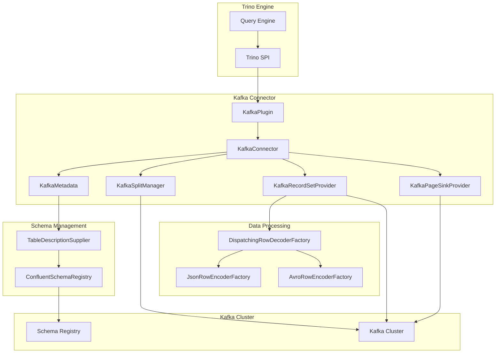
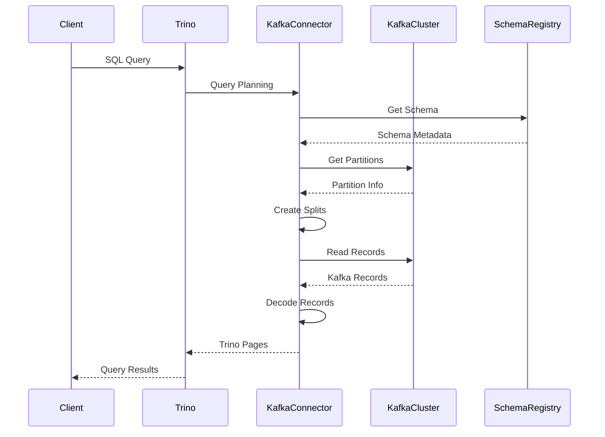

# Kafka Connector

## Overview

The Kafka Connector is a Trino plugin that enables querying and writing data to Apache Kafka topics. It provides seamless integration between Trino's distributed SQL query engine and Kafka's streaming data platform, allowing users to perform real-time analytics on streaming data using standard SQL syntax.

## Purpose and Core Functionality

The Kafka Connector serves as a bridge between Trino and Apache Kafka, providing:

- **Real-time Data Access**: Query streaming data from Kafka topics using SQL
- **Schema Evolution Support**: Integration with schema registries for automatic schema management
- **Multiple Data Formats**: Support for JSON, Avro, and other data serialization formats
- **Bidirectional Data Flow**: Both reading from and writing to Kafka topics
- **Internal Metadata Access**: Access to Kafka-specific metadata like partition, offset, and timestamp

## Architecture Overview

## Component Architecture

The Kafka Connector follows Trino's standard connector architecture with the following key components:

### Core Connector Components

1. **KafkaPlugin** - Entry point that registers the connector with Trino
2. **KafkaConnector** - Main connector implementation managing lifecycle and component coordination
3. **KafkaMetadata** - Handles metadata operations, table discovery, and schema management
4. **KafkaSplitManager** - Manages data partitioning and split creation for distributed processing
5. **KafkaRecordSetProvider** - Provides data reading capabilities with format-specific decoders
6. **KafkaPageSinkProvider** - Handles data writing operations to Kafka topics

### Schema Management System

7. **ConfluentSchemaRegistryTableDescriptionSupplier** - Integrates with Confluent Schema Registry for automatic schema discovery
8. **TableDescriptionSupplier** - Abstract interface for table metadata provision

### Data Format Support

9. **JsonRowEncoderFactory** - Creates JSON format encoders for data serialization
10. **AvroRowEncoderFactory** - Creates Avro format encoders with schema support

## Data Flow Architecture

## Key Features

### Schema Management
- **Automatic Schema Discovery**: Integrates with Confluent Schema Registry
- **Multi-format Support**: JSON, Avro, and custom formats
- **Schema Evolution**: Handles schema changes transparently
- **Subject Resolution**: Flexible subject naming strategies

### Data Processing
- **Parallel Processing**: Distributed reading across Kafka partitions
- **Predicate Pushdown**: Efficient filtering at the connector level
- **Internal Columns**: Access to Kafka metadata (partition, offset, timestamp)
- **Flexible Configuration**: Per-topic format and schema configuration

### Performance Optimization
- **Split-based Processing**: Configurable messages per split for optimal parallelism
- **Filter Management**: Intelligent partition filtering
- **Connection Pooling**: Efficient Kafka consumer management
- **Caching**: Schema and metadata caching for improved performance

## Integration Points

The Kafka Connector integrates with the broader Trino ecosystem:

- **[Trino SPI](Trino SPI.md)**: Standard connector interface
- **[Plugin Architecture](Plugin Architecture.md)**: Plugin registration and lifecycle management
- **[Connector Framework](Connector Framework.md)**: Base connector functionality
- **[Data Processing Framework](Data Processing Framework.md)**: Page-based data processing

## Configuration and Deployment

The connector supports extensive configuration options for:
- Kafka cluster connection settings
- Schema registry integration
- Data format specifications
- Performance tuning parameters
- Security and authentication

## Sub-modules Documentation

For detailed information about specific sub-modules, refer to:

- **[Kafka Connector Core](Kafka Connector Core.md)**: Core connector components and lifecycle management including KafkaPlugin, KafkaConnector, KafkaMetadata, KafkaSplitManager, and KafkaRecordSetProvider
- **[Kafka Schema Management](Kafka Schema Management.md)**: Schema registry integration and table description management through ConfluentSchemaRegistryTableDescriptionSupplier
- **[Kafka Data Processing](Kafka Data Processing.md)**: Data encoding/decoding and record processing via JsonRowEncoderFactory and AvroRowEncoderFactory

Each sub-module documentation provides in-depth coverage of the respective components, their responsibilities, and implementation details.