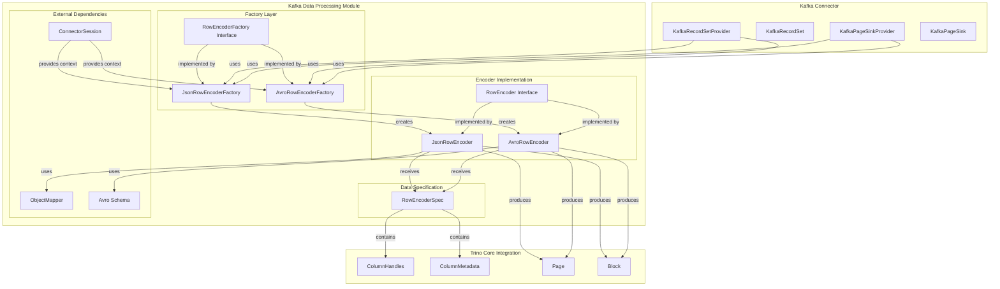
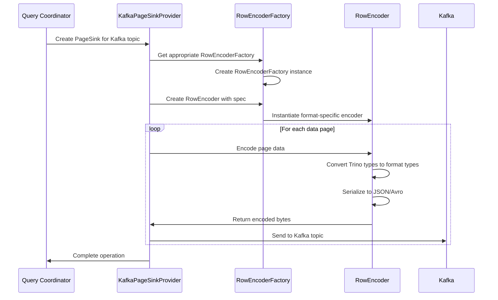
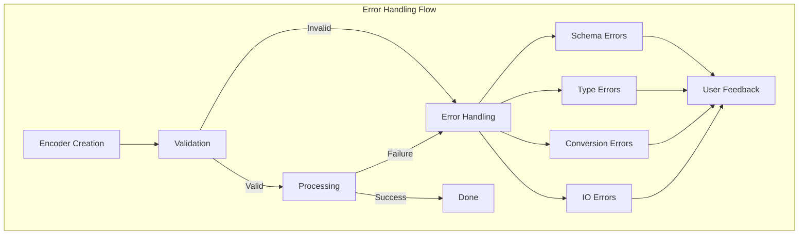

# Kafka Data Processing Module

## Introduction

The Kafka Data Processing module is a critical component of the Trino Kafka Connector that handles the serialization and deserialization of data between Trino's internal data formats and Kafka message formats. This module provides the encoding infrastructure that enables Trino to read from and write to Kafka topics using various data serialization formats, primarily JSON and Avro.

The module serves as the bridge between Trino's columnar data processing engine and Kafka's message-based streaming architecture, ensuring seamless data transformation while maintaining type safety and performance.

## Architecture Overview

The Kafka Data Processing module implements a factory pattern architecture that provides pluggable encoders for different data formats. The architecture is designed to be extensible, allowing for additional format support beyond JSON and Avro.



## Core Components

### RowEncoderFactory Interface
The `RowEncoderFactory` interface defines the contract for creating row encoders. It serves as the entry point for the factory pattern implementation, allowing the Kafka connector to instantiate appropriate encoders based on the desired output format.

### JsonRowEncoderFactory
The `JsonRowEncoderFactory` creates JSON-based row encoders that convert Trino's internal data structures into JSON format for Kafka messages. Key characteristics:
- Uses Jackson's `ObjectMapper` for JSON serialization
- Handles type mapping between Trino types and JSON types
- Supports nested data structures and complex types
- Thread-safe through dependency injection of `ObjectMapper`

### AvroRowEncoderFactory  
The `AvroRowEncoderFactory` creates Avro-based row encoders that serialize data according to Avro schema specifications. Key characteristics:
- Requires Avro schema definition for data serialization
- Provides schema evolution capabilities
- Supports complex Avro types including unions, records, and arrays
- Validates schema presence before encoder creation

### RowEncoder Interface
The `RowEncoder` interface defines the contract for encoding Trino data rows into Kafka-compatible formats. Implementations handle:
- Column value extraction from Trino's internal representation
- Type conversion and validation
- Format-specific serialization logic
- Error handling for encoding failures

### RowEncoderSpec
The `RowEncoderSpec` encapsulates the specification required for creating row encoders, including:
- Column handles for data access
- Column metadata for type information
- Optional data schema (required for Avro)
- Format-specific configuration parameters

## Data Flow Architecture



## Integration with Trino Core

The Kafka Data Processing module integrates with several Trino core components:

### Type System Integration
- Leverages Trino's [Type System](Type System.md) for data type mapping
- Converts between Trino's internal types and format-specific types
- Maintains type safety during serialization/deserialization

### Page and Block Processing
- Works with Trino's [Data Processing Framework](Data Processing Framework.md) components
- Processes data in columnar format using `Page` and `Block` structures
- Optimizes for batch processing and vectorized operations

### Connector Framework Integration
- Implements Trino's [Connector Framework](Connector Framework.md) contracts
- Provides format-specific data handling capabilities
- Integrates with connector metadata and transaction management

## Format-Specific Implementations

### JSON Processing
The JSON encoder implementation provides:
- **Type Mapping**: Converts Trino types to JSON-compatible representations
- **Nested Structure Support**: Handles complex types like arrays, maps, and rows
- **Null Handling**: Proper serialization of null values
- **Date/Time Formatting**: ISO 8601 compliant timestamp formatting
- **Decimal Precision**: Preserves decimal precision and scale

### Avro Processing  
The Avro encoder implementation provides:
- **Schema Validation**: Ensures data conforms to Avro schema
- **Type Compatibility**: Maps Trino types to Avro types
- **Schema Evolution**: Supports backward and forward compatibility
- **Union Type Handling**: Manages Avro's union type semantics
- **Record Serialization**: Handles nested record structures

## Error Handling and Validation

The module implements comprehensive error handling:



### Validation Strategies
- **Schema Validation**: Ensures Avro schema validity before processing
- **Type Validation**: Verifies type compatibility between Trino and target format
- **Data Validation**: Checks data constraints and business rules
- **Format Validation**: Validates output format compliance

## Performance Considerations

### Optimization Strategies
- **Object Reuse**: Reuses encoder instances and buffers where possible
- **Batch Processing**: Processes data in batches to reduce overhead
- **Lazy Evaluation**: Defers expensive operations until necessary
- **Memory Management**: Efficient memory usage for large data volumes

### Scalability Features
- **Thread Safety**: Factory and encoder instances are thread-safe
- **Parallel Processing**: Supports concurrent encoding operations
- **Resource Pooling**: Manages expensive resources like ObjectMapper
- **Streaming Support**: Handles large datasets without full materialization

## Configuration and Usage

### Factory Configuration
```java
// JSON encoder factory configuration
JsonRowEncoderFactory jsonFactory = new JsonRowEncoderFactory(objectMapper);

// Avro encoder factory configuration  
AvroRowEncoderFactory avroFactory = new AvroRowEncoderFactory();
```

### Encoder Creation
```java
// Create encoder specification
RowEncoderSpec spec = RowEncoderSpec.builder()
    .columnHandles(columnHandles)
    .columnMetadata(columnMetadata)
    .dataSchema(optionalSchema) // Required for Avro
    .build();

// Create appropriate encoder
RowEncoder encoder = factory.create(session, spec);
```

## Extension Points

The module provides several extension points for customization:

### Custom Format Support
- Implement `RowEncoderFactory` for new formats
- Implement `RowEncoder` for format-specific logic
- Register factories through dependency injection

### Type Mapping Customization
- Override default type mappings
- Add support for custom types
- Implement format-specific type conversions

### Schema Management
- Custom schema resolution strategies
- Dynamic schema evolution handling
- Schema registry integration

## Testing and Quality Assurance

The module includes comprehensive testing:
- **Unit Tests**: Individual component testing
- **Integration Tests**: End-to-end format validation
- **Performance Tests**: Throughput and latency benchmarks
- **Compatibility Tests**: Cross-version format compatibility

## Dependencies and Related Modules

The Kafka Data Processing module depends on and integrates with:

- **[Kafka Connector](Kafka Connector.md)**: Parent connector providing Kafka integration
- **[Trino SPI](Trino SPI.md)**: Core interfaces and contracts
- **[Type System](Type System.md)**: Type mapping and conversion logic
- **[Data Processing Framework](Data Processing Framework.md)**: Page and Block processing
- **[Connector Framework](Connector Framework.md)**: Connector lifecycle management

## Future Enhancements

Potential areas for future development:
- **Additional Format Support**: Protocol Buffers, MessagePack
- **Schema Registry Integration**: Enhanced schema management
- **Performance Optimizations**: Vectorized encoding operations
- **Compression Support**: Built-in compression for encoded data
- **Streaming Optimizations**: Real-time encoding improvements

## Summary

The Kafka Data Processing module provides a robust, extensible framework for encoding Trino data into Kafka-compatible formats. Through its factory-based architecture and comprehensive format support, it enables seamless integration between Trino's analytical processing capabilities and Kafka's streaming infrastructure. The module's design emphasizes type safety, performance, and extensibility, making it a critical component for real-time data processing pipelines in the Trino ecosystem.