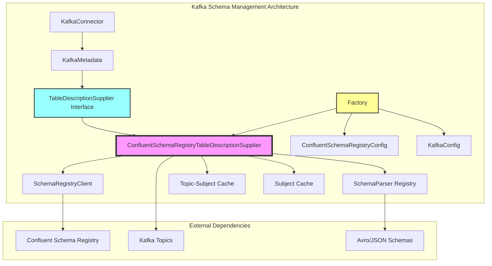
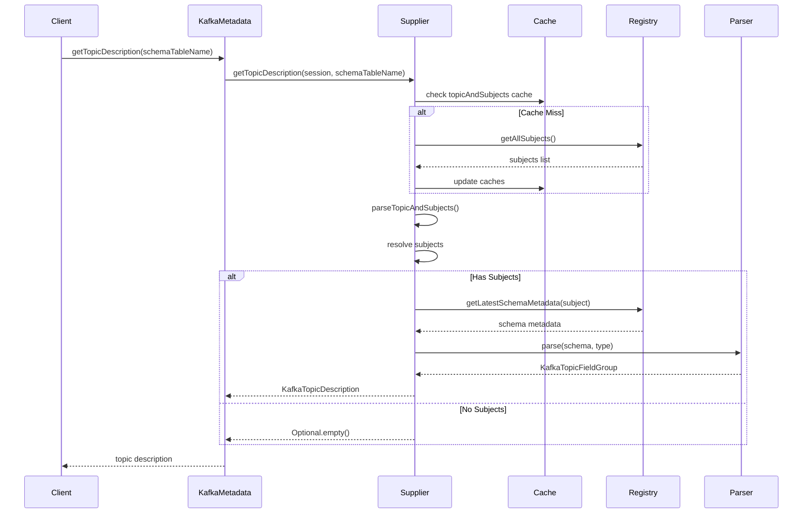
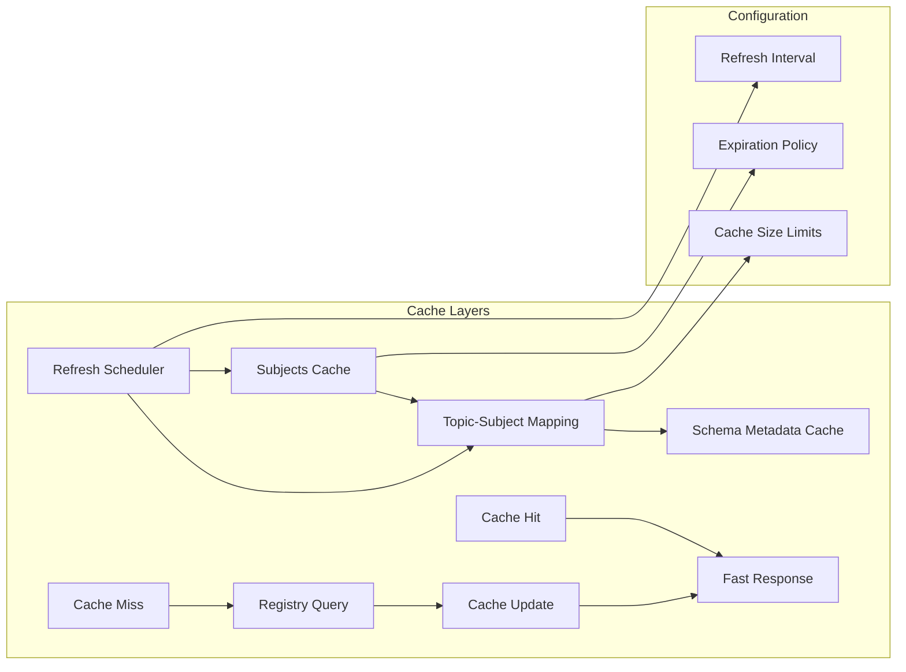
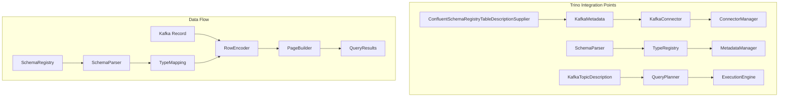

# Kafka Schema Management Module

## Introduction

The Kafka Schema Management module is a critical component of Trino's Kafka connector that provides seamless integration with external schema registries, particularly Confluent Schema Registry. This module enables Trino to automatically discover and parse Kafka topic schemas, supporting both key and value serialization formats including Avro and JSON. By bridging the gap between Kafka's schema registry ecosystem and Trino's type system, this module allows users to query Kafka topics without manual schema definition, ensuring data consistency and compatibility across the entire data pipeline.

## Architecture Overview

The Kafka Schema Management module implements a sophisticated schema discovery and resolution mechanism that operates at the intersection of Kafka's schema registry ecosystem and Trino's metadata management system. The architecture is built around the principle of lazy schema resolution with intelligent caching, ensuring optimal performance while maintaining schema consistency.

## Core Components

### ConfluentSchemaRegistryTableDescriptionSupplier

The `ConfluentSchemaRegistryTableDescriptionSupplier` serves as the central orchestrator for schema management within the Kafka connector. This component implements the `TableDescriptionSupplier` interface, providing a bridge between Kafka's schema registry and Trino's metadata system. The class employs a sophisticated caching strategy with configurable refresh intervals to balance performance with schema freshness.

The supplier maintains two primary caches: a subject-to-topic mapping cache and a comprehensive subjects cache. These caches are populated through periodic refresh operations that query the Confluent Schema Registry for all available subjects. The caching mechanism uses memoization with expiration, ensuring that schema information remains current while minimizing registry API calls.

Key responsibilities include subject resolution, topic-to-subject mapping, and schema metadata retrieval. The component supports both the default TopicNameStrategy and custom subject naming strategies, allowing for flexible schema organization patterns. When topics use non-standard subject naming, the system supports explicit subject specification through encoded table names.

### Factory Pattern Implementation

The `Factory` class implements the dependency injection pattern, serving as the primary entry point for creating `ConfluentSchemaRegistryTableDescriptionSupplier` instances. This factory is responsible for wiring together all necessary dependencies including the schema registry client, schema parsers, and configuration parameters.

The factory receives its dependencies through constructor injection, ensuring loose coupling and testability. It aggregates configuration from both `KafkaConfig` and `ConfluentSchemaRegistryConfig`, providing a unified configuration interface. The factory pattern enables the creation of multiple supplier instances with different configurations, supporting multi-tenant deployments and varied schema registry setups.

### Schema Parser Integration

The module integrates with a pluggable schema parser architecture that supports multiple serialization formats. The `SchemaParser` interface provides a common abstraction for parsing different schema types, with concrete implementations for Avro and JSON formats. This design enables the system to handle diverse data serialization requirements while maintaining a consistent parsing interface.

Schema parsers are registered in a map structure keyed by schema type, allowing for runtime selection based on the schema metadata retrieved from the registry. Each parser is responsible for converting the external schema format into Trino's internal type system, ensuring compatibility with Trino's query engine.

## Schema Resolution Process

## Subject Naming Strategies

The module implements sophisticated subject naming resolution that supports both Confluent's default naming strategies and custom configurations. The system recognizes two primary subject suffixes: `-key` for message keys and `-value` for message values, following Confluent's conventions.

For topics using the TopicNameStrategy, the system automatically constructs subject names by appending the appropriate suffix to the topic name. This enables automatic schema discovery without additional configuration. When topics employ custom SubjectNameStrategy implementations, the system supports explicit subject specification through encoded table names.

The encoded table name format allows users to specify custom key and value subjects: `<table-name>&key-subject=<key-subject>&value-subject=<value-subject>`. This flexible approach accommodates complex schema registry deployments while maintaining backward compatibility with standard configurations.

## Caching Architecture

The caching system employs a multi-layered approach to optimize performance and reduce schema registry load. The primary cache layer maintains a mapping of all available subjects, refreshed at configurable intervals. This cache supports case-insensitive subject resolution, accommodating various naming conventions.

The secondary cache layer maintains the topic-to-subjects mapping, derived from the primary subjects cache. This mapping enables rapid lookup of relevant subjects for a given topic, supporting both key and value subject resolution. The caching mechanism uses Guava's memoization utilities with expiration, providing thread-safe access patterns suitable for concurrent query workloads.

## Error Handling and Validation

The module implements comprehensive error handling strategies to manage various failure scenarios in distributed schema registry deployments. Subject ambiguity detection prevents ambiguous schema resolution by validating that subject references resolve to single, unambiguous subjects.

When multiple subjects match a given reference, the system raises a `SCHEMA_REGISTRY_AMBIGUOUS_SUBJECT` exception with detailed information about the conflicting subjects. This proactive validation prevents runtime errors and provides clear guidance for resolving configuration issues.

Network failures and registry unavailability are handled through exception wrapping and propagation, ensuring that temporary connectivity issues are properly reported to the query layer. The caching mechanism provides resilience against brief registry outages, allowing continued operation with cached schema information.

## Integration with Trino Ecosystem

The schema management module integrates seamlessly with Trino's broader connector architecture through well-defined interfaces. The `TableDescriptionSupplier` interface provides the primary integration point, allowing the Kafka connector to participate in Trino's metadata discovery process.

Schema information flows from the registry through the parser layer into Trino's type system, enabling the query engine to understand Kafka message structures. This integration supports complex query operations including predicate pushdown, column pruning, and type-specific optimizations.

## Configuration and Deployment

The module supports extensive configuration options through dedicated configuration classes. The `ConfluentSchemaRegistryConfig` provides registry-specific settings including connection parameters, authentication credentials, and cache refresh intervals. These configurations integrate with Trino's broader configuration management system, supporting both file-based and environment-based configuration approaches.

Deployment flexibility is achieved through the plugin architecture, allowing the Kafka connector to be deployed independently of the core Trino system. The module supports multiple schema registry instances, enabling connections to different registry deployments for different Kafka clusters.

## Performance Considerations

The caching architecture is designed to minimize schema registry API calls while ensuring schema freshness. Cache refresh intervals can be tuned based on the volatility of schema changes in the deployment environment. For environments with stable schemas, longer refresh intervals reduce registry load and improve query performance.

Subject resolution employs efficient data structures including multimaps for case-insensitive lookups and memoization for expensive operations. The system is designed to handle large numbers of topics and subjects efficiently, with linear time complexity for most operations.

## Security and Access Control

The module integrates with Trino's security framework through the connector's access control mechanisms. Schema registry access can be secured through authentication configurations in the `ConfluentSchemaRegistryConfig`, supporting various authentication schemes including basic authentication and SSL/TLS encryption.

Access to specific topics and their schemas is controlled through Trino's standard privilege system, with the schema management module providing the necessary metadata for access control decisions. This integration ensures that schema discovery respects the same security boundaries as data access.

## Monitoring and Observability

The module provides integration points for monitoring and observability through Trino's event system and logging framework. Cache performance metrics, registry API call frequencies, and schema resolution times can be monitored to ensure optimal operation.

Error conditions and exceptional situations are logged with appropriate context, facilitating troubleshooting in production deployments. The caching mechanism provides visibility into cache hit rates and refresh patterns, enabling performance optimization.

## Future Enhancements

The modular architecture supports future enhancements including additional schema registry implementations, support for emerging serialization formats, and enhanced caching strategies. The pluggable parser architecture enables easy addition of new schema types as they become prevalent in the Kafka ecosystem.

Potential enhancements include support for schema evolution strategies, compatibility checking between schema versions, and integration with schema registry's compatibility enforcement features. These capabilities would further strengthen the module's position as a comprehensive schema management solution for Kafka-based data pipelines.