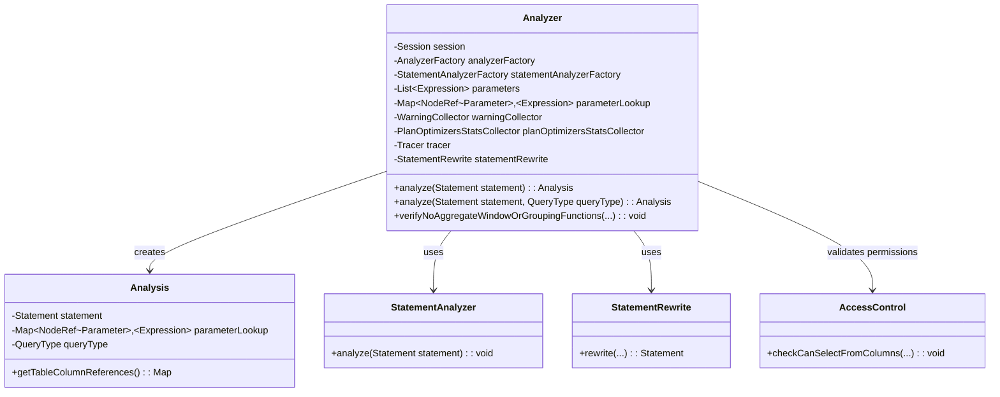
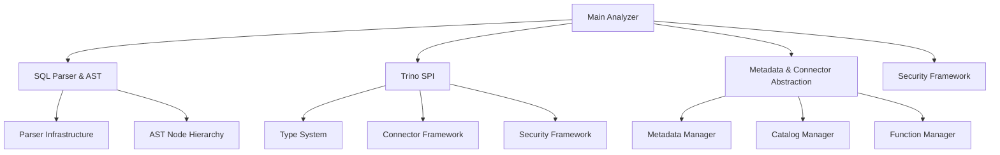
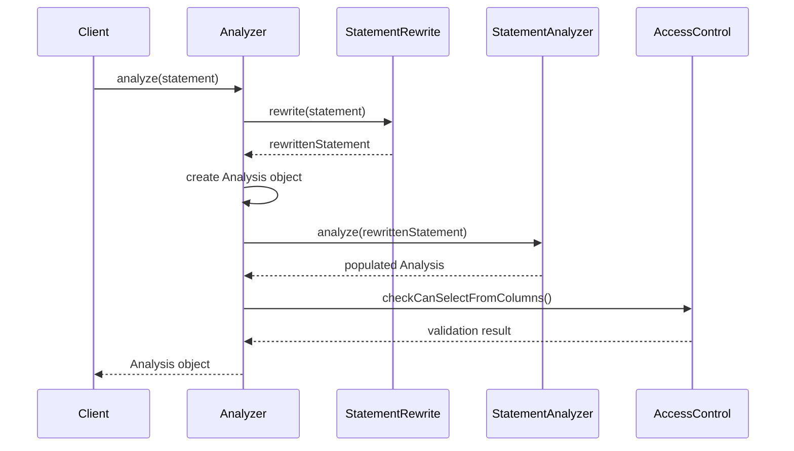
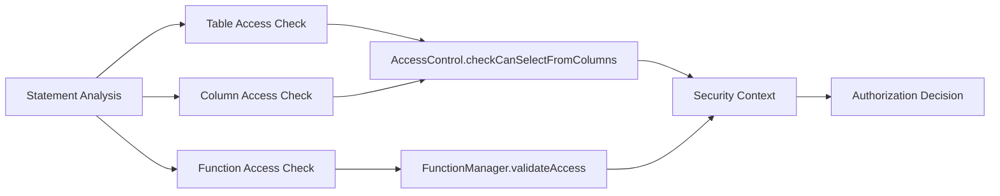

# Main Analyzer Module Documentation

## Introduction

The Main Analyzer module is the core semantic analysis engine of Trino, responsible for validating and analyzing SQL statements to ensure they are semantically correct before execution. It serves as the bridge between the SQL Parser and the Query Planner, transforming parsed SQL statements into analyzed statements with complete semantic information.

## Overview

The Main Analyzer module is built around the `Analyzer` class, which orchestrates the semantic analysis process. It validates SQL statements against the database schema, checks access permissions, resolves identifiers, and builds a comprehensive `Analysis` object that contains all semantic information needed for query planning and optimization.

## Core Architecture

### Main Components



### Module Dependencies



## Detailed Component Analysis

### Analyzer Class

The `Analyzer` class is the main entry point for semantic analysis. It coordinates the entire analysis process through the following key responsibilities:

1. **Statement Rewriting**: Applies statement-level transformations before analysis
2. **Semantic Analysis**: Delegates to `StatementAnalyzer` for detailed semantic validation
3. **Access Control Validation**: Ensures users have appropriate permissions for accessed resources
4. **Parameter Handling**: Manages query parameters and their resolution
5. **Tracing Integration**: Provides OpenTelemetry tracing for analysis operations

#### Key Methods

- `analyze(Statement statement)`: Main analysis entry point with default query type
- `analyze(Statement statement, QueryType queryType)`: Full analysis with specified query type
- `verifyNoAggregateWindowOrGroupingFunctions()`: Utility method for expression validation

### Analysis Process Flow



## Integration with Other Modules

### SQL Parser Integration

The Main Analyzer depends on the [SQL Parser & AST](SQL Parser & AST.md) module for:
- **AST Node Processing**: Receives parsed `Statement` objects from the parser
- **Expression Trees**: Processes `Expression` nodes for semantic validation
- **Parameter Handling**: Manages `Parameter` nodes and their resolution

### Trino SPI Integration

The analyzer integrates with [Trino SPI](Trino SPI.md) components:
- **Type System**: Validates type compatibility and resolves type information
- **Connector Framework**: Interfaces with connector metadata for schema validation
- **Security Framework**: Leverages SPI security interfaces for access control

### Metadata Integration

Works closely with [Metadata & Connector Abstraction](Metadata & Connector Abstraction.md):
- **Schema Resolution**: Resolves table and column metadata
- **Function Resolution**: Validates function calls and signatures
- **Catalog Management**: Handles multi-catalog query scenarios

## Security and Access Control

The analyzer implements comprehensive security validation:



## Error Handling and Validation

The analyzer provides detailed semantic validation with specific error types:

- **Expression Validation**: Ensures expressions are scalar when required
- **Type Checking**: Validates type compatibility across operations
- **Schema Validation**: Verifies table and column existence
- **Permission Checking**: Validates user access rights

## Performance Considerations

### Optimization Features

1. **Caching**: Leverages metadata caching to avoid repeated schema lookups
2. **Incremental Analysis**: Reuses analysis results where possible
3. **Parallel Processing**: Supports concurrent analysis of independent statements
4. **Statistics Collection**: Integrates with plan optimizer statistics

### Monitoring and Observability

The analyzer provides comprehensive tracing through OpenTelemetry:
- **Analysis Span**: Tracks overall analysis duration
- **Access Control Span**: Monitors permission checking performance
- **Statement Analysis Span**: Profiles individual statement analysis

## Usage Examples

### Basic Analysis Flow

```java
// Create analyzer with session and dependencies
Analyzer analyzer = new Analyzer(
    session,
    analyzerFactory,
    statementAnalyzerFactory,
    parameters,
    parameterLookup,
    warningCollector,
    planOptimizersStatsCollector,
    tracer,
    statementRewrite
);

// Analyze a SQL statement
Analysis analysis = analyzer.analyze(parsedStatement);

// Use the analysis for query planning
PlanNode plan = queryPlanner.plan(analysis);
```

### Error Handling

```java
try {
    Analysis analysis = analyzer.analyze(statement);
} catch (SemanticException e) {
    // Handle semantic errors (invalid table, column, etc.)
    logger.error("Semantic analysis failed: {}", e.getMessage());
} catch (AccessDeniedException e) {
    // Handle permission errors
    logger.error("Access denied: {}", e.getMessage());
}
```

## Testing and Quality Assurance

The Main Analyzer module includes comprehensive testing:
- **Unit Tests**: Individual component validation
- **Integration Tests**: End-to-end analysis scenarios
- **Security Tests**: Access control validation
- **Performance Tests**: Analysis throughput and latency

## Future Enhancements

Potential areas for improvement:
1. **Incremental Analysis**: Better support for partial re-analysis
2. **Parallel Analysis**: Enhanced concurrent processing capabilities
3. **Machine Learning Integration**: Intelligent query optimization hints
4. **Extended Security**: Fine-grained access control policies

## Related Documentation

- [SQL Parser & AST](SQL Parser & AST.md) - Input processing and AST generation
- [SQL Analyzer, Planner & Optimizer](SQL Analyzer, Planner & Optimizer.md) - Parent module documentation
- [Trino SPI](Trino SPI.md) - Core interfaces and contracts
- [Metadata & Connector Abstraction](Metadata & Connector Abstraction.md) - Schema and metadata management
- [Security Framework](Security Framework.md) - Access control and authentication